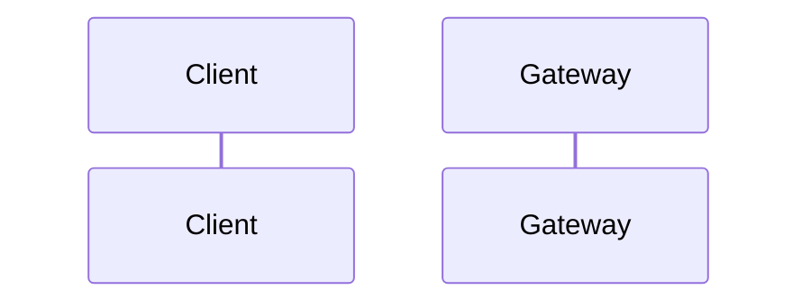

# Flow Specification — `<Flow Name>`

## 1. Goal

## 2. Participants

| Participant | Responsibility |
|---|---|

## 3. Preconditions

- 

## 4. Trigger

## 5. Happy path

## 6. Step-by-step

| Step | From | To | Sync/Async | Contract | State change |
|---:|---|---|---|---|---|

## 7. Data ownership

| Data | Source of truth |
|---|---|

## 8. State transitions by service

| Service | Before | After | Trigger |
|---|---|---|---|

## 9. Failure scenarios

| Case | Failure | Expected behavior | Compensation | Retry |
|---:|---|---|---|---|

## 10. Idempotency

| Operation | Idempotency key | Replay behavior |
|---|---|---|

## 11. Timeout and retry

| Call/event | Timeout | Retry | Backoff | Final action |
|---|---:|---:|---|---|

## 12. Observability

- `requestId`:
- `correlationId`:
- `messageId`:
- Required logs:
- Required metrics:

## 13. Security

- Required roles:
- Sensitive fields:
- Audit requirements:

## 14. Integration test scenarios

| ID | Scenario | Input | Expected result |
|---|---|---|---|

## 15. Acceptance criteria

- [ ] Happy path runs end-to-end.
- [ ] Expected failure cases are handled.
- [ ] Duplicate request/message is safe.
- [ ] Logs can be traced by correlation ID.
- [ ] All contracts are frozen.
