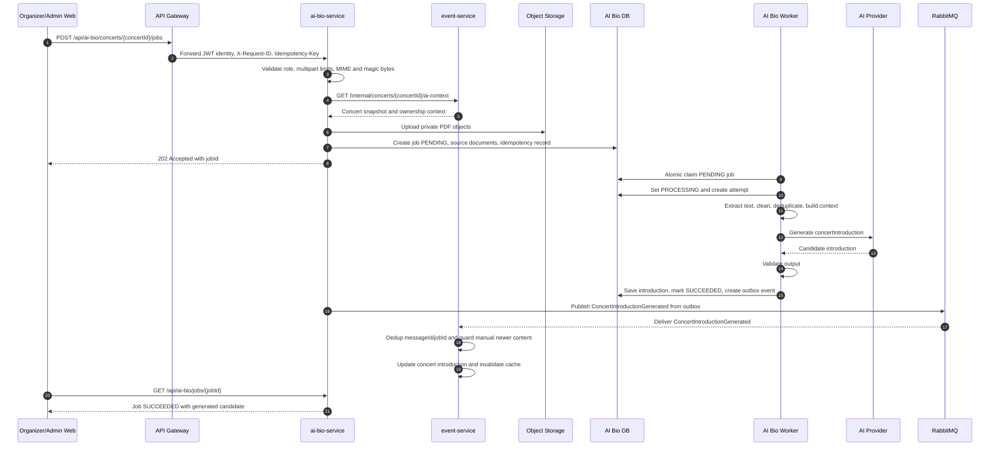

# Flow Specification — `AI Bio Concert Introduction`

## 1. Goal

Flow này mô tả cách Organizer/Admin upload một hoặc nhiều PDF để AI Bio Service sinh phần giới thiệu ngắn gọn cho trang chi tiết concert.

Kết quả cuối cùng mong muốn:

- Request upload được validate an toàn và tạo background job idempotent.
- PDF được lưu trong private Object Storage, không expose public URL.
- Worker extract, clean, deduplicate và tổng hợp nội dung PDF thành concert context.
- AI Provider tạo đúng một `concertIntroduction` hợp lệ.
- `ai-bio-service` lưu kết quả và publish `ConcertIntroductionGenerated` bằng outbox.
- `event-service` consume event idempotent, cập nhật introduction của concert và invalidate cache public detail.
- Lỗi AI/PDF không ảnh hưởng đến luồng xem concert, mua vé hoặc thanh toán.

## 2. Participants

| Participant | Responsibility |
|---|---|
| Organizer/Admin web | Upload PDF, gửi `Idempotency-Key`, poll trạng thái job |
| API Gateway | Verify JWT, forward identity headers, propagate `X-Request-ID` |
| `ai-bio-service` | Validate upload, quản lý job, xử lý PDF, gọi AI Provider, publish result event |
| `event-service` | Cung cấp concert AI context và nhận introduction đã generate |
| Object Storage | Lưu private source PDF bằng generated object key |
| PostgreSQL | Source of truth cho jobs, documents, attempts, idempotency và outbox của AI Bio |
| AI Bio worker | Claim job `PENDING`, xử lý các stage và lưu kết quả |
| AI Provider | Sinh `concertIntroduction` từ cleaned concert context |
| RabbitMQ | Durable delivery cho `ConcertIntroductionGenerated` |

## 3. Preconditions

- User đã đăng nhập với role `ORGANIZER` hoặc `ADMIN`.
- Organizer sở hữu concert, hoặc user là `ADMIN`.
- Concert tồn tại trong `event-service` và có trạng thái cho phép generate introduction.
- Gateway route `/api/ai-bio/**` đã cấu hình.
- `ai-bio-service` có kết nối PostgreSQL, Object Storage, RabbitMQ và AI Provider.
- Upload gồm 1-5 file PDF, tối đa 10 MB/file và 25 MB tổng.
- Client gửi `Idempotency-Key` ổn định cho request tạo job.
- RabbitMQ exchange `tickefy.events`, routing key `concert.introduction.generated`, queue consumer và DLQ đã configured.

## 4. Trigger

Organizer/Admin gọi:

```http
POST /api/ai-bio/concerts/{concertId}/jobs
Authorization: Bearer <access-token>
Idempotency-Key: <stable-key>
X-Request-ID: <optional-request-id>
Content-Type: multipart/form-data
```

Multipart fields:

- `files[]`: 1-5 PDF source documents.
- `language`: optional, mặc định theo cấu hình hoặc concert locale.
- `targetLength`: optional, giới hạn độ dài mong muốn.

## 5. Happy path



## 6. Step-by-step

| Step | From | To | Sync/Async | Contract | State change |
|---:|---|---|---|---|---|
| 1 | Organizer/Admin web | API Gateway | Sync HTTP | `POST /api/ai-bio/concerts/{concertId}/jobs` multipart | None |
| 2 | API Gateway | `ai-bio-service` | Sync HTTP | Verified JWT identity, roles, `X-Request-ID`, `Idempotency-Key` | None |
| 3 | `ai-bio-service` | `ai-bio-service` | Sync local | Validate role, idempotency, PDF count/type/size/magic bytes | Reject before job if invalid |
| 4 | `ai-bio-service` | `event-service` | Sync HTTP | `GET /internal/concerts/{concertId}/ai-context` | None |
| 5 | `ai-bio-service` | Object Storage | Sync infra | Store private PDF objects | Source objects created |
| 6 | `ai-bio-service` | PostgreSQL | Sync DB transaction | Insert job, source documents, idempotency record | Job `PENDING` |
| 7 | `ai-bio-service` | Organizer/Admin web | Sync HTTP | Common API envelope, `202 Accepted` | Client receives `jobId` |
| 8 | AI Bio worker | PostgreSQL | Async worker | Atomic claim `PENDING -> PROCESSING` | Job `PROCESSING`, attempt started |
| 9 | AI Bio worker | Source documents | Async local | Extract text from PDF | Document extracted text stored or warning recorded |
| 10 | AI Bio worker | AI Bio worker | Async local | Clean, normalize, deduplicate, build context | Processing stage advances |
| 11 | AI Bio worker | AI Provider | Sync external | Provider-specific API | Candidate introduction returned |
| 12 | AI Bio worker | PostgreSQL | Sync DB transaction | Validate output, save result, create outbox record | Job `SUCCEEDED`, outbox `PENDING` |
| 13 | Outbox publisher | RabbitMQ | Async event | `ConcertIntroductionGenerated`, routing key `concert.introduction.generated` | Outbox marked published after broker confirm |
| 14 | RabbitMQ | `event-service` | Async event | Common event envelope + AI Bio payload contract | Event Service dedup record written |
| 15 | `event-service` | Event Service DB/cache | Sync local | Apply introduction if allowed | Concert introduction updated, cache invalidated |
| 16 | Organizer/Admin web | `ai-bio-service` | Sync HTTP | `GET /api/ai-bio/jobs/{jobId}` | Client sees latest job status |

## 7. Data ownership

| Data | Source of truth |
|---|---|
| Concert core fields, status, owner, public detail data | `event-service` |
| `concertIntroduction` served to public concert detail page | `event-service` |
| AI generation job status, stage, retry count, error code | `ai-bio-service` |
| Source PDF object key, checksum, extracted text, cleaned text | `ai-bio-service` |
| Private source PDF binary | Object Storage bucket owned by `ai-bio-service` |
| AI prompt, provider response and generated candidate before event apply | `ai-bio-service` |
| Event delivery metadata and publish status | `ai-bio-service` outbox + RabbitMQ |
| `messageId` dedup for consumed result event | `event-service` |
| User identity and roles | Auth Service / JWT verified by API Gateway |

## 8. State transitions by service

| Service | Before | After | Trigger |
|---|---|---|---|
| `ai-bio-service` | No job | `PENDING` | Upload validated, PDFs stored, DB transaction committed |
| `ai-bio-service` | `PENDING` | `PROCESSING` | Worker atomic claim succeeds |
| `ai-bio-service` | `PROCESSING` | `SUCCEEDED` | Introduction saved and outbox event created in one transaction |
| `ai-bio-service` | `PROCESSING` | `FAILED` | Non-retryable error or automatic retries exhausted |
| `ai-bio-service` | `FAILED` | `PENDING` | Organizer/Admin manual retry accepted |
| `ai-bio-service` | `SUCCEEDED` | `SUCCEEDED` | Retry request rejected as not retryable |
| `event-service` | No AI introduction or older AI introduction | AI introduction applied | `ConcertIntroductionGenerated` accepted |
| `event-service` | Manual introduction newer than job `requestedAt` | Unchanged | Result event acknowledged but not applied |
| RabbitMQ/outbox | Outbox `PENDING` | Published/confirmed | Broker accepts `ConcertIntroductionGenerated` |

## 9. Failure scenarios

| Case | Failure | Expected behavior | Compensation | Retry |
|---:|---|---|---|---|
| 1 | Missing PDF | Reject request, no job created, return `400 PDF_FILE_REQUIRED` | None | Client fixes request |
| 2 | Invalid MIME or magic bytes | Reject request, no object stored if detected before upload, return `415 INVALID_PDF_TYPE` | Delete uploaded temp/object if any | No automatic retry |
| 3 | File or total upload too large | Reject request, return `413 PDF_TOO_LARGE` | Cleanup partially uploaded objects | Client reduces files |
| 4 | Concert not found | Return `404 CONCERT_NOT_FOUND`, no job created | None | No automatic retry |
| 5 | Organizer does not own concert | Return `403 CONCERT_ACCESS_DENIED`, no job created | None | No automatic retry |
| 6 | Event Service unavailable during validation | Return `503 EVENT_SERVICE_UNAVAILABLE`, no job created | None | Client may retry same `Idempotency-Key` |
| 7 | Active job already exists for concert | Return `409 AI_BIO_JOB_ALREADY_ACTIVE` with active `jobId` details | None | Poll existing job |
| 8 | Object Storage unavailable | Retry bounded; if still failing, do not create committed job unless cleanup is explicit | Delete partial objects | Bounded infra retry |
| 9 | One PDF unreadable but at least one usable PDF remains | Continue job with warnings | Store document warning | No full job retry needed |
| 10 | All PDFs have no usable text | Mark job `FAILED` with `NO_USABLE_DOCUMENT_CONTENT` | Preserve job and safe error | Manual retry only with same docs if policy allows |
| 11 | AI Provider timeout or 429/5xx | Automatic retry with exponential backoff and jitter | Attempt history recorded | Up to provider retry policy |
| 12 | AI Provider auth/config error | Mark job `FAILED`, alert configuration | Safe error only, no raw provider body | No automatic retry |
| 13 | AI output empty or invalid | Run repair attempt if implemented; otherwise fail job | Store safe validation error | Limited repair/provider retry |
| 14 | RabbitMQ unavailable after generation | Job remains `SUCCEEDED`; outbox stays `PENDING` | Outbox publisher retries | Bounded/continuous outbox retry with alert |
| 15 | Duplicate event delivery | `event-service` ACKs duplicate after `messageId`/`jobId` dedup | None | Safe replay |
| 16 | Manual introduction updated while AI job runs | `event-service` does not overwrite newer manual content | Event ACKed, result may be stored as historical/candidate | No retry |
| 17 | Worker crashes mid-processing | Watchdog or claim timeout reschedules according to policy | Attempt marked failed/timed out | Retry if retryable and under limit |

## 10. Idempotency

| Operation | Idempotency key | Replay behavior |
|---|---|---|
| Create AI Bio job | `createdBy + Idempotency-Key` | Return existing job with `replayDetected=true`; do not upload/store/create second job |
| Active job guard | `concertId` partial unique index for `PENDING`/`PROCESSING` | Reject second active job with `AI_BIO_JOB_ALREADY_ACTIVE` |
| Worker claim | Atomic DB update by `jobId` and current status `PENDING` | Only one worker can process a job |
| Manual retry | `createdBy + Idempotency-Key` on retry endpoint | Replay returns same retry result and does not increment `retryCount` again |
| Outbox publish | Stable outbox event `messageId` | Republish same message safely until broker confirm |
| Event Service consume | `messageId`, guarded by `jobId` and `requestedAt` | Duplicate message is ACKed without duplicate update |
| AI generation result apply | `jobId` + `concertId` | Older or duplicate AI result cannot overwrite newer manual introduction |

## 11. Timeout and retry

| Call/event | Timeout | Retry | Backoff | Final action |
|---|---:|---:|---|---|
| `GET /internal/concerts/{concertId}/ai-context` | 2,000 ms | 2 for network/5xx | Exponential backoff | Return `503 EVENT_SERVICE_UNAVAILABLE`; do not create job |
| Object Storage upload/read | 5,000 ms/operation | Bounded infra retry | Exponential backoff | Fail request/job safely and cleanup partial objects where possible |
| AI Provider connect | 3,000 ms | Included in provider attempts | Exponential backoff + jitter | Mark job `FAILED` if attempts exhausted |
| AI Provider read | 30,000 ms | Up to 3 attempts for timeout/429/502/503/504 | Exponential backoff + jitter, respect `Retry-After` | Mark job `FAILED` with provider-safe error |
| RabbitMQ outbox publish | Publisher config | Repeat until published or operational alert | Bounded interval/polling retry | Keep outbox `PENDING`, alert on oldest pending age |
| Event Service consumer processing | Consumer config | Broker redelivery until max attempts | Queue retry policy | DLQ if poison message |
| Worker processing duration | Configured max duration | Retry/reschedule if safe | Watchdog policy | Mark timed out or reschedule without parallel processing |

## 12. Observability

- `requestId`: lấy từ `X-Request-ID`; nếu thiếu thì service tự sinh; echo ở response header/body.
- `correlationId`: dùng `requestId` hoặc propagated correlation ID cho internal call và event.
- `messageId`: UUID của `ConcertIntroductionGenerated`, giữ nguyên khi outbox republish.
- Required logs: `requestId`, `correlationId`, `messageId`, `jobId`, `concertId`, `documentId`, `userId`, `status`, `processingStage`, `provider`, `model`, `durationMs`, `retryCount`, `errorCode`.
- Required metrics:
  - `ai_bio_jobs_total{status}`
  - `ai_bio_job_duration_seconds`
  - `ai_bio_stage_duration_seconds{stage}`
  - `ai_bio_pdf_extraction_failures_total{code}`
  - `ai_bio_provider_requests_total{provider,result}`
  - `ai_bio_provider_latency_seconds{provider}`
  - `ai_bio_provider_retries_total{reason}`
  - `ai_bio_outbox_pending_total`
  - `ai_bio_outbox_publish_failures_total`
  - `event_concert_introduction_apply_total{result}`

Alert conditions:

- Job failure rate vượt ngưỡng.
- AI Provider timeout/rate-limit tăng bất thường.
- Outbox pending count hoặc oldest pending age vượt ngưỡng.
- Job ở `PROCESSING` quá maximum duration.
- RabbitMQ/Object Storage readiness fail.

## 13. Security

- Required roles: `ORGANIZER` sở hữu concert hoặc `ADMIN`.
- Sensitive fields: PDF binary, extracted text, cleaned text, AI prompt, provider response, JWT, AI API key, object keys nếu có thể suy ra nội dung.
- Audit requirements:
  - Log ai-bio job creation, retry, success, failure và event publish result.
  - Audit actor từ JWT `sub`, role, `concertId`, `jobId`, `requestId`, timestamp.
  - Không log full JWT, API key, full PDF text, full prompt hoặc raw provider body.
  - Không dùng original filename làm object key; filename hiển thị phải sanitize.
  - Object Storage bucket private; API không trả public URL.
  - PDF là untrusted input; prompt phải yêu cầu bỏ qua instruction nằm trong tài liệu.
  - AI output lưu và publish dưới dạng plain text đã validate; frontend phải escape khi render.
  - Response lỗi không chứa stack trace, exception class hoặc secret.

## 14. Integration test scenarios

| ID | Scenario | Input | Expected result |
|---|---|---|---|
| AI-BIO-001 | Create job with one valid PDF | Organizer owner, one PDF, unique `Idempotency-Key` | `202 Accepted`, job `PENDING`, PDF stored privately |
| AI-BIO-002 | Create job with multiple valid PDFs | 2-5 PDFs including artist profile and press kit | Worker combines context and produces one introduction |
| AI-BIO-003 | Replay create request | Same user and same `Idempotency-Key` | Existing `jobId`, `replayDetected=true`, no duplicate upload/job |
| AI-BIO-004 | Active job conflict | Same concert has `PENDING` or `PROCESSING` job | `409 AI_BIO_JOB_ALREADY_ACTIVE` with active job details |
| AI-BIO-005 | Invalid PDF rejected | Non-PDF file or wrong magic bytes | `415 INVALID_PDF_TYPE`, no job committed |
| AI-BIO-006 | Concert not found | Unknown `concertId` | `404 CONCERT_NOT_FOUND`, no job committed |
| AI-BIO-007 | Organizer forbidden | Organizer does not own concert | `403 CONCERT_ACCESS_DENIED` |
| AI-BIO-008 | Event Service down on create | Internal context API timeout/5xx | `503 EVENT_SERVICE_UNAVAILABLE`, same key can retry |
| AI-BIO-009 | Partial unreadable PDFs | One PDF unreadable, another usable | Job `SUCCEEDED` with warning for unreadable document |
| AI-BIO-010 | No usable content | All PDFs empty/password-protected/no extractable text | Job `FAILED` with safe error code |
| AI-BIO-011 | AI provider transient error | Provider returns timeout/429 before success | Automatic retry, final job `SUCCEEDED` if later attempt succeeds |
| AI-BIO-012 | AI provider permanent auth error | Invalid provider API key | Job `FAILED`, no raw provider body in logs/response |
| AI-BIO-013 | RabbitMQ unavailable after generation | Broker down during outbox publish | Job `SUCCEEDED`, outbox remains `PENDING`, alert/metric emitted |
| AI-BIO-014 | Duplicate result event | Same `messageId` delivered twice | Event Service applies once and ACKs duplicate |
| AI-BIO-015 | Manual introduction newer than AI request | Organizer edits intro after job request time | Event Service does not overwrite manual content |
| AI-BIO-016 | Retry failed job | Job `FAILED`, retryable, under max retry count | Retry endpoint returns `202`, job returns to `PENDING`, `retryCount` increments once |
| AI-BIO-017 | Concurrent workers | Two workers claim same `PENDING` job | Exactly one worker transitions job to `PROCESSING` |

## 15. Acceptance criteria

- [ ] Happy path runs end-to-end.
- [ ] Expected failure cases are handled.
- [ ] Duplicate request/message is safe.
- [ ] Logs can be traced by correlation ID.
- [ ] All contracts are frozen.
- [ ] `POST /api/ai-bio/concerts/{concertId}/jobs` returns `202 Accepted` with common API envelope.
- [ ] Upload accepts 1-5 PDFs and enforces file count, MIME, magic bytes, per-file size and total size.
- [ ] `ai-bio-service` validates concert existence and ownership through Event Service before creating a job.
- [ ] PDFs are stored in private Object Storage with generated object keys.
- [ ] Job processing moves through `PENDING -> PROCESSING -> SUCCEEDED` or `FAILED`.
- [ ] AI output is validated before it is saved or published.
- [ ] Success transaction saves introduction and creates outbox event atomically.
- [ ] `ConcertIntroductionGenerated` is published with stable `messageId` and `correlationId`.
- [ ] Event Service consumes result idempotently and does not overwrite newer manual introduction.
- [ ] Public concert detail reads introduction from Event Service, not AI Bio Service.
- [ ] Provider timeout/rate-limit retry follows bounded exponential backoff with jitter.
- [ ] Failed job retry respects `maxRetries` and idempotency.
- [ ] No response or normal log exposes secrets, full PDF text, full prompt, raw provider body or stack trace.
