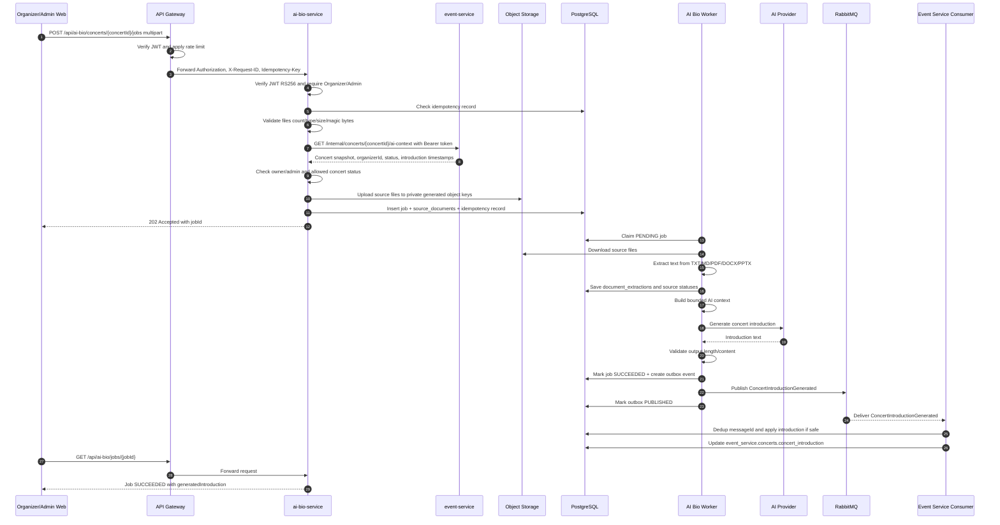
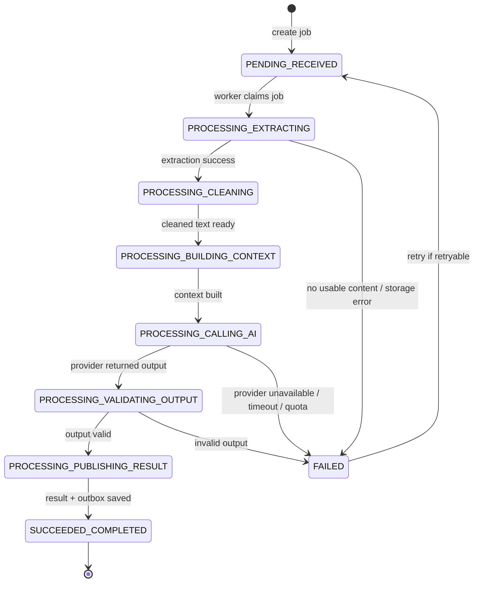
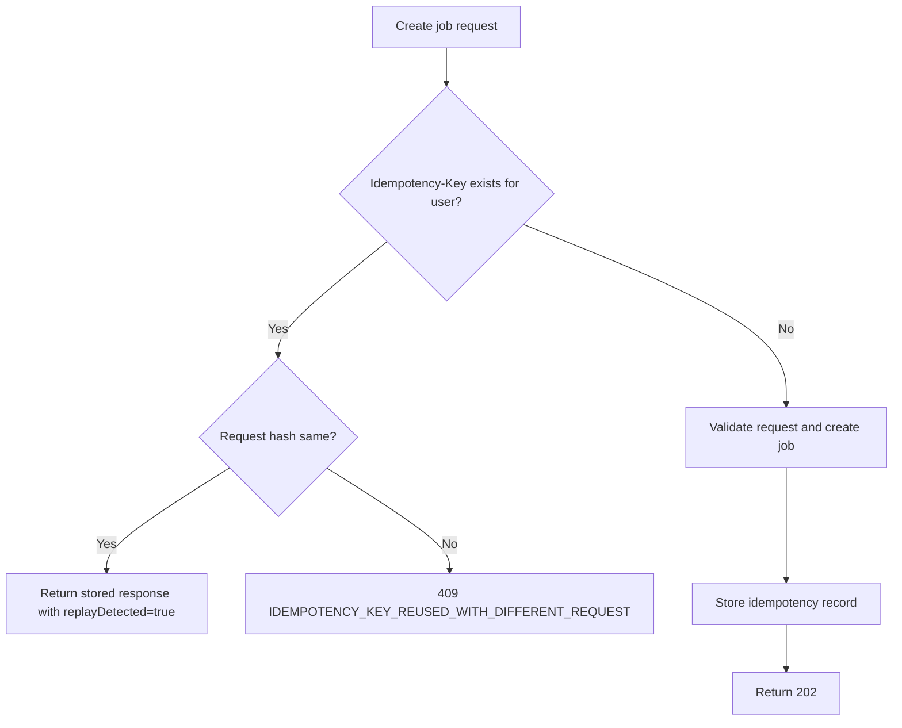
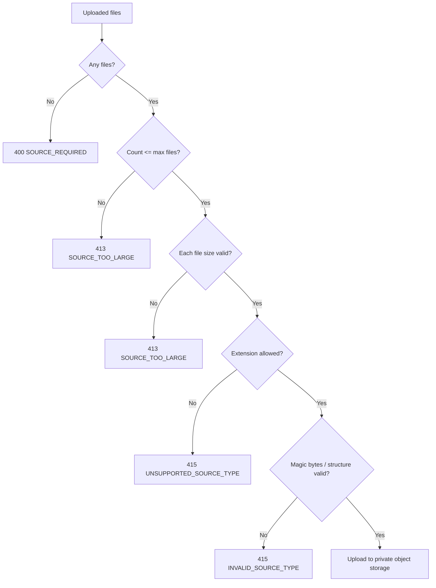
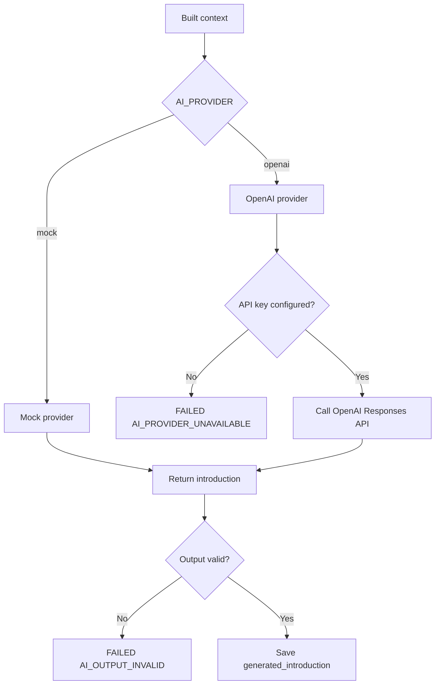
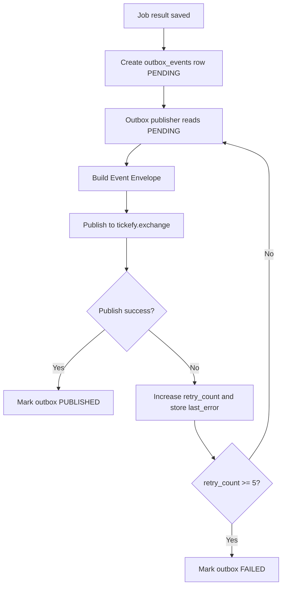
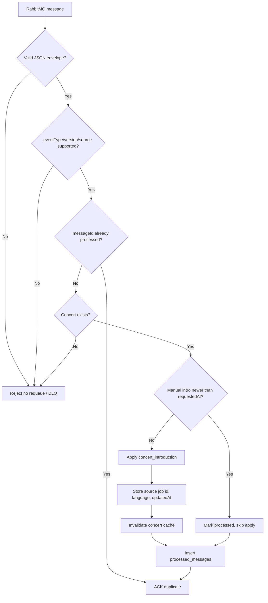
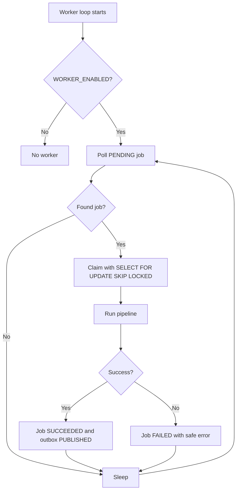

# Flow — AI Bio End-to-End

## 1. Purpose

This flow describes how Tickefy generates a public concert introduction from organizer-provided source documents.

The AI Bio flow covers:

```text
Organizer/Admin
-> API Gateway
-> AI Bio Service
-> Event Service AI context
-> Object Storage
-> AI Bio Worker
-> AI Provider
-> AI Bio Outbox
-> RabbitMQ
-> Event Service Consumer
-> Public concertIntroduction
```

The official public `concertIntroduction` is owned by `event-service`. `ai-bio-service` generates the candidate and publishes an event. `event-service` decides whether and how to apply it.

## 2. Actors and components

| Component | Role |
|---|---|
| Organizer/Admin Web | Uploads press kit/source files and checks job status. |
| API Gateway | Public entry point, JWT verification at edge, rate limiting, request forwarding. |
| Auth Service | Issues RS256 JWTs with `sub`, `roles`, `iss`, `aud`. |
| AI Bio Service | Owns AI generation job, source validation, extraction, provider call, outbox. |
| Event Service | Owns official concert data and public `concertIntroduction`. |
| Object Storage / MinIO | Stores private uploaded source files. |
| PostgreSQL | Stores AI Bio jobs/extractions/outbox and Event Service concert data. |
| RabbitMQ | Delivers `ConcertIntroductionGenerated` event. |
| AI Provider | Mock provider for dev or OpenAI for real generation. |

## 3. Preconditions

- Client has a valid access token.
- Token contains `sub` and roles such as `ORGANIZER` or `ADMIN`.
- Gateway route `/api/ai-bio/**` points to `http://ai-bio-service:8080`.
- `ai-bio-service` verifies JWT again with RS256 public key.
- `event-service` exposes `GET /internal/concerts/{concertId}/ai-context`.
- Concert exists and is in a status that allows AI Bio generation, currently `DRAFT` or `PUBLISHED`.
- Organizer owns the concert, or user is `ADMIN`.
- MinIO/S3 bucket exists.
- RabbitMQ exchange `tickefy.exchange` exists.
- Event Service consumer queue is bound to `concert.introduction.generated`.
- Client sends a stable `Idempotency-Key`.

## 4. Trigger

```http
POST /api/ai-bio/concerts/{concertId}/jobs
Authorization: Bearer <access-token>
Idempotency-Key: <stable-key>
X-Request-ID: <optional-request-id>
Content-Type: multipart/form-data
```

Multipart fields:

| Field | Required | Notes |
|---|---:|---|
| `files` | Yes in Phase 1 | 1–5 files; allowed: PDF, MD, TXT, DOCX, PPTX. |
| `language` | No | Default `vi`. |
| `targetLength` | No | Default `SHORT`. |
| `tone` | No | Optional style such as `ENERGETIC`, `PROFESSIONAL`, `LUXURY`, `FRIENDLY`. |

## 5. Happy path sequence



## 6. Detailed step-by-step

| Step | Actor | Action | Data/state |
|---:|---|---|---|
| 1 | Client | Sends multipart create-job request through Gateway. | `Authorization`, `Idempotency-Key`, source files. |
| 2 | Gateway | Matches `/api/ai-bio/**` route and forwards request. | No path rewrite. |
| 3 | AI Bio | Verifies JWT using RS256 public key. | Extracts `sub`, `email`, `roles`. |
| 4 | AI Bio | Requires `ORGANIZER` or `ADMIN`. | Rejects unauthorized/forbidden request. |
| 5 | AI Bio | Checks `idempotency_records`. | Same key + same request returns stored response. |
| 6 | AI Bio | Validates source files. | Rejects unsupported, too large, invalid magic bytes. |
| 7 | AI Bio | Calls Event Service AI context API. | Gets concert name, organizer id, status and timestamps. |
| 8 | AI Bio | Checks ownership/status. | Owner or Admin; concert `DRAFT`/`PUBLISHED`. |
| 9 | AI Bio | Uploads files to Object Storage. | Key: `ai-bio/{concertId}/jobs/{jobId}/sources/{sourceId}.{ext}`. |
| 10 | AI Bio | Inserts job and sources in PostgreSQL. | Job becomes `PENDING/RECEIVED`. |
| 11 | AI Bio | Returns `202 Accepted`. | Client receives `jobId`. |
| 12 | Worker | Claims pending job. | Job becomes `PROCESSING/EXTRACTING_TEXT`. |
| 13 | Worker | Downloads source objects. | Reads bytes from MinIO/S3. |
| 14 | Worker | Extracts and cleans text. | Saves `document_extractions`. |
| 15 | Worker | Builds AI context. | Bounded by `AI_MAX_CONTEXT_CHARS`. |
| 16 | Worker | Calls provider. | `mock` or `openai`. |
| 17 | Worker | Validates output. | Enforces min/max output chars. |
| 18 | Worker | Saves result and creates outbox. | Job becomes `SUCCEEDED/COMPLETED`, outbox `PENDING`. |
| 19 | Publisher | Publishes event to RabbitMQ. | Outbox becomes `PUBLISHED`. |
| 20 | Event Service | Consumes event. | Dedup by `messageId`. |
| 21 | Event Service | Applies introduction if safe. | Updates `concert_introduction`. |
| 22 | Client | Polls job status. | Sees `SUCCEEDED` and generated candidate. |

## 7. State machine



Main statuses:

| Status | Meaning |
|---|---|
| `PENDING` | Job has been created but not processed yet. |
| `PROCESSING` | Worker is processing extraction/generation/publishing. |
| `SUCCEEDED` | Introduction generated and outbox event created. |
| `FAILED` | Job failed safely with a safe error code. |

Main stages:

| Stage | Meaning |
|---|---|
| `RECEIVED` | Job created. |
| `EXTRACTING_TEXT` | Worker is extracting text from sources. |
| `CLEANING_TEXT` | Text extracted and basic cleaning is complete. |
| `BUILDING_CONTEXT` | Worker is building the AI prompt context. |
| `CALLING_AI` | Provider request is in progress. |
| `VALIDATING_OUTPUT` | Output validation phase. |
| `PUBLISHING_RESULT` | Event/outbox publish phase. |
| `COMPLETED` | Job completed. |

## 8. Idempotency flow



Rules:

- Scope: `created_by + idempotency_key + action`.
- Same request returns the same `jobId`.
- Different request with same key returns conflict.
- Idempotency prevents duplicate active jobs from network retries.

## 9. Source validation flow



Supported Phase 1 formats:

```text
PDF, Markdown, Text, DOCX, PPTX
```

Rejected in Phase 1:

```text
Image, URL, executable, archive, audio, video, unknown binary
```

## 10. Provider flow



Provider recommendations:

| Mode | Config |
|---|---|
| Local/dev default | `AI_PROVIDER=mock` |
| Real AI demo | `AI_PROVIDER=openai`, `OPENAI_MODEL=gpt-5.4-mini` |
| Not recommended default | `gpt-5.5` in current setup, because it failed during testing |

## 11. Outbox and RabbitMQ flow



Event envelope:

```json
{
  "messageId": "...",
  "eventType": "ConcertIntroductionGenerated",
  "eventVersion": "1.0",
  "source": "ai-bio-service",
  "occurredAt": "...",
  "correlationId": "...",
  "causationId": null,
  "payload": {
    "jobId": "...",
    "concertId": "...",
    "introduction": "...",
    "language": "vi",
    "sourceDocumentIds": ["..."],
    "sourceTypes": ["TEXT"],
    "requestedAt": "...",
    "generatedAt": "..."
  }
}
```

## 12. Event Service consumer flow



Event Service updates:

| Table/field | Purpose |
|---|---|
| `event_service.concerts.concert_introduction` | Official public introduction. |
| `event_service.concerts.concert_introduction_source_job_id` | Source AI Bio job. |
| `event_service.concerts.concert_introduction_language` | Language of generated intro. |
| `event_service.concerts.concert_introduction_updated_at` | Last AI intro update time. |
| `event_service.concerts.manual_introduction_updated_at` | Manual edit guard. |
| `event_service.processed_messages` | Dedup by `messageId`. |

## 13. Retry flow

```mermaid
flowchart TD
    A[POST /api/ai-bio/jobs/{jobId}/retry] --> B{Job exists?}
    B -- No --> E1[404 AI_BIO_JOB_NOT_FOUND]
    B -- Yes --> C{User can access job?}
    C -- No --> E2[403 CONCERT_ACCESS_DENIED]
    C -- Yes --> D{status == FAILED?}
    D -- No --> E3[409 AI_BIO_JOB_NOT_RETRYABLE]
    D -- Yes --> F{is_retryable true?}
    F -- No --> E3
    F -- Yes --> G{retry_count < max_retries?}
    G -- No --> E3
    G -- Yes --> H[Reset job to PENDING/RECEIVED]
```

Retry resets:

- Job status/stage.
- Safe error fields.
- `failed_at`, `completed_at`, provider fields.
- Source extraction statuses back to `STORED`.
- Old extraction rows.
- Non-published outbox events for the job.

Retry does not delete uploaded source objects.

## 14. Background worker flow



Recommended local modes:

| Goal | `WORKER_ENABLED` | `DEV_ENDPOINTS_ENABLED` |
|---|---:|---:|
| Manual debug | `false` | `true` |
| Production-like local demo | `true` | `false` |
| Safe idle Docker | `false` | `false` |

## 15. Main failure paths

| Failure | Stage | Result |
|---|---|---|
| Missing token | Gateway/AI Bio auth | `401 UNAUTHORIZED` |
| Invalid/expired token | Gateway/AI Bio auth | `401 INVALID_TOKEN` |
| Role not allowed | AI Bio guard | `403 FORBIDDEN` |
| User not concert owner | AI Bio/Event Service | `403 CONCERT_ACCESS_DENIED` |
| Concert missing | Event Service AI context | `404 CONCERT_NOT_FOUND` |
| Event Service down | Create job | `503 EVENT_SERVICE_UNAVAILABLE` |
| Unsupported file | Source validation | `415 UNSUPPORTED_SOURCE_TYPE` |
| Invalid file content | Source validation/extraction | `415 INVALID_SOURCE_TYPE` or failed source |
| Source too large | Source validation | `413 SOURCE_TOO_LARGE` |
| No usable extracted text | Worker | Job `FAILED`, `NO_USABLE_SOURCE_CONTENT` |
| AI API key missing | Provider | Job `FAILED`, `AI_PROVIDER_UNAVAILABLE` |
| OpenAI quota/rate limit/model unavailable | Provider | Job `FAILED`, retryable |
| RabbitMQ down after generation | Outbox publish | Job can be `SUCCEEDED`, outbox remains pending/failed for retry |
| Event consumer receives duplicate message | Event Service consumer | ACK duplicate, no duplicate apply |
| Manual intro newer than AI request | Event Service consumer | ACK and skip apply |

## 16. Test flow through Gateway

### Create job

```bash
CONCERT_ID=<real-event-service-concert-id>
IDEMPOTENCY_KEY="ai-bio-test-$(date +%s)"

HTTP_STATUS=$(curl -sS -o /tmp/ai-bio-create.json -w "%{http_code}" \
  -X POST "http://localhost:8080/api/ai-bio/concerts/$CONCERT_ID/jobs" \
  -H "Authorization: Bearer $ACCESS_TOKEN" \
  -H "X-Request-ID: req-ai-bio-create" \
  -H "Idempotency-Key: $IDEMPOTENCY_KEY" \
  -F "language=vi" \
  -F "targetLength=SHORT" \
  -F "tone=ENERGETIC" \
  -F "files=@/tmp/press-kit.txt;type=text/plain")

jq . /tmp/ai-bio-create.json
echo "HTTP_STATUS=$HTTP_STATUS"
```

Expected:

```text
HTTP_STATUS=202
data.status=PENDING
```

### Check job status

```bash
JOB_ID=$(jq -r '.data.jobId' /tmp/ai-bio-create.json)

HTTP_STATUS=$(curl -sS -o /tmp/ai-bio-status.json -w "%{http_code}" \
  "http://localhost:8080/api/ai-bio/jobs/$JOB_ID" \
  -H "Authorization: Bearer $ACCESS_TOKEN")

jq . /tmp/ai-bio-status.json
echo "HTTP_STATUS=$HTTP_STATUS"
```

Expected after worker:

```text
HTTP_STATUS=200
data.status=SUCCEEDED
data.processingStage=COMPLETED
data.generatedIntroduction is not null
```

## 17. Final verification script

Recommended final test:

```bash
CONCERT_ID=<real-event-service-concert-id> \
RUN_MODE=worker \
./scripts/verify-ai-bio-e2e.sh
```

Expected:

```text
AI Bio E2E verification passed.
JOB_ID=...
CONCERT_ID=...
IDEMPOTENCY_KEY=...
```

This script verifies:

- Gateway route.
- JWT authentication.
- Event Service AI context.
- AI Bio job creation.
- Source upload.
- Worker processing.
- AI provider generation.
- Outbox event publish.
- RabbitMQ delivery.
- Event Service consumer apply.
- Event Service DB update.

## 18. Handoff notes for team

### Frontend needs to know

- Use `POST /api/ai-bio/concerts/{concertId}/jobs` with multipart form data.
- Always send `Idempotency-Key` for create job.
- Poll `GET /api/ai-bio/jobs/{jobId}` until `SUCCEEDED` or `FAILED`.
- Show safe error from `errorCode/errorMessage` or job `errorCode/errorMessage`.
- Public concert page should read final introduction from Event Service, not AI Bio.

### Event Service needs to know

- It owns official `concertIntroduction`.
- It must keep AI context API stable for AI Bio.
- Consumer must be idempotent by `messageId`.
- Manual newer introduction must not be overwritten.
- Public concert detail DTO should expose `concertIntroduction`.

### Backend/DevOps needs to know

- `DEV_ENDPOINTS_ENABLED=false` for normal Docker/demo.
- `WORKER_ENABLED=true` for automatic processing.
- `AI_PROVIDER=mock` for safe demo without external API.
- `AI_PROVIDER=openai` requires `OPENAI_API_KEY` from environment only.
- `OPENAI_MODEL=gpt-5.4-mini` is the tested working model in current setup.
