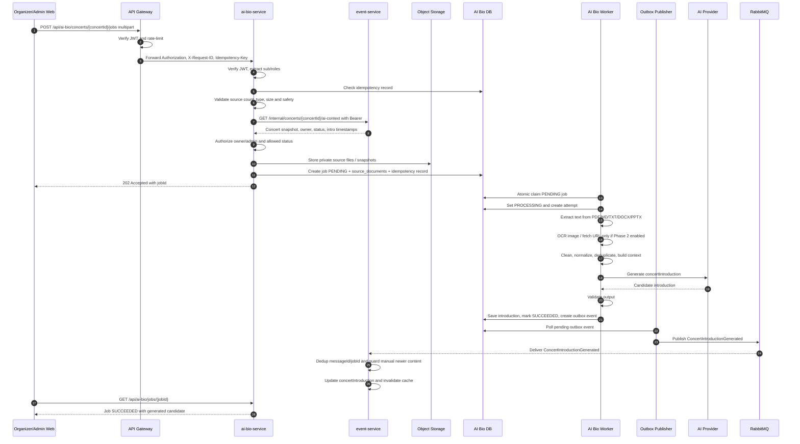

# Flow Specification — `AI Bio Concert Introduction`

## 1. Goal

Flow này mô tả cách Organizer/Admin cung cấp nhiều loại source document để AI Bio Service sinh `concertIntroduction` cho trang chi tiết concert.

Kết quả cuối cùng:

- Request upload/fetch source được validate an toàn và tạo background job idempotent.
- Source file được lưu trong private Object Storage; URL source được snapshot an toàn khi Phase 2 bật.
- Worker extract, OCR nếu cần, clean, deduplicate và build concert context.
- AI Provider tạo một `concertIntroduction` hợp lệ.
- `ai-bio-service` lưu result và publish `ConcertIntroductionGenerated` bằng outbox.
- `event-service` consume event idempotent, cập nhật introduction nếu không có manual edit mới hơn và invalidate public cache.
- Lỗi file/URL/AI không ảnh hưởng luồng xem concert, mua vé hoặc thanh toán.

## 2. Participants

| Participant | Responsibility |
|---|---|
| Organizer/Admin web | Upload files, optionally provide URLs, send `Idempotency-Key`, poll job status. |
| API Gateway | Verify JWT at edge, route `/api/ai-bio/**`, forward `Authorization`, `X-Request-ID`, `Idempotency-Key`. |
| `ai-bio-service` | Validate sources, manage job, process documents, call AI Provider, publish result event. |
| `event-service` | Provide AI context and consume generated introduction. |
| Object Storage | Store private source files and optional URL snapshots. |
| PostgreSQL | Source of truth for jobs, documents, attempts, idempotency and outbox. |
| AI Bio worker | Claim `PENDING` jobs, extract sources, build context, save result. |
| AI Provider | Generate `concertIntroduction`. |
| RabbitMQ | Durable delivery of `ConcertIntroductionGenerated`. |

## 3. Preconditions

- User has role `ORGANIZER` or `ADMIN`.
- Organizer owns the concert, or user is `ADMIN`.
- `ai-bio-service` verifies JWT access token itself and does not trust `X-User-*` for authorization.
- Concert exists in `event-service` and status is `DRAFT` or `PUBLISHED`.
- Gateway route `/api/ai-bio/**` is configured if client uses gateway.
- `ai-bio-service` can connect to PostgreSQL, Object Storage, RabbitMQ and AI Provider.
- Phase 1 accepts `pdf`, `md`, `txt`, `docx`, `pptx`.
- Phase 2 may enable image OCR and URL extraction after security controls are implemented.
- Client sends stable `Idempotency-Key` for create/retry command.
- RabbitMQ exchange is `tickefy.exchange`, routing key is `concert.introduction.generated`.

## 4. Trigger

```http
POST /api/ai-bio/concerts/{concertId}/jobs
Authorization: Bearer <access-token>
Idempotency-Key: <stable-key>
X-Request-ID: <optional-request-id>
Content-Type: multipart/form-data
```

Multipart fields:

- `files[]`: 1-5 source files. Phase 1: PDF/MD/TXT/DOCX/PPTX.
- `sourceUrls[]`: optional Phase 2 URL sources.
- `language`: optional, default `vi`.
- `targetLength`: optional.
- `tone`: optional.

At least one source must be present.

## 5. Happy path



## 6. Step-by-step

| Step | From | To | Sync/Async | Contract | State change |
|---:|---|---|---|---|---|
| 1 | Client | Gateway | Sync HTTP | `POST /api/ai-bio/concerts/{concertId}/jobs` multipart | None |
| 2 | Gateway | `ai-bio-service` | Sync HTTP | Forward `Authorization`, `X-Request-ID`, `Idempotency-Key`; strip untrusted identity headers | None |
| 3 | `ai-bio-service` | local | Sync | Verify JWT RS256; require `ORGANIZER` or `ADMIN` | Reject before job if invalid |
| 4 | `ai-bio-service` | PostgreSQL | Sync | Lookup `createdBy + Idempotency-Key` | Replay returns existing job |
| 5 | `ai-bio-service` | local | Sync | Validate allowed source type, count, size, MIME, magic bytes; URL safety if enabled | Reject before side effects if invalid |
| 6 | `ai-bio-service` | `event-service` | Sync HTTP | `GET /internal/concerts/{concertId}/ai-context`, forward Bearer + `X-Request-ID` | None |
| 7 | `ai-bio-service` | local | Sync | Check owner/admin and status `DRAFT`/`PUBLISHED` | Reject if forbidden/conflict |
| 8 | `ai-bio-service` | Object Storage | Sync infra | Store private files/snapshots using generated object keys | Source objects created |
| 9 | `ai-bio-service` | PostgreSQL | Sync transaction | Insert job, sources and idempotency record | Job `PENDING` |
| 10 | `ai-bio-service` | Client | Sync HTTP | Common envelope, `202 Accepted` | Client receives `jobId` |
| 11 | Worker | PostgreSQL | Async | Atomic claim `PENDING -> PROCESSING` | Job `PROCESSING` |
| 12 | Worker | source processors | Async | Extract text by source type | Document extraction saved |
| 13 | Worker | local | Async | Clean, normalize, deduplicate, build context | Stage advances |
| 14 | Worker | AI Provider | Sync external | Provider API | Candidate returned |
| 15 | Worker | PostgreSQL | Sync transaction | Save introduction, set `SUCCEEDED`, create outbox | Outbox `PENDING` |
| 16 | Publisher | RabbitMQ | Async event | `ConcertIntroductionGenerated`, routing key `concert.introduction.generated` | Outbox marked published after confirm |
| 17 | RabbitMQ | `event-service` | Async event | Common event envelope + payload | Event Service dedup written |
| 18 | `event-service` | DB/cache | Sync local | Apply introduction if no newer manual edit | Public detail updated |
| 19 | Client | `ai-bio-service` | Sync HTTP | `GET /api/ai-bio/jobs/{jobId}` | Client sees current status |

## 7. Data ownership

| Data | Source of truth |
|---|---|
| Concert core fields, status, owner, public detail | `event-service` |
| Public `concertIntroduction` | `event-service` |
| AI job status, stage, retry, error | `ai-bio-service` |
| Source metadata, object key, checksum, extracted/cleaned text | `ai-bio-service` |
| Uploaded source binaries | Object Storage owned by `ai-bio-service` |
| Generated candidate before apply | `ai-bio-service` |
| Event delivery metadata | `ai-bio-service` outbox + RabbitMQ |
| Consumed event dedup | `event-service` |
| User identity and roles | Auth Service / JWT |

## 8. State transitions

| Service | Before | After | Trigger |
|---|---|---|---|
| `ai-bio-service` | No job | `PENDING` | Sources validated, stored and DB committed |
| `ai-bio-service` | `PENDING` | `PROCESSING` | Worker atomic claim succeeds |
| `ai-bio-service` | `PROCESSING` | `SUCCEEDED` | Result saved and outbox event created |
| `ai-bio-service` | `PROCESSING` | `FAILED` | Non-retryable error or retries exhausted |
| `ai-bio-service` | `FAILED` | `PENDING` | Manual retry accepted |
| `ai-bio-service` | `SUCCEEDED` | unchanged | Retry rejected; regenerate requires new job |
| `event-service` | older/no AI intro | intro applied | `ConcertIntroductionGenerated` accepted |
| `event-service` | manual intro newer than `requestedAt` | unchanged | Event acknowledged but not applied |

## 9. Failure scenarios

| Case | Failure | Expected behavior | Retry |
|---:|---|---|---|
| 1 | No source provided | Reject `400 SOURCE_REQUIRED`; no job | Client fixes request |
| 2 | Unsupported source type | Reject `415 UNSUPPORTED_SOURCE_TYPE`; no job | No automatic retry |
| 3 | File too large or total too large | Reject `413 SOURCE_TOO_LARGE` | Client reduces source size |
| 4 | Invalid MIME/magic bytes | Reject `415 INVALID_SOURCE_TYPE` | No automatic retry |
| 5 | PDF password-protected | Job/source warning or fail with `DOCUMENT_PASSWORD_PROTECTED` | Manual retry with unlocked file |
| 6 | DOCX/PPTX parser error | If other usable docs exist, continue with warning; else fail `NO_USABLE_SOURCE_CONTENT` | Upload other source |
| 7 | Image source in Phase 1 | Reject `415 UNSUPPORTED_SOURCE_TYPE` | Enable Phase 2 or upload supported file |
| 8 | URL source in Phase 1 | Reject `415 UNSUPPORTED_SOURCE_TYPE` | Enable Phase 2 or upload file |
| 9 | URL SSRF/private IP | Reject `400 URL_NOT_ALLOWED` | Client changes URL |
| 10 | Event Service unavailable | Return `503 EVENT_SERVICE_UNAVAILABLE`; no job | Client retries same key |
| 11 | Active job already exists | Return `409 AI_BIO_JOB_ALREADY_ACTIVE` | Poll existing job |
| 12 | Object Storage unavailable | Fail safely, cleanup partial objects | Bounded retry |
| 13 | No usable content from all sources | Mark `FAILED` with `NO_USABLE_SOURCE_CONTENT` | Manual retry with better source |
| 14 | AI Provider timeout/429/5xx | Retry with backoff; fail if exhausted | Manual retry later |
| 15 | AI output invalid | Repair attempt if implemented; otherwise fail `AI_OUTPUT_INVALID` | Manual retry |
| 16 | RabbitMQ unavailable after generation | Job remains `SUCCEEDED`, outbox `PENDING` | Publisher retries |

## 10. Security notes for URL Phase 2

- Accept only `https://` URLs.
- Block localhost, private IP, loopback, link-local, multicast and cloud metadata IP ranges.
- Resolve DNS before connect and re-check final IP after redirects.
- Max redirects: 3.
- Max response size: 5 MB.
- Allowed content types: `text/html`, `text/plain`, `text/markdown`, optionally PDF/DOCX/PPTX downloads.
- Strip scripts/styles and extract main content only.
- Store URL fetch metadata and safe error, not raw secrets.

## 11. Observability

Required logs: `requestId`, `correlationId`, `messageId`, `jobId`, `concertId`, `documentId`, `sourceType`, `userId`, `status`, `processingStage`, `provider`, `model`, `durationMs`, `retryCount`, `errorCode`.

Required metrics:

- `ai_bio_jobs_total{status}`
- `ai_bio_job_duration_seconds`
- `ai_bio_stage_duration_seconds{stage}`
- `ai_bio_source_extraction_failures_total{sourceType,code}`
- `ai_bio_provider_requests_total{provider,result}`
- `ai_bio_provider_latency_seconds{provider}`
- `ai_bio_provider_retries_total{reason}`
- `ai_bio_outbox_pending_total`
- `ai_bio_outbox_publish_failures_total`
