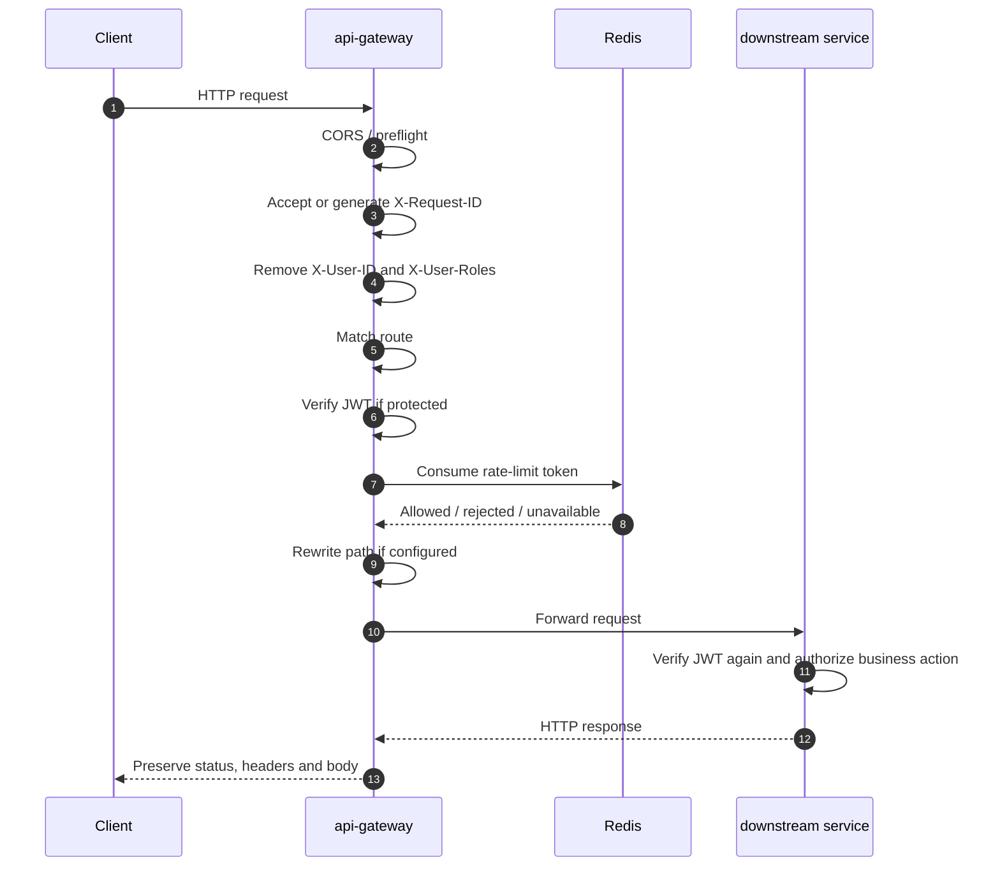
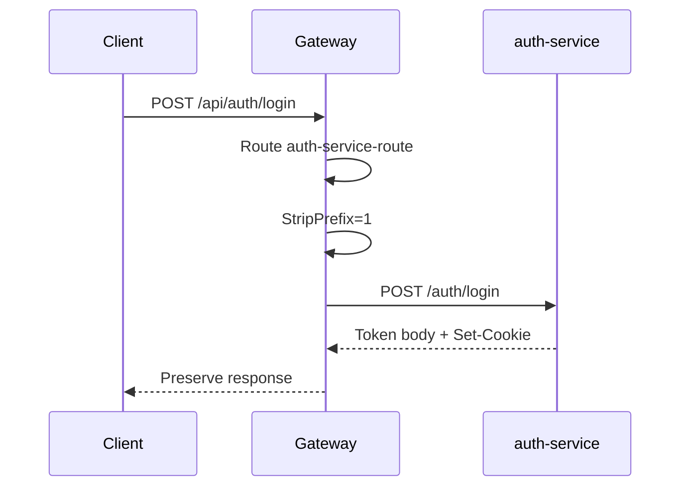
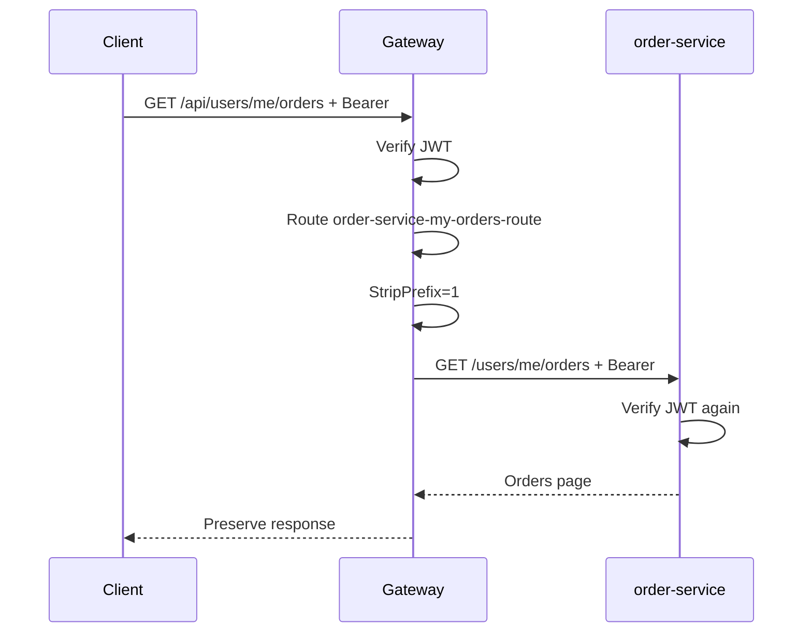
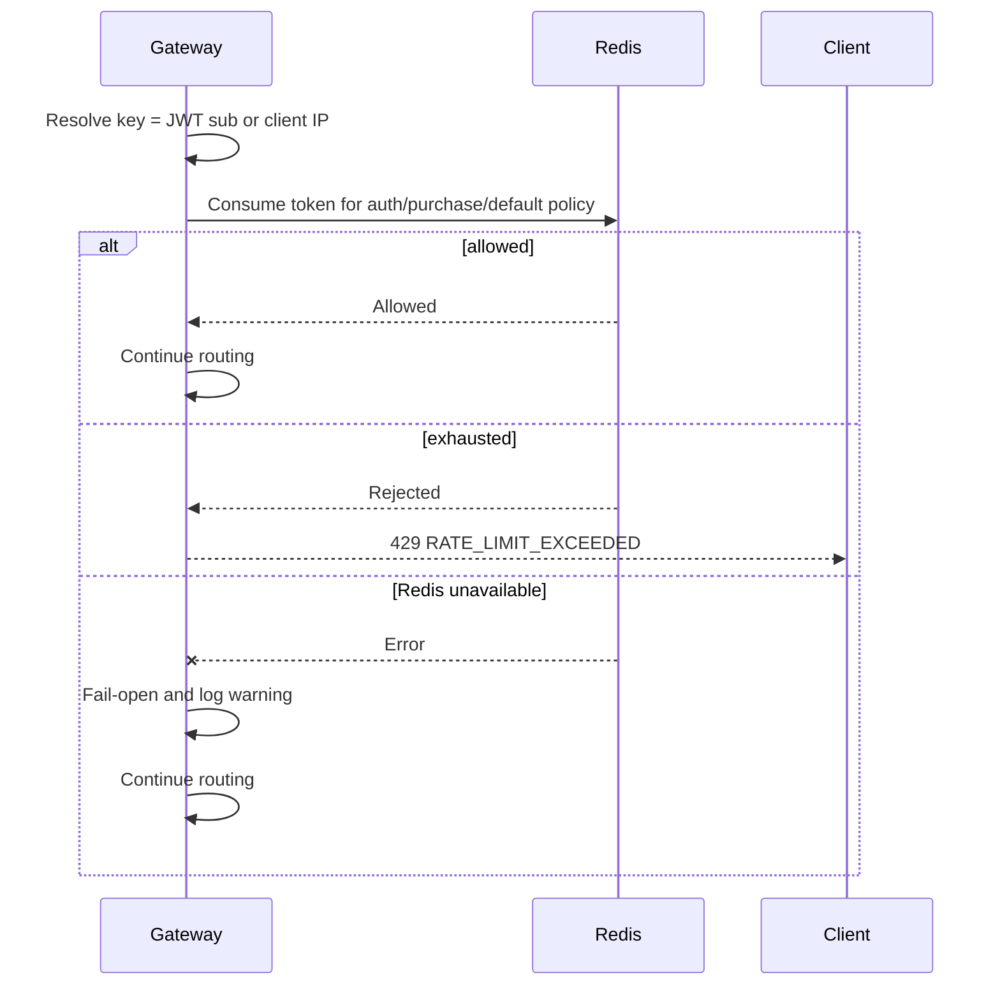

# Flow Specification — API Gateway Request Routing

Flow này mô tả request từ Web/Admin/Mobile đi qua `api-gateway` trước khi tới backend service.

## Main Flow



Gateway không xử lý business logic, không gọi nhiều service để aggregate response, và không route `/internal/**` hoặc `/dev/**` cho client.

## Request Classification

| Type | Examples | Auth |
| --- | --- | --- |
| Health | `/actuator/health`, `/livez`, `/readyz` | Public |
| Auth public | `/api/auth/register`, `/api/auth/login`, `/api/auth/refresh-token` | Public |
| Public read | `GET /api/concerts/**`, `GET /api/inventory/**` | Public |
| Provider callback | `POST /api/payments/callback` | Public; Payment verifies provider signature |
| Protected API | Orders, tickets, check-in, notifications, admin APIs | Bearer JWT required |
| Special transport | SSE, AI Bio upload, CSV upload | Follows route auth policy |

## Auth Flow

Login/register are public but rate-limited by the `auth` policy.



Rewrite:

```text
/api/auth/**
-> /auth/**
```

Refresh token rules:

- `POST /api/auth/refresh-token` is public.
- Gateway forwards `Cookie` and request body.
- Auth Service owns refresh validation and `Set-Cookie`.
- Gateway does not store access or refresh tokens.

Logout:

- `POST /api/auth/logout` is protected.
- Gateway verifies access token then forwards to Auth.
- Gateway does not check Auth blacklist in MVP.

## Order Flow

Order routes are protected and use the `purchase` policy only for `POST /api/orders`.



Rewrites:

```text
POST /api/orders
-> POST /orders

GET /api/orders/{orderId}
-> GET /orders/{orderId}

GET /api/users/me/orders
-> GET /users/me/orders
```

Gateway does not create orders, reserve inventory, call payment, own transactions, or store idempotency state.

## Other Route Flow Notes

| Route | Handling |
| --- | --- |
| `/api/concerts/**` | Public GET; forwarded unchanged to Event Service |
| `/api/inventory/**` | Public GET; forwarded unchanged to Inventory Service |
| `/api/payments/callback` | Public; body/signature headers are preserved for Payment Service |
| `/api/checkin/**` | Protected; forwarded unchanged with 5s response timeout |
| `GET /api/notifications/stream` | Protected SSE; no normal response timeout, no buffering |
| `POST /api/ai-bio/concerts/{concertId}/jobs` | Protected upload; 30MB transport limit, 60s response timeout |
| `POST /api/admin/csv-import` | Protected upload; 12MB transport limit, 60s response timeout |

## Rate-Limit Flow



Rate limiting is traffic protection only. Business correctness remains in downstream services through idempotency, state machines, unique constraints and transactions.

## Error Flow

Gateway-generated failures:

| Case | Response |
| --- | --- |
| No matching route, including `/internal/**` | `404 RESOURCE_NOT_FOUND` |
| Missing token on protected route | `401 UNAUTHORIZED` |
| Invalid/expired/wrong issuer or audience token | `401 INVALID_TOKEN` |
| Rate limit exceeded | `429 RATE_LIMIT_EXCEEDED` + `Retry-After` |
| AI Bio upload too large | `413 PDF_TOO_LARGE` |
| CSV upload too large | `413 FILE_TOO_LARGE` |
| Downstream connection refused/timeout | `503 SERVICE_UNAVAILABLE` |

Downstream business errors are preserved. Example: if Order or Inventory returns `409 TICKET_SOLD_OUT`, Gateway returns the same HTTP status and body.

## Docker Integration Smoke Test

Validated local flow:

```text
Host
-> localhost:8080
-> api-gateway:8080
-> auth-service:8080

Host
-> localhost:8080
-> api-gateway:8080
-> order-service:8080
```

Smoke sequence:

1. `GET /readyz` returns `200`.
2. `POST /api/auth/register` returns `201`.
3. `POST /api/auth/login` returns `200` and a Bearer access token.
4. `GET /api/users/me/orders` with the token returns `200`.

This proves Docker DNS routing, JWT public-key verification, Auth route rewrite and Order route rewrite are working together.
