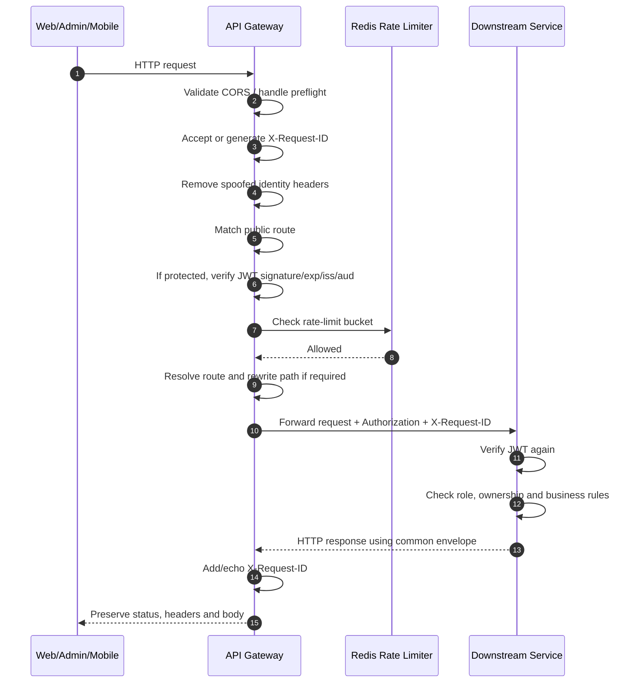
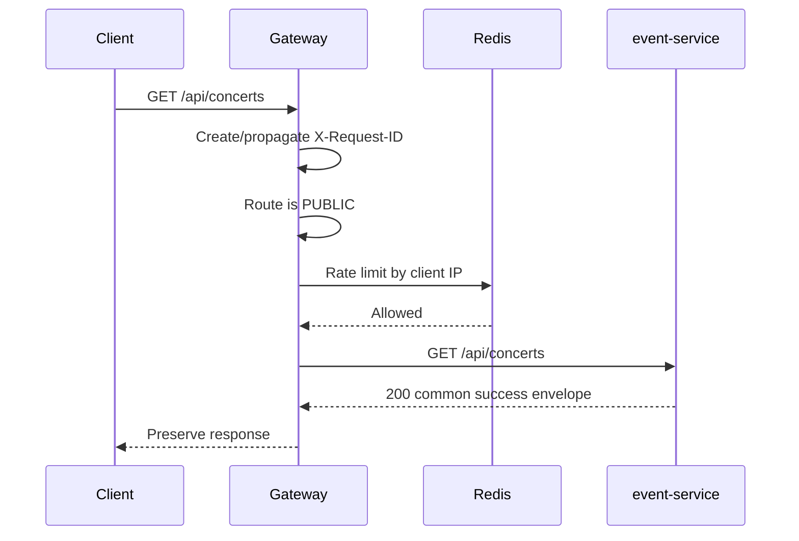
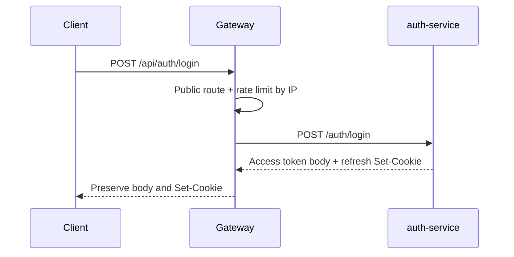
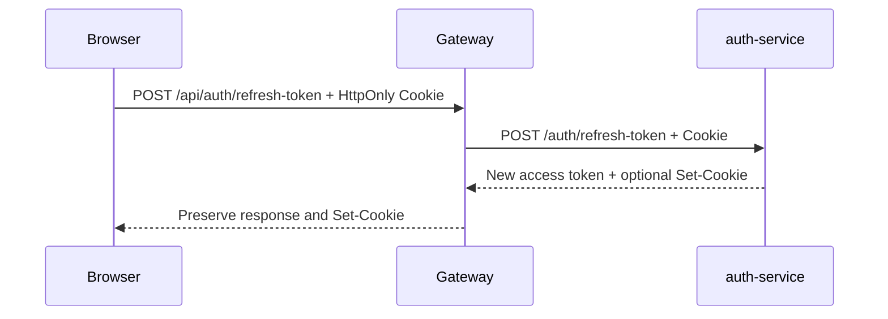
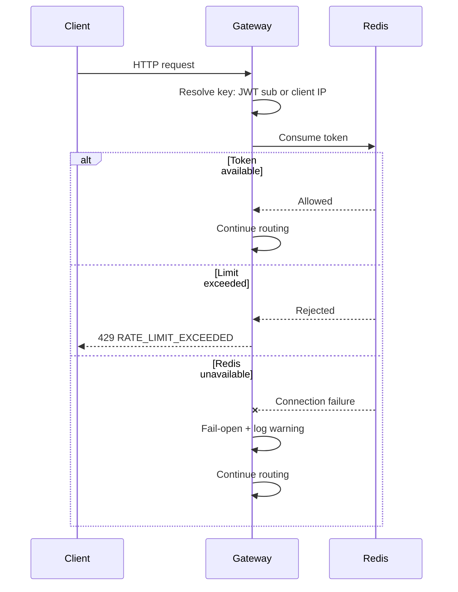
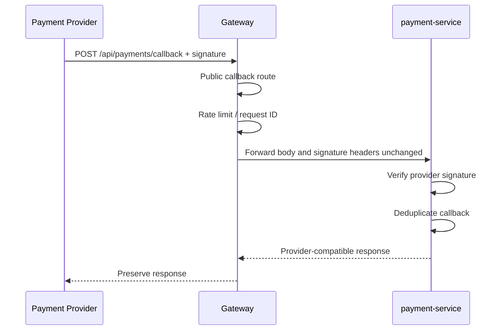
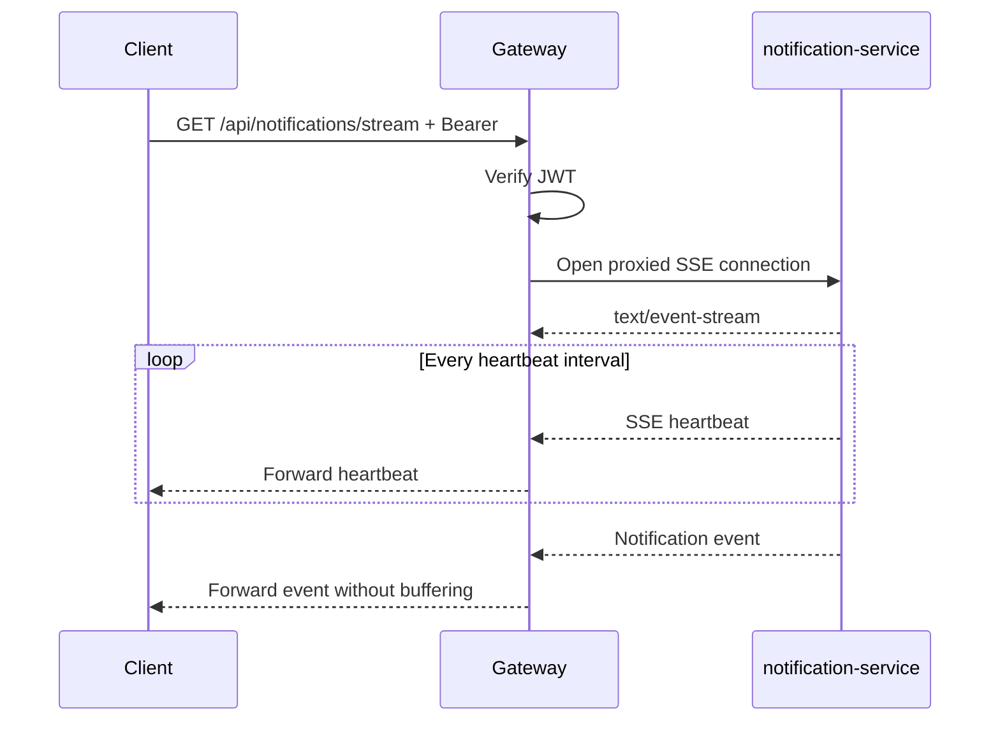
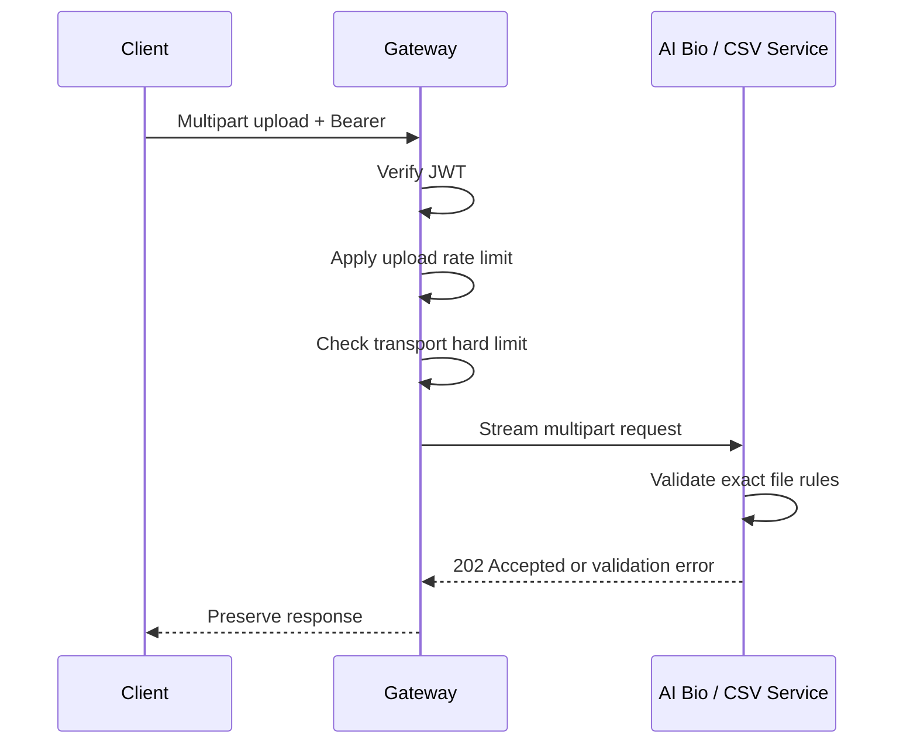

---

title: Flow Specification - API Gateway Request Routing
status: PROPOSED
version: 1.0
owner: Hoàng
reviewers: [BE Lead, Auth Service, Frontend, Mobile]
lastUpdated: 2026-06-17
-----------------------

# Flow Specification — `API Gateway Request Routing`

## 1. Goal

Flow này mô tả cách request từ Web, Admin Web hoặc Mobile đi qua API Gateway trước khi được chuyển tới một backend service.

Kết quả mong muốn:

* Client chỉ cần biết một public base URL.
* Request được route đúng service.
* Protected endpoint bị reject sớm nếu thiếu hoặc sai JWT.
* Downstream service vẫn tự verify JWT và authorize nghiệp vụ.
* `Authorization`, `X-Request-ID`, Cookie và idempotency metadata được propagate đúng.
* `/internal/**` không thể truy cập từ client.
* Rate limit, CORS, timeout và access logging được xử lý tập trung.
* Gateway không làm thay business logic của downstream service.

## 2. Participants

| Participant        | Responsibility                                               |
| ------------------ | ------------------------------------------------------------ |
| Web App            | Gửi request public/protected, sử dụng access token           |
| Admin Web          | Gửi request quản trị, upload PDF/CSV                         |
| Mobile App         | Gửi request user hoặc check-in                               |
| API Gateway        | CORS, request ID, route, JWT verification, rate limit, proxy |
| Auth Service       | Cấp access/refresh token                                     |
| Downstream service | Verify lại JWT, authorize và xử lý business logic            |
| Redis              | Lưu distributed rate-limit counters                          |
| Logging/Metrics    | Quan sát request xuyên Gateway                               |

## 3. Preconditions

* API Gateway đã start và load route configuration.
* JWT public key đọc được.
* Downstream service URL được cấu hình qua environment.
* Redis khả dụng hoặc Gateway đang áp dụng rate-limit fail-open policy.
* Client sử dụng Gateway public URL thay vì gọi trực tiếp host port của service.
* Protected request có `Authorization: Bearer <access-token>`.
* Refresh request có refresh cookie hoặc fallback body theo Auth Contract.
* Service phía sau vẫn cấu hình JWT resource server và public key riêng.

## 4. Request classification

Gateway phân request thành bốn loại.

| Type              | Description                                       | Authentication                                      |
| ----------------- | ------------------------------------------------- | --------------------------------------------------- |
| Public request    | Concert browsing, availability, login/register    | Không yêu cầu JWT                                   |
| Protected request | Order, ticket, check-in, notification, admin APIs | JWT bắt buộc                                        |
| Provider callback | Payment provider gọi callback                     | Không dùng Tickefy JWT; downstream verify signature |
| Special transport | SSE hoặc multipart upload                         | Theo route; có timeout/body handling riêng          |

Gateway không phân loại bất kỳ `/internal/**` nào là public hoặc protected route. Các path đó hoàn toàn không được expose.

## 5. Main happy path



## 6. Step-by-step

| Step | Component  | Action                                             | Failure behavior                                                |
| ---: | ---------- | -------------------------------------------------- | --------------------------------------------------------------- |
|    1 | Client     | Gửi request đến Gateway                            | Network failure do client xử lý                                 |
|    2 | Gateway    | Kiểm tra CORS hoặc xử lý OPTIONS preflight         | Origin không hợp lệ bị từ chối                                  |
|    3 | Gateway    | Nhận hoặc tạo `X-Request-ID`                       | Luôn phải có request ID sau bước này                            |
|    4 | Gateway    | Xóa `X-User-ID`, `X-User-Roles` do client gửi      | Không tin identity header từ client                             |
|    5 | Gateway    | Match route theo method và path                    | Không match trả `404 RESOURCE_NOT_FOUND`                        |
|    6 | Gateway    | Xác định route public hay protected                | Protected tiếp tục JWT verification                             |
|    7 | Gateway    | Verify JWT signature, `exp`, `iss`, `aud`          | Thiếu token: `UNAUTHORIZED`; token sai: `INVALID_TOKEN`         |
|    8 | Gateway    | Resolve rate-limit key                             | Authenticated dùng JWT `sub`, public dùng IP                    |
|    9 | Gateway    | Kiểm tra token bucket trong Redis                  | Vượt giới hạn trả `429`; Redis lỗi thì fail-open                |
|   10 | Gateway    | Rewrite path nếu route yêu cầu                     | Auth và Order có rewrite `/api`                                 |
|   11 | Gateway    | Forward request sang downstream                    | Giữ `Authorization`, Cookie, request ID và idempotency metadata |
|   12 | Downstream | Verify lại JWT                                     | Downstream có thể trả 401 độc lập                               |
|   13 | Downstream | Kiểm tra role, ownership và business authorization | Trả lỗi theo Error Catalog                                      |
|   14 | Downstream | Xử lý business logic                               | Gateway không tham gia transaction                              |
|   15 | Downstream | Trả common response envelope                       | Gateway không wrap lại body                                     |
|   16 | Gateway    | Preserve response và echo request ID               | Client nhận status/body gốc                                     |

## 7. Public request flow

Ví dụ:

```http
GET /api/concerts
```



Rules:

* Không yêu cầu access token.
* Nếu client gửi token hợp lệ, Gateway có thể parse để logging/rate-limit theo user nhưng không bắt buộc.
* Public request vẫn chịu CORS, rate limit, timeout và request tracing.
* Event Service chịu trách nhiệm trả business response.

## 8. Protected request flow

Ví dụ:

```http
POST /api/orders
Authorization: Bearer <access-token>
```

Gateway thực hiện:

1. Verify access token.
2. Lấy `sub` làm rate-limit key.
3. Rewrite:

```text
/api/orders
→ /orders
```

4. Forward nguyên access token sang Order Service.
5. Order Service verify lại token.
6. Order Service lấy `userId` từ JWT `sub`.
7. Order Service xử lý idempotency, reserve và payment flow.

Gateway không:

* Tạo order.
* Gọi Inventory.
* Gọi Payment.
* Quản lý order transaction.
* Retry request tạo order.
* Thay thế idempotency key.

## 9. Authentication flows

### 9.1. Login



Gateway rewrite:

```text
/api/auth/login
→ /auth/login
```

### 9.2. Refresh token



Rules:

* Route public nhưng rate limit profile phải nghiêm ngặt.
* CORS phải `allowCredentials=true`.
* Gateway không đọc hoặc lưu refresh token.
* Gateway không dùng refresh cookie để xác thực request đến service khác.
* Access token vẫn được gửi trong `Authorization` cho protected APIs.

### 9.3. Logout

```http
POST /api/auth/logout
Authorization: Bearer <access-token>
```

Rules:

* Protected endpoint.
* Gateway verify token và forward.
* Auth Service xử lý blacklist/revoke.
* Gateway chưa tự check Auth blacklist trong MVP.

## 10. Order route rewrite flow

Current Order Service controller path:

```text
/orders/**
/users/me/orders
```

Canonical external Gateway path:

```text
/api/orders/**
/api/users/me/orders
```

Rewrites:

```text
POST /api/orders
→ POST /orders

GET /api/orders/{orderId}
→ GET /orders/{orderId}

GET /api/users/me/orders
→ GET /users/me/orders
```

Client không được phụ thuộc direct-development path của Order Service.

## 11. Internal service-to-service flow

Internal calls không đi qua Gateway.

Ví dụ:

```text
Order Service
→ POST http://inventory-service:8080/internal/inventory/reservations
```

```text
Check-in Service
→ POST http://ticket-service:8080/internal/tickets/checkin
```

Rules:

* Sử dụng Docker service name và container port `8080`.
* Forward access token gốc khi call đại diện user.
* Downstream verify JWT.
* Propagate `X-Request-ID`.
* Không route vòng qua public Gateway.
* Không expose internal endpoint cho frontend/mobile.
* Gateway nhận `/internal/**` phải trả route-not-found.

## 12. Rate-limit flow



Rate limiting không đảm bảo business correctness. Service vẫn phải dùng:

* Unique constraints.
* Idempotency keys.
* State-machine guards.
* Atomic inventory operations.
* Check-in deduplication.

## 13. Payment callback flow



Rules:

* Không yêu cầu Tickefy JWT.
* Gateway không verify provider signature.
* Gateway không parse payment payload.
* Gateway không retry callback.
* Payment Service là nơi đảm bảo callback idempotency.
* Không log callback secret hoặc signature.

## 14. Notification SSE flow



Rules:

* Protected route.
* Gateway không buffer toàn bộ stream.
* Không dùng default response timeout.
* Không retry connection tự động.
* Không cache.
* Không modify SSE body.
* Disconnect từ client phải đóng downstream connection.
* Notification Service gửi heartbeat định kỳ.

## 15. Multipart upload flow

Áp dụng cho:

```text
POST /api/ai-bio/concerts/{concertId}/jobs
POST /api/admin/csv-import
```



Rules:

* Gateway không đọc PDF hoặc CSV content để xử lý nghiệp vụ.
* Gateway không log multipart body.
* Gateway hard limit chỉ bảo vệ transport.
* Service sở hữu validation chính xác.
* `Idempotency-Key` phải được forward cho AI Bio.
* Gateway không retry upload.

## 16. Error flows

### 16.1. Missing token

```text
Protected endpoint
Authorization header missing
→ 401 UNAUTHORIZED
```

Response:

```json
{
  "success": false,
  "data": null,
  "error": {
    "httpStatus": 401,
    "code": "UNAUTHORIZED",
    "message": "Chưa xác thực.",
    "details": {}
  },
  "requestId": "req-uuid",
  "timestamp": "2026-06-17T10:00:00Z"
}
```

### 16.2. Invalid token

```text
Invalid signature
Expired token
Wrong issuer
Wrong audience
→ 401 INVALID_TOKEN
```

Gateway không dùng code `TOKEN_EXPIRED`.

### 16.3. Rate limit exceeded

```text
Rate-limit bucket exhausted
→ 429 RATE_LIMIT_EXCEEDED
→ Include Retry-After when available
```

### 16.4. Downstream unavailable

```text
Connection refused
Connection timeout
Response timeout
→ 503 SERVICE_UNAVAILABLE
```

Gateway không trả stack trace hoặc downstream hostname cho client.

### 16.5. Downstream business error

Ví dụ Inventory trả:

```text
409 TICKET_SOLD_OUT
```

Gateway phải trả nguyên:

```text
HTTP 409
error.code = TICKET_SOLD_OUT
```

Gateway không chuyển thành `SERVICE_UNAVAILABLE` hoặc `INTERNAL_SERVER_ERROR`.

## 17. Failure scenarios

| Case | Failure                                        | Expected behavior                                     |
| ---: | ---------------------------------------------- | ----------------------------------------------------- |
|    1 | Route không tồn tại                            | `404 RESOURCE_NOT_FOUND`                              |
|    2 | Client gọi `/internal/**`                      | `404 RESOURCE_NOT_FOUND`                              |
|    3 | Protected route thiếu token                    | `401 UNAUTHORIZED`                                    |
|    4 | JWT hết hạn                                    | `401 INVALID_TOKEN`                                   |
|    5 | JWT sai issuer/audience                        | `401 INVALID_TOKEN`                                   |
|    6 | Rate limit vượt ngưỡng                         | `429 RATE_LIMIT_EXCEEDED`                             |
|    7 | Redis unavailable                              | Fail-open, route request, log/metric warning          |
|    8 | Downstream unavailable                         | `503 SERVICE_UNAVAILABLE`                             |
|    9 | Downstream timeout                             | `503 SERVICE_UNAVAILABLE`                             |
|   10 | Downstream trả validation error                | Preserve status/body                                  |
|   11 | Client giả identity header                     | Header bị xóa trước khi forward                       |
|   12 | CORS origin không được phép                    | Request bị từ chối tại Gateway                        |
|   13 | Payment callback thiếu/sai signature           | Gateway forward; Payment Service trả lỗi              |
|   14 | SSE vượt default timeout                       | Không xảy ra vì route có timeout riêng                |
|   15 | Multipart quá Gateway hard limit               | Reject trước downstream                               |
|   16 | Multipart hợp lệ transport nhưng sai file type | Service trả service-specific validation error         |
|   17 | Gateway restart giữa request                   | Client xử lý retry theo endpoint/idempotency contract |
|   18 | JWT public key không load được                 | Gateway không trở thành ready                         |

## 18. Retry and idempotency

Gateway không tự retry request.

Client hoặc service quyết định retry dựa trên endpoint contract.

| Operation                 | Idempotency owner       |
| ------------------------- | ----------------------- |
| Create order              | Order Service           |
| Inventory reservation     | Inventory Service       |
| Payment creation/callback | Payment Service         |
| Check-in scan             | Check-in/Ticket Service |
| AI Bio job creation       | AI Bio Service          |
| CSV import                | CSV Ingestion Service   |

Gateway chỉ forward idempotency metadata, không lưu kết quả idempotency.

Request retry phải giữ nguyên:

```text
Idempotency key
Request body
Authenticated user
Business identifiers
```

## 19. Security boundaries

### Gateway guarantees

* Public/protected route classification.
* JWT verification tại system edge.
* CORS.
* Rate limiting.
* Request ID propagation.
* Removal of spoofed identity headers.
* Internal route isolation.
* Basic transport security.

### Downstream guarantees

* JWT verification lần hai.
* Role authorization.
* Ownership authorization.
* Business state validation.
* Data validation.
* Idempotency.
* Transaction integrity.
* Error contract.

### Auth Service guarantees

* Credential verification.
* Access token signing.
* Refresh token handling.
* Role claims.
* Logout/revocation data.

Không component nào được xem Gateway là lớp bảo mật duy nhất.

## 20. Observability

Mọi request phải có một request ID xuyên suốt:

```text
Client
→ Gateway
→ Downstream service
→ Internal HTTP calls
→ Event correlation ID nếu phát sinh event
```

Gateway log tối thiểu:

```text
requestId
routeId
method
path
status
durationMs
clientIp
authenticatedUserId
downstreamService
failureReason
```

Không log:

```text
JWT
Cookie
password
refresh token
payment signature
PDF/CSV body
raw QR token
```

## 21. Integration test scenarios

| ID       | Scenario                              | Expected                          |
| -------- | ------------------------------------- | --------------------------------- |
| `GW-001` | Public GET concert không token        | Route thành công                  |
| `GW-002` | Protected GET tickets không token     | `401 UNAUTHORIZED`                |
| `GW-003` | Protected request với expired token   | `401 INVALID_TOKEN`               |
| `GW-004` | JWT đúng signature nhưng sai audience | `401 INVALID_TOKEN`               |
| `GW-005` | Auth login external path              | Rewrite sang `/auth/login`        |
| `GW-006` | Create order external path            | Rewrite sang `/orders`            |
| `GW-007` | My orders external path               | Rewrite sang `/users/me/orders`   |
| `GW-008` | Downstream nhận Authorization         | Header giống request gốc          |
| `GW-009` | Client gửi fake `X-User-ID`           | Downstream không nhận fake header |
| `GW-010` | Client không gửi request ID           | Gateway sinh và echo ID           |
| `GW-011` | Client gửi request ID hợp lệ          | ID được preserve                  |
| `GW-012` | Rate limit exceeded                   | `429` + common envelope           |
| `GW-013` | Redis down                            | Request vẫn được route            |
| `GW-014` | Gọi `/internal/tickets/checkin`       | `404`                             |
| `GW-015` | Payment callback không JWT            | Request đến Payment Service       |
| `GW-016` | Payment callback signature headers    | Headers được preserve             |
| `GW-017` | AI Bio multipart hợp lệ               | Request đến AI Bio Service        |
| `GW-018` | CSV multipart hợp lệ                  | Request đến CSV Service           |
| `GW-019` | Notification SSE                      | Stream và heartbeat hoạt động     |
| `GW-020` | Downstream trả `TICKET_SOLD_OUT`      | Gateway preserve 409/code         |
| `GW-021` | Downstream connection refused         | `503 SERVICE_UNAVAILABLE`         |
| `GW-022` | Refresh cookie qua CORS               | Cookie và Set-Cookie hoạt động    |
| `GW-023` | Access log inspection                 | Không có JWT/Cookie/body          |
| `GW-024` | Gateway restart                       | Không mất business data           |

## 22. Completion criteria

Flow được xem là hoàn thành khi:

* Client sử dụng một Gateway base URL.
* Tất cả canonical public route hoạt động.
* Auth và Order path rewrite đúng.
* JWT verification hoạt động.
* Downstream vẫn verify JWT.
* CORS và refresh cookie hoạt động.
* Request ID xuyên suốt.
* Redis rate limiting hoạt động.
* Internal route bị cô lập.
* Multipart và SSE hoạt động.
* Gateway-generated error đúng common envelope.
* Downstream response được preserve.
* Docker Compose end-to-end tests pass.

## 23. Related contracts

* `../common/auth-contract.md`
* `../common/api-standard.md`
* `../common/error-catalog.md`
* `../common/event-envelope.md`
* `../services/api-gateway.md`
* `../services/auth-service.md`
* `../services/order-service.md`
* `../services/payment-service.md`
* `../services/notification-service.md`
* `../services/ai-bio-service.md`
* `../services/csv-ingestion-service.md`
