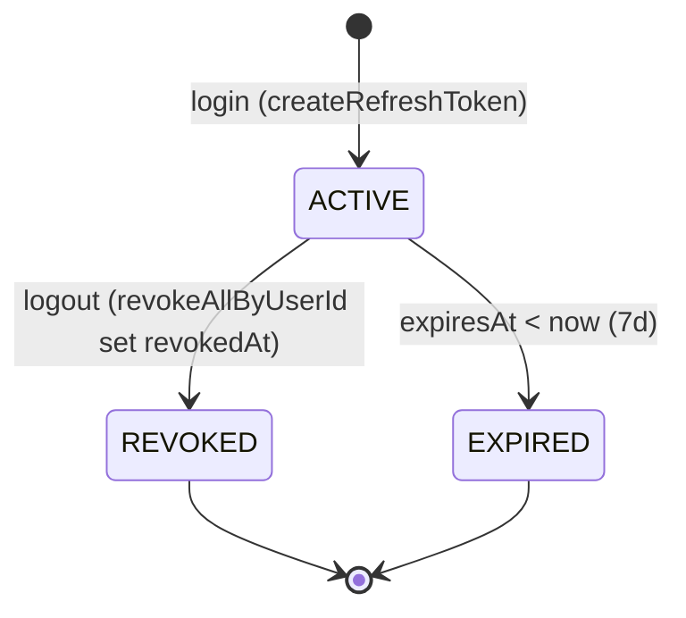

# Flow Specification — `Authentication`

> Nhãn tin cậy: ✅ khớp implement (verify repo `dev` HEAD `42ae0de`) · 🔭 PLANNED/parked (chưa code, cố ý) · ⚠️ VERIFY (cần xác nhận thêm / khác giữa dev↔prod).
> Nguồn: `INSPECT-auth-flow.md` (evidence file:line) + baseline `services/auth-service.md` (RE-VERIFY: không mục nào STALE).
> **Gateway caveat:** gateway đã merge `dev` (route + JWT verify config có trên branch), **nhưng `docker-compose.dev.yml` chưa wire gateway** (Hoàng push sau). → đường **canonical prod** = `Client → Gateway → service`; đường **dev-test hiện tại** = gọi DIRECT `auth:8081`. Doc mô tả cả hai, đánh dấu rõ.

---

## 1. Goal

Cấp & xác minh danh tính cho toàn hệ Tickefy: đăng ký → đăng nhập (JWT RS256 access + refresh opaque) → request đã xác thực (gateway verify + service re-verify, defense-in-depth) → làm mới access → đăng xuất (blacklist + revoke refresh). ✅

JWT bất đối xứng **RS256**: auth-service GIỮ **private key** (ký), API Gateway + mọi service khác **verify bằng public key** (md5 trùng nhau). Service khác KHÔNG gọi auth để xác thực — chỉ verify chữ ký + đọc claims. ✅ (`JwtTokenProvider:48` sign / `:57` verify)

## 2. Participants

| Participant | Responsibility |
|---|---|
| **auth-service** (8081 host / 8080 container) | register/login/refresh/logout/me + role mgmt; ký JWT (private key); blacklist jti (Redis); ✅ |
| **api-gateway** (8080) | verify JWT RS256 + enforce `aud`/`iss`, gate public vs protected, forward `Authorization` nguyên (KHÔNG strip/TokenRelay). ✅ (canonical; dev-test hiện gọi DIRECT auth) |
| **Service downstream** (inventory/order/e-ticket/checkin) | verify sig+exp (public key) + RBAC `@PreAuthorize` — defense-in-depth, KHÔNG check blacklist. ✅ |
| **PostgreSQL** (`auth_service`) | `users`, `roles`, `user_roles`, `refresh_tokens`. ✅ |
| **Redis** | blacklist jti namespace `tickefy:auth:token:blacklist:{jti}` (CHỈ auth check). ✅ |
| RabbitMQ | **N/A** — auth KHÔNG publish/consume event (no amqp dep). ✅ |

## 3. Preconditions

- Role seed: `roles` có AUDIENCE/ORGANIZER/CHECKIN_STAFF/ADMIN; register cần AUDIENCE tồn tại (`AuthService:77` orElseThrow nếu thiếu). ✅
- Keypair RS256 sẵn: private `classpath:keys/...` (auth), public `jwt-dev-public.pem` (mọi service + gateway, md5 trùng). ✅
- Bootstrap admin: chỉ tạo nếu env `app.bootstrap.admin.email/password` set (`AdminBootstrapRunner:24-31`). ⚠️ compose dev KHÔNG set → **không có admin mặc định** → demo phải set env hoặc grant role ADMIN/CHECKIN_STAFF tay trong DB.

## 4. Trigger

Client gọi (qua gateway `/api/auth/**`, hoặc dev-direct `/auth/**`):
- `POST /auth/register` · `POST /auth/login` · `POST /auth/refresh-token` — **public**. ✅
- `POST /auth/logout` · `GET /auth/me` · role-mgmt — **authenticated**. ✅
(`AuthController:39/47/60/81`)

## 5. Happy path

```mermaid
sequenceDiagram
    participant C as Client (FE)
    participant G as API Gateway
    participant A as auth-service
    participant DB as PostgreSQL (auth_service)
    participant R as Redis (blacklist)

    Note over C,DB: LOGIN (public route)
    C->>G: POST /api/auth/login {email, password}
    G->>A: forward (public — không yêu cầu JWT)
    A->>DB: findByEmail
    A->>A: bcrypt.matches (dummy hash nếu email không tồn tại — anti-enumeration)
    A->>A: ký access JWT (RS256, private key; sub/email/roles/jti/iss/aud/exp)
    A->>DB: save refresh token (lưu SHA-256 hash, không lưu raw)
    A-->>C: 200 + body{accessToken, refreshToken} + Set-Cookie(access_token, refresh_token HttpOnly)

    Note over C,R: AUTHENTICATED REQUEST (protected)
    C->>G: GET /api/... + Authorization: Bearer <access>
    G->>G: verify RS256 sig + aud=tickefy-api + iss=tickefy-auth-service + exp/nbf
    G->>A: forward (Authorization giữ nguyên)
    A->>A: re-verify sig+exp (public key) + set authority ROLE_<code> + @PreAuthorize
    A->>R: isBlacklisted(jti)? (CHỈ auth-side)
    A-->>C: 200 / 401 INVALID_TOKEN / 403 FORBIDDEN
```

## 6. Step-by-step

| Step | From | To | Sync/Async | Contract | State change |
|---:|---|---|---|---|---|
| **REGISTER** |||| | |
| 1 | Client | auth `AuthController:39` | Sync | `POST /auth/register` (api-contracts §2) | — |
| 2 | auth | DB | Sync (1 tx `AuthService:68`) | `existsByEmail`; trùng → 409 `EMAIL_ALREADY_EXISTS` | — |
| 3 | auth | DB | Sync | bcrypt hash + tạo user (enabled=true) + gán AUDIENCE (`AuthService:84-93`) | user CREATED |
| 4 | auth | Client | Sync | **201** `{userId,email,fullName,roles}`; **KHÔNG cấp token/cookie** | — |
| **LOGIN** |||| | |
| 1 | Client | auth `AuthController:47` | Sync | `POST /auth/login` | — |
| 2 | auth | DB | Sync | `findByEmail`; null → dummy bcrypt (constant-time) → 401 `INVALID_CREDENTIALS` (không lộ email) | — |
| 3 | auth | — | Sync | `passwordEncoder.matches` sai → 401 `INVALID_CREDENTIALS` (cùng message) | — |
| 4 | auth | — | Sync | ký access RS256 (`JwtTokenProvider:34`): sub/email/roles/jti/iss=tickefy-auth-service/aud=tickefy-api/exp=now+15m | — |
| 5 | auth | DB | Sync | tạo refresh: 32B SecureRandom base64url, lưu **SHA-256 hex** + expiresAt=now+7d (`RefreshTokenService:32`) | refresh ACTIVE |
| 6 | auth | Client | Sync | **200** body `{accessToken,refreshToken,Bearer,expiresIn}` + 2 Set-Cookie (`AuthController:54-57`) | — |
| **AUTHENTICATED REQUEST** |||| | |
| 1 | Client | Gateway | Sync | `Authorization: Bearer <access>`; gateway verify RS256+aud+iss+exp (`JwtDecoderConfig:40-106`) | — |
| 2 | Gateway | Service | Sync | forward Authorization nguyên (no strip) | — |
| 3 | Service | — | Sync | re-verify sig+exp public key + authority `ROLE_<code>` + `@PreAuthorize` (`JwtAuthenticationFilter:65-75`) | — |
| 4 | auth (nếu là auth endpoint) | Redis | Sync | `isBlacklisted(jti)` — CHỈ auth check | — |
| **REFRESH** |||| | |
| 1 | Client | auth `AuthController:60` | Sync | refresh đọc từ **COOKIE** trước, fallback body; thiếu → 401 `INVALID_TOKEN` | — |
| 2 | auth | DB | Sync | SHA-256 → `findByTokenHash`; revokedAt≠null → 401 `TOKEN_REVOKED`; hết hạn → 401 `INVALID_TOKEN` (`RefreshTokenService:50-64`) | — |
| 3 | auth | Client | Sync | cấp **access MỚI**; **KHÔNG rotate refresh** (`AuthController:75`); 200 + 1 Set-Cookie(access) | — |
| **LOGOUT** |||| | |
| 1 | Client | auth `AuthController:81` | Sync (1 tx) | authenticated; parse access → jti/exp | — |
| 2 | auth | Redis | Sync | blacklist jti, TTL = remaining(exp) nếu dương (`AuthService:162`) | access REVOKED (Redis) |
| 3 | auth | DB | Sync | `revokeAllByUserId` set revokedAt (`RefreshTokenService:67`) | refresh REVOKED |
| 4 | auth | Client | Sync | clear 2 cookie (Max-Age=0); 200 | — |

> ⚠️ **Quan sát access-cookie vs Bearer:** login set CẢ access cookie (Path `/`) lẫn refresh cookie (Path `/auth`, HttpOnly) VÀ trả 2 token trong body (backward-compat). Service-side verify đọc **`Authorization: Bearer` header**, KHÔNG đọc cookie. → theo FE auth convention (`Frontend-conventions.md`), FE giữ **access in-memory** (từ body) + **refresh HttpOnly cookie**; access cookie là dư/backward-compat, không dùng cho service auth. ✅

## 7. Data ownership

| Data | Source of truth |
|---|---|
| `users` / `roles` / `user_roles` / `refresh_tokens` | auth-service (schema `auth_service`) ✅ |
| Private RS256 key (ký) | auth-service ✅ |
| Public RS256 key (verify) | phân phối tới gateway + mọi service (md5 trùng) ✅ |
| Blacklist jti | Redis `tickefy:auth:token:blacklist:{jti}` (auth ghi/đọc) ✅ |

- Service khác KHÔNG đọc bảng auth — chỉ verify JWT + đọc claims (`sub`/`roles`). KHÔNG cross-service FK. ✅

## 8. State transitions by service

| Service | Before | After | Trigger |
|---|---|---|---|
| auth (User) | (none) | CREATED (enabled=true, +AUDIENCE) | register |
| auth (User roles) | roles[] | +role / −role (LAST_ADMIN guard) | role mgmt (ADMIN) |
| auth (RefreshToken) | ACTIVE | REVOKED | logout (`revokeAllByUserId`) |
| auth (RefreshToken) | ACTIVE | EXPIRED | expiresAt < now (7d) |
| auth (AccessToken) | valid | blacklisted (Redis, TTL=remaining) | logout |

## 9. Refresh token state machine



- **KHÔNG rotation** ✅ — `AuthService.refresh` không tạo refresh mới; 1 refresh sống suốt 7 ngày tới khi logout/exp. (🔭 rotation parked nếu sau muốn tăng bảo mật.)

## 10. Idempotency

| Operation | Idempotency key | Replay behavior |
|---|---|---|
| register | `email` (UNIQUE) | re-POST cùng email → 409 `EMAIL_ALREADY_EXISTS`, không tạo trùng ✅ |
| assign role | (user, role) | đã có → no-op (`UserService:50`) ✅ |
| remove role | (user, role) | chưa có → no-op (`:81`); chặn `LAST_ADMIN` ✅ |
| login / refresh | — | KHÔNG idempotent (by design: mỗi login tạo refresh mới; refresh cấp access mới) ✅ |
| (event messageId) | — | N/A — auth không phát/nhận event ✅ |

## 11. Timeout and retry

| Call/event | Timeout | Retry | Backoff | Final action |
|---|---:|---:|---|---|
| outbound dependency | — | — | — | **N/A** — auth không gọi service khác, không event ✅ |
| access token TTL | 15m (`PT15M`) | — | — | hết hạn → 401 → FE refresh |
| refresh token TTL | 7d (`P7D`) | — | — | hết hạn → 401 → buộc login |
| blacklist TTL | = remaining(access) | — | — | tự hết hạn (Redis EX) |
| Redis (blacklist) down | — | — | — | **fail-safe**: cho qua nếu sig+exp hợp lệ + log WARN (§13) |

## 12. Observability

- `requestId`: `RequestIdFilter`+`RequestLoggingFilter` (MDC) → field `requestId` trong `ApiResponse {success,data,error,requestId}`. ✅
- `X-Request-Id`: propagate qua header (gateway sinh/forward; service đọc vào MDC). ✅
- `correlationId` / `messageId`: **N/A** — auth không phát event. ✅
- Required logs: request có requestId+userId; **KHÔNG log raw token/password** (password chỉ ở DTO, bcrypt trước khi lưu; CookieFactory không log giá trị cookie). ✅
- Required metrics: actuator mặc định ✅; 🔭 custom counter (login success/fail) chưa code.

## 13. Security

- **JWT RS256 bất đối xứng:** auth ký private, gateway+service verify public (`JwtTokenProvider:48/57`). Gateway **pin RS256** (chặn `alg:none`/HS256-confusion) + enforce `aud=tickefy-api`+`iss=tickefy-auth-service` (`JwtDecoderConfig:40-106`). ✅
- **Password:** bcrypt, cost **10** (Spring `BCryptPasswordEncoder` default; đạt yêu cầu CLAUDE "≥10"). ⚠️ không override strength tường minh — nếu spec cần số khác phải cấu hình.
- **Refresh token:** opaque 32B SecureRandom, lưu **SHA-256 hex** (không raw, không bcrypt refresh). ✅
- **Anti user-enumeration:** dummy bcrypt khi email không tồn tại (login constant-time, cùng message 2 nhánh). ✅
- **Cookie:** `HttpOnly=true` (luôn, chống XSS đọc token). Secure/SameSite env-overridable (`CookieProperties:23/26`): dev `Secure=false` (`COOKIE_SECURE:false`), `SameSite=Lax` (`COOKIE_SAMESITE:Lax`). **Prod: set `COOKIE_SECURE=true`** (+ `SameSite=None` yêu cầu `Secure=true`). access cookie Path `/` Max-Age 900s, refresh cookie Path `/auth` Max-Age 604800s (`CookieFactory:35-42`). ✅ (giá trị prod là env lúc deploy — xem doc-hygiene §Open)
- **Blacklist fail-safe:** Redis down → coi NOT-blacklisted, cho qua nếu sig+exp ok + log WARN (`JwtBlacklistService:38-41`, CLAUDE §6.1). ✅
- **⚠️ Giới hạn đã biết:** blacklist CHỈ auth-service check → token đã logout vẫn pass ở service downstream tới khi `exp` (access TTL 15m bù rủi ro). Gateway/service KHÔNG check blacklist. ✅ (đánh đổi có chủ đích)
- **Sensitive fields:** `password` (request, không trả/không log), `passwordHash` (DB, không expose DTO), `refreshToken` raw (chỉ trả 1 lần login + HttpOnly cookie).
- **Required roles:** AUDIENCE (default) / ORGANIZER / CHECKIN_STAFF / ADMIN; authority `ROLE_<code>`; `@PreAuthorize` method-level. Đổi role chỉ hiệu lực ở token LẦN SAU (`/auth/me` đọc DB tươi). ✅

## 14. Integration test scenarios

| ID | Scenario | Input | Expected result | Test |
|---|---|---|---|---|
| AUTH-IT-1 | login đúng | email+pass hợp lệ | 200 + access(RS256)+refresh+cookie | `AuthIntegrationTest`, `AuthCookieIntegrationTest` |
| AUTH-IT-2 | login sai pass / email không tồn tại | sai | 401 `INVALID_CREDENTIALS`, không lộ email | `AuthIntegrationTest` (enumeration) |
| AUTH-IT-3 | refresh từ cookie | refresh hợp lệ | access mới, refresh KHÔNG rotate | `AuthCookieIntegrationTest:126-175` |
| AUTH-IT-4 | refresh đã revoke / hết hạn | refresh revoked/expired | 401 `TOKEN_REVOKED`/`INVALID_TOKEN` | `RefreshTokenServiceUnitTest` |
| AUTH-IT-5 | logout → blacklist | access + logout | jti blacklisted, refresh revoked, cookie cleared | `AuthIntegrationTest:266-288` |
| AUTH-IT-6 | Redis down (blacklist) | check khi Redis down | fail-safe cho qua + WARN | `JwtBlacklistServiceFailSafeTest` |
| AUTH-IT-7 | RBAC + LAST_ADMIN | gỡ admin cuối | chặn `LAST_ADMIN`; sai role → 403 | `UserIntegrationTest`, `UserServiceUnitTest` |
| AUTH-IT-8 | claims/sig | issue/parse | aud/iss/exp đúng, RS256 | `JwtTokenProviderTest` |

- Tổng **81 @Test** (Testcontainers Postgres+Redis; auth KHÔNG dùng rabbit → ít rủi ro rabbit-creds khi `./mvnw verify`). ✅

## 15. Acceptance criteria

- [x] Happy path chạy end-to-end (login→authenticated→refresh→logout). ✅ (81 test + audit chain)
- [x] Failure cases xử lý (sai pass/token revoke/expire/RBAC/LAST_ADMIN). ✅ (§15 bảng dưới)
- [x] Duplicate an toàn (register email-unique, role no-op). ✅
- [x] Trace được theo `requestId`. ✅
- [ ] Contract `api-contracts §2` frozen — ✅ phần đã code; 🔭 `change-password`, `GET /auth/users/{id}` chưa code.
- [ ] Gateway route + verify on `dev` ✅ code; ⚠️ **gateway-in-compose chưa wire** (Hoàng push) → smoke-qua-gateway pending.

### Bảng failure scenarios (RE-VERIFY ErrorCode + HTTP)

| Tình huống | Code | HTTP | Nhãn |
|---|---|---|---|
| email trùng (register) | `EMAIL_ALREADY_EXISTS` | 409 | ✅ |
| sai email/pass (login) | `INVALID_CREDENTIALS` | 401 | ✅ không lộ email |
| token sig sai / hết hạn / aud-iss sai | `INVALID_TOKEN` | 401 | ✅ |
| (KHÔNG có `TOKEN_EXPIRED`) | — | — | ✅ expired → `INVALID_TOKEN` → FE refresh-on-any-401 |
| refresh đã revoke | `TOKEN_REVOKED` | 401 | ✅ |
| refresh không thấy/hết hạn/thiếu | `INVALID_TOKEN` | 401 | ✅ |
| thiếu quyền (RBAC) | `FORBIDDEN` | 403 | ✅ |
| gỡ admin cuối | `LAST_ADMIN` | **409** | ✅ `UserService:93` CONFLICT |
| user không tồn tại (mgmt) | `USER_NOT_FOUND` | 404 | ✅ |
| role không hợp lệ | `INVALID_ROLE` | **400** | ✅ `UserService:59/147` BAD_REQUEST |
| Redis down (blacklist) | fail-safe | — | ✅ cho qua nếu sig+exp ok |

> Cơ chế status: `GlobalExceptionHandler.handleApiException` dùng `ex.getStatus()` mang theo từ throw-site (`:66-68`) — KHÔNG có bảng `ErrorCode`→status tập trung. Status do mỗi throw-site quyết định.

---

## Open questions / điểm cần chốt

- 📝 **Doc-hygiene `ADR-0002`:** ADR backend riêng **chưa tồn tại** (không có file/thư mục `adr` trong `docs/contracts`); convention auth FE (access in-memory + refresh HttpOnly cookie + refresh-on-any-401) hiện ở `Frontend-conventions.md`. → hoặc viết ADR-0002 chính thức, hoặc trỏ thẳng `Frontend-conventions.md`. Prod cookie (`COOKIE_SECURE=true` + `SameSite`) là env lúc deploy, nên chốt trong doc này khi deploy.
- 🔭 `change-password`, refresh **rotation**, `UserRegistered` event, gateway-side blacklist (ADR-AUTH-003) — parked, chưa code.
- ⚠️ Gateway-in-compose wiring (Hoàng push) → khi có, re-smoke flow auth **qua `:8080`** (hiện verify DIRECT auth:8081).
