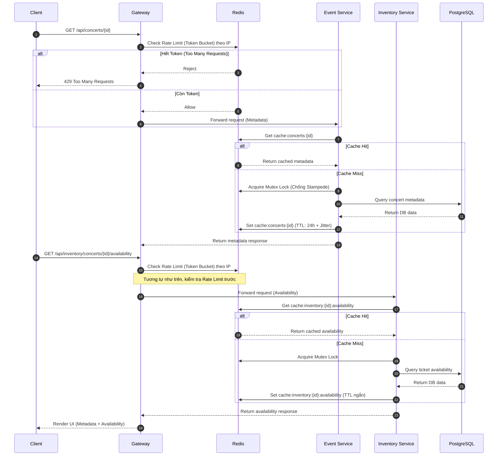

# Flow Specification — `Concert Browsing`

## 1. Goal
Đảm bảo luồng tìm kiếm và xem chi tiết Concert (bao gồm thông tin metadata, sơ đồ ghế và số lượng vé còn lại) hoạt động ổn định dưới tải trọng đột biến (Read-Heavy Traffic) lên tới hàng nghìn request/giây mà không làm sập Database. Áp dụng cơ chế **Rate Limiting** bảo vệ tại Gateway và chiến lược Cache-aside với Redis đa tầng, chống Penetration và Stampede tại Service.

## 2. Participants

| Participant | Responsibility |
|---|---|
| Khán giả (Client) | Mở ứng dụng/web để xem danh sách hoặc chi tiết sự kiện. |
| API Gateway | Định tuyến request, đóng vai trò tuyến phòng thủ đầu tiên. Áp dụng Rate Limiting (Token Bucket) theo IP để chặn Bot/Spam. |
| Event Service | Cung cấp thông tin Metadata của Concert (Tên, Nghệ sĩ, Địa điểm, Mô tả, Sơ đồ). |
| Inventory Service | Cung cấp thông tin loại vé (Ticket Types), giá và số lượng vé khả dụng (Availability). |
| Redis (Cache) | Cung cấp lưu trữ cho Token Bucket của Rate Limiter và lưu bản sao dữ liệu (Cache L2) cho danh sách/chi tiết concert để giảm tải Database. |
| PostgreSQL | Database lưu trữ dữ liệu thực tế (Source of Truth) của Event và Inventory. |

## 3. Preconditions

- Khán giả có thể là khách vãng lai (Chưa đăng nhập) hoặc đã đăng nhập.
- Concert đã được Admin tạo và chuyển sang trạng thái `PUBLISHED`.
- Hệ thống Redis và Database PostgreSQL đang hoạt động bình thường.
- API Gateway đã được cấu hình Rate Limiter (Token Bucket) giới hạn số request/giây trên mỗi IP.

## 4. Trigger
- Khán giả truy cập trang chủ (Tải danh sách Concert).
- Khán giả bấm vào một Concert cụ thể (Tải chi tiết Concert và số lượng vé).

## 5. Happy path

## 6. Step-by-step

| Step | From | To | Sync/Async | Contract | State change |
|---:|---|---|---|---|---|
| 1 | Client | Gateway | Sync | `GET /api/concerts/{id}` | N/A |
| 2 | Gateway | Redis | Sync | `EVAL Lua script (Token Bucket)` | Trừ đi 1 Token của IP |
| 3 | Gateway | Event Service | Sync | `GET /api/concerts/{id}` | N/A |
| 4 | Event Service | Redis | Sync | GET `cache:concerts:{id}` | N/A |
| 5 | Event Service | DB | Sync | `SELECT ... FROM concerts` | N/A (Nếu Miss) |
| 6 | Event Service | Redis | Sync | SET `cache:concerts:{id}` | Cache saved |
| 7 | Client | Gateway | Sync | `GET /api/inventory/concerts/{id}/availability` | N/A |
| 8 | Gateway | Redis | Sync | `EVAL Lua script (Token Bucket)` | Trừ đi 1 Token của IP |
| 9 | Gateway | Inventory Service| Sync | `GET /api/inventory/concerts/{id}/availability` | N/A |
| 10 | Inventory Service | Redis | Sync | GET `cache:inventory:{id}` | N/A |
| 11 | Inventory Service | DB | Sync | Query availability | N/A (Nếu Miss) |
| 12 | Inventory Service | Redis | Sync | SET `cache:inventory:{id}` | Cache saved |

## 7. Data ownership

| Data | Source of truth |
|---|---|
| Concert Metadata (Title, Artist, Venue, Sơ đồ) | `event_service` DB |
| Ticket Types & Availability (Tồn kho vé) | `inventory_service` DB |
| Rate Limit Counters | `redis` |

## 8. State transitions by service

| Service | Before | After | Trigger |
|---|---|---|---|
| Redis | Miss | Hit | Client truy cập lần đầu tiên, dữ liệu được ghi vào cache. |
| Redis | N Token | N-1 Token | Có request đi qua Gateway được cấp phép truy cập. |

## 9. Failure scenarios

| Case | Failure | Expected behavior | Compensation | Retry |
|---:|---|---|---|---|
| 1 | Lưu lượng từ một IP vượt quá ngưỡng cho phép (Bot spam) | Gateway từ chối request ngay tại cửa. | Trả về HTTP 429 Too Many Requests kèm Header `Retry-After`. Không gọi xuống Backend. | Chờ hết thời gian phạt rồi gửi lại. |
| 2 | Redis Down | Hệ thống mở Circuit Breaker. Đọc tạm từ Local Cache (L1). Rate Limiter chuyển sang chế độ fail-open (cho qua) với API đọc. | Fallback trả về HTTP 503 nếu Backend quá tải. | Client tự retry sau khoảng thời gian Backoff. |
| 3 | Concert không tồn tại | Event Service không tìm thấy trong DB. | Set `cache:concerts:{id}:null` (TTL 30s) để chống Penetration. Trả về HTTP 404. | N/A |
| 4 | Database Down | Hệ thống không thể phục vụ Miss request. | Trả về HTTP 500/503. | N/A |
| 5 | Cache Stampede (Nhiều request cùng lúc khi cache Miss) | Mutex Lock (Redisson) đảm bảo chỉ 1 thread được query DB. | Các thread khác đứng chờ tối đa 2s, sau đó lấy kết quả từ Cache do thread 1 vừa set. | Tự động chờ lock. |

## 10. Idempotency

| Operation | Idempotency key | Replay behavior |
|---|---|---|
| GET Concerts | Trạng thái tự nhiên của GET là Idempotent. | Trả về dữ liệu giống nhau cho cùng một thời điểm. Rate Limiter vẫn trừ token. |

## 11. Timeout and retry

| Call/event | Timeout | Retry | Backoff | Final action |
|---|---:|---:|---|---|
| Client -> Gateway | 10s | 3 | Exponential (1s, 2s, 4s) | Báo lỗi UI "Hệ thống đang bận" |
| Gateway -> Event/Inventory | 5s | 0 | N/A | 504 Gateway Timeout |
| Service -> Redis (Get) | 1s | 0 | N/A | Chuyển sang Query DB hoặc dùng L1 Cache |
| Service -> Database | 3s | 0 | N/A | Báo lỗi 503 |

## 12. Observability

- `requestId`: Gateway sinh UUID gán vào Header `X-Request-Id` cho mỗi request.
- `correlationId`: Bằng `requestId`, đi xuyên suốt qua Event/Inventory Service.
- `messageId`: N/A (Luồng này là Sync).
- Required logs: Log tỷ lệ Cache Hit / Miss của Redis, log thời gian trễ của Database. Báo động (Alert) nếu tỷ lệ lỗi 429 tăng đột biến.
- Required metrics: Số lượng Request/s (RPS), Latency của API GET Concert, Tỷ lệ Hit L1/L2, Số lượng request bị chặn bởi Rate Limiter.

## 13. Security

- Required roles: PUBLIC (Mọi người đều được xem, không cần token). 
- Rate Limiting: Áp dụng Rate Limiting theo IP tại Gateway để chống Bot càn quét hoặc DDoS. Sử dụng thuật toán Token Bucket.
- Sensitive fields: N/A. Dữ liệu công khai.
- Audit requirements: Không yêu cầu lưu lịch sử xem của user trừ khi phục vụ Tracking/AI Recommender (Nằm ngoài luồng cốt lõi này).

## 14. Integration test scenarios

| ID | Scenario | Input | Expected result |
|---|---|---|---|
| 1 | Xem Concert hợp lệ | `GET /api/concerts/{valid_id}` | HTTP 200, trả về JSON metadata. Redis lưu cache thành công. |
| 2 | Xem Concert không tồn tại | `GET /api/concerts/{invalid_id}` | HTTP 404. Redis lưu cache null (chống Penetration). |
| 3 | Xem tồn kho vé | `GET /api/inventory/concerts/{id}/availability` | HTTP 200, trả về danh sách các loại vé và lượng tồn kho còn lại. |
| 4 | Tải cao đột biến | Gửi 10,000 request/s vào 1 ID duy nhất. | DB chỉ nhận 1 query duy nhất (Mutex Lock). 9,999 request lấy từ Cache. Không sập DB. |
| 5 | Test Rate Limit chặn Bot | Gửi 100 request/giây từ cùng 1 IP. | Các request đầu tiên trả về HTTP 200. Các request sau bị chặn và trả về HTTP 429. |

## 15. Acceptance criteria

- [x] Sơ đồ Happy path đầy đủ. Có tính tới bước chặn của Rate Limiter tại Gateway.
- [x] Cơ chế Caching (Hit/Miss, Stampede, Penetration) được mô tả chi tiết.
- [x] Hiểu rõ sự phân tách trách nhiệm giữa Event Service (Metadata) và Inventory Service (Vé).
- [x] Có kịch bản xử lý khi bị quá giới hạn Rate Limit (HTTP 429).
- [x] Các thông số Timeout và Retry hợp lý.
