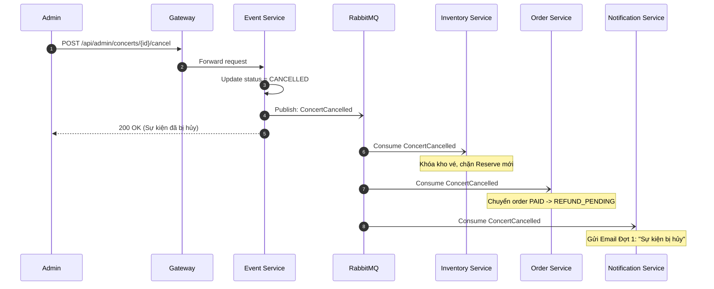
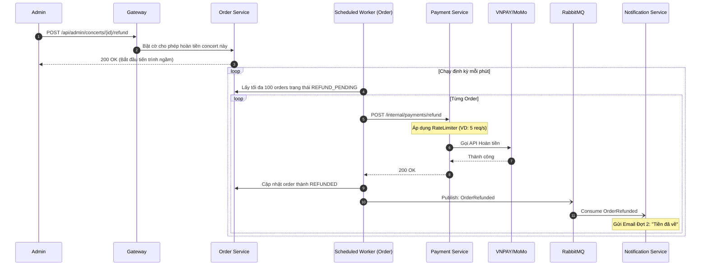

# Flow Specification — `Concert Cancellation & Refund`

## 1. Goal
Đảm bảo quy trình Admin hủy sự kiện và hoàn tiền diễn ra an toàn, không thất thoát tài chính. Giải quyết triệt để bài toán "Bão hoàn tiền" (Bulk Refund) khi có hàng ngàn vé cần xử lý cùng lúc:
- Chia tách việc hủy sự kiện và việc hoàn tiền thành 2 giai đoạn độc lập.
- Sử dụng cơ chế Worker chạy nền theo lô định kỳ (Scheduled Chunk Worker) kết hợp giới hạn tốc độ (Outbound Throttling) bằng Resilience4j để bảo vệ Cổng thanh toán (VNPAY/MoMo) khỏi bị sập do quá tải (Rate Limit).

## 2. Participants

| Participant | Responsibility |
|---|---|
| Admin Web (Client) | Giao diện để Admin bấm "Hủy Sự Kiện" và sau đó bấm "Bắt đầu Hoàn Tiền". |
| API Gateway | Định tuyến request và kiểm tra JWT. |
| Event Service | Thay đổi trạng thái Concert thành `CANCELLED` và phát thông báo `ConcertCancelled` ra toàn hệ thống. |
| Inventory Service | Lắng nghe `ConcertCancelled` và ngay lập tức khóa kho vé, chặn mọi yêu cầu mua vé mới. |
| Order Service (Orchestrator) | Chuyển đơn hàng sang `REFUND_PENDING`. Chứa Worker chạy nền để quét các đơn hàng cần hoàn tiền và gửi lệnh sang Payment Service. |
| Payment Service | Thực hiện gọi API hoàn tiền của Cổng thanh toán (VNPAY/MoMo). Cấu hình RateLimiter và Circuit Breaker bảo vệ chiều gọi ra (Outbound). |
| Notification Service | Gửi Email/Push thông báo cho khán giả 2 đợt: Đợt 1 khi hủy sự kiện, Đợt 2 khi hoàn tiền thành công. |
| Cổng Thanh Toán | VNPAY/MoMo nhận lệnh và hoàn trả tiền về tài khoản ngân hàng/ví của user. |

## 3. Preconditions

- Concert đang ở trạng thái `PUBLISHED` và có các đơn hàng ở trạng thái `PAID` (đã thanh toán thành công).
- RabbitMQ và PostgreSQL hoạt động bình thường.
- Hạ tầng Resilience4j (Rate Limiter, Circuit Breaker) đã được cấu hình tại lớp giao tiếp với Cổng thanh toán.

## 4. Trigger
- **Trigger 1 (Hủy sự kiện):** Admin bấm nút Hủy Concert.
- **Trigger 2 (Bắt đầu hoàn tiền):** Admin vào trang quản lý của Concert đã hủy, duyệt qua danh sách và bấm nút Bắt đầu hoàn tiền.

## 5. Happy path

### Giai đoạn 1: Hủy Sự Kiện

### Giai đoạn 2: Xử Lý Hoàn Tiền (Chunk Worker + Throttling)

## 6. Step-by-step

| Step | From | To | Sync/Async | Contract | State change |
|---:|---|---|---|---|---|
| 1 | Admin | Event Service | Sync | `POST /api/admin/concerts/{id}/cancel` | Concert: `CANCELLED` |
| 2 | Event Service | RabbitMQ | Async | Gửi `ConcertCancelled` | Outbox: `SENT` |
| 3 | RabbitMQ | Order Service | Async | Consume `ConcertCancelled` | Orders: `REFUND_PENDING` |
| 4 | RabbitMQ | Notification | Async | Consume `ConcertCancelled` | In-app Noti created |
| 5 | Admin | Order Service | Sync | `POST /api/admin/concerts/{id}/refund` | Concert Refund: `ACTIVE` |
| 6 | Worker (Order) | Payment Service | Sync | `POST /internal/payments/refund` | N/A |
| 7 | Payment Service | VNPAY | Sync | REST API (qua RateLimiter) | VNPAY xử lý hoàn tiền |
| 8 | Payment Service | Order Service | Sync | Response 200 OK | N/A |
| 9 | Worker (Order) | Order DB | Sync | `UPDATE orders SET status = REFUNDED` | Order: `REFUNDED` |
| 10 | Worker (Order) | RabbitMQ | Async | Gửi `OrderRefunded` | Outbox: `SENT` |
| 11 | RabbitMQ | Notification | Async | Consume `OrderRefunded` | In-app Noti created |

## 7. Data ownership

| Data | Source of truth |
|---|---|
| Trạng thái Sự kiện (CANCELLED) | `event-service` DB |
| Lịch sử và ID giao dịch hoàn tiền gốc | `payment-service` DB |
| Trạng thái hoàn tiền của đơn hàng (`REFUND_PENDING`, `REFUNDED`, `REFUND_MANUAL_REVIEW`) | `order-service` DB |
| Lịch sử gửi Email/Push Notification | `notification-service` DB |

## 8. State transitions by service

| Service | Before | After | Trigger |
|---|---|---|---|
| `event-service` | `PUBLISHED` | `CANCELLED` | Admin bấm nút hủy. |
| `order-service` | `PAID` | `REFUND_PENDING` | Consume event `ConcertCancelled`. |
| `order-service` | `REFUND_PENDING` | `REFUNDED` | API VNPAY hoàn tiền thành công. |
| `order-service` | `REFUND_PENDING` | `REFUND_MANUAL_REVIEW` | VNPAY từ chối (Lỗi tài khoản khóa, thẻ đóng...). |

## 9. Failure scenarios

| Case | Failure | Expected behavior | Compensation | Retry |
|---:|---|---|---|---|
| 1 | Server Java Crash khi đang chạy Worker | Dữ liệu không bị mất. Những vé chưa kịp gọi sang VNPAY vẫn giữ nguyên trạng thái `REFUND_PENDING`. | Worker khởi động lại và tiếp tục quét các vé `REFUND_PENDING` ở chu kỳ kế tiếp. | Tự động quét tiếp. |
| 2 | VNPAY Rate Limit (429) | RateLimiter của Resilience4j sẽ block Thread hiện tại để chờ đến giây tiếp theo thay vì văng lỗi. | Giữ an toàn cho tài khoản Merchant không bị VNPAY khóa. | Tự động (RateLimiter). |
| 3 | VNPAY Sập (Downtime 5xx) | Circuit Breaker (Resilience4j) mở sang trạng thái **OPEN**. Worker Job bắt exception. | Worker chủ động dùng lệnh `break` để thoát khỏi vòng lặp lô 100 vé hiện tại, tránh spam API lỗi làm hệ thống chậm thêm. Các vé còn lại vẫn ở `REFUND_PENDING`. | Worker tự chạy lại phút sau, nếu CB đóng thì xử lý tiếp. |
| 4 | VNPAY từ chối do lỗi thẻ Khách hàng | Mã lỗi báo Thẻ bị khóa, hết hạn... | Cập nhật đơn hàng thành `REFUND_MANUAL_REVIEW`. Báo cáo lên màn hình Admin. | Xử lý thủ công, đối soát ngân hàng. |
| 5 | Gửi Email báo Hủy bị lỗi | SMTP Server nghẽn. | RabbitMQ DLQ xử lý retry, dữ liệu đơn hàng vẫn an toàn. | Tự động (RabbitMQ). |

## 10. Idempotency

| Operation | Idempotency key | Replay behavior |
|---|---|---|
| Hủy sự kiện | `concertId` | Gọi nhiều lần chỉ set thành `CANCELLED` 1 lần, không phát event lần 2. |
| Đánh dấu Pending Refund | `messageId` (ConcertCancelled) | Đơn hàng đã ở `REFUND_PENDING` hoặc cao hơn thì bỏ qua. |
| Gọi API hoàn trả VNPAY | `orderId` / `refundRequestId` | Payment Service phải có Idempotency Key để nếu Order Service gửi trùng lệnh Refund thì không hoàn tiền 2 lần. |

## 11. Timeout and retry

| Call/event | Timeout | Retry | Backoff | Final action |
|---|---:|---:|---|---|
| Gateway -> Event/Order | 15s | 0 | N/A | Lỗi 504. Trả lỗi về Admin UI. |
| Worker -> Payment | 5s | 0 | N/A | Đơn hàng ở nguyên trạng thái `REFUND_PENDING`. |
| Payment -> VNPAY | 10s | 0 | N/A | Circuit Breaker đếm lỗi. Nếu nhiều thì Open. |

## 12. Observability

- `requestId`: Truyền xuyên suốt qua MDC.
- `correlationId`: Đính kèm trong Event Envelope.
- Required logs: 
  - Số lượng orders chuyển sang `REFUND_PENDING`.
  - Số lượng orders quét được mỗi chu kỳ Job.
  - Trạng thái phản hồi của VNPAY (Thành công / Từ chối / Lỗi).
  - Trạng thái đóng/mở của Circuit Breaker.
- Required metrics: Số lượng vé đã Refund thành công, Tỷ lệ lỗi API VNPAY, Tổng tiền đã hoàn.

## 13. Security

- Required roles: Chỉ `ADMIN` hoặc `ORGANIZER` cấp cao mới có quyền truy cập endpoint Cancel và Trigger Refund.
- Token Verification: Gateway check JWT, Order/Event service re-verify auth token.
- API Keys: Mã Secret/Key kết nối VNPAY/MoMo phải lưu dưới dạng biến môi trường bảo mật, không hardcode.
- Traceability: Ghi nhận rõ ràng Admin ID nào đã bấm nút Hủy sự kiện để phục vụ audit.

## 14. Integration test scenarios

| ID | Scenario | Input | Expected result |
|---|---|---|---|
| 1 | Hủy sự kiện thành công | Admin gọi `/cancel` | Concert = CANCELLED. Orders chuyển sang REFUND_PENDING. Khóa mua vé mới. Nhận email hủy. |
| 2 | Kích hoạt hoàn tiền | Admin gọi `/refund` | Worker chạy. Quét 100 vé, gọi Payment API. Đổi trạng thái sang REFUNDED. Khách nhận email hoàn tiền. |
| 3 | Kiểm tra Rate Limiter | Mô phỏng 100 vé, RateLimit set 10 req/s | Worker xử lý hết 100 vé mất xấp xỉ 10 giây. Không có request nào bị fail vì Rate Limit. |
| 4 | Kiểm tra Circuit Breaker | Mock VNPAY trả về lỗi 503 liên tục | Circuit Breaker chuyển sang OPEN. Worker dừng lô hiện tại ngay lập tức. |
| 5 | Hoàn tiền lỗi do KH | Mock VNPAY báo lỗi thẻ bị khóa | Trạng thái đổi thành REFUND_MANUAL_REVIEW, không ngắt Worker (xử lý tiếp vé khác). |

## 15. Acceptance criteria

- [x] Có thiết kế 2 giai đoạn tách biệt (Hủy riêng, Hoàn tiền riêng).
- [x] Áp dụng rõ ràng cơ chế Bất đồng bộ (Scheduled Chunk Worker) cho khâu hoàn tiền.
- [x] Tích hợp Resilience4j RateLimiter để giải quyết bài toán chống khóa IP từ đối tác (Outbound Throttling).
- [x] Tích hợp Resilience4j Circuit Breaker để bảo vệ hệ thống không chết chùm.
- [x] Không mất dữ liệu đơn hàng hoàn tiền nếu Server Restart/Crash (nhờ DB state tracking).
- [x] Gửi đúng 2 đợt Email cho khán giả (Hủy và Tiền về).
