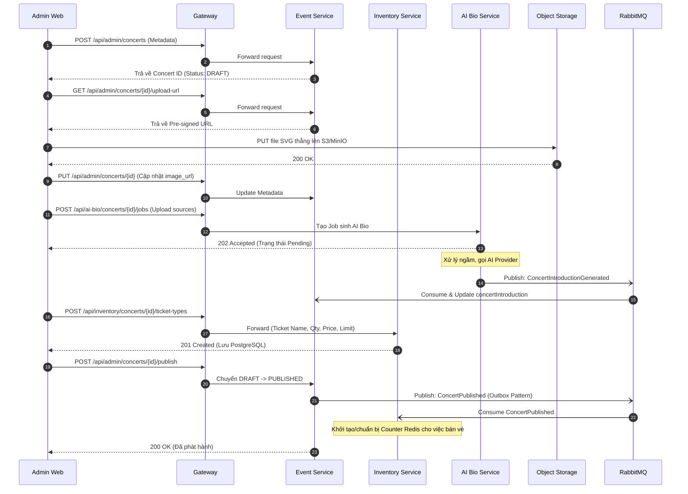

# Flow Specification — `Concert Management`

## 1. Goal
Mô tả quy trình Ban tổ chức (Organizer) hoặc Admin tạo mới, cấu hình và phát hành (Publish) một Concert. Quy trình này bao gồm việc tạo Metadata sự kiện, upload sơ đồ ghế, sinh phần giới thiệu tự động bằng AI, thiết lập các loại vé và cuối cùng là kích hoạt trạng thái mở bán.

## 2. Participants

| Participant | Responsibility |
|---|---|
| Admin / Organizer (Client) | Tương tác qua giao diện Web Admin để thực hiện các bước cấu hình Concert. |
| API Gateway | Cổng giao tiếp duy nhất, xác thực JWT (vòng 1) và định tuyến request. |
| Event Service | Quản lý vòng đời (DRAFT -> PUBLISHED), lưu trữ Metadata (Tên, ngày giờ, địa điểm, sơ đồ ghế), và cấp Pre-signed URL cho upload. |
| Inventory Service | Khởi tạo và quản lý cấu hình các loại vé (Ticket Types), giá vé, số lượng tồn kho (Stock) và giới hạn mỗi người dùng (Per-user Limit). |
| AI Bio Service | Nhận nhiều nguồn đầu vào (PDF/MD/TXT/DOCX/PPTX; URL/Image ở Phase 2), xử lý bằng AI để sinh ra đoạn văn giới thiệu Concert (`concertIntroduction`). |
| Object Storage (S3/MinIO) | Lưu trữ file sơ đồ chỗ ngồi (Seatmap SVG) và source file/snapshot của AI Bio. |
| RabbitMQ (Message Broker) | Chuyển phát các Integration Events như `ConcertIntroductionGenerated` (từ AI Bio) và `ConcertPublished` (từ Event). |

## 3. Preconditions

- Người dùng đã đăng nhập vào Admin Web và có Role `ADMIN` hoặc `ORGANIZER`.
- Trong MVP, `ADMIN` có toàn quyền sửa mọi Concert. `ORGANIZER` chỉ được sửa Concert do mình tạo ra (`organizerId`).
- RabbitMQ và Object Storage đang hoạt động bình thường.

## 4. Trigger
- Admin truy cập trang Quản lý Sự kiện và bấm "Tạo Concert Mới".
- Quá trình này được chia làm nhiều bước tách biệt trên Frontend.

## 5. Happy path

## 6. Step-by-step

| Step | From | To | Sync/Async | Contract | State change |
|---:|---|---|---|---|---|
| 1 | Admin Web | Event Service | Sync | `POST /api/admin/concerts` | DB: Tạo concert `DRAFT` |
| 2 | Admin Web | Event Service | Sync | `GET /api/admin/concerts/{id}/upload-url` | N/A |
| 3 | Admin Web | Object Storage | Sync | `PUT {Presigned_URL}` | S3: Lưu file Seatmap |
| 4 | Admin Web | Event Service | Sync | `PUT /api/admin/concerts/{id}` | DB: Cập nhật URL sơ đồ |
| 5 | Admin Web | AI Bio Service | Sync | `POST /api/ai-bio/concerts/{id}/jobs` | Job `PENDING` |
| 6 | AI Bio Service | RabbitMQ | Async | Gửi `ConcertIntroductionGenerated` | N/A |
| 7 | RabbitMQ | Event Service | Async | Consume sự kiện AI sinh text | DB: Cập nhật introduction |
| 8 | Admin Web | Inventory Service| Sync | `POST /api/inventory/concerts/{id}/ticket-types`| DB: Lưu Ticket Types |
| 9 | Admin Web | Event Service | Sync | `POST /api/admin/concerts/{id}/publish` | DB: `PUBLISHED` & Lưu Outbox |
| 10 | Event Service | RabbitMQ | Async | Gửi `ConcertPublished` (Outbox Drainer) | Outbox message `SENT` |
| 11 | RabbitMQ | Inventory Service| Async | Lắng nghe `ConcertPublished` | Redis: Init Counter |

## 7. Data ownership

| Data | Source of truth |
|---|---|
| Concert Metadata, Status (DRAFT/PUBLISHED), AI Bio Text | `event-service` DB |
| Seatmap Images (SVG) | `object-storage` (S3/MinIO) |
| Ticket Types, Total Quantity, Price, Sale Windows | `inventory-service` DB |
| Lịch sử và trạng thái sinh AI Bio | `ai-bio-service` DB |

## 8. State transitions by service

| Service | Before | After | Trigger |
|---|---|---|---|
| `event-service` | `DRAFT` | `PUBLISHED` | Admin gọi API Publish. |
| `inventory-service` | Chưa có counter | Có counter Redis | Consume event `ConcertPublished` từ RabbitMQ. |

## 9. Failure scenarios

| Case | Failure | Expected behavior | Compensation | Retry |
|---:|---|---|---|---|
| 1 | Lỗi gọi API Upload SVG | Admin không lấy được link Pre-signed. | Trả về thông báo lỗi, cho phép Admin bấm Upload lại. | Admin thử lại thủ công. |
| 2 | AI Bio chạy thất bại | Source không hợp lệ, không extract được nội dung hoặc AI Provider down. | Giữ nguyên trạng thái `FAILED` của Job. Concert vẫn có thể Publish mà không có Bio (hoặc Admin tự nhập tay). | Retry từ màn hình Admin. |
| 3 | Publish thất bại do RabbitMQ down | Hành động Publish của Admin đổi State = PUBLISHED, lưu message vào Outbox an toàn. | Background Drainer sẽ quét Outbox và gửi lại event `ConcertPublished` khi MQ hồi phục (Eventual Consistency). | Tự động (Outbox Worker). |
| 4 | Inventory cấu hình vé lỗi | Admin tạo Ticket Type bị Validation Error (Giá âm, Qty <= 0). | Báo lỗi 400 Bad Request, vé không được tạo. | Admin nhập lại dữ liệu. |

## 10. Idempotency

| Operation | Idempotency key | Replay behavior |
|---|---|---|
| AI Bio Result | `jobId` / `messageId` | `event-service` bỏ qua nếu đã áp dụng bản text mới nhất hoặc Admin đã sửa tay mới hơn. |
| ConcertPublished | `concertId` / `messageId` | `inventory-service` bỏ qua nếu đã chuẩn bị Counter cho concert này rồi. |

## 11. Timeout and retry

| Call/event | Timeout | Retry | Backoff | Final action |
|---|---:|---:|---|---|
| FE -> Gateway | 10s | 0 | N/A | Lỗi HTTP 504 / Báo lỗi UI |
| Outbox -> RabbitMQ| N/A | Vô hạn (Cronjob) | Cron chạy liên tục | Lưu giữ Outbox đến khi gửi được |

## 12. Observability

- `requestId`: Được Gateway gán (Header `X-Request-Id`) truyền xuyên suốt.
- `correlationId`: Đính kèm trong Event Envelope khi gửi qua MQ (`ConcertPublished`, `ConcertIntroductionGenerated`).
- Required logs: Log khi chuyển đổi trạng thái Concert.
- Required metrics: Số lượng Request/s (RPS), Số lần Publish Concert, thời gian xử lý AI Bio.

## 13. Security

- Required roles: Endpoint cấu hình yêu cầu `ADMIN` hoặc `ORGANIZER`.
- Token Verification: Gateway check cơ bản. Downstream Service check JWT Signature, check quyền `sub` xem Organizer có đúng là người sở hữu Concert không (Sử dụng Spring Security `@PreAuthorize`).
- S3 Security: URL Upload chỉ tồn tại trong thời gian ngắn (15 phút). Bucket để private, chỉ đọc qua CDN/Proxy hoặc Pre-signed Get URL.

## 14. Integration test scenarios

| ID | Scenario | Input | Expected result |
|---|---|---|---|
| 1 | Tạo Concert cơ bản | Gửi payload Metadata | Trả về ConcertID, Status = DRAFT |
| 2 | Phân quyền | `USER` bình thường gọi API Publish | Gateway cho qua nhưng `event-service` chặn (HTTP 403 Forbidden) |
| 3 | Publish luồng chuẩn | Admin Publish concert ID X | DB đổi sang PUBLISHED, có bản ghi trong Outbox Table. |
| 4 | Event Consumer | Inventory nhận MQ `ConcertPublished` | Hệ thống không ném lỗi, Redis được chuẩn bị Counter. |

## 15. Acceptance criteria

- [x] Sơ đồ luồng chia tách rõ ràng các Service (`event`, `inventory`, `ai-bio`).
- [x] Thể hiện đúng cơ chế Pre-signed URL cho file upload.
- [x] Thể hiện đúng Transactional Outbox Pattern khi Publish Concert.
- [x] Có sự tham gia và kiểm tra bảo mật từ API Gateway.
- [x] Quản lý rủi ro và các kịch bản lỗi rõ ràng.
