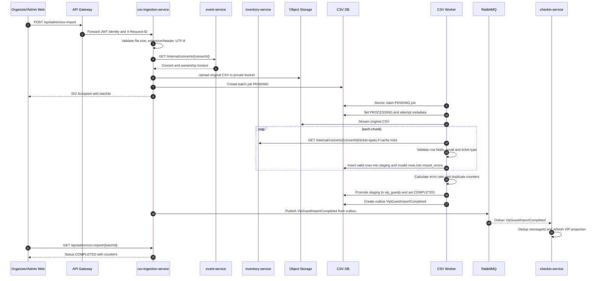

# Flow Specification — `CSV VIP Import`

## 1. Goal

Flow này mô tả cách Organizer/Admin import danh sách VIP guest cho một concert bằng file CSV, xử lý bất đồng bộ, ghi nhận lỗi theo từng dòng và publish kết quả để Check-in Service cập nhật VIP guest projection.

Kết quả cuối cùng mong muốn:

- Upload CSV trả `202 Accepted` nhanh với `batchId`, không xử lý toàn bộ file trong request thread.
- File-level validation chặn file sai format, quá lớn, sai encoding hoặc user không có quyền với concert.
- Worker đọc CSV theo stream, validate từng dòng, ghi staging và error report theo batch.
- Dòng hợp lệ được promote sang `vip_guests` idempotent theo `(concertId, email)`.
- Dòng lỗi được skip-and-continue nếu tỷ lệ lỗi không vượt `CSV_ERROR_THRESHOLD`.
- Job chuyển `COMPLETED`, `PARTIALLY_COMPLETED` hoặc `FAILED` rõ ràng.
- `csv-ingestion-service` publish `VipGuestImportCompleted` hoặc `VipGuestImportFailed` bằng outbox.
- `checkin-service` consume completed event idempotent và cập nhật VIP guest projection, không query trực tiếp DB của CSV service trong luồng scan.

## 2. Participants

| Participant | Responsibility |
|---|---|
| Organizer/Admin web | Upload CSV, poll status, tải/xem error report |
| API Gateway | Verify JWT, forward identity headers, propagate `X-Request-ID` |
| `csv-ingestion-service` | Validate file/concert, tạo job, stream process CSV, publish import result |
| `event-service` | Kiểm tra concert tồn tại và Organizer có quyền quản lý |
| `inventory-service` | Resolve và validate `ticket_type`/`ticketTypeId` theo concert |
| Object Storage | Lưu CSV gốc và error report trong private bucket |
| PostgreSQL | Source of truth cho batch job, staging, errors, VIP guests và outbox |
| CSV worker | Claim job `PENDING`, xử lý CSV theo chunk, promote hoặc fail job |
| RabbitMQ | Durable delivery cho import result events |
| `checkin-service` | Consume `VipGuestImportCompleted`, cập nhật VIP guest projection cho check-in |
| Scheduler | Phát hiện file CSV mới trong Object Storage theo cron |

## 3. Preconditions

- User đã đăng nhập với role `ORGANIZER` hoặc `ADMIN`.
- Organizer sở hữu concert, hoặc user là `ADMIN`.
- Concert tồn tại trong `event-service`.
- `inventory-service` có ticket types của concert để resolve `ticket_type`.
- Gateway route `/api/admin/csv-import/**` đã cấu hình.
- `csv-ingestion-service` có kết nối PostgreSQL, Object Storage và RabbitMQ.
- CSV dùng UTF-8, đúng header đã chốt, kích thước không vượt `CSV_MAX_FILE_SIZE_MB` mặc định 10 MB.
- RabbitMQ exchange `tickefy.events`, routing keys, queue consumer và DLQ đã configured.
- `checkin-service` có consumer cho `VipGuestImportCompleted` hoặc cơ chế bootstrap qua internal API.

## 4. Trigger

### Admin upload

Organizer/Admin gọi:

```http
POST /api/admin/csv-import
Authorization: Bearer <access-token>
X-Request-ID: <optional-request-id>
Content-Type: multipart/form-data
```

Multipart fields:

- `file`: CSV source file.
- `concertId`: concert UUID.

### Cron import

Scheduler của `csv-ingestion-service` quét private Object Storage theo `CSV_IMPORT_CRON`, phát hiện file mới đã được đặt theo convention nội bộ và tạo job với source `CRON`.

## 5. Happy path



## 6. Step-by-step

| Step | From | To | Sync/Async | Contract | State change |
|---:|---|---|---|---|---|
| 1 | Organizer/Admin web | API Gateway | Sync HTTP | `POST /api/admin/csv-import` multipart | None |
| 2 | API Gateway | `csv-ingestion-service` | Sync HTTP | Verified JWT identity, roles, `X-Request-ID` | None |
| 3 | `csv-ingestion-service` | `csv-ingestion-service` | Sync local | Validate file size, extension/header, UTF-8 | Reject before job if invalid |
| 4 | `csv-ingestion-service` | `event-service` | Sync HTTP | `GET /internal/concerts/{concertId}` | None |
| 5 | `csv-ingestion-service` | Object Storage | Sync infra | Store original CSV privately | CSV object created |
| 6 | `csv-ingestion-service` | PostgreSQL | Sync DB transaction | Insert `batch_jobs` | Job `PENDING` |
| 7 | `csv-ingestion-service` | Organizer/Admin web | Sync HTTP | Common API envelope, `202 Accepted` | Client receives `batchId` |
| 8 | CSV worker | PostgreSQL | Async worker | Atomic claim `PENDING -> PROCESSING` | Job `PROCESSING`, attempt started |
| 9 | CSV worker | Object Storage | Async infra | Stream original CSV object | None |
| 10 | CSV worker | `inventory-service` | Sync HTTP | `GET /internal/concerts/{concertId}/ticket-types` | Ticket type map available |
| 11 | CSV worker | PostgreSQL | Async DB chunks | Insert valid rows into staging, invalid rows into `import_errors` | Counters increase |
| 12 | CSV worker | PostgreSQL | Sync DB transaction | Promote staging if error ratio `<= 50%` | `COMPLETED` or `PARTIALLY_COMPLETED` |
| 13 | CSV worker | PostgreSQL | Sync DB transaction | Mark failed if error ratio `> 50%` or unrecoverable error | Job `FAILED` |
| 14 | Outbox publisher | RabbitMQ | Async event | `VipGuestImportCompleted` or `VipGuestImportFailed` | Outbox published after broker confirm |
| 15 | RabbitMQ | `checkin-service` | Async event | Common event envelope + VIP import payload | Check-in dedup record written |
| 16 | `checkin-service` | Check-in DB/projection | Sync local | Refresh VIP guest projection for concert | Projection updated |
| 17 | Organizer/Admin web | `csv-ingestion-service` | Sync HTTP | `GET /api/admin/csv-import/{batchId}` | Client sees terminal status and counters |

## 7. Data ownership

| Data | Source of truth |
|---|---|
| Concert core fields, status, owner/organizer | `event-service` |
| Ticket type catalog for a concert | `inventory-service` |
| CSV import job status, counters, retry, source object key | `csv-ingestion-service` |
| Raw CSV object and error report file | Object Storage bucket owned by `csv-ingestion-service` |
| Staging rows and per-row validation errors | `csv-ingestion-service` |
| Official VIP guest list imported by CSV | `csv-ingestion-service` table `vip_guests` |
| VIP projection used during check-in | `checkin-service` |
| Import result event publish state | `csv-ingestion-service` outbox + RabbitMQ |
| Consumed import event dedup state | `checkin-service` |
| User identity and roles | Auth Service / JWT verified by API Gateway |

## 8. State transitions by service

| Service | Before | After | Trigger |
|---|---|---|---|
| `csv-ingestion-service` | No job | `PENDING` | Upload/cron source validated, CSV stored, job committed |
| `csv-ingestion-service` | `PENDING` | `PROCESSING` | Worker atomic claim succeeds |
| `csv-ingestion-service` | `PROCESSING` | `COMPLETED` | All rows valid and promoted |
| `csv-ingestion-service` | `PROCESSING` | `PARTIALLY_COMPLETED` | Valid rows promoted, some rows rejected, error ratio `<= 50%` |
| `csv-ingestion-service` | `PROCESSING` | `FAILED` | Error ratio `> 50%` or unrecoverable error |
| `csv-ingestion-service` | `FAILED` | `PENDING` | Organizer/Admin retry accepted |
| `csv-ingestion-service` | `COMPLETED`/`PARTIALLY_COMPLETED` | Unchanged | Retry rejected or treated as no-op |
| `checkin-service` | No/older VIP projection | Projection refreshed | `VipGuestImportCompleted` accepted |
| `checkin-service` | Projection already refreshed for same message/job | Unchanged | Duplicate event delivery |
| RabbitMQ/outbox | Outbox `PENDING` | Published/confirmed | Broker accepts import result event |

## 9. Failure scenarios

| Case | Failure | Expected behavior | Compensation | Retry |
|---:|---|---|---|---|
| 1 | File larger than 10 MB | Reject request, no job created, return `413 FILE_TOO_LARGE` | None | Client uploads smaller file |
| 2 | Invalid extension/header/format | Reject request, no job created, return `400 INVALID_FILE_FORMAT` | Delete uploaded temp/object if any | No automatic retry |
| 3 | Invalid UTF-8 encoding | Reject request, no job created, return `400 INVALID_ENCODING` | Delete uploaded temp/object if any | Client fixes file |
| 4 | Concert not found | Return `404 CONCERT_NOT_FOUND`, no job created | None | No automatic retry |
| 5 | Organizer not allowed for concert | Return `403 FORBIDDEN`, no job created | None | No automatic retry |
| 6 | Event Service unavailable before job creation | Return `503 SERVICE_UNAVAILABLE`, no job created | None | Client may retry upload |
| 7 | Object Storage unavailable during upload | Return `503 OBJECT_STORAGE_UNAVAILABLE`, no job created | Cleanup partial upload | Client may retry upload |
| 8 | Row missing required field or invalid email | Skip row, write `import_errors`, continue | Error report contains line number and safe raw data | No row retry in same attempt |
| 9 | Ticket type missing/unknown | Skip row, write `import_errors`, continue | Error report records reason | Re-upload or retry after fixing ticket type |
| 10 | Duplicate row in same CSV | Keep first valid occurrence, mark later row `DUPLICATE_ROW` | Duplicate counter increases | No retry needed |
| 11 | Guest already exists from earlier import | Do not create duplicate guest; count as duplicate/skipped | Unique key `(concertId, email)` protects data | Safe replay/re-upload |
| 12 | Error ratio greater than 50% | Mark job `FAILED`, do not promote staging | Staging from attempt is not promoted; publish failed event | Manual retry after fixing file |
| 13 | Worker crash mid-import | Reclaim after lease timeout; reprocess idempotently | Attempt marked timed out/failed | Retry up to worker max retries |
| 14 | Inventory Service unavailable during processing | Retry bounded; fail job if dependency remains unavailable | Safe failure reason stored | Worker retry if retryable |
| 15 | RabbitMQ unavailable after DB commit | Imported data remains; outbox stays `PENDING` | Outbox publisher retries and alerts | Continuous/bounded publish retry |
| 16 | Duplicate completed event delivery | `checkin-service` ACKs duplicate after `messageId` dedup | None | Safe replay |
| 17 | Check-in projection refresh fails | Message retry; DLQ after max attempts | CSV import remains terminal | Consumer retry/DLQ |

## 10. Idempotency

| Operation | Idempotency key | Replay behavior |
|---|---|---|
| VIP guest import row | `(concertId, email)` | Existing guest is not duplicated; duplicate/skipped counter increases |
| Duplicate row in same file | `concertId + normalized email` within batch | First valid row wins; later rows become `DUPLICATE_ROW` errors |
| Worker claim | Atomic DB update by `batchId` and current status `PENDING` | Only one worker processes a job |
| Chunk insert | `batchId + attempt + lineNumber` or staging unique key | Retried chunk does not double-count/promote rows |
| Promote staging | `(concertId, email)` with `ON CONFLICT DO NOTHING` | Re-run/re-upload cannot duplicate VIP guests |
| Retry failed job | `batchId` with attempt counter | Reset attempt staging safely, keep job history and retry within limit |
| Outbox publish | Stable event `messageId` per terminal job event | Republish same message safely until broker confirm |
| Check-in consume | `messageId`, optionally guarded by `batchId`/`jobId` | Duplicate event is ACKed without duplicate projection update |
| Cron discovery | Source object key/checksum | Same object is not imported as multiple active jobs unless explicitly reprocessed |

## 11. Timeout and retry

| Call/event | Timeout | Retry | Backoff | Final action |
|---|---:|---:|---|---|
| Upload request thread | Target under 2,000 ms | N/A | N/A | Return `202` after file-level validation/job creation |
| `GET /internal/concerts/{concertId}` | 2,000 ms | 1 for 5xx/timeout | Short exponential backoff | Return `503 SERVICE_UNAVAILABLE`; do not create job |
| `GET /internal/concerts/{concertId}/ticket-types` | 2,000 ms | 1 for 5xx/timeout | Short exponential backoff | Fail/retry job according to worker policy |
| Object Storage upload/read | Service config | Bounded infra retry | Exponential backoff | Fail request/job safely and cleanup partial upload where possible |
| CSV worker retry | Job policy | Up to `CSV_WORKER_MAX_RETRIES` | Exponential backoff | Mark job `FAILED` after retry exhaustion |
| RabbitMQ outbox publish | Publisher config | Repeat until published or operational alert | Bounded interval/polling retry | Keep outbox `PENDING`, alert on oldest pending age |
| Check-in consumer processing | Consumer config | Broker retry until max attempts | Queue retry policy | DLQ poison message |
| Cron scan | `CSV_IMPORT_CRON` | Next scheduled run | Scheduler interval | Detect unprocessed source object on later run |

## 12. Observability

- `requestId`: lấy từ `X-Request-ID`; nếu thiếu thì service tự sinh; echo ở response header/body.
- `correlationId`: dùng `requestId` cho upload-created jobs; cron jobs tự sinh stable job correlation ID.
- `messageId`: UUID của `VipGuestImportCompleted` hoặc `VipGuestImportFailed`, giữ nguyên khi outbox republish.
- Required logs: `requestId`, `correlationId`, `messageId`, `batchId`, `concertId`, `organizerId`, `source`, `status`, `attempt`, `totalRows`, `successRows`, `failedRows`, `duplicateRows`, `errorRatio`, `durationMs`, `errorCode`.
- Required metrics:
  - `csv_import_jobs_total{status,source}`
  - `csv_import_duration_seconds`
  - `csv_import_rows_total{result}`
  - `csv_import_rows_per_second`
  - `csv_import_error_ratio`
  - `csv_import_duplicate_rows_total`
  - `csv_import_retry_total`
  - `csv_import_outbox_pending_total`
  - `csv_import_event_publish_failures_total`
  - `checkin_vip_projection_refresh_total{result}`

Alert conditions:

- Job `PROCESSING` quá lease timeout.
- Tỷ lệ job `FAILED` tăng bất thường.
- Error ratio của batch vượt ngưỡng.
- Outbox pending count hoặc oldest pending age vượt ngưỡng.
- Cron không chạy đúng lịch.
- DB pool saturation hoặc Object Storage/RabbitMQ readiness fail.

## 13. Security

- Required roles: `ORGANIZER` sở hữu concert hoặc `ADMIN`.
- Sensitive fields: tên guest, email, phone nếu có, raw CSV, raw row data, error report, object keys, JWT, signed URLs và Object Storage credentials.
- Audit requirements:
  - Audit upload/create job, retry, terminal status, error report generation và event publish result.
  - Actor lấy từ JWT `sub`; không nhận `organizerId` từ body như nguồn tin cậy.
  - Không log full email, raw CSV row, full error report, JWT, secret hoặc signed URL.
  - Error report phải giới hạn/mask raw data đủ để debug nhưng không dump toàn bộ file.
  - Object Storage bucket private; API không trả public URL dài hạn.
  - CSV là untrusted input; parser phải chống formula injection khi xuất error report.
  - Service khác không được query trực tiếp `csv_schema`.
  - Response lỗi không chứa stack trace, exception class hoặc secret.

## 14. Integration test scenarios

| ID | Scenario | Input | Expected result |
|---|---|---|---|
| CSV-VIP-001 | Upload valid CSV | Organizer owner, valid header, valid rows | `202 Accepted`, job `PENDING`, CSV stored privately |
| CSV-VIP-002 | Worker completes all-valid file | Valid CSV with known ticket types | Job `COMPLETED`, guests inserted, completed event created |
| CSV-VIP-003 | Partial row failures | CSV with invalid email and missing field under threshold | Job `PARTIALLY_COMPLETED`, valid rows promoted, error report available |
| CSV-VIP-004 | Error threshold exceeded | CSV with more than 50% invalid rows | Job `FAILED`, no staging promoted, failed event created |
| CSV-VIP-005 | Duplicate rows in same file | Same email repeated | First row imported, later row `DUPLICATE_ROW`, no duplicate guest |
| CSV-VIP-006 | Re-upload already imported guest | CSV contains existing `(concertId,email)` | No duplicate guest, duplicate/skipped counter increases |
| CSV-VIP-007 | Invalid file format | Wrong header or non-CSV | `400 INVALID_FILE_FORMAT`, no job committed |
| CSV-VIP-008 | Invalid encoding | Non UTF-8 CSV | `400 INVALID_ENCODING`, no job committed |
| CSV-VIP-009 | File too large | CSV larger than `CSV_MAX_FILE_SIZE_MB` | `413 FILE_TOO_LARGE`, no job committed |
| CSV-VIP-010 | Concert not found | Unknown `concertId` | `404 CONCERT_NOT_FOUND`, no job committed |
| CSV-VIP-011 | Organizer forbidden | Organizer does not own concert | `403 FORBIDDEN`, no job committed |
| CSV-VIP-012 | Event Service unavailable on upload | Concert lookup timeout/5xx | `503 SERVICE_UNAVAILABLE`, no job committed |
| CSV-VIP-013 | Inventory unavailable in worker | Ticket type lookup timeout/5xx | Worker retries, then job `FAILED` if exhausted |
| CSV-VIP-014 | RabbitMQ unavailable after promote | Broker down during outbox publish | Job terminal remains, outbox `PENDING`, alert emitted |
| CSV-VIP-015 | Duplicate completed event | Same `messageId` delivered twice | Check-in projection updates once and ACKs duplicate |
| CSV-VIP-016 | Retry failed job | Failed retryable job under retry limit | Retry returns accepted, job goes back to `PENDING` safely |
| CSV-VIP-017 | Cron detects new CSV | New object key/checksum in configured prefix | Job created with source `CRON` and processed asynchronously |

## 15. Acceptance criteria

- [ ] Happy path runs end-to-end.
- [ ] Expected failure cases are handled.
- [ ] Duplicate request/message is safe.
- [ ] Logs can be traced by correlation ID.
- [ ] All contracts are frozen.
- [ ] `POST /api/admin/csv-import` returns `202 Accepted` with common API envelope and `batchId`.
- [ ] Upload validates size, header, UTF-8 and concert ownership before creating job.
- [ ] CSV source and error report are stored in private Object Storage.
- [ ] Worker streams CSV and does not load full file into memory.
- [ ] Valid rows are processed in configurable chunks, default around 1,000 rows.
- [ ] Invalid rows are skipped with `lineNumber`, masked raw data and stable reason.
- [ ] Error ratio greater than 50% marks job `FAILED` and does not promote staging.
- [ ] `(concertId, email)` idempotency prevents duplicate VIP guests across retry/re-upload.
- [ ] Terminal success creates outbox `VipGuestImportCompleted`; terminal failure creates `VipGuestImportFailed`.
- [ ] Check-in Service consumes completed event idempotently and refreshes VIP projection.
- [ ] RabbitMQ publish failure does not roll back promoted guests; outbox retries publish.
- [ ] Retry of failed job resets attempt staging safely and respects max retry count.
- [ ] Cron-created jobs follow the same validation, processing, idempotency and observability rules as upload jobs.
- [ ] No response or normal log exposes JWT, secrets, full email list, raw CSV file, full row content or signed URL.
- [ ] Routing key naming is reconciled before freeze: `csv-ingestion-service.md` currently uses `vip-guest.import.completed`, while common event examples use `vip-guest-import.completed`.
