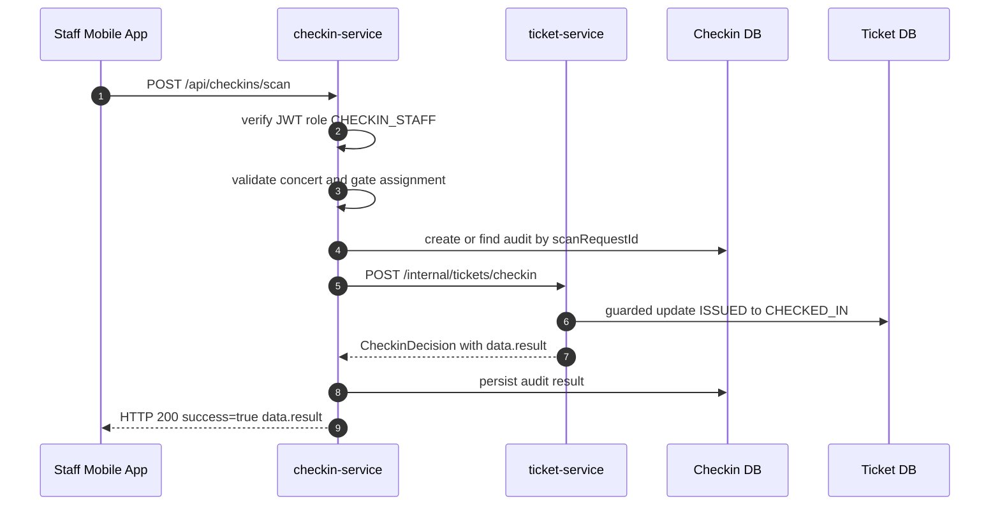
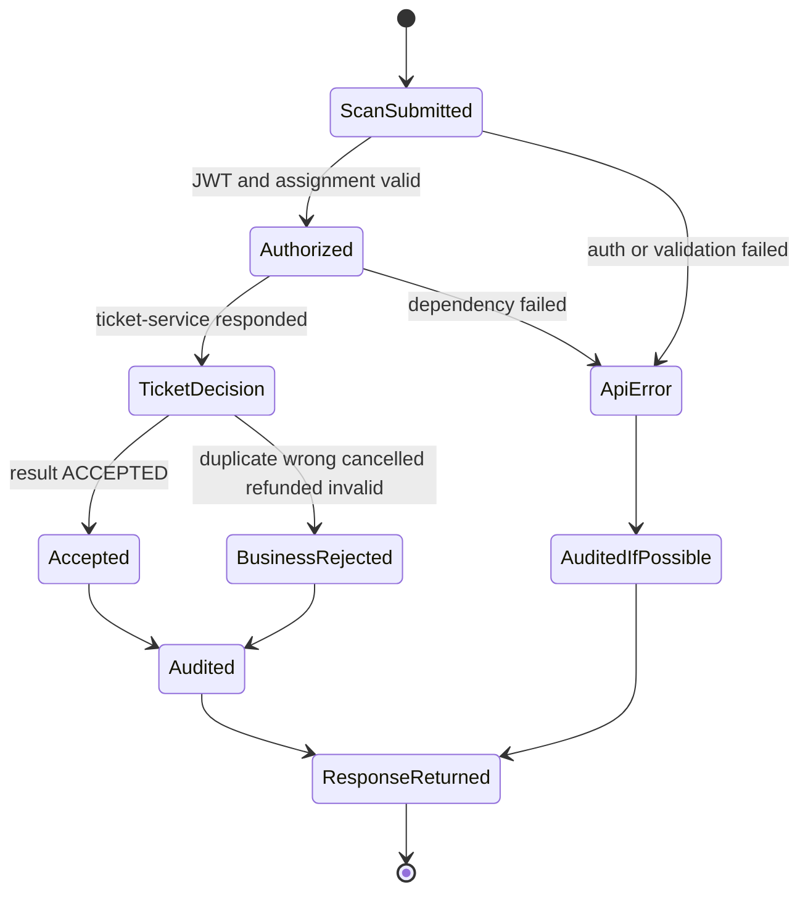

# Flow Contract — Online Check-in

## 1. Mục tiêu

Flow này mô tả đường đi realtime khi nhân viên soát vé quét QR bằng mobile app có mạng.

Kết quả cuối cùng mong muốn:

- QR hợp lệ: ticket chuyển `ISSUED` → `CHECKED_IN` đúng một lần.
- Duplicate/wrong/cancelled/refunded là business result, không phải API error.
- Mobile nhận result code ổn định để hiển thị UX.
- `checkin-service` ghi audit đầy đủ.

## 2. Participants

| Participant | Responsibility |
|---|---|
| Staff mobile app | Scan QR, gửi request, hiển thị result |
| `checkin-service` | Auth/assignment, orchestration, audit, response mapping |
| `ticket-service` | Verify QR and atomic ticket state transition |
| PostgreSQL | Store ticket state and check-in audit |
| Redis | Optional rate limit/idempotency accelerator |

## 3. Preconditions

- Staff đã login và token có role `CHECKIN_STAFF`.
- Staff được phân công scan `concertId`/gate tương ứng.
- Ticket đã được issue bởi `ticket-service`.
- Mobile gửi `scanRequestId` để idempotency.
- Request dùng `concertId`, không dùng `eventId`.

## 4. Sequence



## 5. Request contract

```json
{
  "concertId": "concert-uuid",
  "qrTokenMasked": "masked-or-derived-token",
  "deviceId": "device-uuid",
  "gate": "GATE_A",
  "scannedAt": "2026-06-16T10:00:00Z",
  "scanRequestId": "mobile-generated-idempotency-key"
}
```

Rules:

- `staffId` is read from JWT `sub`, not request body.
- `qrTokenMasked` stands for the agreed safe scan representation; raw `qrToken` must not be logged.
- `scanRequestId` must be stable when mobile retries the same scan request.

## 6. Response contract

Expected business result response:

```json
{
  "success": true,
  "data": {
    "result": "ACCEPTED",
    "ticketId": "ticket-uuid",
    "concertId": "concert-uuid",
    "ticketTypeName": "SVIP",
    "gate": "GATE_A",
    "checkedInAt": "2026-06-16T10:00:00Z",
    "replayDetected": false,
    "message": "Check-in thành công."
  },
  "error": null,
  "requestId": "req-uuid",
  "timestamp": "2026-06-16T10:00:00Z"
}
```

Business results are defined in `../common/checkin-result-catalog.md`.

## 7. Result mapping

| Situation | HTTP | `success` | `data.result` | UX |
|---|---:|---:|---|---|
| Ticket valid and first scan | 200 | true | `ACCEPTED` | Green / allow entry |
| Ticket already checked in | 200 | true | `DUPLICATE_REJECTED` | Red / already used |
| Ticket belongs to other concert | 200 | true | `WRONG_EVENT` | Red / wrong event |
| Ticket cancelled | 200 | true | `CANCELLED_REJECTED` | Red / cancelled |
| Ticket refunded | 200 | true | `REFUNDED_REJECTED` | Red / refunded |
| QR parseable but no valid ticket | 200 | true | `INVALID_QR_REJECTED` | Red / invalid QR |
| QR malformed / request invalid | 400 | false | N/A | API error screen/toast |
| Missing/expired token | 401 | false | N/A | Re-login |
| Staff lacks permission | 403 | false | N/A | Forbidden |
| Ticket service down | 503 | false | N/A | Retry/backoff |

## 8. Atomic check-in rule

`ticket-service` owns the guarded transition:

```text
UPDATE tickets
SET status = CHECKED_IN, checked_in_at = now()
WHERE ticket_id = :ticketId
  AND concert_id = :concertId
  AND status = ISSUED
```

Equivalent JPA/SQL is acceptable. Requirement: concurrent scans must produce exactly one `ACCEPTED`; all other valid duplicates return `DUPLICATE_REJECTED`.

## 9. State machine



## 10. Idempotency and retry

| Retry case | Required behavior |
|---|---|
| Mobile retries same `scanRequestId` after timeout | Return stored audit/result if available |
| Mobile sends new scan for same ticket after accepted | Return `DUPLICATE_REJECTED` |
| `checkin-service` times out calling `ticket-service` | Return API error only if result unknown; audit as dependency failure |
| `ticket-service` receives duplicate internal request with same key | Must be safe; no second acceptance |

## 11. Audit fields

Minimum `checkin_audits` fields:

| Field | Notes |
|---|---|
| `auditId` | UUID |
| `scanRequestId` | Mobile idempotency key |
| `ticketId` | Nullable if QR cannot map |
| `concertId` | Required |
| `staffId` | From JWT |
| `deviceId` | From request |
| `gate` | From request |
| `result` | Business result or API error code |
| `scannedAt` | Mobile timestamp |
| `serverReceivedAt` | Server timestamp |
| `checkedInAt` | If accepted |
| `qrTokenMasked` | Safe masked/derived value only |

## 12. Observability

Required logs/metrics:

- `checkin_scan_total{result}`
- `checkin_scan_duration_ms`
- `checkin_ticket_dependency_error_total`
- `checkin_duplicate_total`
- log fields: `requestId`, `scanRequestId`, `staffId`, `deviceId`, `concertId`, `gate`, `result`, `ticketId`, `durationMs`

Never log raw `qrToken` or JWT.

## 13. Acceptance criteria

- [ ] `ACCEPTED` response is `HTTP 200`, `success=true`, `data.result=ACCEPTED`.
- [ ] Duplicate scan is `HTTP 200`, `success=true`, `data.result=DUPLICATE_REJECTED`.
- [ ] Wrong concert is `HTTP 200`, `success=true`, `data.result=WRONG_EVENT`.
- [ ] Missing role returns `403` API error, not business result.
- [ ] Malformed QR/request returns `400` API error, not business result.
- [ ] Concurrent double scan accepts exactly one request.
- [ ] Audit is written for both accepted and rejected scans.
- [ ] No response/log exposes raw `qrToken`.

## 14. Open questions

- [ ] Confirm final QR scan representation: masked token, signed compact token, or hash lookup.
- [ ] Confirm whether staff gate assignment is checked in `checkin-service` DB or event-service.
- [ ] Confirm whether `TicketCheckedIn` event is needed for analytics in MVP.
