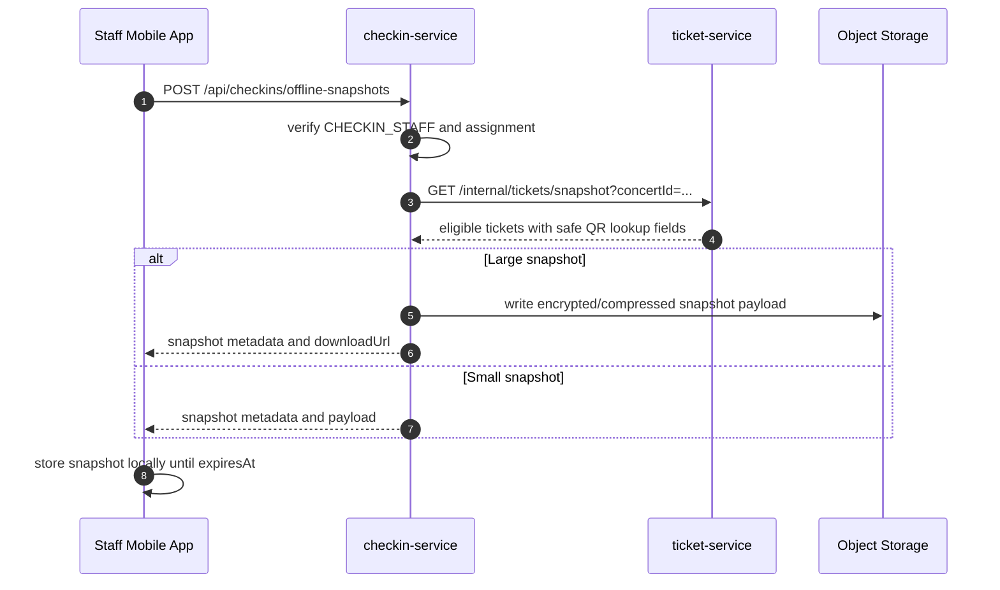
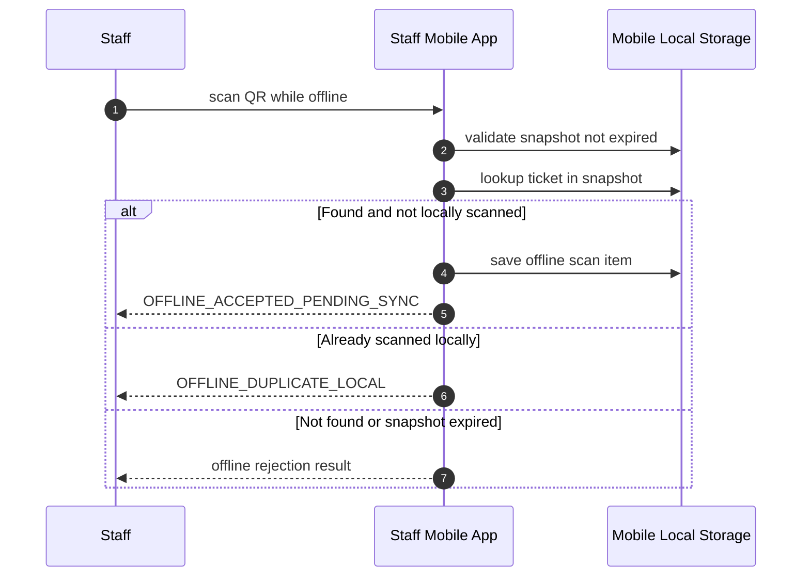
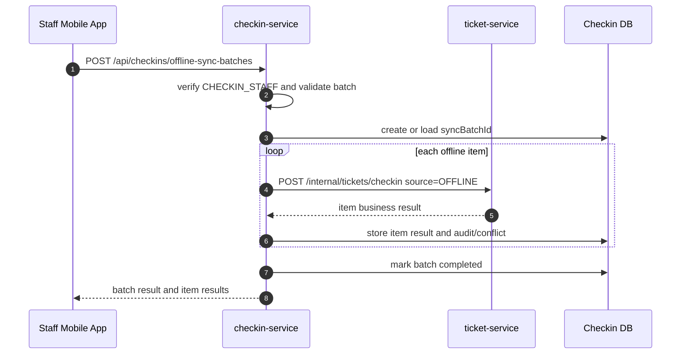
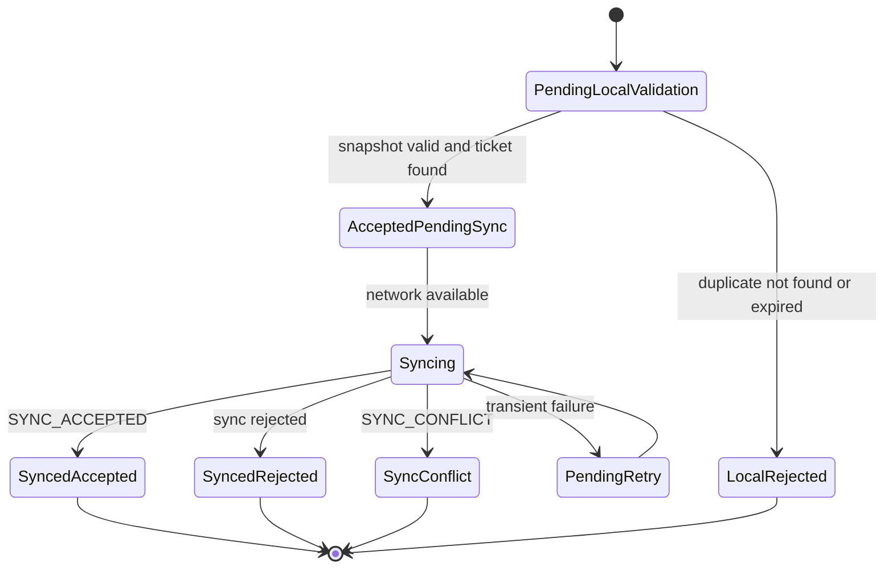
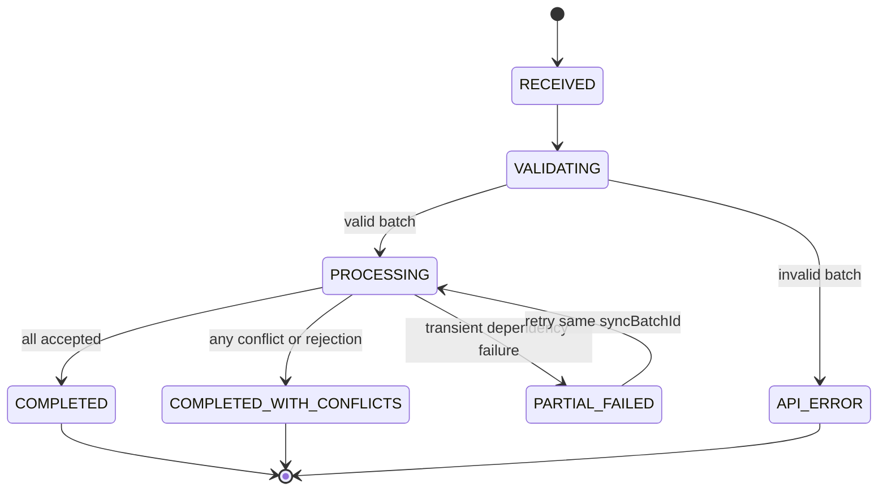

# Flow Contract — Offline Check-in & Sync

## 1. Mục tiêu

Flow này mô tả cách mobile staff app hoạt động khi cổng check-in mất mạng:

1. Tải offline snapshot trước khi sự kiện bắt đầu.
2. Scan QR local trong thời gian mất mạng.
3. Lưu local queue với `offlineScanId`.
4. Khi có mạng, sync batch lên server.
5. Server reconcile với `ticket-service` là Source of Truth.
6. Mobile nhận batch/item results để hiển thị conflict và trạng thái sync.

## 2. Participants

| Participant | Responsibility |
|---|---|
| Staff mobile app | Store snapshot, local scan, local queue, sync retry |
| `checkin-service` | Snapshot metadata, sync batch idempotency, audit/conflict |
| `ticket-service` | Ticket state source of truth and atomic check-in during sync |
| PostgreSQL | Server audit/sync/conflict records |
| Mobile local storage | Snapshot and pending offline scans |
| Object Storage | Optional large snapshot payload storage |

## 3. Preconditions

- Staff has valid `CHECKIN_STAFF` token when downloading snapshot.
- Staff/device is authorized for `concertId` and gate.
- Snapshot is downloaded before going offline.
- Snapshot has `snapshotId`, `version`, and `expiresAt`.
- Snapshot contains no raw `qrToken` unless future security review explicitly approves it.

## 4. Phase A — Snapshot download



Snapshot payload must include only data required for offline decision:

| Field | Required | Notes |
|---|---:|---|
| `snapshotId` | Yes | UUID |
| `concertId` | Yes | Must not be `eventId` |
| `version` | Yes | Snapshot version |
| `generatedAt` | Yes | Server timestamp |
| `expiresAt` | Yes | Mobile blocks offline scan after expiry |
| `tickets[].ticketId` | Yes | Ticket UUID |
| `tickets[].ticketTypeName` | Yes | Display name |
| `tickets[].qrTokenMasked` or derived verifier | Yes | No public raw QR token |
| `tickets[].status` | Yes | Usually valid statuses only, but can include cancelled/refunded if needed for UX |

## 5. Phase B — Offline local scan



Local result codes:

| Situation | Result |
|---|---|
| Snapshot valid, ticket found, first local scan | `OFFLINE_ACCEPTED_PENDING_SYNC` |
| Same device already scanned same ticket | `OFFLINE_DUPLICATE_LOCAL` |
| QR not in snapshot | `OFFLINE_NOT_IN_SNAPSHOT` |
| Snapshot expired | `OFFLINE_SNAPSHOT_EXPIRED` |

## 6. Phase C — Sync batch



## 7. Sync request contract

```json
{
  "syncBatchId": "sync-batch-uuid",
  "snapshotId": "snapshot-uuid",
  "concertId": "concert-uuid",
  "deviceId": "device-uuid",
  "items": [
    {
      "offlineScanId": "offline-scan-uuid",
      "ticketId": "ticket-uuid",
      "qrTokenMasked": "masked-or-derived-token",
      "gate": "GATE_A",
      "scannedAt": "2026-06-16T10:00:00Z"
    }
  ]
}
```

Rules:

- `staffId` comes from JWT `sub`.
- `syncBatchId` must remain the same across retries of the same local batch.
- `offlineScanId` must remain stable per local scan item.
- Batch must not exceed `SYNC_BATCH_MAX_ITEMS`.

## 8. Sync response contract

```json
{
  "success": true,
  "data": {
    "syncBatchId": "sync-batch-uuid",
    "result": "SYNC_BATCH_COMPLETED_WITH_CONFLICTS",
    "concertId": "concert-uuid",
    "deviceId": "device-uuid",
    "totalItems": 3,
    "acceptedCount": 1,
    "rejectedCount": 1,
    "conflictCount": 1,
    "replayDetected": false,
    "items": [
      {
        "offlineScanId": "offline-scan-1",
        "ticketId": "ticket-uuid-1",
        "result": "SYNC_ACCEPTED",
        "checkedInAt": "2026-06-16T10:00:00Z"
      },
      {
        "offlineScanId": "offline-scan-2",
        "ticketId": "ticket-uuid-2",
        "result": "SYNC_DUPLICATE_REJECTED",
        "firstCheckedInAt": "2026-06-16T09:59:00Z"
      },
      {
        "offlineScanId": "offline-scan-3",
        "ticketId": "ticket-uuid-3",
        "result": "SYNC_CONFLICT",
        "conflictId": "conflict-uuid"
      }
    ]
  },
  "error": null,
  "requestId": "req-uuid",
  "timestamp": "2026-06-16T10:00:05Z"
}
```

## 9. Result mapping

| Scope | Situation | Result/API error |
|---|---|---|
| Local | Accepted pending sync | `OFFLINE_ACCEPTED_PENDING_SYNC` |
| Local | Duplicate on same device | `OFFLINE_DUPLICATE_LOCAL` |
| Local | Not in snapshot | `OFFLINE_NOT_IN_SNAPSHOT` |
| Local | Snapshot expired | `OFFLINE_SNAPSHOT_EXPIRED` |
| Sync item | Server accepted | `SYNC_ACCEPTED` |
| Sync item | Ticket already checked in online/other device | `SYNC_DUPLICATE_REJECTED` |
| Sync item | Wrong concert | `SYNC_WRONG_EVENT` |
| Sync item | Cancelled/refunded | `SYNC_CANCELLED_REJECTED` / `SYNC_REFUNDED_REJECTED` |
| Sync item | Needs review | `SYNC_CONFLICT` |
| Sync batch | Completed no conflicts | `SYNC_BATCH_ACCEPTED` |
| Sync batch | Completed with conflicts | `SYNC_BATCH_COMPLETED_WITH_CONFLICTS` |
| Sync batch | Replay | `SYNC_BATCH_REPLAYED` |
| API | Batch too large | `SYNC_BATCH_TOO_LARGE` |
| API | Snapshot API expired | `SNAPSHOT_EXPIRED` |

## 10. State machines

### Mobile local scan item



### Server sync batch



## 11. Conflict handling

A conflict record is required when server cannot treat the offline local decision as clean acceptance.

| Conflict type | Example | Stored fields |
|---|---|---|
| Duplicate server state | Ticket checked in online before offline sync | `ticketId`, `offlineScanId`, `firstCheckedInAt`, `deviceId`, `staffId` |
| Cross-device duplicate | Same ticket accepted by another offline device first | Both device/staff ids if known |
| Wrong concert | Item's `concertId` mismatch | scanned vs actual concert if available |
| Invalid snapshot | Snapshot id/version not valid for staff/device | `snapshotId`, `version`, `deviceId` |

Product can later decide manual override UX; MVP stores conflict and returns stable item result.

## 12. Idempotency

| Key | Scope | Behavior |
|---|---|---|
| `snapshotId` | Snapshot | Identifies snapshot version used for scan |
| `syncBatchId` | Batch | Replay returns stored batch response |
| `(syncBatchId, offlineScanId)` | Item | Duplicate item is not processed twice |
| `ticketId` + ticket guarded update | Ticket state | At most one accepted check-in globally |

No implementation may depend on `String.intern()` or in-memory locks for production sync correctness.

## 13. Security

- Snapshot download requires online JWT with `CHECKIN_STAFF`.
- Sync requires current valid JWT; if staff session expired, mobile must re-auth before sync.
- Snapshot is scoped to `concertId`, `deviceId`, `staffId`/assignment, and `expiresAt`.
- Snapshot at rest on mobile should be encrypted if platform support exists.
- No raw `qrToken` in snapshot, sync request logs, server response, or events.

## 14. Observability

Required metrics:

- `offline_snapshot_download_total{result}`
- `offline_snapshot_ticket_count`
- `offline_local_scan_total{result}` if mobile telemetry exists
- `offline_sync_batch_total{result}`
- `offline_sync_item_total{result}`
- `offline_sync_conflict_total`
- `offline_sync_replay_total`

Required logs:

- `requestId`
- `syncBatchId`
- `snapshotId`
- `concertId`
- `staffId`
- `deviceId`
- `offlineScanId`
- `ticketId`
- `result`
- `durationMs`

## 15. Acceptance criteria

- [ ] Staff can download snapshot for assigned concert/gate.
- [ ] Snapshot response contains `concertId`, `ticketTypeName`, and no raw `qrToken`.
- [ ] Mobile local duplicate returns `OFFLINE_DUPLICATE_LOCAL`.
- [ ] Expired snapshot blocks offline local scan.
- [ ] Sync batch with all clean items returns `SYNC_BATCH_ACCEPTED`.
- [ ] Sync batch with any duplicate/conflict returns `SYNC_BATCH_COMPLETED_WITH_CONFLICTS`.
- [ ] Replaying same `syncBatchId` returns previous response without reprocessing.
- [ ] Concurrent online/offline sync for same ticket accepts at most one final check-in.
- [ ] Conflicts are persisted for later review.
- [ ] Batch too large returns API error `SYNC_BATCH_TOO_LARGE`.

## 16. Open questions

- [ ] Confirm final QR verifier representation in snapshot.
- [ ] Confirm snapshot max size and whether object storage is mandatory.
- [ ] Confirm conflict review owner/UX in admin web.
- [ ] Confirm whether expired snapshot sync is rejected entirely or accepted with warning if scans happened before `expiresAt`.
