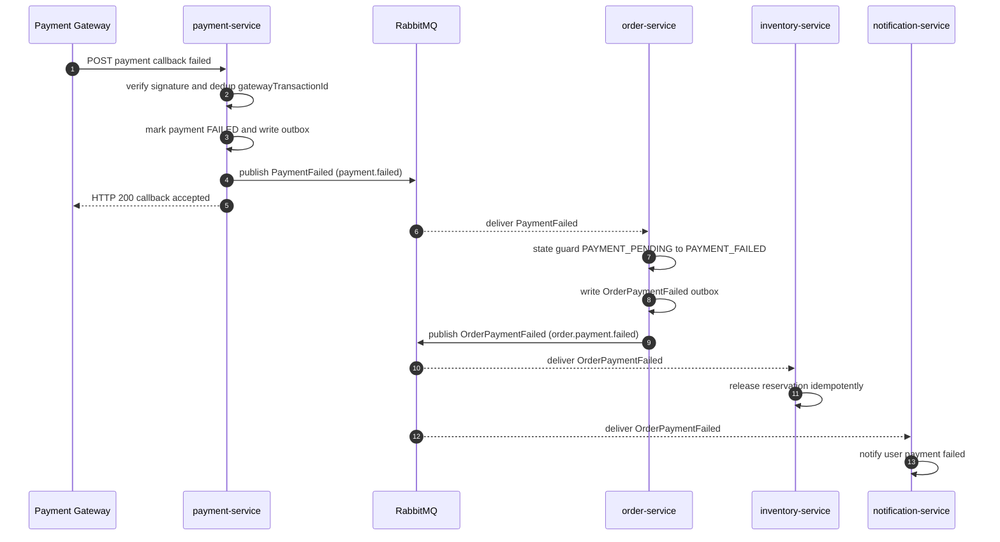
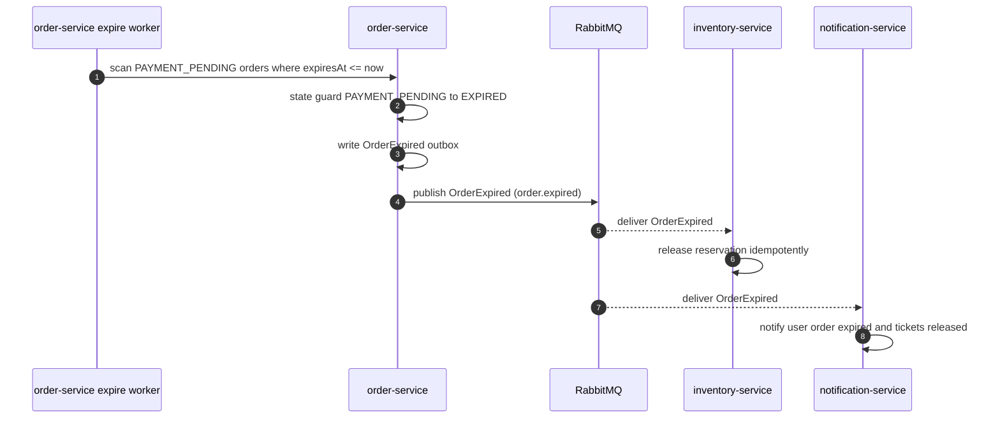
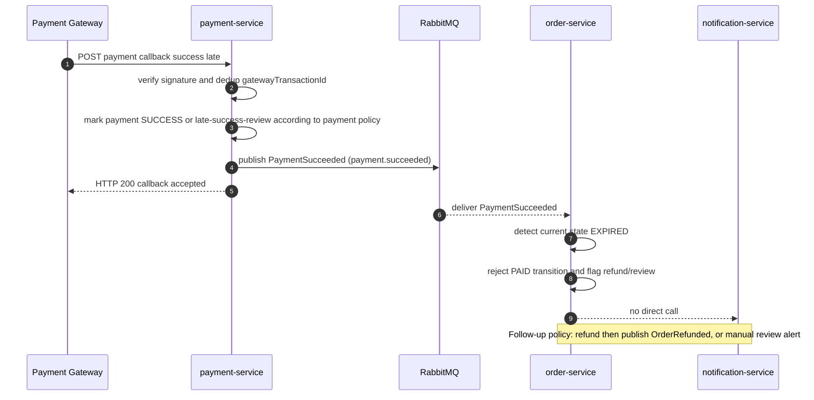
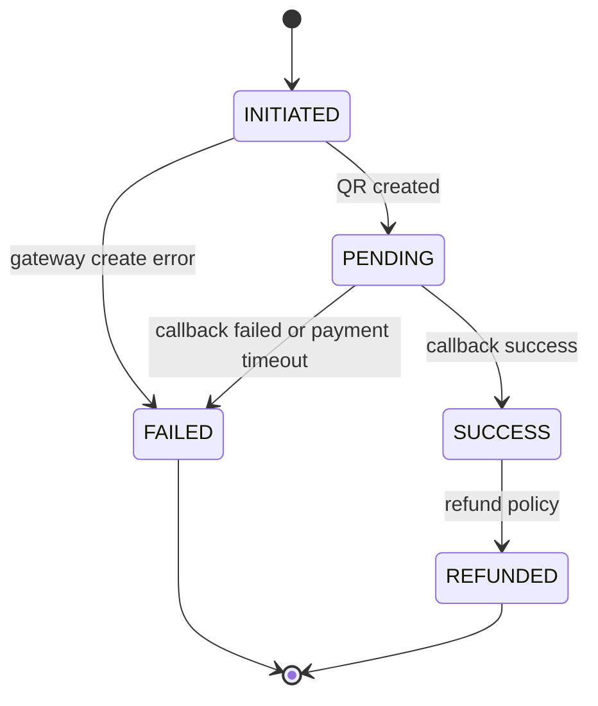
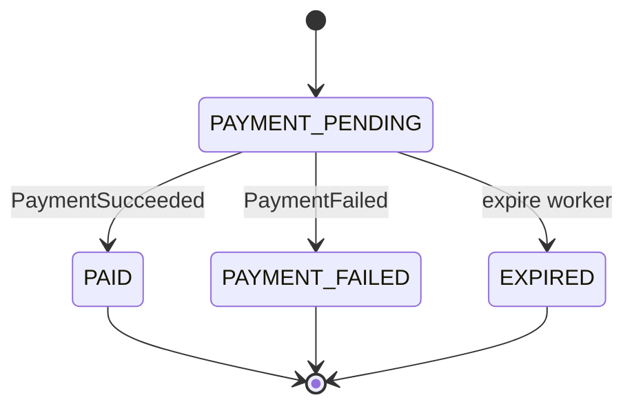
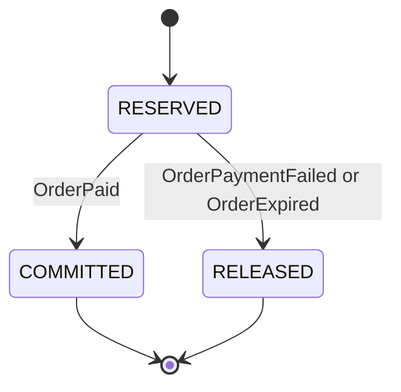

# Flow Contract — Payment Failure & Order Expiration

## 1. Mục tiêu

Flow này mô tả cách hệ thống xử lý các đơn hàng không đi tới thanh toán thành công:

1. Payment gateway hoặc `payment-service` xác nhận thanh toán thất bại.
2. Order bị kẹt `PAYMENT_PENDING` quá hạn và expire worker chuyển sang `EXPIRED`.
3. Inventory reservation được release đúng một lần.
4. User nhận thông báo rõ ràng qua `notification-service`.
5. Không issue ticket cho order chưa `PAID`.

Kết quả cuối cùng mong muốn:

- Không giữ vé vô hạn khi user không thanh toán.
- Không oversell khi release/commit xảy ra retry hoặc duplicate event.
- Notification chỉ gửi sau khi `order-service` đã cập nhật state.
- Late payment success sau khi order đã `EXPIRED` không tự động issue ticket; phải đi qua chính sách refund/review.

## 2. Participants

| Participant | Responsibility |
|---|---|
| User app | Nhận trạng thái order/payment và thông báo hết hạn/thất bại |
| Payment Gateway | Gửi callback success/failure hoặc trạng thái giao dịch |
| `payment-service` | Verify callback, dedup gateway transaction, publish `PaymentFailed` khi gateway báo lỗi/hết hạn |
| `order-service` | Saga orchestrator; consume `PaymentFailed`, expire `PAYMENT_PENDING`, publish order failure/expiration events |
| `inventory-service` | Consume order events để release reservation |
| `notification-service` | Consume order events để gửi SSE/push/email |
| RabbitMQ | Durable async event delivery, retry, DLQ |
| PostgreSQL | Source of truth per service schema |

## 3. Preconditions

- Order đã được tạo, inventory đã reserve, order đang ở `PAYMENT_PENDING`.
- `payment-service` đã tạo payment transaction hoặc đang theo dõi payment transaction.
- Reservation TTL/order `expiresAt` đã được lưu khi tạo order.
- RabbitMQ exchange/queues/DLQ đã configured cho `payment.failed`, `order.payment.failed`, `order.expired`.
- `inventory-service` release chỉ dựa trên order events, không expose HTTP release endpoint cho `order-service` gọi trực tiếp.

## 4. Triggers

| Trigger | Source | Expected order transition | Downstream event |
|---|---|---|---|
| Gateway báo payment failed | Payment Gateway → `payment-service` | `PAYMENT_PENDING` → `PAYMENT_FAILED` | `OrderPaymentFailed` |
| Payment transaction hết hạn tại `payment-service` | `payment-service` scheduler/reconciliation | `PAYMENT_PENDING` → `PAYMENT_FAILED` | `OrderPaymentFailed` |
| Order quá `expiresAt` mà chưa PAID | `order-service` expire worker | `PAYMENT_PENDING` → `EXPIRED` | `OrderExpired` |
| Payment success tới sau khi order đã `EXPIRED` | Payment Gateway / reconciliation | Không chuyển sang `PAID` tự động | Refund/review policy |

## 5. Sequence A — PaymentFailed path



## 6. Sequence B — OrderExpired path



## 7. Sequence C — Late PaymentSucceeded after EXPIRED



> Edge case này cần policy cuối cùng khi Payment thật + reconciliation hoàn chỉnh. Contract hiện chốt: **không issue ticket** và **không commit inventory** nếu order đã `EXPIRED` trước khi `PaymentSucceeded` tới.

## 8. Step-by-step rules

### A. Payment failed

| Step | Owner | Rule |
|---:|---|---|
| 1 | `payment-service` | Verify callback signature trước khi xử lý. |
| 2 | `payment-service` | Dedup callback bằng `gatewayTransactionId` hoặc payment intent id. |
| 3 | `payment-service` | Trong cùng DB transaction: mark payment `FAILED`, ghi outbox `PaymentFailed`. |
| 4 | `order-service` | Consume `PaymentFailed`; nếu order đang `PAYMENT_PENDING` thì chuyển `PAYMENT_FAILED`. |
| 5 | `order-service` | Ghi outbox `OrderPaymentFailed` cùng transaction với state update. |
| 6 | `inventory-service` | Consume `OrderPaymentFailed`; release reservation nếu còn `RESERVED`. |
| 7 | `notification-service` | Consume `OrderPaymentFailed`; gửi thông báo thanh toán thất bại. |

### B. Order expired

| Step | Owner | Rule |
|---:|---|---|
| 1 | `order-service` | Scheduled worker quét order `PAYMENT_PENDING` có `expiresAt <= now`. |
| 2 | `order-service` | State guard: chỉ transition `PAYMENT_PENDING` → `EXPIRED`; terminal state khác phải skip. |
| 3 | `order-service` | Ghi outbox `OrderExpired` cùng transaction với state update. |
| 4 | `inventory-service` | Consume `OrderExpired`; release reservation nếu còn `RESERVED`. |
| 5 | `notification-service` | Consume `OrderExpired`; báo user order hết hạn và vé đã được trả lại. |

## 9. Event contracts

| Event | Producer | Consumer | Routing key | Contract |
|---|---|---|---|---|
| `PaymentFailed` | `payment-service` | `order-service` (`order.payment-failed`) | `payment.failed` | `../common/event-envelope.md` §14.1.1 |
| `OrderPaymentFailed` | `order-service` | `inventory-service` (`inventory.order-payment-failed`), `notification-service` (`notification.order-payment-failed`) | `order.payment.failed` | `../common/event-envelope.md` §14.2.1 |
| `OrderExpired` | `order-service` | `inventory-service` (`inventory.order-expired`), `notification-service` (`notification.order-expired`) | `order.expired` | `../common/event-envelope.md` §14.2.2 |

### PaymentFailed envelope shape (v1.0)

```json
{
  "messageId": "uuid",
  "eventType": "PaymentFailed",
  "eventVersion": "1.0",
  "source": "payment-service",
  "occurredAt": "2026-06-18T10:00:00Z",
  "correlationId": "req-uuid",
  "causationId": "gateway-callback-id",
  "payload": {
    "paymentId": "payment-uuid",
    "orderId": "order-uuid",
    "amount": 1200000,
    "currency": "VND",
    "provider": "SEPAY",
    "providerTransactionId": "gateway-tx-id",
    "failedAt": "2026-06-18T10:00:00Z",
    "reason": "GATEWAY_DECLINED"
  }
}
```

### OrderPaymentFailed envelope shape (v1.0)

```json
{
  "messageId": "uuid",
  "eventType": "OrderPaymentFailed",
  "eventVersion": "1.0",
  "source": "order-service",
  "occurredAt": "2026-06-18T10:00:01Z",
  "correlationId": "req-uuid",
  "causationId": "payment-failed-message-id",
  "payload": {
    "orderId": "order-uuid",
    "userId": "user-uuid",
    "concertId": "concert-uuid",
    "reservationId": "reservation-uuid",
    "failedAt": "2026-06-18T10:00:01Z",
    "reason": "PAYMENT_FAILED"
  }
}
```

### OrderExpired envelope shape (v1.0)

```json
{
  "messageId": "uuid",
  "eventType": "OrderExpired",
  "eventVersion": "1.0",
  "source": "order-service",
  "occurredAt": "2026-06-18T10:15:00Z",
  "correlationId": "req-uuid",
  "causationId": "order-expire-worker-run-id",
  "payload": {
    "orderId": "order-uuid",
    "userId": "user-uuid",
    "concertId": "concert-uuid",
    "reservationId": "reservation-uuid",
    "expiredAt": "2026-06-18T10:15:00Z"
  }
}
```

## 10. State transitions

### Payment transaction



### Order



### Inventory reservation



## 11. Data ownership and consistency

| Data | Owner | Notes |
|---|---|---|
| Payment transaction status | `payment-service` | Payment state is source of truth for gateway transaction. |
| Order status | `order-service` | Order state controls downstream business action. |
| Reservation status/counts | `inventory-service` | Release/commit idempotent by reservation state. |
| Notification history/device tokens | `notification-service` | No query to order/payment/inventory DB. |

Consistency rules:

- `PaymentFailed` alone does not release inventory; release happens only after `order-service` publishes `OrderPaymentFailed`.
- `OrderExpired` can happen without `PaymentFailed`; it is driven by order `expiresAt`.
- `notification-service` listens to order events, not payment events, to avoid notifying before order state is committed.
- Ticket issuing is impossible in this flow because no `OrderPaid` is published.

## 12. Idempotency

| Layer | Key | Required behavior |
|---|---|---|
| Payment callback | `gatewayTransactionId` / provider transaction id | Duplicate callback is ACKed without duplicate outbox event. |
| Payment outbox | outbox row id / `messageId` | Publish at least once; consumer must dedup. |
| PaymentFailed → Order | `messageId`, `paymentId`, `orderId` | Order transitions to `PAYMENT_FAILED` once. |
| Expire worker | `orderId` + state guard | Multiple worker runs do not republish duplicate active transitions. |
| Order outbox | outbox row id / `messageId` | `OrderPaymentFailed` / `OrderExpired` delivered at least once. |
| Order event → Inventory | `messageId`, reservation/order status | Reservation releases once; duplicate event is harmless ACK. |
| Order event → Notification | `messageId`, `userId`, `orderId` | Duplicate notification suppressed or made harmless. |

## 13. Timeout, retry, DLQ

| Component | Rule |
|---|---|
| `payment-service` callback | Return 200 to valid duplicate callback after dedup; reject invalid signature with API error. |
| Payment outbox drainer | Retry publish while RabbitMQ down; do not lose `PaymentFailed`. |
| `order-service` payment consumer | Retry transient DB/message failures; poison message goes DLQ with `messageId`. |
| `order-service` expire worker | Runs periodically; transition guarded by DB state. |
| Order outbox drainer | Retry publish `OrderPaymentFailed`/`OrderExpired` until success. |
| `inventory-service` consumers | Retry transient DB/Redis failures; duplicate/terminal reservation is ACKed. |
| `notification-service` consumers | Retry channel failures; in-app/push/email failure should not corrupt order/inventory state. |

## 14. Failure scenarios

| Scenario | Expected behavior | User-visible state |
|---|---|---|
| Invalid payment callback signature | `payment-service` rejects; no event | Payment pending until gateway retry/reconcile |
| Duplicate failed callback | Dedup and ACK | One failure notification at most |
| `PaymentFailed` delivered after order already `PAID` | Order state guard skips failure transition; alert/review if needed | Paid; no release |
| Expire worker sees order already `PAID` | Skip | Paid |
| Expire worker sees order already `PAYMENT_FAILED` | Skip or no-op | Payment failed |
| `OrderPaymentFailed` duplicate | Inventory release no-op after first release | Failed; seats released once |
| `OrderExpired` duplicate | Inventory release no-op after first release | Expired; seats released once |
| Inventory release fails transiently | Consumer retry/DLQ; ops alert | Order failed/expired, reservation pending release until retry |
| Notification fails | Retry/DLQ; order/inventory remain correct | User may not receive notification immediately |
| Late `PaymentSucceeded` after `EXPIRED` | Do not mark order `PAID`; no ticket issue; follow refund/review policy | Needs refund/review notification |

## 15. Observability

Required logs/correlation fields:

- `requestId`
- `correlationId`
- `causationId`
- `messageId`
- `eventType`
- `orderId`
- `paymentId`
- `reservationId` if available
- `concertId`
- `userId`
- `fromState`
- `toState`
- `reason`
- `durationMs`

Metrics:

- `payment_failed_event_published_total{reason}`
- `order_payment_failed_total{reason}`
- `order_expired_total`
- `order_expire_worker_duration_ms`
- `inventory_reservation_release_total{source}`
- `inventory_reservation_release_duplicate_total`
- `notification_order_failure_total{eventType}`
- `event_consumer_dlq_total{service,eventType}`

Alerts:

- DLQ depth > 0 for `order.payment-failed`, `order.expired`, `inventory.order-payment-failed`, `inventory.order-expired`.
- Order stuck `PAYMENT_PENDING` past expiration threshold.
- Reservation remains `RESERVED` after order terminal `PAYMENT_FAILED`/`EXPIRED`.
- Late `PaymentSucceeded` after `EXPIRED` count > 0.

## 16. Security

- Payment callback must verify provider signature before any state change.
- Internal service-to-service APIs, if used, must forward `Authorization: Bearer`; this flow relies mainly on events after order creation.
- Do not log payment secrets, webhook signature, JWT, full bank/card data.
- Event payload should include only business identifiers needed by consumers; no secret or raw payment credential.
- `userId` in order events comes from order source of truth, not from client request body.

## 17. Integration test scenarios

| Scenario | Expected assertion |
|---|---|
| Payment gateway sends failed callback once | Payment `FAILED`, order `PAYMENT_FAILED`, inventory reservation `RELEASED`, notification event consumed. |
| Payment gateway sends failed callback twice | One order transition, one inventory release, no duplicate notification effect. |
| Order reaches `expiresAt` without payment | Order `EXPIRED`, `OrderExpired` published, inventory release. |
| Expire worker runs twice on same order | Second run is no-op; no duplicate release. |
| `OrderPaymentFailed` delivered three times | Inventory release exactly once. |
| `OrderExpired` delivered three times | Inventory release exactly once. |
| Payment success arrives after order expired | Order remains `EXPIRED`; no `OrderPaid`; no ticket issued; refund/review path flagged. |
| RabbitMQ down during order event publish | Outbox row remains pending and later publishes successfully. |
| Notification service down | Order/inventory state remains correct; notification message retries/DLQ. |

## 18. Acceptance criteria

- [ ] `PaymentFailed` leads to exactly one `PAYMENT_FAILED` order transition.
- [ ] `PAYMENT_FAILED` order publishes `OrderPaymentFailed` with envelope metadata.
- [ ] `OrderExpired` is published by expire worker for stale `PAYMENT_PENDING` orders.
- [ ] `inventory-service` releases reservation on `OrderPaymentFailed` and `OrderExpired`.
- [ ] Duplicate `PaymentFailed`, `OrderPaymentFailed`, and `OrderExpired` messages are harmless.
- [ ] `notification-service` consumes `OrderPaymentFailed` and `OrderExpired`; it does not consume `PaymentFailed` directly for user notification.
- [ ] No ticket is issued for `PAYMENT_FAILED` or `EXPIRED` orders.
- [ ] Late `PaymentSucceeded` after `EXPIRED` does not publish `OrderPaid`.
- [ ] DLQ exists for all consumers in this flow.
- [ ] Logs include `correlationId`/`messageId` and do not expose secrets.

## 19. Open questions

- [ ] Final policy for late `PaymentSucceeded` after `EXPIRED`: automatic refund, manual review, or hold order if inventory still available?
- [ ] Exact payment failure `reason` enum list from Payment owner.
- [ ] Whether notification for `OrderPaymentFailed` should include retry payment URL before order `expiresAt`, or only final failure message.
