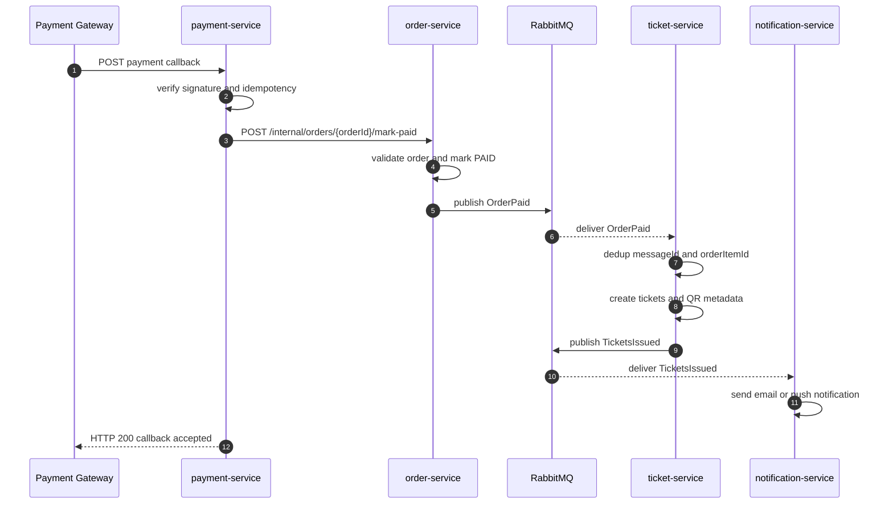
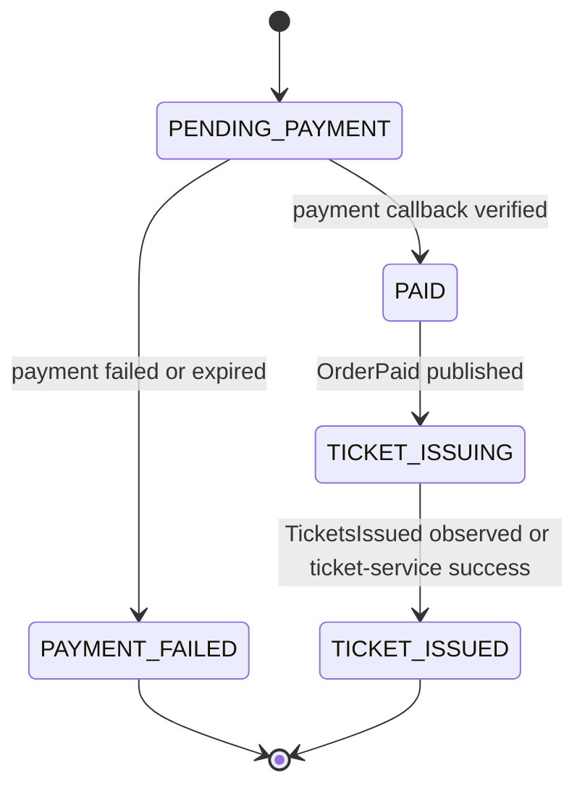
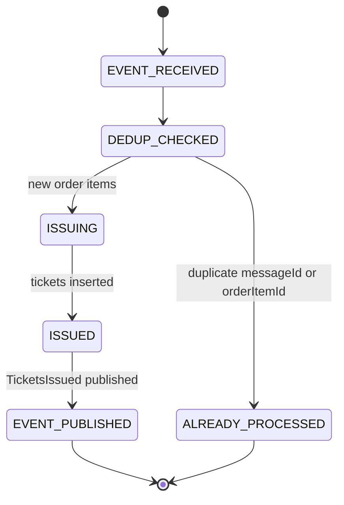

# Flow Contract — Payment → Ticket Issuing

## 1. Mục tiêu

Flow này mô tả cách một đơn hàng đã thanh toán tạo ra ticket điện tử.

Kết quả cuối cùng mong muốn:

- Payment callback được xử lý idempotent.
- `order-service` chuyển order sang paid và publish `OrderPaid`.
- `ticket-service` consume `OrderPaid`, issue tickets, publish `TicketsIssued`.
- `notification-service` consume `TicketsIssued` để gửi thông báo/email/ticket link.

## 2. Participants

| Participant | Responsibility |
|---|---|
| Payment Gateway | Gửi callback payment status |
| `payment-service` | Verify callback, dedup gateway transaction, publish payment success |
| `order-service` | Mark order paid, publish `OrderPaid` |
| RabbitMQ | Durable async event delivery |
| `ticket-service` | Issue tickets idempotently |
| `notification-service` | Notify audience when tickets issued |
| PostgreSQL | Source of truth per service schema |

## 3. Preconditions

- Order đã tồn tại và còn payable.
- Inventory reservation vẫn hợp lệ tại thời điểm payment success.
- Payment callback có signature hợp lệ.
- RabbitMQ exchange/queues/DLQ đã configured.
- `ticket-service` consumer đang chạy hoặc queue durable để nhận sau.

## 4. Sequence

## 5. Event contracts

| Event | Producer | Consumer | Routing key | Contract |
|---|---|---|---|---|
| `PaymentSucceeded` or internal payment success command | `payment-service` | `order-service` | project-specific | `../common/event-envelope.md` §14.1 if event-based |
| `OrderPaid` | `order-service` | `ticket-service` | `order.paid` | `../common/event-envelope.md` §14.2 |
| `TicketsIssued` | `ticket-service` | `notification-service` | `tickets.issued` | `../common/event-envelope.md` §14.3 |

Contract requirement:

- Payload uses `concertId`, not `eventId`.
- Ticket display field uses `ticketTypeName`, not `ticketName` or `zoneName`.
- No event contains raw `qrToken`.

## 6. State transitions

### Order state

### Ticket issue state

## 7. Idempotency keys

| Layer | Key | Required behavior |
|---|---|---|
| Payment callback | gateway transaction id / payment intent id | Duplicate callback does not double mark order |
| Payment → Order | `orderId`, payment transaction id | Order transition to PAID exactly once |
| RabbitMQ event | `messageId` | Consumer dedups message replay |
| Ticket issuing | `orderItemId` or `(orderId, orderItemId, sequence)` | Duplicate `OrderPaid` does not create duplicate tickets |
| Notification | `messageId`, `ticketId` | Duplicate notification suppressed or made harmless |

## 8. Error handling

| Failure | Handling | User-visible state |
|---|---|---|
| Invalid callback signature | Reject callback, no order update | Payment pending/failed depending gateway retry |
| Duplicate payment callback | Return success after replay check | No duplicate charge/ticket |
| Order already paid | Treat as idempotent success | Paid |
| RabbitMQ temporarily unavailable | Retry publish or outbox if implemented | Payment accepted, ticket pending |
| `ticket-service` fails after event delivery | Retry consumer; DLQ after max retries | Paid but ticket pending, ops alert |
| Duplicate `OrderPaid` event | ACK duplicate after dedup | No duplicate ticket |
| `TicketsIssued` notification fails | Notification retry/DLQ | Ticket still issued |

## 9. Data consistency

- Order payment is synchronous/transactional inside `order-service`.
- Ticket issue is asynchronous and eventually consistent after `OrderPaid`.
- UI should show paid/ticket pending state if tickets not issued yet.
- Reconciliation job can compare paid order items vs issued tickets.

## 10. Observability

Required correlation/log fields:

- `requestId`
- `correlationId`
- `causationId`
- `messageId`
- `orderId`
- `paymentTransactionId`
- `ticketId`
- `concertId`
- `eventType`
- `durationMs`

Metrics:

- `payment_callback_total{result}`
- `order_paid_event_published_total`
- `ticket_issue_total{result}`
- `ticket_issue_duration_ms`
- `ticket_issue_duplicate_total`
- `ticket_issue_dlq_total`

## 11. Acceptance criteria

- [ ] Valid payment callback produces exactly one paid order.
- [ ] Valid paid order produces expected number of tickets.
- [ ] Duplicate payment callback does not duplicate tickets.
- [ ] Duplicate `OrderPaid` event does not duplicate tickets.
- [ ] `TicketsIssued` contains `ticketTypeName` and no raw `qrToken`.
- [ ] `notification-service` can consume `TicketsIssued` without querying ticket DB directly.
- [ ] If ticket issuing fails, event is retried or sent to DLQ with alert.

## 12. Open questions

- [ ] Confirm if `payment-service` calls `order-service` synchronously or publishes `PaymentSucceeded` for order-service to consume.
- [ ] Confirm outbox pattern requirement for `OrderPaid` and `TicketsIssued` in MVP.
- [ ] Confirm whether order status includes explicit `TICKET_PENDING` / `TICKET_ISSUED`.
