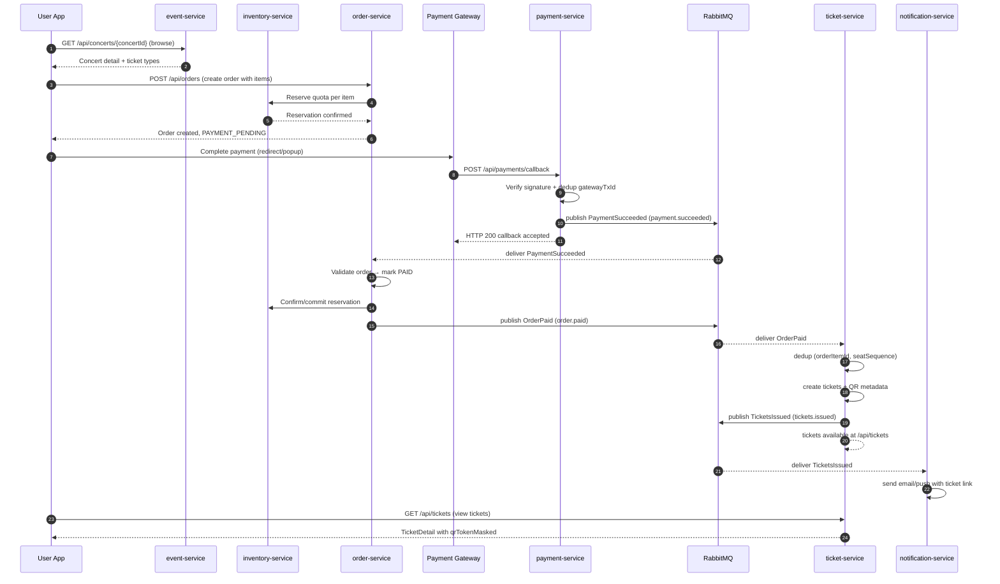
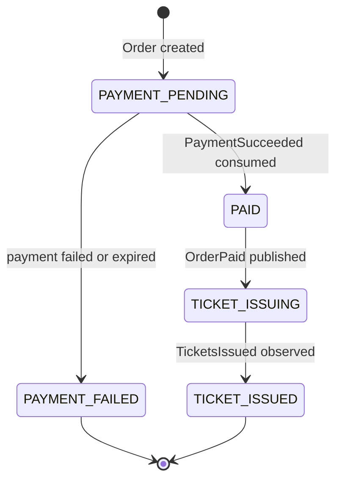
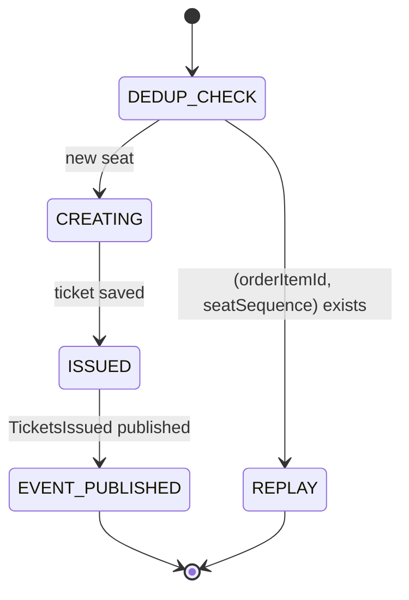

# Flow Contract — Ticket Purchase (Full User Journey)

## 1. Mục tiêu

Flow này mô tả toàn bộ hành trình từ khi user mua vé đến khi nhận được e-ticket.

Kết quả cuối cùng mong muốn:

- User chọn vé, giữ chỗ tạm thời qua inventory-service.
- User thanh toán, payment-service xác nhận.
- Order chuyển PAID, publish `OrderPaid`.
- ticket-service phát hành vé, publish `TicketsIssued`.
- notification-service gửi email/push chứa link vé.
- User xem được vé trong app với `qrTokenMasked`.

## 2. Participants

| Participant | Responsibility |
|---|---|
| User browser/app | Browse concert, chọn vé, thanh toán |
| `event-service` | Catalog concerts, ticket types |
| `inventory-service` | Reserve + commit quota per ticket type |
| `order-service` | Own order state, consume PaymentSucceeded, publish OrderPaid |
| `payment-service` | Verify gateway callback, publish PaymentSucceeded |
| Payment Gateway | Process card/transfer, callback payment-service |
| RabbitMQ | Durable async event delivery |
| `ticket-service` | Issue tickets after OrderPaid, publish TicketsIssued |
| `notification-service` | Send email/push with ticket link |
| PostgreSQL | Source of truth per service schema |

## 3. Preconditions

- Concert đã published và còn trong sale window.
- Inventory quota còn đủ cho ticket type được chọn.
- User đã login và có role `AUDIENCE`.
- Payment gateway đang hoạt động.
- RabbitMQ exchanges, queues, DLQs đã configured.

## 4. Sequence — Happy Path



## 5. Event contracts

| Event | Producer | Consumer (queue) | Routing key |
|---|---|---|---|
| `PaymentSucceeded` | `payment-service` | `order-service` (`order.payment-succeeded`) | `payment.succeeded` |
| `OrderPaid` | `order-service` | `ticket-service` (`ticket.order-paid`), `inventory-service` (`inventory.order-paid`) | `order.paid` |
| `TicketsIssued` | `ticket-service` | `notification-service` (`notification.tickets-issued`) | `tickets.issued` |

### OrderPaid envelope shape (v1.0)

```json
{
  "messageId": "uuid",
  "eventType": "OrderPaid",
  "eventVersion": "1.0",
  "source": "order-service",
  "occurredAt": "2026-06-17T10:00:00Z",
  "correlationId": "req-uuid",
  "causationId": "payment-msg-uuid",
  "payload": {
    "orderId": "order-uuid",
    "userId": "user-uuid",
    "concertId": "concert-uuid",
    "paidAt": "2026-06-17T10:00:00Z",
    "items": [
      {
        "orderItemId": "item-uuid",
        "ticketTypeId": "type-uuid",
        "quantity": 2,
        "zoneId": "zone-uuid",
        "ticketTypeName": "SVIP"
      }
    ]
  }
}
```

### TicketsIssued envelope shape (v1.0)

```json
{
  "messageId": "uuid",
  "eventType": "TicketsIssued",
  "eventVersion": "1.0",
  "source": "ticket-service",
  "occurredAt": "2026-06-17T10:00:05Z",
  "correlationId": "req-uuid",
  "causationId": "order-paid-msg-uuid",
  "payload": {
    "orderId": "order-uuid",
    "userId": "user-uuid",
    "concertId": "concert-uuid",
    "issuedAt": "2026-06-17T10:00:05Z",
    "tickets": [
      {
        "ticketId": "ticket-uuid-1",
        "orderItemId": "item-uuid",
        "ticketTypeId": "type-uuid",
        "ticketTypeName": "SVIP",
        "status": "ISSUED"
      },
      {
        "ticketId": "ticket-uuid-2",
        "orderItemId": "item-uuid",
        "ticketTypeId": "type-uuid",
        "ticketTypeName": "SVIP",
        "status": "ISSUED"
      }
    ]
  }
}
```

> ⚠️ `TicketsIssued` KHÔNG chứa raw `qrToken`. Notification-service gửi link app để user tự view ticket; QR chỉ hiển thị trong app sau khi user đăng nhập.

## 6. Contract rules

- Tất cả event dùng `concertId`, không dùng `eventId`.
- `ticketTypeName` (không phải `ticketName` hay `zoneName`).
- `TicketsIssued` không có raw `qrToken`.
- Routing key `tickets.issued` (có `s`).

## 7. State transitions

### Order states



### Ticket issue states (per seat)



## 8. Idempotency keys

| Layer | Key | Replay behavior |
|---|---|---|
| Payment callback | `gatewayTransactionId` | Duplicate callback ignored |
| PaymentSucceeded → Order | `messageId` + `paymentId` + `orderId` | Order PAID exactly once |
| OrderPaid → Ticket | `(orderItemId, seatSequence)` UNIQUE | No duplicate tickets |
| TicketsIssued → Notification | `messageId` | No duplicate email/push |

## 9. Error handling

| Failure | Handling | User state |
|---|---|---|
| Invalid gateway signature | Reject callback | Payment pending |
| Duplicate payment callback | ACK after dedup | No duplicate charge |
| Inventory sold out at order creation | API error 409 | Must choose another ticket |
| RabbitMQ unavailable at OrderPaid | Outbox drainer retries | Ticket pending |
| ticket-service fails | Retry consumer → DLQ + alert | Paid, ticket pending |
| Duplicate `OrderPaid` | ACK after dedup on (orderItemId, seatSequence) | No duplicate ticket |
| notification failure | Notification retry/DLQ | Ticket still issued |

## 10. Data consistency

- Payment → Order transition là async sau `PaymentSucceeded`.
- Ticket issue là async và eventually consistent sau `OrderPaid`.
- UI nên hiển thị "đang phát hành vé..." nếu order PAID nhưng ticket chưa có.
- Reconciliation job có thể compare paid orders vs issued tickets.

## 11. Acceptance criteria

- [ ] Một order qty=1 → đúng 1 ticket issued sau payment.
- [ ] Một order item qty=N → đúng N tickets với seat_sequence 1..N.
- [ ] Duplicate `OrderPaid` delivery → không tạo ticket trùng.
- [ ] Duplicate payment callback → không charge thêm, không duplicate order.
- [ ] `TicketsIssued` event không có raw `qrToken`.
- [ ] `TicketsIssued` có `ticketTypeName` đúng.
- [ ] `tickets.issued` routing key (có `s`).
- [ ] notification-service nhận được `TicketsIssued` và gửi thông báo.
- [ ] DLQ nhận message khi ticket-service cố tình fail.
- [ ] User xem `/api/tickets` thấy ticket với `qrTokenMasked`.

## 12. Open questions

- [x] `OrderPaid` envelope format đã chốt — `payload.{orderId, userId, concertId, items[...]}`.
- [ ] Confirm outbox pattern requirement cho `OrderPaid` và `TicketsIssued` trong MVP.
- [ ] Confirm order có status `TICKET_PENDING` / `TICKET_ISSUED` hay không.
- [ ] Notification-service binding key `notification.tickets-issued` — cần Dương confirm.
