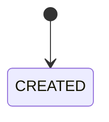

# Service Specification — `<service-name>`

## 1. Identity

| Item | Value |
|---|---|
| Service name | |
| Owner | |
| Repository | |
| Internal port | |
| Public base path | |
| Health check | `/actuator/health` |
| Swagger/OpenAPI | |
| Database schema | |

## 2. Responsibilities

### Service chịu trách nhiệm

- 

### Service không chịu trách nhiệm

- 

## 3. Data ownership

### Tables owned

| Table | Purpose |
|---|---|

### Cross-service references

| Field | Source service | Validation strategy |
|---|---|---|

### Invariants

- Không có cross-service foreign key.
- Service khác không query trực tiếp schema này.

## 4. Dependencies

### Synchronous dependencies

| Service | Endpoint | Purpose | Timeout | Retry |
|---|---|---|---:|---|

### Infrastructure dependencies

| Dependency | Purpose |
|---|---|
| PostgreSQL | |
| Redis | |
| RabbitMQ | |
| Object Storage | |

## 5. Public APIs

| Method | Path | Role | Description | Contract |
|---|---|---|---|---|

## 6. Internal APIs

| Method | Path | Caller | Description | Contract |
|---|---|---|---|---|

## 7. Events published

| Event | Routing key | When | Consumers | Contract |
|---|---|---|---|---|

## 8. Events consumed

| Event | Producer | Queue | Behavior | Idempotency key |
|---|---|---|---|---|

## 9. State machines

### Transition table

| Current | Action/Event | Next | Side effects |
|---|---|---|---|

## 10. Reliability

### Idempotency

- 

### Retry

- 

### Timeout

- 

### Circuit breaker

- 

### Transaction boundaries

- 

## 11. Cache

| Key pattern | Data | TTL | Invalidation |
|---|---|---:|---|

## 12. Security

- Authentication:
- Authorization:
- Sensitive data:
- Logging mask:

## 13. Environment variables

| Variable | Required | Example | Description |
|---|---|---|---|

## 14. Observability

- Logs:
- Metrics:
- Traces:
- Alerts:

## 15. Failure scenarios

| Scenario | Expected behavior | Error/event |
|---|---|---|

## 16. Integration acceptance criteria

- [ ] Health check pass.
- [ ] Swagger/OpenAPI available.
- [ ] API contract tests pass.
- [ ] Event contract tests pass.
- [ ] Duplicate message does not duplicate data.
- [ ] Docker image builds.
- [ ] `.env.example` complete.
- [ ] Gateway route configured.
- [ ] Queue/binding/DLQ configured.
- [ ] Integration test with dependencies passes.

## 17. Open questions

-
