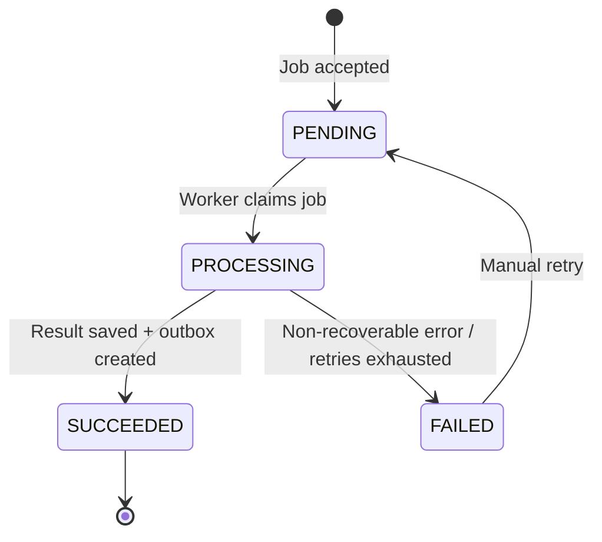

# Service Specification — `ai-bio-service`

## 1. Identity

| Item | Value |
|---|---|
| Service name | `ai-bio-service` |
| Owner | Hoàng |
| Repository | `ai-bio-service` |
| Internal port | `8080` |
| Public base path | `/api/ai-bio` |
| Health check | `/actuator/health` |
| Swagger/OpenAPI | `/swagger-ui/index.html`, `/v3/api-docs` |
| Database schema | `ai_bio_schema` |

## 2. Responsibilities

### Service chịu trách nhiệm

- Nhận một hoặc nhiều file PDF làm tài liệu nguồn cho một concert.
- Chấp nhận cả hồ sơ nghệ sĩ và press kit của concert mà không tách thành các use case nghiệp vụ khác nhau.
- Kiểm tra loại file, magic bytes, kích thước file và số lượng file.
- Lưu PDF vào Object Storage riêng tư.
- Tạo và quản lý background job sinh phần giới thiệu concert.
- Tách văn bản từ từng PDF.
- Làm sạch, chuẩn hóa và loại bỏ nội dung trùng lặp.
- Tổng hợp nội dung từ nhiều tài liệu thành context chung của concert.
- Gọi AI provider để tạo `concertIntroduction` ngắn gọn cho trang chi tiết concert.
- Validate output của AI trước khi lưu và phát event.
- Lưu trạng thái job, processing stage, retry count và lỗi an toàn.
- Publish `ConcertIntroductionGenerated` sau khi tạo nội dung thành công.
- Hỗ trợ Organizer/Admin xem trạng thái và retry job thất bại.

### Service không chịu trách nhiệm

- Không sở hữu dữ liệu concert chính thức.
- Không sở hữu artist hoặc quan hệ concert–artist.
- Không tự thêm, sửa hoặc xóa nghệ sĩ dựa trên nội dung PDF.
- Không cập nhật trực tiếp database của Event Service.
- Không phục vụ nội dung introduction trực tiếp cho public concert detail page.
- Không tự publish, cancel hoặc thay đổi trạng thái concert.
- Không xử lý OCR cho PDF chỉ chứa ảnh trong MVP.
- Không nhận Word, PowerPoint, ảnh hoặc URL ngoài trong MVP.
- Không làm lỗi AI ảnh hưởng đến luồng xem concert, mua vé hoặc thanh toán.

## 3. Data ownership

### Tables owned

| Table | Purpose |
|---|---|
| `concert_introduction_jobs` | Lưu job tạo phần giới thiệu concert, trạng thái, stage, kết quả và lỗi. |
| `source_documents` | Lưu metadata PDF, object key, checksum, extracted text và cleaned text. |
| `job_attempts` | Lưu lịch sử từng lần xử lý hoặc retry của một job. |
| `outbox_events` | Lưu event chờ publish theo Transactional Outbox Pattern. |
| `idempotency_records` | Lưu kết quả request tạo/retry theo `Idempotency-Key` nếu không lưu trực tiếp trên bảng job. |

### Cross-service references

| Field | Source service | Validation strategy |
|---|---|---|
| `concert_id` | Event Service | Gọi `GET /internal/concerts/{concertId}/ai-context` trước khi tạo job. |
| `concert_name_snapshot` | Event Service | Lấy từ AI context API và lưu snapshot tại thời điểm tạo job. |
| `organizer_id_snapshot` | Event Service | Lấy từ AI context API để kiểm tra ownership. |
| `created_by` | Auth Service / JWT | Lấy từ verified JWT `sub`; không tin `X-User-*` header trong MVP. |
| `correlation_id` | API Gateway / caller | Lấy từ `X-Request-ID`; nếu thiếu thì service tự sinh. |

### Invariants

- Không có cross-service foreign key.
- Service khác không query trực tiếp schema này.
- Mỗi job phải thuộc đúng một `concertId`.
- Mỗi job phải có ít nhất một source document hợp lệ.
- Một concert chỉ có tối đa một job ở trạng thái `PENDING` hoặc `PROCESSING` tại một thời điểm.
- `SUCCEEDED` chỉ được thiết lập khi introduction đã được lưu và outbox event đã được tạo trong cùng transaction.
- `retryCount` không được vượt `maxRetries`.
- Job `SUCCEEDED` không retry; regenerate phải tạo job mới.

## 4. Dependencies

### Synchronous dependencies

| Service | Endpoint | Purpose | Timeout | Retry |
|---|---|---|---:|---|
| Event Service | `GET /internal/concerts/{concertId}/ai-context` | Kiểm tra concert tồn tại, lấy tên concert, owner và trạng thái. | 2,000 ms | Tối đa 2 lần cho network/5xx, exponential backoff; không retry 4xx. |
| AI Provider | Provider-specific API | Sinh phần giới thiệu concert từ cleaned context. | Connect 3,000 ms; read 30,000 ms | Tối đa 3 attempts cho 429/502/503/504/timeout, exponential backoff + jitter. |

### Infrastructure dependencies

| Dependency | Purpose |
|---|---|
| PostgreSQL | Lưu jobs, documents, attempts, idempotency và outbox. |
| Redis | Không bắt buộc trong MVP; có thể dùng distributed lock hoặc short-lived idempotency/cache khi scale nhiều instance. |
| RabbitMQ | Publish `ConcertIntroductionGenerated` sang Event Service. |
| Object Storage | Lưu private PDF source documents; local dùng MinIO. |

## 5. Public APIs

| Method | Path | Role | Description | Contract |
|---|---|---|---|---|
| `POST` | `/api/ai-bio/concerts/{concertId}/jobs` | `ORGANIZER`, `ADMIN` | Upload 1–5 PDF và tạo background job. Trả `202 Accepted`. | Multipart: `files[]`, optional `language`, optional `targetLength`; bắt buộc `Idempotency-Key`. |
| `GET` | `/api/ai-bio/jobs/{jobId}` | Concert owner, `ADMIN` | Lấy trạng thái, stage, warnings, lỗi và generated candidate. | Trả job DTO trong common response envelope. |
| `POST` | `/api/ai-bio/jobs/{jobId}/retry` | Concert owner, `ADMIN` | Retry job `FAILED` còn retryable và chưa vượt giới hạn. | Bắt buộc `Idempotency-Key`; trả `202 Accepted`. |
| `GET` | `/api/ai-bio/concerts/{concertId}/jobs` | Concert owner, `ADMIN` | Xem lịch sử generation của concert. | Query: `page`, `size`, `sort`; dùng pagination envelope chung. |

Common rules:

- Nhận và echo `X-Request-ID` ở response header và body.
- Mọi timestamp dùng UTC ISO-8601.
- Mọi JSON response dùng `success`, `data`, `error`, `requestId`, `timestamp`.
- Client branch bằng string `error.code`, không branch bằng message.
- Không expose JPA entity trực tiếp.
- Upload mặc định: tối đa 5 file/job, 10 MB/file, 25 MB tổng; cấu hình qua environment variables.
- Chỉ nhận `application/pdf` và phải xác minh magic bytes `%PDF-`.

## 6. Internal APIs

| Method | Path | Caller | Description | Contract |
|---|---|---|---|---|
| — | — | — | MVP không expose internal API. Worker xử lý job qua application service/repository nội bộ. | — |

Ghi chú: Event Service nhận kết quả bằng RabbitMQ event, không gọi API đồng bộ để lấy introduction.

## 7. Events published

| Event | Routing key | When | Consumers | Contract |
|---|---|---|---|---|
| `ConcertIntroductionGenerated` | `concert.introduction.generated` | Sau khi AI output hợp lệ, introduction được lưu và outbox record được tạo. | `event-service` | Envelope chuẩn gồm `messageId`, `eventType`, `eventVersion`, `source`, `occurredAt`, `correlationId`, `causationId`, `payload`. |

Payload `ConcertIntroductionGenerated`:

```json
{
  "messageId": "759986e2-27ec-4de5-8570-d69357da2ed0",
  "eventType": "ConcertIntroductionGenerated",
  "eventVersion": "1.0",
  "source": "ai-bio-service",
  "occurredAt": "2026-06-16T04:05:00Z",
  "correlationId": "req_123",
  "causationId": null,
  "payload": {
    "jobId": "96126719-66fd-4c18-827b-86d6146d39a5",
    "concertId": "77a5dd8f-5352-4d8a-b82c-c597713eecdb",
    "introduction": "Nội dung giới thiệu ngắn gọn của concert...",
    "language": "vi",
    "sourceDocumentIds": [
      "c54aaac4-9602-45db-b8ec-f453b97c7ed1"
    ],
    "requestedAt": "2026-06-16T04:00:00Z",
    "generatedAt": "2026-06-16T04:05:00Z"
  }
}
```

RabbitMQ topology:

```text
Exchange: tickefy.events
Exchange type: topic
Routing key: concert.introduction.generated
Consumer queue: event.concert-introduction-generated
DLQ: event.concert-introduction-generated.dlq
```

## 8. Events consumed

| Event | Producer | Queue | Behavior | Idempotency key |
|---|---|---|---|---|
| — | — | — | MVP không consume business event. Job được tạo qua public API. | — |

## 9. State machines



Processing stages khi `status = PROCESSING`:

```text
STORING_DOCUMENTS
EXTRACTING_TEXT
CLEANING_TEXT
BUILDING_CONTEXT
CALLING_AI
VALIDATING_OUTPUT
PUBLISHING_RESULT
```

### Transition table

| Current | Action/Event | Next | Side effects |
|---|---|---|---|
| — | Create job accepted | `PENDING` | Lưu job, document metadata và PDF object keys. |
| `PENDING` | Worker claim thành công | `PROCESSING` | Set `startedAt`, tạo attempt, bắt đầu extract. |
| `PROCESSING` | Extraction/cleaning/AI/output thành công | `SUCCEEDED` | Lưu generated candidate, `completedAt`; tạo outbox event trong cùng transaction. |
| `PROCESSING` | Lỗi không retryable hoặc automatic retries hết | `FAILED` | Lưu `errorCode`, safe `errorMessage`, stage và attempt result. |
| `FAILED` | Organizer/Admin retry hợp lệ | `PENDING` | Tăng `retryCount`, clear lỗi hiện tại, giữ source documents. |
| `SUCCEEDED` | Retry request | Không đổi | Trả `AI_BIO_JOB_NOT_RETRYABLE`; regenerate phải tạo job mới. |

## 10. Reliability

### Idempotency

- `POST /concerts/{concertId}/jobs` bắt buộc `Idempotency-Key`.
- Idempotency scope: `createdBy + Idempotency-Key`.
- Replay cùng key trả job cũ với `replayDetected=true`, không upload hoặc tạo job lần hai.
- Retry endpoint cũng bắt buộc `Idempotency-Key`; replay không tăng `retryCount` lần hai.
- Một partial unique index chặn nhiều active job trên cùng `concertId`.
- Outbox retry giữ nguyên `messageId`.
- Event Service phải deduplicate theo `messageId` và guard theo `jobId`/`requestedAt`.

### Retry

- Automatic provider retry: tối đa 3 attempts cho timeout, 429, 502, 503, 504 và connection reset.
- Exponential backoff có jitter và tôn trọng `Retry-After`.
- Object Storage/RabbitMQ retry qua bounded backoff.
- Manual retry mặc định tối đa 3 lần/job.
- Không retry PDF rỗng, password-protected, invalid type, invalid API key hoặc request không hợp lệ.

### Timeout

- Event Service internal call: 2 giây.
- Object Storage operation: 5 giây/operation, cấu hình được.
- AI connect timeout: 3 giây.
- AI read timeout: 30 giây.
- Worker phải có maximum processing duration để phát hiện job treo.

### Circuit breaker

- Áp dụng circuit breaker cho AI Provider.
- Mở circuit khi lỗi liên tiếp vượt ngưỡng cấu hình.
- Khi `OPEN`, job không fail ngay nếu còn policy retry; worker reschedule với backoff.
- `HALF_OPEN` cho phép số request thử giới hạn.
- Event Service internal client có thể dùng circuit breaker nhẹ; khi unavailable, request tạo job trả `503 EVENT_SERVICE_UNAVAILABLE`.

### Transaction boundaries

- Tạo job: DB transaction lưu job/document metadata; chỉ commit sau khi các PDF đã được upload thành công hoặc có cleanup compensation rõ ràng.
- Worker claim: atomic update `PENDING -> PROCESSING` để chỉ một worker xử lý.
- Success transaction: lưu introduction + chuyển `SUCCEEDED` + tạo outbox event.
- Failure transaction: chuyển `FAILED` + lưu safe error + hoàn tất attempt.
- Publisher không cập nhật job; chỉ cập nhật trạng thái outbox sau broker confirm.

## 11. Cache

| Key pattern | Data | TTL | Invalidation |
|---|---|---:|---|
| Không dùng cache bắt buộc trong MVP | — | — | — |

Redis có thể được dùng sau cho distributed lock hoặc dedup ngắn hạn, nhưng PostgreSQL vẫn là source of truth cho job, idempotency và active-job constraint.

## 12. Security

- Authentication: JWT access token dùng `Authorization: Bearer`; service verify RS256 bằng public key theo Auth Contract. Gateway có thể route request nhưng không phải nguồn tin cậy cho `X-User-*` trong MVP.
- Authorization: chỉ `ORGANIZER` sở hữu concert hoặc `ADMIN` được upload, xem và retry job.
- Sensitive data: PDF, extracted text, cleaned text, AI prompt, provider response, JWT và AI API key là dữ liệu nhạy cảm.
- Logging mask: không log full JWT/API key/full document text/full prompt; mask `Authorization`; chỉ log `requestId`, `jobId`, `concertId`, `documentId`, `userId`, stage, duration và error code.
- Object Storage bucket phải private; không trả public URL.
- Không dùng original filename làm object key; filename phải được sanitize.
- PDF được xem là untrusted input; prompt phải bỏ qua instruction nằm trong tài liệu.
- AI output chỉ được lưu dưới dạng plain text sau validation; frontend phải escape output.
- Không trả stack trace, exception class hoặc raw provider body cho client.

## 13. Environment variables

| Variable | Required | Example | Description |
|---|---|---|---|
| `SERVER_PORT` | Yes | `8080` | Internal application port. |
| `SPRING_DATASOURCE_URL` | Yes | `jdbc:postgresql://postgres:5432/tickefy` | PostgreSQL connection URL. |
| `SPRING_DATASOURCE_USERNAME` | Yes | `tickefy` | Database username. |
| `SPRING_DATASOURCE_PASSWORD` | Yes | `change-me` | Database password; không commit secret thật. |
| `SPRING_RABBITMQ_HOST` | Yes | `rabbitmq` | RabbitMQ host. |
| `SPRING_RABBITMQ_PORT` | Yes | `5672` | RabbitMQ AMQP port. |
| `SPRING_RABBITMQ_USERNAME` | Yes | `tickefy` | RabbitMQ username. |
| `SPRING_RABBITMQ_PASSWORD` | Yes | `change-me` | RabbitMQ password. |
| `MINIO_ENDPOINT` | Yes | `http://minio:9000` | Object Storage endpoint. |
| `MINIO_ACCESS_KEY` | Yes | `minioadmin` | MinIO access key. |
| `MINIO_SECRET_KEY` | Yes | `change-me` | MinIO secret key. |
| `MINIO_BUCKET_AI_BIO` | Yes | `tickefy-ai-bio` | Private bucket chứa PDF. |
| `AI_PROVIDER` | Yes | `OPENAI` | AI provider implementation. |
| `AI_API_KEY` | Yes | `secret` | Provider API key. |
| `AI_MODEL` | Yes | `provider-model-name` | Model dùng để generate introduction. |
| `AI_CONNECT_TIMEOUT_MS` | No | `3000` | Provider connection timeout. |
| `AI_READ_TIMEOUT_MS` | No | `30000` | Provider read timeout. |
| `AI_MAX_ATTEMPTS` | No | `3` | Automatic provider attempts. |
| `AI_MAX_INPUT_TOKENS` | No | `12000` | Maximum input token budget. |
| `AI_CHUNK_TOKENS` | No | `4000` | Chunk size khi input dài. |
| `AI_OUTPUT_MAX_TOKENS` | No | `500` | Maximum generation output tokens. |
| `AI_JOB_MAX_RETRIES` | No | `3` | Manual retry limit. |
| `AI_MAX_FILES_PER_JOB` | No | `5` | Maximum PDFs per job. |
| `AI_MAX_FILE_SIZE_BYTES` | No | `10485760` | Maximum bytes per PDF. |
| `AI_MAX_TOTAL_UPLOAD_BYTES` | No | `26214400` | Maximum total upload bytes. |
| `EVENT_SERVICE_BASE_URL` | Yes | `http://event-service:8082` | Event Service internal URL. |
| `AI_PROMPT_VERSION` | No | `concert-introduction-v1` | Version của prompt contract. |
| `OUTBOX_PUBLISH_INTERVAL_MS` | No | `1000` | Outbox publisher polling interval. |

## 14. Observability

- Logs: structured JSON logs có `requestId`, `correlationId`, `jobId`, `concertId`, `documentId`, `userId`, `status`, `processingStage`, `provider`, `model`, `durationMs`, `errorCode`, `retryCount`.
- Metrics:
  - `ai_bio_jobs_total{status}`
  - `ai_bio_job_duration_seconds`
  - `ai_bio_stage_duration_seconds{stage}`
  - `ai_bio_pdf_extraction_failures_total{code}`
  - `ai_bio_provider_requests_total{provider,result}`
  - `ai_bio_provider_latency_seconds{provider}`
  - `ai_bio_provider_retries_total{reason}`
  - `ai_bio_outbox_pending_total`
  - `ai_bio_outbox_publish_failures_total`
- Traces: propagate `X-Request-ID`/correlation ID qua Event Service call, provider client và event envelope; OpenTelemetry là optional cho MVP.
- Alerts:
  - Job failure rate vượt ngưỡng.
  - Provider timeout/rate-limit tăng bất thường.
  - Outbox pending hoặc oldest pending age vượt ngưỡng.
  - Object Storage/RabbitMQ readiness fail.
  - Job ở `PROCESSING` quá maximum duration.

Health policy:

- Liveness chỉ phản ánh process còn hoạt động.
- Readiness kiểm tra PostgreSQL, Object Storage và RabbitMQ.
- AI Provider unavailable không làm liveness fail để tránh restart loop.

## 15. Failure scenarios

| Scenario | Expected behavior | Error/event |
|---|---|---|
| Không có PDF | Reject request, không tạo job. | `400 PDF_FILE_REQUIRED` |
| File giả PDF hoặc MIME/magic bytes sai | Reject request. | `415 INVALID_PDF_TYPE` |
| File hoặc tổng upload quá lớn | Reject request. | `413 PDF_TOO_LARGE` |
| Concert không tồn tại | Không tạo job. | `404 CONCERT_NOT_FOUND` |
| Organizer không sở hữu concert | Không tạo hoặc xem/retry job. | `403 CONCERT_ACCESS_DENIED` |
| Event Service unavailable khi validate concert | Không tạo job; client có thể retry request. | `503 EVENT_SERVICE_UNAVAILABLE` |
| Concert đã có active job | Không tạo job mới; trả active job id trong details. | `409 AI_BIO_JOB_ALREADY_ACTIVE` |
| Một PDF lỗi nhưng còn PDF khác dùng được | Tiếp tục xử lý, job có warnings. | Warning `PDF_UNREADABLE` hoặc `PDF_NO_EXTRACTABLE_TEXT` |
| Tất cả PDF không có text dùng được | Job chuyển `FAILED`. | `NO_USABLE_DOCUMENT_CONTENT` |
| PDF password-protected | Document fail; job tiếp tục nếu còn document dùng được. | `PDF_PASSWORD_PROTECTED` |
| Object Storage tạm unavailable | Retry bounded; nếu hết retry, request/job fail an toàn. | `OBJECT_STORAGE_UNAVAILABLE` |
| AI provider timeout | Automatic retry/backoff; hết attempts thì job `FAILED`. | `AI_PROVIDER_TIMEOUT` |
| AI provider rate limit | Respect `Retry-After`, retry/backoff. | `AI_PROVIDER_RATE_LIMITED` |
| AI provider auth sai | Không retry tự động; job `FAILED`, alert cấu hình. | `AI_PROVIDER_AUTH_FAILED` |
| AI trả output rỗng/sai schema | Một repair attempt; nếu vẫn sai thì job `FAILED`. | `AI_OUTPUT_INVALID` |
| RabbitMQ unavailable sau generation | Job vẫn `SUCCEEDED`; outbox giữ `PENDING` và retry publish. | Không trả lỗi public; metric/alert outbox. |
| Event publish lặp | Publish cùng `messageId`; Event Service dedupe. | `ConcertIntroductionGenerated` |
| Organizer sửa introduction thủ công trong lúc AI chạy | Event Service không ghi đè bản manual mới hơn `requestedAt`. | Event được ACK nhưng có thể không apply. |
| Job `PROCESSING` bị treo | Watchdog đánh dấu hoặc reschedule theo policy; không xử lý song song hai worker. | `AI_JOB_PROCESSING_TIMEOUT` |

## 16. Integration acceptance criteria

- [ ] Health check pass.
- [ ] Swagger/OpenAPI available.
- [ ] API contract tests pass.
- [ ] Event contract tests pass.
- [ ] Duplicate message does not duplicate data.
- [ ] Docker image builds.
- [ ] `.env.example` complete.
- [ ] Gateway route configured.
- [ ] Queue/binding/DLQ configured.
- [ ] Integration test with dependencies passes.
- [ ] Organizer/Admin upload được 1–5 PDF cho một concert.
- [ ] API create/retry trả `202 Accepted` và common response envelope.
- [ ] `X-Request-ID` được echo trong header, body và logs.
- [ ] PDF được lưu vào private Object Storage bằng generated object key.
- [ ] PDF press kit và artist profile đều được xử lý như source document của concert.
- [ ] Nhiều PDF được extract, clean, deduplicate và tổng hợp thành một context.
- [ ] AI output tạo đúng một `concertIntroduction` cho trang concert.
- [ ] Provider timeout/rate limit có retry và exponential backoff.
- [ ] Failed job retry đúng state và không vượt giới hạn.
- [ ] Hai worker không xử lý cùng một job.
- [ ] Success transaction tạo outbox event atomically.
- [ ] RabbitMQ unavailable không làm mất kết quả generation.
- [ ] Event Service cập nhật introduction idempotent và invalidate concert cache.
- [ ] Manual introduction mới hơn không bị AI ghi đè.
- [ ] Public concert detail lấy introduction từ Event Service, không từ AI Bio Service.
- [ ] Không có secret, full token, stack trace hoặc full PDF text trong response/log thường.
- [ ] Test end-to-end pass cho concert solo, concert nhiều nghệ sĩ và concert có nhiều source PDFs.

## 17. Open questions

- Event Service có cho phép cập nhật AI introduction khi concert ở trạng thái `PUBLISHED`, hay chỉ `DRAFT`?
- Giới hạn chính thức là 5 PDF/job, 10 MB/file và 25 MB tổng hay cần điều chỉnh?
- Có cần hỗ trợ OCR cho PDF scan trong phạm vi nộp bài không?
- Retention policy của PDF, extracted text và cleaned text là bao lâu?
- Redis có bắt buộc dùng cho distributed lock khi chạy nhiều instance hay PostgreSQL atomic claim là đủ cho MVP?
- Có cần publish thêm event `ConcertIntroductionGenerationFailed`, hay trạng thái lỗi chỉ được tra cứu qua job API?
