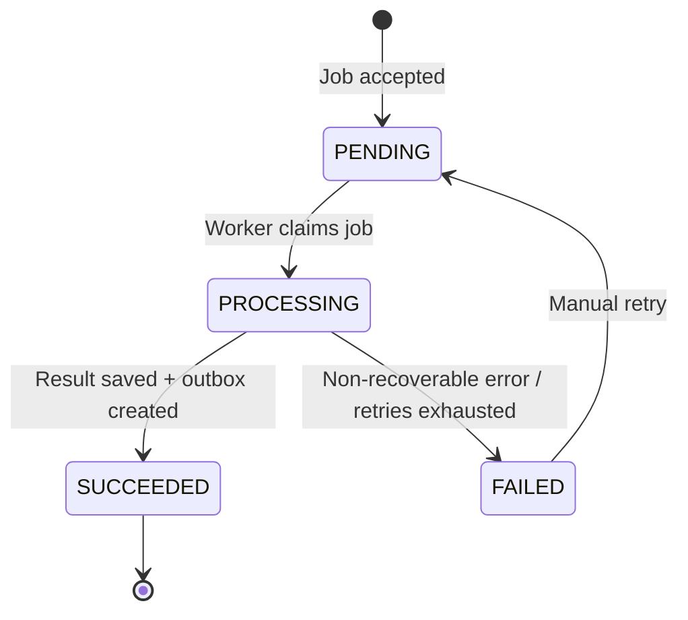

# Service Specification — `ai-bio-service`

## 1. Identity

| Item | Value |
|---|---|
| Service name | `ai-bio-service` |
| Owner | Hoàng |
| Repository | `tickefy-backend/services/ai-bio-service` |
| Runtime | Python 3.12 + FastAPI |
| Internal port | 8089 (host) → 8080 (container) |
| Public base path | `/api/ai-bio` |
| Health check | `/health`, `/actuator/health` compatibility alias |
| Swagger/OpenAPI | `/docs`, `/openapi.json`; optional alias `/swagger-ui/index.html` nếu gateway/team cần |
| Database schema | `ai_bio_schema` |
| Object Storage bucket/prefix | `ai-bio-source-documents` / `ai-bio/{concertId}/{jobId}/...` |

## 2. Responsibilities

### Service chịu trách nhiệm

- Nhận nhiều nguồn đầu vào để sinh phần giới thiệu concert.
- Tạo background job idempotent cho request generate introduction.
- Validate input source theo size, type, magic bytes, URL safety và giới hạn số lượng.
- Lưu uploaded file vào private Object Storage; không expose public URL.
- Với URL source, fetch nội dung an toàn, lưu snapshot/extracted text và metadata phục vụ audit.
- Extract text từ PDF, Markdown/Text, DOCX, PPTX.
- Phase 2: OCR image và crawl/fetch URL nâng cao có kiểm soát.
- Clean, normalize, deduplicate và build concert context từ nhiều source.
- Gọi AI Provider để sinh đúng một `concertIntroduction` ngắn gọn.
- Validate output AI trước khi lưu và publish event.
- Lưu job status, processing stage, retry count, warnings và safe error.
- Publish `ConcertIntroductionGenerated` bằng Outbox Pattern sau khi job `SUCCEEDED`.
- Cho phép Organizer/Admin xem job, xem lịch sử job và retry job thất bại còn retryable.

### Service không chịu trách nhiệm

- Không sở hữu dữ liệu concert chính thức.
- Không cập nhật trực tiếp database của `event-service`.
- Không serve `concertIntroduction` cho public concert detail page.
- Không tự publish/cancel/change status concert.
- Không tự sửa artist/venue/concert metadata dựa trên source document.
- Không nhận raw HTML/URL không kiểm soát để crawl vô hạn.
- Không xử lý file executable, archive, video, audio hoặc binary không nằm trong allowlist.
- Không để lỗi AI, file extraction hoặc URL fetch ảnh hưởng đến flow xem concert, mua vé, thanh toán.

## 3. Supported input sources

### Phase 1 — implement trước

| Source type | Extensions | MIME examples | Extraction strategy |
|---|---|---|---|
| PDF | `.pdf` | `application/pdf` | `pypdf`/`pdfplumber`; không OCR ảnh trong Phase 1 |
| Markdown | `.md`, `.markdown` | `text/markdown`, `text/plain` | Read UTF-8 text, strip markdown noise |
| Text | `.txt` | `text/plain` | Read UTF-8 text |
| Word | `.docx` | `application/vnd.openxmlformats-officedocument.wordprocessingml.document` | `python-docx` |
| PowerPoint | `.pptx` | `application/vnd.openxmlformats-officedocument.presentationml.presentation` | `python-pptx` |

### Phase 2 — chỉ làm sau khi Phase 1 ổn

| Source type | Extensions / Input | Extraction strategy | Extra security |
|---|---|---|---|
| Image | `.png`, `.jpg`, `.jpeg`, `.webp` | OCR bằng Tesseract hoặc Vision model | Size/pixel limit; không log image content |
| URL | `https://...` | Fetch HTML/text, extract main content | SSRF protection, private IP block, timeout, max download size, redirect limit |

### Upload limits

| Limit | Default |
|---|---:|
| Max files per job | 5 |
| Max uploaded file size | 10 MB/file |
| Max total uploaded size | 25 MB/job |
| Max URL sources per job | 5 |
| Max URL download size | 5 MB/url |
| Max extracted text per source | configurable, default 80,000 chars |
| Max context sent to AI | configurable, default by model budget |

## 4. Data ownership

### Tables owned

| Table | Purpose |
|---|---|
| `concert_introduction_jobs` | Job generate introduction, status, stage, result, retry, actor, concert snapshot. |
| `source_documents` | Metadata cho từng input source: file/url/text type, object key, checksum, extraction status, warnings. |
| `document_extractions` | Extracted text, cleaned text, token/char count, parser version, extraction warnings. |
| `job_attempts` | Lịch sử từng attempt xử lý job/retry, provider, model, duration, safe error. |
| `outbox_events` | Event chờ publish theo Transactional Outbox Pattern. |
| `idempotency_records` | Replay-safe record cho create job và retry job theo `createdBy + Idempotency-Key`. |

### Cross-service references

| Field | Source service | Validation strategy |
|---|---|---|
| `concert_id` | `event-service` | Gọi `GET /internal/concerts/{concertId}/ai-context` trước khi tạo job. |
| `concert_name_snapshot` | `event-service` | Lưu snapshot tại thời điểm tạo job. |
| `organizer_id_snapshot` | `event-service` | Dùng để check ownership với JWT `sub`. |
| `created_by` | `auth-service` / JWT | Lấy từ verified JWT `sub`; không tin `X-User-*`. |
| `correlation_id` | Gateway/caller | Lấy từ `X-Request-ID`; nếu thiếu service tự sinh. |

### Invariants

- Không có cross-service foreign key.
- Service khác không query trực tiếp `ai_bio_schema`.
- Mỗi job thuộc đúng một `concertId`.
- Mỗi job phải có ít nhất một source hợp lệ.
- Một concert chỉ có tối đa một job `PENDING` hoặc `PROCESSING` tại một thời điểm.
- `SUCCEEDED` chỉ được set khi result đã lưu và outbox event đã tạo trong cùng transaction.
- Retry không vượt `maxRetries`.
- Job `SUCCEEDED` không retry; regenerate tạo job mới với idempotency key mới.
- Không lưu plaintext secret, JWT, AI API key hoặc provider raw sensitive body.

## 5. Dependencies

### Synchronous dependencies

| Service | Endpoint | Purpose | Timeout | Retry |
|---|---|---|---:|---|
| `event-service` | `GET /internal/concerts/{concertId}/ai-context` | Validate concert, owner, status and existing introduction timestamps. | 2s | Max 2 for network/5xx; no retry for 4xx |
| AI Provider | Provider-specific API | Generate `concertIntroduction`. | connect 3s, read 30s | Max 3 for timeout/429/502/503/504, exponential backoff + jitter |
| URL source | external URL | Phase 2 content fetch. | connect 3s, read 10s | No automatic retry for 4xx; bounded retry for 5xx/timeout |

### Infrastructure dependencies

| Dependency | Purpose |
|---|---|
| PostgreSQL | Source of truth for jobs, documents, attempts, idempotency and outbox. |
| RabbitMQ | Publish `ConcertIntroductionGenerated` to Event Service. |
| Object Storage / MinIO | Store private uploaded source files and optional normalized snapshots. |
| Redis | Optional; not required in Phase 1. Can be used for distributed lock if scaling workers. |

## 6. Public APIs

All responses use the common envelope: `success`, `data`, `error`, `requestId`, `timestamp`.

| Method | Path | Role | Description |
|---|---|---|---|
| `POST` | `/api/ai-bio/concerts/{concertId}/jobs` | `ORGANIZER`, `ADMIN` | Create background generation job from files and/or URLs. Returns `202 Accepted`. |
| `GET` | `/api/ai-bio/jobs/{jobId}` | Concert owner, `ADMIN` | Get job status, stage, warnings, safe error and generated candidate. |
| `POST` | `/api/ai-bio/jobs/{jobId}/retry` | Concert owner, `ADMIN` | Retry `FAILED` job if retryable and retry limit not exceeded. Returns `202 Accepted`. |
| `GET` | `/api/ai-bio/concerts/{concertId}/jobs` | Concert owner, `ADMIN` | List generation history for a concert. Query: `page`, `size`, `sort`. |

### `POST /api/ai-bio/concerts/{concertId}/jobs`

Headers:

```http
Authorization: Bearer <access-token>
Idempotency-Key: <stable-key>
X-Request-ID: <optional-request-id>
Content-Type: multipart/form-data
```

Multipart fields:

| Field | Required | Notes |
|---|---:|---|
| `files[]` | Conditional | 1-5 uploaded files. Required if `sourceUrls[]` empty. |
| `sourceUrls[]` | Conditional | Phase 2. Required if `files[]` empty. HTTPS only. |
| `language` | No | Default `vi`. |
| `targetLength` | No | Default from config, e.g. `SHORT`, `MEDIUM`. |
| `tone` | No | Optional: `PROFESSIONAL`, `ENERGETIC`, `LUXURY`, etc. |

Rules:

- At least one valid source is required: `files[]` or `sourceUrls[]`.
- Phase 1 accepts only file sources; URL returns `UNSUPPORTED_SOURCE_TYPE` until Phase 2 is enabled.
- Validate count/size/type before creating committed job.
- For files, verify extension, MIME and magic bytes where applicable.
- For text/markdown, validate UTF-8 and max length.
- For DOCX/PPTX, verify ZIP/OpenXML signature and parser safety.
- For URL Phase 2, enforce HTTPS, SSRF protection, redirect limit, response size limit and content-type allowlist.

Example response:

```json
{
  "success": true,
  "data": {
    "jobId": "96126719-66fd-4c18-827b-86d6146d39a5",
    "concertId": "77a5dd8f-5352-4d8a-b82c-c597713eecdb",
    "status": "PENDING",
    "stage": "SOURCE_ACCEPTED",
    "replayDetected": false,
    "createdAt": "2026-06-19T08:00:00Z"
  },
  "error": null,
  "requestId": "req-123",
  "timestamp": "2026-06-19T08:00:00Z"
}
```

## 7. Internal APIs

MVP does not expose internal APIs. Event Service receives result via RabbitMQ event, not by querying AI Bio.

## 8. Events published

| Event | Routing key | Exchange | When | Consumers |
|---|---|---|---|---|
| `ConcertIntroductionGenerated` | `concert.introduction.generated` | `tickefy.exchange` | After valid AI result is saved and outbox record is created. | `event-service` |

Payload envelope:

```json
{
  "messageId": "759986e2-27ec-4de5-8570-d69357da2ed0",
  "eventType": "ConcertIntroductionGenerated",
  "eventVersion": "1.0",
  "source": "ai-bio-service",
  "occurredAt": "2026-06-19T08:05:00Z",
  "correlationId": "req-123",
  "causationId": null,
  "payload": {
    "jobId": "96126719-66fd-4c18-827b-86d6146d39a5",
    "concertId": "77a5dd8f-5352-4d8a-b82c-c597713eecdb",
    "introduction": "Nội dung giới thiệu ngắn gọn của concert...",
    "language": "vi",
    "sourceDocumentIds": ["c54aaac4-9602-45db-b8ec-f453b97c7ed1"],
    "sourceTypes": ["PDF", "DOCX"],
    "requestedAt": "2026-06-19T08:00:00Z",
    "generatedAt": "2026-06-19T08:05:00Z"
  }
}
```

RabbitMQ topology target:

```text
Exchange: tickefy.exchange
Exchange type: topic
Routing key: concert.introduction.generated
Consumer queue: event-service.concert-introduction-generated.queue
DLQ: event-service.concert-introduction-generated.queue.dlq
DLX: tickefy.dlx
DLQ routing key: event-service.concert-introduction-generated.dlq
```

## 9. Events consumed

| Event | Producer | Queue | Behavior |
|---|---|---|---|
| — | — | — | MVP does not consume business events. Jobs are created by public API. |

## 10. State machines



Processing stages:

```text
SOURCE_ACCEPTED
STORING_SOURCES
FETCHING_URLS          # Phase 2
EXTRACTING_TEXT
OCR_IMAGE              # Phase 2
CLEANING_TEXT
BUILDING_CONTEXT
CALLING_AI
VALIDATING_OUTPUT
SAVING_RESULT
PUBLISHING_RESULT
```

## 11. Reliability

### Idempotency

- `POST /concerts/{concertId}/jobs` requires `Idempotency-Key`.
- Idempotency scope: `createdBy + Idempotency-Key`.
- Replay returns existing job with `replayDetected=true`; no upload/fetch/job duplication.
- Retry endpoint also requires `Idempotency-Key`.
- Partial unique index blocks multiple active jobs for the same `concertId`.
- Outbox retry preserves the same `messageId`.
- Event Service deduplicates by `messageId` and guards by `jobId/requestedAt`.

### Retry

- AI Provider retry: max 3 for timeout, 429, 502, 503, 504 and connection reset.
- Object storage operation retry: bounded backoff.
- URL fetch Phase 2: bounded retry only for temporary network/5xx.
- Manual retry max 3 per job.
- Do not retry invalid type, unsupported type, password-protected document, no usable content, invalid provider config or forbidden concert.

### Transaction boundaries

- Create job: upload/store source first, then DB transaction records job, documents and idempotency record; cleanup partial objects if DB fails.
- Worker claim: atomic `PENDING -> PROCESSING`.
- Success transaction: save introduction, set `SUCCEEDED`, create outbox event.
- Failure transaction: set `FAILED`, save safe error and attempt result.
- Publisher marks outbox published only after broker confirm.

## 12. Security

- Required roles: `ORGANIZER` owner of concert or `ADMIN`.
- Service verifies JWT RS256 itself and gets actor from JWT `sub`.
- Do not trust `X-User-ID` or `X-User-Roles` for authorization.
- Never log full source content, AI prompt, provider raw body, JWT, API keys or object storage credentials.
- For URL Phase 2: block private/reserved IPs, localhost, metadata IP ranges, file URLs and non-HTTP(S) schemes.
- Store source files private; no public URL in API/event/log.

## 13. Python implementation notes

Recommended stack:

```text
FastAPI + Uvicorn
Pydantic v2 + pydantic-settings
SQLAlchemy 2.x + Alembic
psycopg
httpx
PyJWT / python-jose
boto3 or minio
pypdf/pdfplumber
python-docx
python-pptx
aio-pika
APScheduler or internal worker loop
```

Service must still follow Tickefy common API envelope, error catalog, event envelope, database-per-service, outbox and Docker Compose conventions.