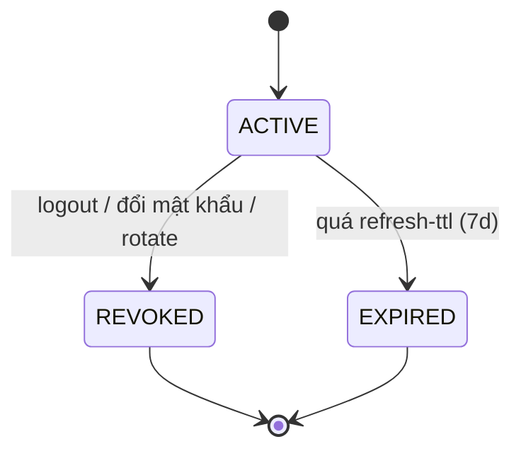

# Service Specification — `auth-service`

> Nhãn tin cậy: ✅ khớp implement (session) · 🔭 PLANNED/parked (chưa code, cố ý) · ⚠️ VERIFY (tái dựng — Claude Code đối chiếu repo).

## 1. Identity
| Item | Value |
|---|---|
| Service name | auth-service |
| Owner | Hiệp |
| Repository | tickefy-backend (monorepo) → `services/auth-service` ✅ |
| Internal port | 8081 (host) → 8080 (container) |
| Public base path | External gateway: `/api/auth/**`; direct-dev service path: `/auth/**` |
| Health check | `/actuator/health` ✅ + `/health` (`HealthController.java:17`) |
| Swagger/OpenAPI | springdoc `/swagger-ui.html` ✅ (dep trong pom) |
| Database name / schema | DB `tickefy_auth` · schema `auth_service` (`${DB_SCHEMA}`; `V2__auth_schema.sql:1`) ✅ |

## 2. Responsibilities
### Chịu trách nhiệm
- Đăng ký / đăng nhập / đăng xuất; hash password (bcrypt cost ≥10).
- Cấp & làm mới JWT: access (RS256, 15') + refresh (opaque, 7d, hash SHA-256 trong DB).
- Quản lý RBAC: 4 role AUDIENCE/ORGANIZER/CHECKIN_STAFF/ADMIN; gán/gỡ role (ADMIN).
- Thu hồi token qua Redis blacklist (logout / đổi mật khẩu).
- `GET /auth/me` (user + roles từ DB tươi).

### KHÔNG chịu trách nhiệm
- Business logic service khác (concert/order/ticket/payment).
- **Check blacklist cho service khác** — inventory/order chỉ **verify-only** (chữ ký + exp), KHÔNG check blacklist.
- Gateway routing + CORS prod (Hoàng).
- Fine-grained permission (chỉ role-based — ADR-AUTH-004).

## 3. Data ownership
### Tables owned ✅ (`V2__auth_schema.sql`)
| Table | Purpose |
|---|---|
| `users` | Tài khoản: `email` (unique), `password_hash` (bcrypt), `full_name`, `enabled`, `created_at`/`updated_at` (`V2:5-14`) |
| `roles` | 4 role seed (V2 migration) |
| `user_roles` | Mapping user ↔ role (many-to-many) |
| `refresh_tokens` | Refresh token **hash** (SHA-256), userId, expires_at, revoked_at |

### Cross-service references
| Field | Source service | Validation strategy |
|---|---|---|
| (none) | — | auth là service nền — KHÔNG tham chiếu service khác. Service khác lấy `userId`/`roles` từ JWT, KHÔNG FK vào schema này. |

### Invariants
- Không cross-service FK. Service khác KHÔNG query schema auth trực tiếp (chỉ qua JWT claims / API).

## 4. Dependencies
### Synchronous dependencies
| Service | Endpoint | Purpose | Timeout | Retry |
|---|---|---|---:|---|
| (none) | — | auth nền tảng — KHÔNG gọi đồng bộ service khác | — | — |

### Infrastructure dependencies
| Dependency | Purpose |
|---|---|
| PostgreSQL | users / roles / user_roles / refresh_tokens |
| Redis | Token blacklist (`tickefy:auth:token:blacklist:{jti}`) |
| RabbitMQ | ✅ auth KHÔNG publish/consume event (no amqp dep — xem §7/§8). 🔭 `UserRegistered` chỉ là ý tưởng chưa freeze nếu sau cần notification. |
| Object Storage | (none) |

## 5. Public APIs ✅

Canonical external path qua Gateway là `/api/auth/**`. Bảng dưới đây ghi direct-dev service path theo controller hiện tại (`UserController` `@RequestMapping("/auth")`); Gateway map `/api/auth/**` sang các path này.

| Method | Path | Role | Description | Contract |
|---|---|---|---|---|
| POST | `/auth/register` | public | Đăng ký → role mặc định AUDIENCE, 201 | api-contracts §2 |
| POST | `/auth/login` | public | Login → `{accessToken,refreshToken,tokenType,expiresIn}` + Set-Cookie refresh | api-contracts §2 |
| POST | `/auth/refresh-token` | public (cookie) | Đọc refresh từ **cookie** (fallback body) → access mới | api-contracts §2 |
| POST | `/auth/logout` | authenticated | Blacklist jti + revoke refresh + clear cookie | api-contracts §2 |
| GET | `/auth/me` | authenticated | `{userId,email,fullName,roles[]}` (DB tươi) | api-contracts §2 |
| POST | `/auth/change-password` | authenticated | Đổi mật khẩu + revoke refresh cũ | 🔭 PLANNED — **chưa code** (grep changePassword = NONE) |
| GET | `/auth/users/{userId}` | ADMIN | Thông tin user | 🔭 PLANNED — **chưa code** (chỉ có `/users/{id}/roles` + `/users` list) |
| GET | `/auth/users/{userId}/roles` | ADMIN | Danh sách role của user | ✅ (`UserController.java:66`) |
| GET | `/auth/users` | ADMIN | Danh sách user (paginated) | ✅ (`UserController.java:76`) |
| POST | `/auth/users/{userId}/roles` | ADMIN | Gán role (idempotent, đã có → no-op) → `{userId,roles[]}` | ✅ (`UserController.java:44`) |
| DELETE | `/auth/users/{userId}/roles/{role}` | ADMIN | Gỡ role (idempotent); chặn `LAST_ADMIN` | api-contracts §2 ✅ |

## 6. Internal APIs
| Method | Path | Caller | Description | Contract |
|---|---|---|---|---|
| (none) | — | — | Service khác xác thực bằng cách **verify JWT** (public key) — không gọi internal API auth | — |

## 7. Events published
| Event | Routing key | When | Consumers | Contract |
|---|---|---|---|---|
| (none hiện tại) | — | — | — | ✅ auth KHÔNG publish (no amqp dep) |
| 🔭 `UserRegistered` | `user.registered` | sau register | notification | PLANNED, chưa code, chưa freeze trong common event contract |

## 8. Events consumed
| Event | Producer | Queue | Behavior | Idempotency key |
|---|---|---|---|---|
| (none) | — | — | auth không consume event | — |

## 9. State machines
Auth không có domain state machine phức tạp. Vòng đời refresh token:

| Current | Action/Event | Next | Side effects |
|---|---|---|---|
| ACTIVE | logout / change-password | REVOKED | set `revoked_at` |
| ACTIVE | refresh | (KHÔNG đổi) | 🔭 rotation **chưa code** — `AuthService.refresh()` `:130-151` chỉ cấp access mới, KHÔNG tạo refresh mới / KHÔNG revoke old (refresh tái dùng tới hết 7d) |
| ACTIVE | hết 7d | EXPIRED | — |

## 10. Reliability
### Idempotency
- Register: email UNIQUE → trùng trả 409 `EMAIL_ALREADY_EXISTS`.
- Gán/gỡ role: idempotent (đã có/đã gỡ → no-op).
### Retry / Timeout / Circuit breaker
- KHÔNG có outbound dependency → không retry/CB. Timeout theo cấu hình HTTP mặc định.
### Transaction boundaries
- Register (tạo user + gán role) trong 1 transaction.
- 🔭 Refresh rotation (revoke cũ + tạo mới) — **chưa code** (hiện refresh không rotate).

## 11. Cache
| Key pattern | Data | TTL | Invalidation |
|---|---|---:|---|
| `tickefy:auth:token:blacklist:{jti}` | "1" (token đã thu hồi) | = thời gian còn lại của access token | Tự hết hạn (Redis EX) |
> Redis-down fail-safe: `isBlacklisted` lỗi → trả `false` (cho qua nếu chữ ký + exp hợp lệ) + log WARN. ✅

## 12. Security
- **Authentication:** JWT RS256 — auth giữ **private key** (ký); service khác verify **public key**. Login so bcrypt.
- **Authorization:** RBAC 4 role, authority `ROLE_{code}`, `@PreAuthorize` method-level. ⚠️ Role nhúng token lúc login → đổi role chỉ hiệu lực authority ở token LẦN SAU; `/auth/me` đọc DB tươi.
- **Sensitive data:** password bcrypt (cost ≥10); refresh token SHA-256 hash; private key KHÔNG commit (prod key path).
- **Logging mask:** KHÔNG log token/password/secret; CookieFactory KHÔNG log giá trị cookie.

## 13. Environment variables ✅ (theo `application.yml`)
| Variable | Required | Example | Description |
|---|---|---|---|
| `SPRING_PROFILES_ACTIVE` | ✅ | `docker` | Profile |
| `DB_HOST` / `DB_PORT` / `DB_NAME` / `DB_USERNAME` / `DB_PASSWORD` | ✅ | postgres / 5432 / `tickefy_auth` | DB auth (`application.yml:7-9`) |
| `DB_SCHEMA` | ✅ | `auth_service` | Schema (database-per-service) |
| `REDIS_HOST` / `REDIS_PORT` | ✅ | redis / 6379 | Blacklist (`application.yml:28-29`) |
| `JWT_PRIVATE_KEY_PATH` / `JWT_PUBLIC_KEY_PATH` | ✅ (prod) | `/keys/*.pem` | Dev: keypair classpath |
| `app.jwt.access-ttl` / `refresh-ttl` | ✅ | `PT15M` / `P7D` | TTL token |
| `CORS_ALLOWED_ORIGINS` | optional | `http://localhost:3000` | CSV; rỗng = CORS off (gateway lo prod) |
| `COOKIE_SECURE` | optional | `false` (dev) | Cookie Secure flag |
| `BOOTSTRAP_ADMIN_EMAIL` / `BOOTSTRAP_ADMIN_PASSWORD` | optional | — | Seed admin đầu tiên |

## 14. Observability
- **Logs:** `requestId` (MDC) + userId; không secret.
- **Metrics:** actuator mặc định ✅; 🔭 custom counter (login success/fail) chưa code (no MeterRegistry/Counter).
- **Traces:** propagate `X-Request-Id`.
- **Alerts:** (không formal — phạm vi đồ án).

## 15. Failure scenarios
| Scenario | Expected behavior | Error/event |
|---|---|---|
| Register email trùng | 409 | `EMAIL_ALREADY_EXISTS` |
| Login sai mật khẩu | 401, không lộ email tồn tại | `INVALID_CREDENTIALS` |
| Access token hết hạn | 401 → client refresh (any-401) | `INVALID_TOKEN` (⚠️ KHÔNG `TOKEN_EXPIRED`) |
| Refresh hết hạn/revoke | 401 → buộc login | `TOKEN_REVOKED` / 401 |
| Token trong blacklist | 401 (chỉ auth-service phát hiện) | `TOKEN_REVOKED` |
| Token sai chữ ký | 401 | `INVALID_TOKEN` |
| Đủ auth, sai role | 403 | `FORBIDDEN` |
| Redis down (check blacklist) | Fail-safe: cho qua nếu sig+exp hợp lệ + log WARN | — |
| Gỡ ADMIN cuối cùng | 409, chặn | `LAST_ADMIN` |
| Đổi mật khẩu | Revoke refresh + blacklist access hiện tại; thiết bị khác login lại sau ≤15' | 🔭 PLANNED — change-password chưa code |

## 16. Integration acceptance criteria
- [ ] Health check pass.
- [x] Swagger/OpenAPI available. ✅ (springdoc)
- [ ] API contract tests pass.
- [ ] ~~Event contract tests~~ — N/A (auth không publish/consume event).
- [ ] Duplicate request không tạo trùng data (register/role idempotent).
- [ ] Docker image builds.
- [ ] `.env.example` complete.
- [ ] 🔭 Gateway route configured — gateway chưa build (Hoàng).
- [ ] ~~Queue/binding/DLQ~~ — N/A (không dùng MQ).
- [ ] Integration test với Postgres + Redis pass (**81 `@Test`** trong repo — unit + integration).

## 17. Open questions
- ✅ Path role mgmt = `/auth/users/{userId}/roles` (xác nhận repo).
- ✅ `change-password` **chưa code** → 🔭 (cần làm nếu spec yêu cầu).
- ✅ Refresh **không rotate** (chỉ cấp access mới) → 🔭 rotation nếu muốn tăng bảo mật.
- 🔭 auth publish `UserRegistered` cho notification — chưa code/chưa freeze; chỉ thêm common event contract khi Notification build cần consume.
- 🔭 Gateway-side blacklist check (ADR-AUTH-003) — parked; hiện chỉ auth-service check.
- ✅ DB `tickefy_auth` / schema `auth_service` / Swagger `/swagger-ui.html` (xác nhận).
