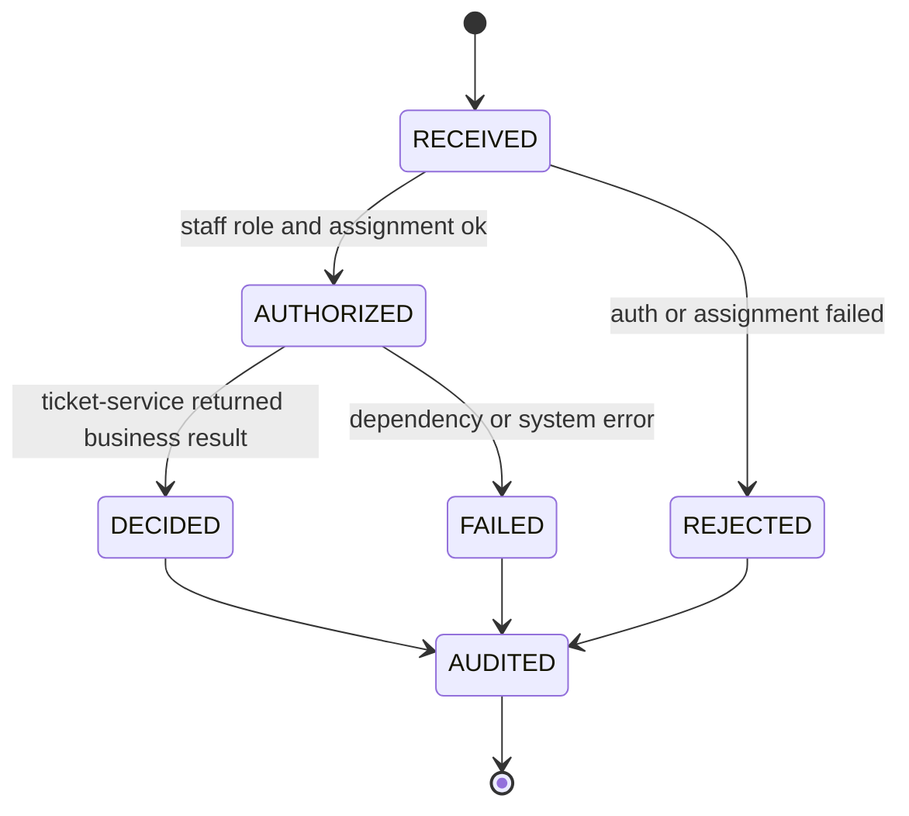
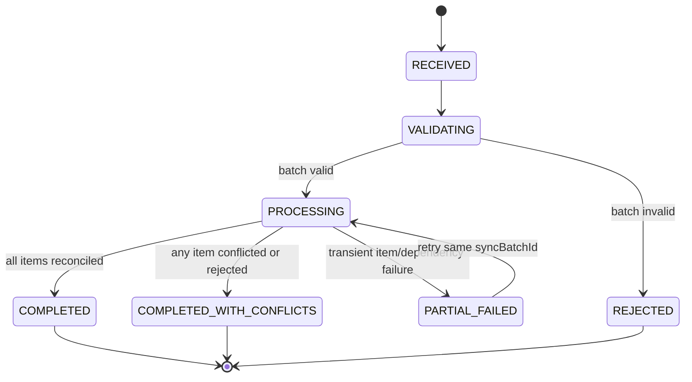

# Service Specification — `checkin-service`

## 1. Identity

| Item | Value |
|---|---|
| Service name | `checkin-service` |
| Implementation folder | `services/checkin-service` |
| Owner | Hòa |
| Repository | `tickefy-backend` |
| Internal port | TBD from service config |
| Public base path | `/api/checkins` |
| Internal base path | `/internal/checkins` |
| Health check | `/actuator/health` |
| Swagger/OpenAPI | `/swagger-ui/index.html` when enabled |
| Database schema | `checkin_schema` target; verify implementation schema before freeze |

## 2. Responsibilities

### Service chịu trách nhiệm

- Orchestrate online QR scan từ mobile staff app.
- Validate staff role/assignment for concert/gate.
- Call `ticket-service` to verify and atomically update ticket state.
- Return stable business result codes for mobile UX.
- Own check-in audit log, device/snapshot/sync metadata, and conflict records.
- Provide offline snapshot download for authorized staff/device.
- Accept offline sync batch and reconcile with server source of truth.
- Enforce idempotency for online scan and offline sync batch.

### Service không chịu trách nhiệm

- Không sở hữu ticket status cuối cùng.
- Không tự ý mark ticket checked-in trong schema của service khác.
- Không issue ticket.
- Không reserve/refund/cancel order/payment.
- Không expose raw `qrToken` trong logs/public response.

## 3. Data ownership

| Table | Purpose |
|---|---|
| `checkin_audits` | Mỗi online/offline scan attempt và result |
| `checkin_devices` | Registered mobile devices if required |
| `offline_snapshots` | Snapshot metadata: concert, device/staff, version, expiry |
| `offline_sync_batches` | Batch-level sync idempotency and status |
| `offline_sync_items` | Item-level reconciliation result |
| `checkin_conflicts` | Conflicts needing later review |
| `staff_gate_assignments` | Optional authorization data for concert/gate |

### Cross-service references

| Field | Source service | Notes |
|---|---|---|
| `ticketId` | `ticket-service` | Reference only, no FK |
| `concertId` | `event-service` | Must not be `eventId` |
| `staffId` | `auth-service` | From JWT `sub` |
| `deviceId` | mobile/checkin-service | Registered or trusted device identifier |
| `ticketTypeName` | `ticket-service` snapshot | Display only |

## 4. Dependencies

### Synchronous dependencies

| Service | Endpoint | Purpose | Timeout | Retry |
|---|---|---|---:|---|
| `ticket-service` | `POST /internal/tickets/checkin` | Verify and atomically mark ticket checked-in | 2s | One safe retry only if idempotency key present |
| `ticket-service` | `GET /internal/tickets/snapshot` | Build offline snapshot | 5s | Retry with backoff outside request if precomputing |
| `event-service` | TBD assignment/concert lookup | Optional concert/gate validation | 2s | No retry in scan path |
| `auth-service` | none in request path | JWT verified locally via public key | N/A | N/A |

### Infrastructure dependencies

| Dependency | Purpose |
|---|---|
| PostgreSQL | Audit, snapshot, sync metadata, conflict records |
| Redis | Optional rate limit / short idempotency accelerator |
| Object Storage | Optional snapshot payload storage for large concerts |

## 5. APIs

### Online check-in

| Method | Path | Role | Description |
|---|---|---|---|
| POST | `/api/checkins/scan` | `CHECKIN_STAFF` | Online scan and immediate server decision |
| GET | `/api/checkins/concerts/{concertId}/stats` | `CHECKIN_STAFF` / `ORGANIZER` | Check-in summary for a concert |

Request `POST /api/checkins/scan`:

```json
{
  "concertId": "concert-uuid",
  "qrTokenMasked": "masked-or-derived-token",
  "deviceId": "device-uuid",
  "gate": "GATE_A",
  "scannedAt": "2026-06-16T10:00:00Z",
  "scanRequestId": "mobile-generated-idempotency-key"
}
```

Response uses `../common/checkin-result-catalog.md`.

### Offline snapshot

| Method | Path | Role | Description |
|---|---|---|---|
| POST | `/api/checkins/offline-snapshots` | `CHECKIN_STAFF` | Create/download snapshot metadata/payload |
| GET | `/api/checkins/offline-snapshots/{snapshotId}` | `CHECKIN_STAFF` | Fetch existing snapshot if not expired |

Snapshot response contains safe fields only:

| Field | Notes |
|---|---|
| `snapshotId` | UUID |
| `concertId` | Concert UUID |
| `version` | Monotonic snapshot version |
| `expiresAt` | Offline expiry time |
| `generatedAt` | Server timestamp |
| `tickets[].ticketId` | Ticket UUID |
| `tickets[].qrTokenMasked` or hash/derived lookup field | No raw QR token |
| `tickets[].ticketTypeName` | Display |
| `tickets[].status` | Only statuses needed for offline decision |

### Offline sync

| Method | Path | Role | Description |
|---|---|---|---|
| POST | `/api/checkins/offline-sync-batches` | `CHECKIN_STAFF` | Upload offline scan batch for reconciliation |
| GET | `/api/checkins/offline-sync-batches/{syncBatchId}` | `CHECKIN_STAFF` | Read batch result/replay outcome |

Request:

```json
{
  "syncBatchId": "sync-batch-uuid",
  "snapshotId": "snapshot-uuid",
  "concertId": "concert-uuid",
  "deviceId": "device-uuid",
  "items": [
    {
      "offlineScanId": "offline-scan-uuid",
      "ticketId": "ticket-uuid",
      "qrTokenMasked": "masked-or-derived-token",
      "gate": "GATE_A",
      "scannedAt": "2026-06-16T10:00:00Z"
    }
  ]
}
```

## 6. Business result handling

Expected scan rejection uses `HTTP 200` + `success=true` + `data.result`.

| Situation | Result code |
|---|---|
| Ticket accepted online | `ACCEPTED` |
| Already checked in | `DUPLICATE_REJECTED` |
| Ticket belongs to another concert | `WRONG_EVENT` |
| Ticket cancelled | `CANCELLED_REJECTED` |
| Ticket refunded | `REFUNDED_REJECTED` |
| QR parseable but no valid ticket match | `INVALID_QR_REJECTED` |
| Offline local accept pending sync | `OFFLINE_ACCEPTED_PENDING_SYNC` |
| Offline sync accepted | `SYNC_ACCEPTED` |
| Offline sync conflict | `SYNC_CONFLICT` |

API errors are reserved for auth/validation/dependency/system failures; see `../common/error-catalog.md`.

## 7. State machines

### Online scan audit state



### Offline sync batch state



## 8. Idempotency and concurrency

### Online scan

- Mobile sends `scanRequestId` as idempotency key.
- Server records audit keyed by `(staffId, deviceId, scanRequestId)`.
- If same request is replayed, return stored result.
- Concurrent scan correctness depends on `ticket-service` guarded atomic update.

### Offline sync

- `syncBatchId` is required and globally unique per device batch.
- Replay of completed `syncBatchId` returns stored batch response.
- Item dedup uses `(syncBatchId, offlineScanId)`.
- Server must not rely on JVM-local locks; use DB status/unique constraints/transactions.

## 9. Security

- Required role: `CHECKIN_STAFF` for scan/snapshot/sync.
- `staffId` comes from JWT `sub`, never from request body/query.
- Gate/concert permission checked server-side.
- Raw `qrToken` must not be logged; use `qrTokenMasked`/hash.
- Offline snapshot must expire and be scoped to `concertId`, `staffId`/assignment, `deviceId`.
- Sync rejects or flags items from unknown/expired snapshot according to API/result rules.

## 10. Observability

| Signal | Required fields |
|---|---|
| Online scan log | `requestId`, `scanRequestId`, `concertId`, `staffId`, `deviceId`, `gate`, `result`, `durationMs` |
| Offline snapshot log | `snapshotId`, `concertId`, `staffId`, `deviceId`, `ticketCount`, `expiresAt` |
| Sync batch log | `syncBatchId`, `snapshotId`, `concertId`, `staffId`, `deviceId`, `result`, `acceptedCount`, `conflictCount` |
| Conflict log | `conflictId`, `ticketId`, `offlineScanId`, `result`, `firstCheckedInAt` if available |

Metrics:

- `checkin_scan_total{result}`
- `checkin_scan_duration_ms`
- `offline_snapshot_created_total`
- `offline_sync_batch_total{result}`
- `offline_sync_item_total{result}`
- `checkin_conflict_total`
- `ticket_service_dependency_error_total`

## 11. Failure scenarios

| Scenario | Response strategy | Notes |
|---|---|---|
| Missing/invalid JWT | API error | `UNAUTHORIZED` / `INVALID_TOKEN` |
| User lacks `CHECKIN_STAFF` | API error | `FORBIDDEN` |
| Staff not assigned to concert/gate | API error or permission denial | Prefer `FORBIDDEN` unless product wants business result |
| QR malformed | API error | `INVALID_QR_TOKEN` or `VALIDATION_ERROR` |
| Duplicate ticket scan | Business result | `DUPLICATE_REJECTED` |
| Ticket service unavailable | API error | `TICKET_SERVICE_UNAVAILABLE` / `SERVICE_UNAVAILABLE` |
| Snapshot expired when fetching API | API error | `SNAPSHOT_EXPIRED` |
| Snapshot expired during local scan | Mobile local result | `OFFLINE_SNAPSHOT_EXPIRED` |
| Sync batch too large | API error | `SYNC_BATCH_TOO_LARGE` |
| One item conflicts in batch | Batch success with conflicts | `SYNC_BATCH_COMPLETED_WITH_CONFLICTS` |

## 12. Environment variables

| Variable | Required | Example | Description |
|---|---|---|---|
| `SERVER_PORT` | Yes | `8088` | Service port |
| `DB_URL` / `DB_HOST` | Yes | `jdbc:postgresql://localhost:5432/tickefy` | PostgreSQL connection |
| `DB_SCHEMA` | Yes | `checkin_schema` | Owned schema |
| `JWT_PUBLIC_KEY_PATH` | Yes in prod | `/run/secrets/jwt-public.pem` | Verify bearer token |
| `TICKET_SERVICE_BASE_URL` | Yes | `http://localhost:8087` | Internal ticket-service URL |
| `SNAPSHOT_TTL_MINUTES` | Yes | `240` | Offline snapshot validity |
| `SYNC_BATCH_MAX_ITEMS` | Yes | `500` | Max items per sync request |

## 13. Integration acceptance criteria

- [ ] Health check pass.
- [ ] Swagger/OpenAPI available.
- [ ] API contract tests pass for scan/snapshot/sync.
- [ ] Auth tests prove `staffId` comes from JWT, not request body.
- [ ] Duplicate online scan returns stored/business result safely.
- [ ] Offline sync replay by same `syncBatchId` returns previous response.
- [ ] Batch with one conflict completes with `SYNC_BATCH_COMPLETED_WITH_CONFLICTS`.
- [ ] No public response/log contains raw `qrToken`.
- [ ] Dependency failure to ticket-service maps to API error, not business result.
- [ ] Docker image builds.
- [ ] `.env.example` complete.
- [ ] Gateway route configured.
- [ ] Integration test with ticket-service passes.

## 14. Open questions

- [ ] Confirm final schema name: `checkin_schema` vs current implementation schema.
- [ ] Confirm whether gate assignment data is owned here or fetched from event-service.
- [ ] Confirm offline snapshot payload storage: DB JSON vs object storage file.
- [ ] Confirm mobile local QR verification field: `qrTokenMasked`, hash, or signed compact token.
- [ ] Confirm manual override behavior and result/error code.
