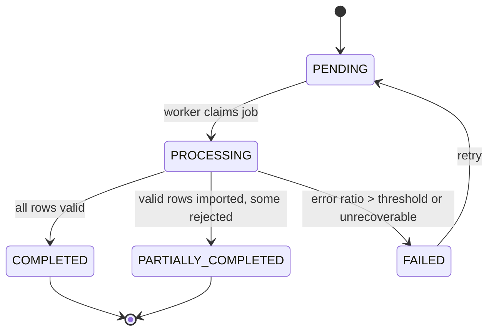

# Service Specification — `csv-ingestion-service`

> **Changelog v1.1 (align convention LOCKED — đối chiếu CLAUDE.md theo SỐ section, bằng chứng từ INSPECT-csv-ingestion-state.md):**
> - **S1** Exchange `tickefy.events` → **`tickefy.exchange`** + DLX **`tickefy.dlx`** (CLAUDE §6.5/§6.6). Code BẮT BUỘC theo đây, KHÔNG theo doc cũ.
> - **S2** Schema `csv_schema` → **`csv_ingestion_service`** (CLAUDE §3 snake_case; `.env.example` + README của service đã đúng).
> - **S3** Host port `8091/8090` (mâu thuẫn nội bộ) → **8090** (host) → 8080 (container) — đã reserve trong infra `.env`.
> - **S4** Inventory path `/internal/concerts/{id}/ticket-types` → **`/api/inventory/concerts/{id}/ticket-types`** (path THẬT, CLAUDE §6.11).
> - **S5** Envelope `source/correlationId/causationId` → **minimal §6.4** `{messageId, eventType, eventVersion, occurredAt, payload}`; tracing field là extension tùy chọn, KHÔNG bắt buộc.
> - **S6** Queue consumer checkin `checkin.vip-guest-import-completed` → **`checkin-service.vip-guest-import-completed.queue`** (CLAUDE §6.5 naming; Hòa chốt cuối khi làm consumer).
> - **D1** CSV format chốt = `name,email,ticket_type` (thiết kế Hoàng — brainstorm A7).
> - **D2** Ownership interim = **ORGANIZER+ADMIN, CHƯA enforce ownership** (degraded; event-service chưa expose `organizerId` — xem §4/§12/§17). Log warning + TODO chờ Dương.
> - **D3** Object storage bucket = **`tickefy-csv`**.
> - **D4** **KHÔNG** có notification consumer cho `VipGuestImport*` (chỉ checkin + monitoring).
>
> Ngoài phạm vi file này (xử lý riêng): **S7** sửa CLAUDE §6.10 (Inventory tự sinh ticketTypeId); **S8** sửa Dockerfile csv (`maven:3.9-eclipse-temurin-25` + `EXPOSE 8080`).

---

## 1. Identity

| Item | Value |
|---|---|
| Service name | `csv-ingestion-service` |
| Owner | Hoàng |
| Repository | `tickefy-backend/services/csv-ingestion-service` |
| Package root | `com.tickefy.csvingestion` · entry `CsvIngestionServiceApplication` |
| Port | **8090 (host) → 8080 (container)** |
| Public base path | `/api/admin/csv-import` |
| Internal base path | `/internal/concerts/{concertId}/vip-guests` |
| Health check | `/actuator/health` |
| Swagger/OpenAPI | `/swagger-ui/index.html`, `/v3/api-docs` |
| Database schema | **`csv_ingestion_service`** (DB chung `tickefy`, database-per-schema) |

## 2. Responsibilities

### Service chịu trách nhiệm

- Nhận file CSV từ Admin Web hoặc phát hiện file mới qua cron.
- Kiểm tra file-level: kích thước, định dạng, header, UTF-8 và (interim) sự tồn tại của concert.
- Tạo background job và trả `importJobId` ngay, không xử lý toàn bộ file trong request thread.
- Đọc CSV theo stream, validate theo dòng, ghi staging và xử lý theo batch khoảng 1.000 dòng.
- Resolve `ticket_type` (theo `name`) → `ticket_type_id` qua `inventory-service`.
- Ghi nhận dòng lỗi theo cơ chế skip-and-continue; dừng job nếu tỷ lệ lỗi vượt ngưỡng.
- Deduplicate và import idempotent theo `(concert_id, email)`.
- Cung cấp trạng thái, thống kê và error report cho Admin Web.
- Publish kết quả import (qua outbox) để Check-in Service cập nhật VIP guest projection.

### Service không chịu trách nhiệm

- Không quản lý concert, organizer, ticket type hoặc tồn kho vé.
- Không thực hiện check-in và không quản lý offline snapshot.
- Không ghi trực tiếp vào schema của Event, Inventory, Order hoặc Check-in.
- Không xử lý CSV đồng bộ trong request upload.
- Không để Check-in query trực tiếp database của service trong luồng soát vé.

## 3. Data ownership

### Tables owned (schema `csv_ingestion_service`)

| Table | Purpose |
|---|---|
| `import_jobs` | Job: nguồn kích hoạt (UPLOAD/CRON), object key, status, counters, attempt/retry, error_report_object_key, timestamps. |
| `vip_guest_staging` | Dòng hợp lệ ghi tạm trước khi kiểm threshold và promote. |
| `import_errors` | `line_number`, raw data đã giới hạn/mask, `reason` (mã row-level: `MISSING_FIELD`/`INVALID_EMAIL`/`TICKET_TYPE_NOT_FOUND`/`DUPLICATE_ROW`...). |
| `vip_guests` | Guest list chính thức; unique `(concert_id, email)`. |
| `outbox` | Transactional outbox cho event publish (mirror pattern order-service). |

### Cross-service references

| Field | Source service | Validation strategy |
|---|---|---|
| `concert_id` | `event-service` | Gọi `GET /internal/concerts/{concertId}` kiểm tra concert tồn tại + status cho phép. **Ownership: interim CHƯA enforce** (xem §4 F2). |
| `organizer_id` | `auth-service` | Lấy từ verified JWT `sub`; KHÔNG tin `organizerId` client gửi. (Đối chiếu owner concert khi event-service expose `organizerId`.) |
| `ticket_type_id` | `inventory-service` | Gọi `GET /api/inventory/concerts/{concertId}/ticket-types` → map row `ticket_type` (name) → `id`. |

### Invariants

- Không có cross-service foreign key (validate ở application layer).
- ID cross-service = UUID v4. Tiền (không áp dụng ở đây). Thời gian = TIMESTAMPTZ / ISO-8601 UTC.
- Service khác không query trực tiếp schema này.
- `vip_guests` chỉ chứa dữ liệu đã validate + promote từ staging.
- `(concert_id, email)` là unique key và idempotency boundary của guest.
- Job có tỷ lệ lỗi `> CSV_ERROR_THRESHOLD` KHÔNG promote dữ liệu sang `vip_guests`.

## 4. Dependencies

### Synchronous dependencies

| Service | Endpoint | Purpose | Timeout | Retry |
|---|---|---|---:|---|
| `event-service` | `GET /internal/concerts/{concertId}` | Kiểm tra concert tồn tại + status. (⚠ response **chưa có** `organizerId` — ownership degraded.) | 2s | 1 lần với 5xx/timeout |
| `inventory-service` | `GET /api/inventory/concerts/{concertId}/ticket-types` | Resolve + validate `ticket_type` (name → id). Endpoint không @PreAuthorize, forward bearer OK. | 2s | 1 lần với 5xx/timeout |

> **F2 — Ownership BỊ CHẶN (interim):** `ConcertResponse` của event-service hiện KHÔNG có `organizerId`/`ownerId`/`createdBy`. Trước khi Dương thêm field, csv chỉ validate concert TỒN TẠI + status, **không enforce** "organizer sở hữu concert" (D2 degraded). Khi field có → bật ownership check (403 `FORBIDDEN` nếu organizer không sở hữu).

### Infrastructure dependencies

| Dependency | Purpose |
|---|---|
| PostgreSQL | Lưu job, staging, error report, VIP guests, outbox trong `csv_ingestion_service`. |
| RabbitMQ | Publish kết quả import (exchange `tickefy.exchange`). |
| Object Storage (MinIO) | Lưu CSV gốc + file error report. Bucket **`tickefy-csv`** (private). Local = MinIO đã có sẵn trong compose. |
| Scheduler | `@Scheduled` quét object storage theo cron khung giờ thấp điểm (gated — tắt khi test). |
| Redis | Không dùng trong MVP. |

## 5. Public APIs

| Method | Path | Role | Description | Contract |
|---|---|---|---|---|
| `POST` | `/api/admin/csv-import` | `ORGANIZER`, `ADMIN` | Upload CSV + tạo job; trả **`202`** với `importJobId`. | `multipart/form-data`: `file`, `concertId` |
| `GET` | `/api/admin/csv-import/{importJobId}` | `ORGANIZER`, `ADMIN` | Status, summary, error rows. | `CsvImportStatusResponse` |
| `POST` | `/api/admin/csv-import/{importJobId}/retry` | `ORGANIZER`, `ADMIN` | Retry job `FAILED` retryable; giữ idempotency rules. | `CsvImportRetryResponse` |

Mọi response theo envelope chung: `{success, data, error, requestId}` (`timestamp` nếu wrapper hỗ trợ). Role check qua `@PreAuthorize`. **Ownership interim CHƯA enforce** (D2/§4 F2).

### CSV format (D1 — thiết kế Hoàng)

```
name,email,ticket_type
Nguyễn Văn A,a@gmail.com,SVIP
Trần Thị B,b@gmail.com,VIP
```

| Cột | Bắt buộc | Validation |
|---|---|---|
| `name` | ✅ | Không rỗng, max 255 chars |
| `email` | ✅ | RFC 5322 email format |
| `ticket_type` | ✅ | Phải match `name` trong `ticket_types` của concert (resolve → `ticket_type_id` qua inventory; không match → row error `TICKET_TYPE_NOT_FOUND`) |

Encoding: UTF-8 (có/không BOM — strip BOM tự động).

### Status response (canonical)

```json
{
  "success": true,
  "data": {
    "importJobId": "uuid",
    "status": "COMPLETED",
    "summary": { "totalRows": 1000, "successRows": 985, "duplicateRows": 10, "failedRows": 5 },
    "errorRows": [
      { "lineNumber": 12, "rawData": "Nguyễn A,invalid-email,SVIP", "reason": "INVALID_EMAIL" }
    ]
  },
  "error": null,
  "requestId": "req-uuid"
}
```

## 6. Internal APIs

| Method | Path | Caller | Description | Contract |
|---|---|---|---|---|
| `GET` | `/internal/concerts/{concertId}/vip-guests` | `checkin-service` | Bootstrap/rebuild VIP projection; KHÔNG dùng cho từng lần scan. | Paginated `VipGuestProjectionItem` `{concertId, email, name, ticketTypeId, ticketTypeName}` |

> Check-in nhận `VipGuestImportCompleted` (signal + counts) rồi **pull full list qua endpoint này** để refresh projection idempotent. Event KHÔNG mang guest list inline.

## 7. Events published

| Event | Routing key | Exchange | When | Consumers | Payload |
|---|---|---|---|---|---|
| `VipGuestImportCompleted` | `vip-guest-import.completed` | `tickefy.exchange` | Job → `COMPLETED` hoặc `PARTIALLY_COMPLETED`. | `checkin-service` | `event-envelope.md §14.8` |
| `VipGuestImportFailed` | `vip-guest-import.failed` | `tickefy.exchange` | Job → `FAILED`. | Monitoring/Admin | `event-envelope.md §14.9` |

**Envelope (minimal §6.4):**
```json
{ "messageId":"uuid", "eventType":"VipGuestImportCompleted", "eventVersion":"1.0",
  "occurredAt":"<ISO-8601 UTC>", "payload":{ /* §14.8 */ } }
```
- `VipGuestImportCompleted.payload`: `{importJobId, concertId, totalRows, successRows, failedRows, duplicateRows, errorReportObjectKey, completedAt}`
- `VipGuestImportFailed.payload`: `{importJobId, concertId, totalRows, successRows, failedRows, duplicateRows, failureReason, errorReportObjectKey, failedAt}`
- Publish SAU commit qua outbox + drainer. Republish cùng job → giữ nguyên `messageId` đã lưu.
- Consumer queue (checkin, Hòa chốt): `checkin-service.vip-guest-import-completed.queue`; DLQ `...queue.dlq`; DLX `tickefy.dlx`; dead-letter rk = tên-queue (`checkin-service.vip-guest-import-completed.dlq`).

## 8. Events consumed

| Event | Producer | Queue | Behavior | Idempotency key |
|---|---|---|---|---|
| — | — | — | MVP không consume business event. Cron + Admin upload là 2 trigger tạo job. | — |

## 9. State machine



| Current | Action/Event | Next | Side effects |
|---|---|---|---|
| — | Upload/cron phát hiện file hợp lệ | `PENDING` | Lưu file (object storage), tạo `import_jobs`, trả `importJobId`. |
| `PENDING` | Worker claim (atomic) | `PROCESSING` | Ghi `started_at`, tăng attempt, bắt đầu streaming. |
| `PROCESSING` | Không dòng lỗi | `COMPLETED` | Promote staging, cập nhật counters, outbox completed. |
| `PROCESSING` | Lỗi `<= threshold` | `PARTIALLY_COMPLETED` | Promote dòng hợp lệ, lưu error report, outbox completed. |
| `PROCESSING` | Lỗi `> threshold` / unrecoverable | `FAILED` | KHÔNG promote staging; lưu failure reason, outbox failed. |
| `FAILED` | Retry hợp lệ | `PENDING` | Reset staging attempt cũ, chạy lại an toàn. |

## 10. Reliability

### Idempotency
- Unique `(concert_id, email)` + `ON CONFLICT DO NOTHING` ngăn import trùng.
- Duplicate trong cùng file → giữ bản đầu; dòng sau ghi `DUPLICATE_ROW`.
- Retry/re-upload không tạo guest đã tồn tại.
- Worker claim idempotent: atomic update theo `importJobId` + status `PENDING` (chỉ 1 worker xử lý).
- Job state-guard (PENDING→PROCESSING→terminal) là tầng chính (CLAUDE §6.9 — KHÔNG cần `processed_messages`).
- Outbox publish giữ nguyên `messageId` của terminal event → republish an toàn tới khi broker confirm.

### Retry
- Worker retry tối đa `CSV_WORKER_MAX_RETRIES` (mặc định 3) với exponential backoff cho lỗi tạm thời.
- KHÔNG retry lỗi file format/encoding/permission/threshold.
- Outbox publish retry qua drainer.

### Timeout
- Upload chỉ validate file-level + tạo job; mục tiêu `202` < 2s.
- Event/Inventory API timeout 2s/request. KHÔNG đặt timeout HTTP theo tổng thời gian xử lý CSV.

### Circuit breaker
- Resilience4j CB cho `event-service` + `inventory-service` client.
- ⚠ CB chỉ intercept khi gọi QUA Spring proxy (cross-bean) — KHÔNG self-invocation (CLAUDE §8; mẫu `PaymentGatewayClient`).
- Circuit mở trước khi tạo job → KHÔNG tạo job, trả `503 SERVICE_UNAVAILABLE`. Job đang chạy chỉ retry theo policy, không busy-loop.

### Transaction boundaries
- Tạo `import_jobs` = 1 TX sau khi file đã lưu object storage.
- Mỗi chunk staging/error = 1 TX ngắn.
- Promote staging → `vip_guests` + cập nhật terminal status + ghi outbox = 1 TX.
- Event publish SAU commit (outbox pattern — mirror order-service).

## 11. Cache

| Key pattern | Data | TTL | Invalidation |
|---|---|---:|---|
| — | Không cache business data trong MVP. | — | — |

## 12. Security

- **Authentication:** JWT access token `Authorization: Bearer`; Gateway verify cơ bản rồi forward nguyên header; csv-ingestion-service **vẫn verify lại RS256** bằng public key (Auth Contract). KHÔNG dùng `X-User-*` làm nguồn xác thực duy nhất.
- **Authorization:** `ORGANIZER` + `ADMIN` được upload/xem/retry. **Ownership interim CHƯA enforce** (D2/§4 F2 — event-service chưa expose `organizerId`); log warning mỗi lần bỏ qua + TODO chờ Dương. Khi field có → enforce (403 nếu organizer không sở hữu concert).
- **Sensitive data:** name, email, raw CSV, error report = PII; bucket private; KHÔNG trả public URL dài hạn.
- **Logging mask:** KHÔNG log full email / raw CSV row / full error report / JWT / object storage secret / signed URL. Được log: `requestId, importJobId, concertId, organizerId, status, counters`.
- **Upload hardening:** ≤ 10MB, chỉ CSV UTF-8, kiểm header trước khi tạo job. CSV là untrusted input → parser chống formula injection khi xuất error report.

## 13. Environment variables

| Variable | Required | Example | Description |
|---|---|---|---|
| `SERVER_PORT` | Yes | `8080` | Container port (host 8090 map ở compose). |
| `SPRING_PROFILES_ACTIVE` | Yes | `dev` | Runtime profile. |
| `DB_HOST` / `DB_PORT` / `DB_NAME` | Yes | `postgres` / `5432` / `tickefy` | PostgreSQL (DB chung). |
| `DB_USERNAME` / `DB_PASSWORD` | Yes | `tickefy` / `***` | DB user chung. |
| `DB_SCHEMA` | Yes | `csv_ingestion_service` | Owned schema. |
| `EVENT_SERVICE_BASE_URL` | Yes | `http://event-service:8080` | Concert validation (container port 8080). |
| `INVENTORY_SERVICE_BASE_URL` | Yes | `http://inventory-service:8080` | Ticket-type resolution. |
| `RABBITMQ_HOST` / `RABBITMQ_PORT` | Yes | `rabbitmq` / `5672` | Broker. |
| `RABBITMQ_USERNAME` / `RABBITMQ_PASSWORD` | Yes | `tickefy` / `***` | Broker creds. |
| `RABBITMQ_EXCHANGE` | Yes | **`tickefy.exchange`** | Topic exchange (LOCKED §6.5). DLX `tickefy.dlx` self-declare. |
| `OBJECT_STORAGE_ENDPOINT` | Yes | `http://minio:9000` | S3-compatible (MinIO). |
| `OBJECT_STORAGE_BUCKET` | Yes | **`tickefy-csv`** | Private CSV/error-report bucket. |
| `OBJECT_STORAGE_ACCESS_KEY` / `OBJECT_STORAGE_SECRET_KEY` | Yes | `minio` / `***` | Storage creds. |
| `CSV_MAX_FILE_SIZE_MB` | Yes | `10` | Upload limit. |
| `CSV_BATCH_SIZE` | Yes | `1000` | Rows/DB batch. |
| `CSV_ERROR_THRESHOLD` | Yes | `0.5` | Fail job khi error ratio `>` giá trị này. |
| `CSV_IMPORT_CRON` | Yes | `0 0 1 * * *` | Nightly object storage scan. |
| `CSV_WORKER_MAX_RETRIES` | Yes | `3` | Max worker attempts. |

## 14. Observability

- **Logs:** structured JSON với `requestId`, `importJobId`, `concertId`, `organizerId`, `source`, `status`, counters, `attempt`, `durationMs`; KHÔNG log raw PII.
- **Metrics:** jobs theo status/source, processing duration, rows/second, error ratio, duplicate count, retry count, outbox pending, event publish failures, stuck jobs.
- **Traces:** upload, Event/Inventory calls, Object Storage, DB chunks, RabbitMQ publish.
- **Alerts:** job `PROCESSING` quá lease timeout, tỷ lệ `FAILED` tăng, outbox pending tăng, cron không chạy, DB pool saturation.

## 15. Failure scenarios

| Scenario | Expected behavior | Error/event |
|---|---|---|
| File > 10MB | Từ chối ngay, không tạo job. | `413 FILE_TOO_LARGE` |
| Sai extension/header/encoding | Từ chối ngay, không tạo job. | `400 INVALID_FILE_FORMAT` / `INVALID_ENCODING` |
| Concert không tồn tại | Không tạo job. | `404 CONCERT_NOT_FOUND` |
| (Khi có organizerId) Organizer không sở hữu concert | Không tạo job. | `403 FORBIDDEN` |
| Dòng thiếu field / email sai / ticket_type không tồn tại | Skip row, ghi `import_errors`, tiếp tục. | Job có thể `PARTIALLY_COMPLETED` |
| Tỷ lệ lỗi > threshold | Dừng promote, đánh dấu thất bại. | `VipGuestImportFailed` |
| Dòng trùng / re-upload | Không tạo guest mới; tăng duplicate/skipped counter. | Không lỗi toàn job |
| Worker crash | Reclaim sau lease timeout, retry idempotent. | Alert nếu vượt retry limit |
| Event/Inventory unavailable | Retry có giới hạn; CB mở → fail. | `503 SERVICE_UNAVAILABLE` hoặc `FAILED` |
| Object Storage unavailable | Không tạo job nếu chưa lưu được; cron retry lần sau. | `503 OBJECT_STORAGE_UNAVAILABLE` |
| RabbitMQ unavailable sau DB commit | Dữ liệu import giữ nguyên; outbox `PENDING` retry. | Alert `EVENT_PUBLISH_FAILED` |

> Error codes: `error-catalog.md §csv` (ERR-CSV-001..007). Row-level reason ghi vào `import_errors.reason`, KHÔNG làm API error code.

## 16. Integration acceptance criteria

- [ ] Health check pass · Swagger available.
- [ ] `POST /api/admin/csv-import` trả `202` + `importJobId` < 2s, theo envelope chung.
- [ ] Upload validate size/header/UTF-8 (+ concert tồn tại) trước khi tạo job.
- [ ] CSV gốc + error report lưu private bucket `tickefy-csv`.
- [ ] Worker stream CSV, KHÔNG nạp full file vào memory; batch size cấu hình được.
- [ ] Dòng lỗi không chặn dòng hợp lệ; error report có `lineNumber`, `rawData` (mask), `reason`.
- [ ] Error ratio > threshold → job `FAILED`, KHÔNG promote staging.
- [ ] `(concertId, email)` idempotency: re-upload/retry không tạo duplicate guest.
- [ ] Terminal success → outbox `VipGuestImportCompleted` (exchange `tickefy.exchange`); failure → `VipGuestImportFailed`.
- [ ] Duplicate message → checkin ACK sau dedup `messageId`, projection update 1 lần (task checkin).
- [ ] RabbitMQ publish fail KHÔNG rollback promoted guests; outbox retry.
- [ ] Retry failed job reset staging an toàn, tôn trọng max retry.
- [ ] Cron-created jobs theo cùng validation/processing/idempotency/observability như upload.
- [ ] Không response/log nào lộ JWT/secret/full email/raw CSV/full row/signed URL.
- [ ] Docker image build · `.env.example` đầy đủ · entry compose dev · queue/binding/DLQ self-declare.
- [ ] Import file lớn không vượt ngưỡng latency purchase flow (DB isolation).

## 17. Open questions

- **Q2 (Dương):** Thêm `organizerId` vào `ConcertResponse` (hoặc internal variant) để mở khóa ownership-check. Trước khi có: ownership degraded (D2).
- **Q3 (Hòa):** `checkin-service` consumer `VipGuestImportCompleted` + bảng VIP projection — Hiệp làm hộ (cần permission), khi nào.
- **Q4 (vận hành):** Retention CSV gốc / staging / error report; naming convention object key cho cron; reprocess thủ công; retention failed attempts.

### Resolved (v1.1)
- ✅ Port = 8090 (host) → 8080. Schema = `csv_ingestion_service`. Exchange = `tickefy.exchange`. Inventory path = `/api/inventory/concerts/{id}/ticket-types`. Bucket = `tickefy-csv`. CSV format = `name,email,ticket_type`. `ticketTypeId` nguồn = inventory tự sinh (CLAUDE §6.10 cần sửa).
