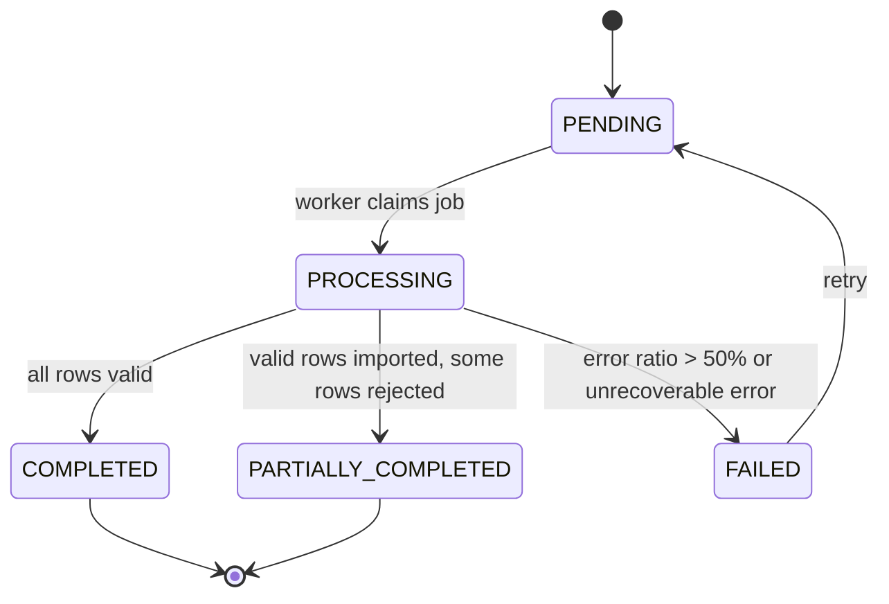

# Service Specification — `csv-ingestion-service`

## 1. Identity

| Item | Value |
|---|---|
| Service name | `csv-ingestion-service` |
| Owner | Hoàng |
| Repository | `tickefy-backend/services/csv-ingestion-service` |
| Internal port | `8090` |
| Public base path | `/api/admin/csv-import` |
| Health check | `/actuator/health` |
| Swagger/OpenAPI | `/swagger-ui/index.html`, `/v3/api-docs` |
| Database schema | `csv_schema` |

## 2. Responsibilities

### Service chịu trách nhiệm

- Nhận file CSV từ Admin Web hoặc phát hiện file mới qua cron.
- Kiểm tra file-level: kích thước, định dạng, header, UTF-8 và quyền sở hữu concert.
- Tạo background job và trả `importJobId` ngay, không xử lý toàn bộ file trong request thread.
- Đọc CSV theo stream, validate theo dòng, ghi staging và xử lý theo batch khoảng 1.000 dòng.
- Ghi nhận dòng lỗi theo cơ chế skip-and-continue; dừng job nếu tỷ lệ lỗi vượt 50%.
- Deduplicate và import idempotent theo `concertId + email`.
- Cung cấp trạng thái, thống kê và error report cho Admin Web.
- Publish kết quả import để Check-in Service cập nhật VIP guest projection.

### Service không chịu trách nhiệm

- Không quản lý concert, organizer, ticket type hoặc tồn kho vé.
- Không thực hiện check-in và không quản lý offline snapshot.
- Không ghi trực tiếp vào schema của Event, Inventory, Order hoặc Check-in.
- Không xử lý CSV đồng bộ trong request upload.
- Không để Check-in query trực tiếp database của service trong luồng soát vé.

## 3. Data ownership

### Tables owned

| Table | Purpose |
|---|---|
| `import_jobs` | Lưu job, nguồn kích hoạt, object key, trạng thái, counters, retry và timestamps. |
| `vip_guest_staging` | Lưu tạm các dòng hợp lệ trước khi kiểm tra threshold và promote. |
| `import_errors` | Lưu `line_number`, dữ liệu gốc đã giới hạn/mask và lý do lỗi. |
| `vip_guests` | Guest list chính thức; unique theo `(concert_id, email)`. |

### Cross-service references

| Field | Source service | Validation strategy |
|---|---|---|
| `concert_id` | `event-service` | Gọi API để kiểm tra concert tồn tại và organizer có quyền quản lý. |
| `organizer_id` | `auth-service` | Lấy từ verified JWT `sub`; đối chiếu với owner của concert. Không tin `organizerId` client tự gửi. |
| `ticket_type_id` | `inventory-service` | Resolve `ticket_type` theo concert và kiểm tra loại vé tồn tại. |

### Invariants

- Không có cross-service foreign key.
- Service khác không query trực tiếp schema này.
- `vip_guests` chỉ chứa dữ liệu đã qua validate và promote từ staging.
- `(concert_id, email)` là unique key và idempotency boundary của guest.
- Job có hơn 50% dòng lỗi không được promote dữ liệu sang `vip_guests`.

## 4. Dependencies

### Synchronous dependencies

| Service | Endpoint | Purpose | Timeout | Retry |
|---|---|---|---:|---|
| `event-service` | `GET /internal/concerts/{concertId}` | Kiểm tra concert và quyền organizer. | 2s | 1 lần với 5xx/timeout |
| `inventory-service` | `GET /internal/concerts/{concertId}/ticket-types` | Resolve và validate `ticket_type`. | 2s | 1 lần với 5xx/timeout |

### Infrastructure dependencies

| Dependency | Purpose |
|---|---|
| PostgreSQL | Lưu job, staging, error report và VIP guests trong `csv_schema`. |
| Redis | Không bắt buộc trong MVP. |
| RabbitMQ | Publish kết quả import; có thể dùng work queue thay `@Async` ở phiên bản sau. |
| Object Storage | Lưu CSV gốc và file error report; local dùng MinIO. |
| Scheduler | Quét object storage theo cron vào khung giờ thấp điểm. |

## 5. Public APIs

| Method | Path | Role | Description | Contract |
|---|---|---|---|---|
| `POST` | `/api/admin/csv-import` | `ORGANIZER`, `ADMIN` | Upload CSV và tạo job; trả `202` với `importJobId`. | `multipart/form-data`: `file`, `concertId` |
| `GET` | `/api/admin/csv-import/{importJobId}` | `ORGANIZER`, `ADMIN` | Lấy status, summary và error rows của job. | `CsvImportStatusResponse` |
| `POST` | `/api/admin/csv-import/{importJobId}/retry` | `ORGANIZER`, `ADMIN` | Retry job `FAILED`; giữ nguyên idempotency rules. | `CsvImportRetryResponse` |

Mọi response tuân theo envelope chung: `success`, `data`, `error`, `requestId`, `timestamp`.

## 6. Internal APIs

| Method | Path | Caller | Description | Contract |
|---|---|---|---|---|
| `GET` | `/internal/concerts/{concertId}/vip-guests` | `checkin-service` | Bootstrap hoặc rebuild VIP projection; không dùng cho từng lần scan. | Paginated `VipGuestProjectionItem` |

## 7. Events published

| Event | Routing key | When | Consumers | Contract |
|---|---|---|---|---|
| `VipGuestImportCompleted` | `vip-guest-import.completed` | Job chuyển sang `COMPLETED` hoặc `PARTIALLY_COMPLETED`. | `checkin-service` | `../common/event-envelope.md` §14.8 |
| `VipGuestImportFailed` | `vip-guest-import.failed` | Job chuyển sang `FAILED`. | Monitoring/Admin integration | `../common/event-envelope.md` §14.9 |

Event dùng exchange `tickefy.events` và common envelope gồm `messageId`, `eventType`, `eventVersion`, `source`, `occurredAt`, `correlationId`, `causationId` và `payload`. Payload dùng `importJobId` làm định danh import job. Khi publish lại cùng job, service phải dùng lại `messageId` đã lưu.

## 8. Events consumed

| Event | Producer | Queue | Behavior | Idempotency key |
|---|---|---|---|---|
| — | — | — | MVP không consume business event. Cron và Admin upload là hai trigger tạo job. | — |

## 9. State machines

### Transition table

| Current | Action/Event | Next | Side effects |
|---|---|---|---|
| — | Upload hoặc cron phát hiện file hợp lệ | `PENDING` | Lưu file, tạo `import_jobs`, trả `importJobId`. |
| `PENDING` | Worker claim | `PROCESSING` | Ghi `started_at`, tăng attempt, bắt đầu streaming. |
| `PROCESSING` | Không có dòng lỗi | `COMPLETED` | Promote dữ liệu, cập nhật counters, publish completed event. |
| `PROCESSING` | Có lỗi nhưng tỷ lệ `<= 50%` | `PARTIALLY_COMPLETED` | Promote dòng hợp lệ, lưu error report, publish completed event. |
| `PROCESSING` | Tỷ lệ lỗi `> 50%` hoặc lỗi không thể phục hồi | `FAILED` | Không promote staging; lưu failure reason, publish failed event. |
| `FAILED` | Retry hợp lệ | `PENDING` | Xóa/reset staging của attempt cũ và chạy lại an toàn. |

## 10. Reliability

### Idempotency

- Unique constraint `(concert_id, email)` và `ON CONFLICT DO NOTHING` ngăn import trùng.
- Duplicate trong cùng file chỉ giữ bản đầu; dòng sau được ghi lỗi `DUPLICATE_ROW`.
- Retry hoặc re-upload không tạo thêm guest đã tồn tại.
- Event publish lại phải giữ nguyên `messageId` của terminal import job event.

### Retry

- Worker retry tối đa 3 lần với exponential backoff cho lỗi tạm thời.
- Không retry lỗi file format, encoding, permission hoặc error threshold.
- RabbitMQ publish dùng publisher confirm; lỗi publish được retry qua outbox/publisher worker.

### Timeout

- Upload chỉ validate file-level và tạo job; mục tiêu trả `202` trong dưới 2 giây.
- Event/Inventory API timeout 2 giây mỗi request.
- Không đặt timeout HTTP theo tổng thời gian xử lý CSV.

### Circuit breaker

- Áp dụng cho `event-service` và `inventory-service` khi dùng Resilience4j.
- Khi circuit mở trước khi tạo job, không tạo job mới và trả `503 SERVICE_UNAVAILABLE` hoặc dependency-specific code nếu catalog đã định nghĩa.
- Job đang chạy chỉ retry dependency failure theo policy, không busy-loop.

### Transaction boundaries

- Tạo `import_jobs` là một transaction sau khi file đã lưu thành công.
- Mỗi chunk staging/error là một transaction ngắn.
- Promote staging sang `vip_guests` và cập nhật terminal status trong một transaction.
- Event được publish sau commit; dùng transactional outbox để tránh mất event.

## 11. Cache

| Key pattern | Data | TTL | Invalidation |
|---|---|---:|---|
| — | Service không cache business data trong MVP. | — | — |

## 12. Security

- Authentication: JWT access token dùng `Authorization: Bearer`; service verify RS256 bằng public key theo Auth Contract. Gateway có thể route request nhưng không phải nguồn tin cậy cho `X-User-*` trong MVP.
- Authorization: chỉ `ORGANIZER` sở hữu concert hoặc `ADMIN` được upload, xem và retry job.
- Sensitive data: tên, email, raw CSV và error report là dữ liệu cá nhân; object storage bucket phải private.
- Logging mask: không log full email, raw CSV row, JWT, object storage secret hoặc signed URL.
- Upload hardening: giới hạn 10 MB, chỉ chấp nhận CSV UTF-8, kiểm tra header trước khi tạo job.

## 13. Environment variables

| Variable | Required | Example | Description |
|---|---|---|---|
| `SERVER_PORT` | Yes | `8090` | Internal service port. |
| `SPRING_PROFILES_ACTIVE` | Yes | `dev` | Runtime profile. |
| `DB_URL` | Yes | `jdbc:postgresql://postgres:5432/tickefy` | PostgreSQL connection URL. |
| `DB_USERNAME` | Yes | `tickefy` | Database user. |
| `DB_PASSWORD` | Yes | `***` | Database password. |
| `DB_SCHEMA` | Yes | `csv_schema` | Owned schema. |
| `EVENT_SERVICE_BASE_URL` | Yes | `http://event-service:8082` | Concert validation endpoint. |
| `INVENTORY_SERVICE_BASE_URL` | Yes | `http://inventory-service:8083` | Ticket type validation endpoint. |
| `RABBITMQ_HOST` | Yes | `rabbitmq` | Broker host. |
| `RABBITMQ_PORT` | Yes | `5672` | Broker port. |
| `RABBITMQ_USERNAME` | Yes | `tickefy` | Broker user. |
| `RABBITMQ_PASSWORD` | Yes | `***` | Broker password. |
| `RABBITMQ_EXCHANGE` | Yes | `tickefy.events` | Topic exchange. |
| `OBJECT_STORAGE_ENDPOINT` | Yes | `http://minio:9000` | S3-compatible endpoint. |
| `OBJECT_STORAGE_BUCKET` | Yes | `tickefy-csv` | Private CSV/error-report bucket. |
| `OBJECT_STORAGE_ACCESS_KEY` | Yes | `minio` | Storage access key. |
| `OBJECT_STORAGE_SECRET_KEY` | Yes | `***` | Storage secret key. |
| `CSV_MAX_FILE_SIZE_MB` | Yes | `10` | Upload limit. |
| `CSV_BATCH_SIZE` | Yes | `1000` | Rows processed per DB batch. |
| `CSV_ERROR_THRESHOLD` | Yes | `0.5` | Fail job when error ratio is greater than this value. |
| `CSV_IMPORT_CRON` | Yes | `0 0 1 * * *` | Nightly object storage scan. |
| `CSV_WORKER_MAX_RETRIES` | Yes | `3` | Maximum worker attempts. |

## 14. Observability

- Logs: structured JSON với `requestId`, `importJobId`, `concertId`, `organizerId`, `status`, counters, attempt và duration; không log raw PII.
- Metrics: jobs theo status, processing duration, rows/second, error ratio, duplicate count, retry count, event publish failures và stuck jobs.
- Traces: trace upload, Event/Inventory calls, Object Storage, database chunks và RabbitMQ publish.
- Alerts: job `PROCESSING` quá lease timeout, tỷ lệ `FAILED` tăng, publish event thất bại, DB pool saturation hoặc cron không chạy.

## 15. Failure scenarios

| Scenario | Expected behavior | Error/event |
|---|---|---|
| File lớn hơn 10 MB | Từ chối ngay, không tạo job. | `413 FILE_TOO_LARGE` |
| Sai extension/header/encoding | Từ chối ngay, không tạo job. | `400 INVALID_FILE_FORMAT` / `INVALID_ENCODING` |
| Concert không tồn tại | Không tạo job. | `404 CONCERT_NOT_FOUND` |
| Organizer không sở hữu concert | Không tạo job. | `403 FORBIDDEN` |
| Dòng thiếu field, email sai hoặc ticket type không tồn tại | Skip row, ghi `import_errors`, tiếp tục. | Job có thể `PARTIALLY_COMPLETED` |
| Tỷ lệ lỗi lớn hơn 50% | Dừng promote và đánh dấu thất bại. | `VipGuestImportFailed` |
| Dòng trùng hoặc re-upload | Không tạo guest mới; cập nhật duplicate/skipped counter. | Không lỗi toàn job |
| Worker crash | Recovery job reclaim sau lease timeout và retry idempotent. | Alert nếu vượt retry limit |
| Event/Inventory tạm unavailable | Retry có giới hạn; sau đó fail request/job tùy thời điểm. | `503 SERVICE_UNAVAILABLE` hoặc `FAILED` |
| Object Storage unavailable | Không tạo job nếu upload chưa lưu được; job cron retry ở lần quét sau. | `503 OBJECT_STORAGE_UNAVAILABLE` |
| RabbitMQ unavailable sau DB commit | Giữ outbox record và retry publish; dữ liệu import không rollback. | Alert `EVENT_PUBLISH_FAILED` |

## 16. Integration acceptance criteria

- [ ] Health check pass.
- [ ] Swagger/OpenAPI available.
- [ ] API contract tests pass.
- [ ] Event contract tests pass.
- [ ] Duplicate message does not duplicate data.
- [ ] Docker image builds.
- [ ] `.env.example` complete.
- [ ] Gateway route configured.
- [ ] Queue/binding/DLQ configured.
- [ ] Integration test with dependencies passes.
- [ ] Upload file hợp lệ trả `202` và `importJobId` trong dưới 2 giây.
- [ ] Streaming import không nạp toàn bộ file vào memory; batch size cấu hình được.
- [ ] Dòng lỗi không chặn dòng hợp lệ; error report có `lineNumber`, `rawData`, `reason`.
- [ ] Tỷ lệ lỗi lớn hơn 50% làm job `FAILED` và không promote staging.
- [ ] Re-upload cùng file không tạo duplicate guest.
- [ ] Check-in nhận `VipGuestImportCompleted` và cập nhật projection idempotent.
- [ ] Import file lớn không làm vượt ngưỡng latency của purchase flow do team thống nhất.

## 17. Open questions

- Chốt service port trong Docker Compose; spec đang dùng mặc định `8090`.
- Chốt retention của CSV gốc, staging rows và import error report.
- Chốt policy vận hành cho cron import: naming convention object key, reprocess thủ công và retention failed attempts.
