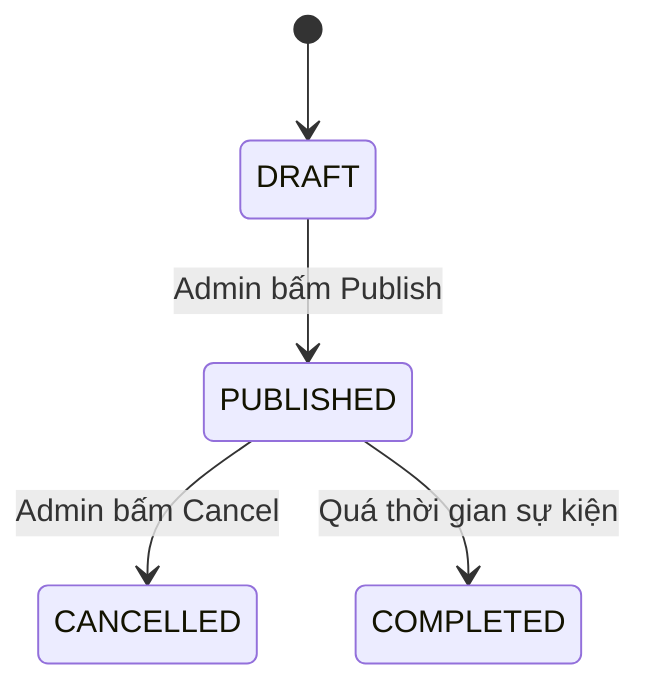

# Service Specification — `event-service`

## 1. Identity

| Item | Value |
|---|---|
| Service name | event-service |
| Owner | Dương |
| Repository | tickefy-backend/services/event-service |
| Internal port | 8082 (host) → 8080 (container) |
| Public base path | `/api/concerts` |
| Health check | `/actuator/health` |
| Swagger/OpenAPI | `/swagger-ui.html` |
| Database schema | `event_service` |

## 2. Responsibilities

### Service chịu trách nhiệm

- Quản lý vòng đời của Sự kiện (Concert): Tạo nháp (DRAFT), phát hành (PUBLISHED), và hủy (CANCELLED).
- Quản lý thông tin metadata của Sự kiện: Nghệ sĩ (Artists), Địa điểm (Venues), và khu vực hiển thị trên sơ đồ chỗ ngồi (Zones).
- Sở hữu dữ liệu public `concertIntroduction` hiển thị trên trang chi tiết concert.
- Cung cấp internal AI context API để service khác kiểm tra concert, owner và trạng thái.
- Consume kết quả `ConcertIntroductionGenerated` từ `ai-bio-service` và cập nhật introduction idempotent.
- Lưu trữ URL của sơ đồ ghế ngồi (Seat Map SVG) thông qua cơ chế cấp Pre-signed URL.
- Xử lý lưu lượng truy cập đọc lớn (Read-heavy) từ phía khán giả thông qua hệ thống Caching đa tầng (Two-Tier).

### Service không chịu trách nhiệm

- Không quản lý tồn kho vé, số lượng vé còn lại, hay chống over-selling (Thuộc về `inventory-service`).
- Không sở hữu ticket type bán được, giá, sale window hoặc per-user limit; các dữ liệu này thuộc `inventory-service`.
- Không xử lý thanh toán (Thuộc về `payment-service`).
- Không sinh mã vé QR hay quản lý vé đã xuất (Thuộc về `ticket-service` / `checkin-service`).
- Không trực tiếp xử lý upload file nhị phân (Chỉ cấp Pre-signed URL cho FE tự đẩy lên S3).
- Không gọi AI Provider và không xử lý PDF source document; phần đó thuộc `ai-bio-service`.

## 3. Data ownership

### Tables owned

| Table | Purpose |
|---|---|
| `concerts` | Dữ liệu gốc về sự kiện (Title, thời gian diễn ra, trạng thái, owner, `concert_introduction`). |
| `artists` | Thông tin nghệ sĩ (tên, mô tả/tiểu sử do Organizer/Admin quản lý nếu có). |
| `venues` | Địa điểm tổ chức (Sân vận động, sức chứa). |
| `concert_zones` | Khu vực hiển thị trên sơ đồ/venue layout. Không phải ticket type bán vé và không quyết định giá/tồn kho. |
| `outbox_events` | Bảng Outbox phục vụ Transactional Outbox Pattern khi publish sự kiện. |
| `processed_messages` | Dedup integration event đã consume theo `messageId`. |

### Cross-service references

| Field | Source service | Validation strategy |
|---|---|---|
| `created_by` | `auth-service` | Chứa UserId của Admin/Organizer từ JWT Token. Không dùng Foreign Key. |
| `concert_introduction_source_job_id` | `ai-bio-service` | Lấy từ `ConcertIntroductionGenerated.payload.jobId`; chỉ dùng để audit/idempotency, không FK. |

### Invariants

- Không có cross-service foreign key.
- Service khác không query trực tiếp schema này (PostgreSQL của Event Service là đóng kín).

## 4. Dependencies

### Synchronous dependencies

*Event Service là nguồn dữ liệu gốc (Single Source of Truth), hầu như không gọi đồng bộ (Synchronous) sang service khác để phục vụ luồng chính.*

| Service | Endpoint | Purpose | Timeout | Retry |
|---|---|---|---:|---|
| None | N/A | Không phụ thuộc đồng bộ vào API khác. | N/A | N/A |

### Infrastructure dependencies

| Dependency | Purpose |
|---|---|
| PostgreSQL | Source of Truth lưu trữ cấu trúc Sự kiện. |
| Redis | Two-Tier Caching (L2) cho dữ liệu Read-Heavy, và Distributed Lock (Mutex Lock) chống Stampede. |
| RabbitMQ | Message Broker để gửi đi thông báo (`ConcertPublished`, `ConcertCancelled`). |
| Object Storage (S3/MinIO) | Lưu trữ file sơ đồ ghế SVG. (Event Service chỉ gọi SDK để sinh Pre-signed URL, FE Admin sẽ gửi thẳng file lên S3). |

## 5. Public APIs (Gateway Exposes)

| Method | Path | Role | Description | Contract |
|---|---|---|---|---|
| GET | `/api/concerts` | PUBLIC | Lấy danh sách concert (Có phân trang, phục vụ trang chủ). Caching 2 tầng. | `event-contract.md` |
| GET | `/api/concerts/{concertId}` | PUBLIC | Chi tiết concert metadata, venue/zone layout và `concertIntroduction`. Không trả ticket type/availability chính thức. | `event-contract.md` |
| POST | `/api/admin/concerts` | ADMIN/ORGANIZER | Tạo mới sự kiện (Trạng thái DRAFT). | |
| PUT | `/api/admin/concerts/{concertId}` | ADMIN/ORGANIZER | Chỉnh sửa metadata sự kiện. | |
| POST | `/api/admin/concerts/{concertId}/publish`| ADMIN/ORGANIZER | Chuyển trạng thái sang PUBLISHED. | `event-contract.md` |
| POST | `/api/admin/concerts/{concertId}/cancel` | ADMIN/ORGANIZER | Chuyển trạng thái sang CANCELLED. | `event-contract.md` |
| GET | `/api/admin/concerts/upload-url` | ADMIN/ORGANIZER | Cấp Pre-signed URL cho FE đẩy file SVG lên S3. | Trả về chuỗi URL. |

## 6. Internal APIs (Service-to-Service, Không qua Gateway)

| Method | Path | Caller | Description | Contract |
|---|---|---|---|---|
| GET | `/internal/concerts/{concertId}` | `inventory-service`, `csv-ingestion-service` | Lấy thông tin Concert + kiểm tra trạng thái/owner. (Kèm Bearer Token). | Internal concert summary DTO. |
| GET | `/internal/concerts/{concertId}/ai-context` | `ai-bio-service` | Kiểm tra concert tồn tại, lấy tên concert, organizer owner và trạng thái cho AI Bio job. | `AiConcertContextResponse`. |

`InternalConcertSummaryResponse` tối thiểu:

```json
{
  "concertId": "concert-uuid",
  "concertName": "Tickefy Live",
  "organizerId": "organizer-user-uuid",
  "status": "PUBLISHED",
  "startsAt": "2026-06-16T12:00:00Z",
  "endsAt": "2026-06-16T15:00:00Z",
  "isPublished": true,
  "isCancelled": false
}
```

`AiConcertContextResponse` tối thiểu:

```json
{
  "concertId": "concert-uuid",
  "concertName": "Tickefy Live",
  "organizerId": "organizer-user-uuid",
  "status": "DRAFT",
  "currentIntroductionUpdatedAt": "2026-06-16T10:00:00Z",
  "manualIntroductionUpdatedAt": null
}
```

## 7. Events published

*Lưu ý: Publish thông qua Outbox Pattern.*

| Event | Routing key | When | Consumers (queue) | Contract |
|---|---|---|---|---|
| `ConcertPublished` | `concert.published` | Khi Admin gọi API publish. | `inventory-service` (`inventory.concert-published`) | Payload: `{concertId, organizerId, publishedAt, startsAt, endsAt}` — theo `../common/event-envelope.md` §14.4 |
| `ConcertCancelled` | `concert.cancelled` | Khi Admin gọi API cancel. | `order-service` (`order.concert-cancelled`), `inventory-service` (`inventory.concert-cancelled`), `ticket-service` (`ticket.concert-cancelled`), `notification-service` (`notification.concert-cancelled`) | Payload: `{concertId, cancelledAt, reason}` — theo `../common/event-envelope.md` §14.5 |

## 8. Events consumed

| Event | Producer | Queue | Behavior | Idempotency key |
|---|---|---|---|---|
| `ConcertIntroductionGenerated` | `ai-bio-service` | `event.concert-introduction-generated` | Cập nhật `concert_introduction` của concert nếu không bị manual update mới hơn. | `messageId`, `jobId`, `concertId` |

## 9. State machines



### Transition table

| Current | Action/Event | Next | Side effects |
|---|---|---|---|
| DRAFT | Admin Publish | PUBLISHED | Lưu DB + Ghi `ConcertPublished` vào bảng Outbox. |
| PUBLISHED | Admin Cancel | CANCELLED | Lưu DB + Ghi `ConcertCancelled` vào bảng Outbox. |

## 10. Reliability

### Idempotency
- Consuming `ConcertIntroductionGenerated` deduplicate theo `messageId`.
- Payload phải có `jobId`, `concertId`, `introduction`, `requestedAt`, `generatedAt`.
- Nếu `manualIntroductionUpdatedAt` mới hơn `payload.requestedAt`, service ACK message nhưng không ghi đè manual introduction.
- Duplicate cùng `jobId` hoặc `messageId` không cập nhật lại dữ liệu hoặc invalidate cache lần hai.

### Retry & Transaction boundaries
- **Transactional Outbox Pattern**: Hành động đổi status sự kiện và việc xuất message MQ được gộp chung trong 1 Database Transaction (Cập nhật bảng `concerts` + Insert `outbox_events`). Một worker `@Scheduled` (Drainer) sẽ quét outbox định kỳ và publish lên RabbitMQ, sau đó mark sent. Điều này đảm bảo Eventual Consistency.

## 11. Cache

*Áp dụng chuẩn `caching.md`.*

| Key pattern | Data | TTL | Invalidation |
|---|---|---:|---|
| `cache:concerts:list` | Danh sách concert | 1h + Jitter | Xóa chủ động (Evict L2) + Bắn Redis Pub/Sub xóa L1 khi có thay đổi. |
| `cache:concerts:{concertId}` | Chi tiết Concert | 24h + Jitter | Evict chủ động khi update, publish/cancel hoặc apply `ConcertIntroductionGenerated`. |
| `cache:concerts:{concertId}:null` | Kết quả rỗng (Chống Penetration) | 30s - 60s | Tự hết hạn (Auto-expire). |

- **Bloom Filter:** [Nice-to-have] Tạm thời defer, ưu tiên dùng Cache Null để chống Penetration.
- **Mutex Lock:** Dùng Redisson lock 2s khi Cache Miss để chặn Cache Stampede.

## 12. Security

- Authentication: JWT access token dùng `Authorization: Bearer`; Gateway verify cơ bản khi request đi qua Gateway, sau đó forward nguyên `Authorization`; `event-service` vẫn verify lại RS256 bằng public key theo Auth Contract. Không dùng `X-User-*` làm nguồn xác thực/phân quyền duy nhất.
- Authorization: Các endpoint `/api/admin/*` yêu cầu quyền `ORGANIZER` hoặc `ADMIN`.
- Logging mask: Không yêu cầu che giấu dữ liệu sự kiện vì bản chất là Public. Tránh log JWT Token.

## 13. Environment variables

| Variable | Required | Example | Description |
|---|---|---|---|
| `POSTGRES_URL` | Yes | `jdbc:postgresql://db:5432/event` | DB Connection |
| `REDIS_URL` | Yes | `redis://redis:6379` | Cache connection |
| `S3_BUCKET_NAME` | Yes | `tickefy-media` | Bucket cấp Pre-signed URL |
| `AWS_ACCESS_KEY` | Yes | `...` | MinIO/S3 Creds cho SDK |

## 14. Observability
- Logs: Gom log ELK. Focus vào các action thay đổi trạng thái (Publish/Cancel).
- Metrics: Đếm tỷ lệ Cache Hit/Miss cho endpoint GET Concerts.
- Alerts: Cảnh báo nếu Outbox Worker fail nhiều lần liên tục hoặc Outbox queue tồn đọng > 100 records.

## 15. Failure scenarios

| Scenario | Expected behavior | Error/event |
|---|---|---|
| RabbitMQ down lúc Publish | Trả về 200 OK cho Admin bình thường. Sự kiện nằm an toàn ở bảng `outbox_events`. | Drainer tự động gửi bù khi MQ phục hồi. (Eventual Consistency). Không Fail-fast. |
| Redis down | Circuit Breaker mở. Dữ liệu tĩnh sẽ đọc tạm từ L1 (Caffeine). Fallback chặn query dội thẳng vào DB. | HTTP 503 nếu quá tải L1 Miss. |
| Concert không tồn tại | API error | `404 CONCERT_NOT_FOUND` hoặc `RESOURCE_NOT_FOUND` theo endpoint |
| Organizer không sở hữu concert | API error | `403 CONCERT_ACCESS_DENIED` hoặc `FORBIDDEN` theo endpoint |
| S3 / MinIO down | API cấp Pre-signed URL trả về lỗi. Admin không upload được hình SVG. | `503 OBJECT_STORAGE_UNAVAILABLE` |
| Duplicate `ConcertIntroductionGenerated` | ACK sau dedup, không cập nhật introduction lần hai. | metric duplicate event |
| AI introduction cũ hơn manual edit | ACK message nhưng không ghi đè `concert_introduction`. | log `AI_INTRO_SKIPPED_MANUAL_NEWER` |
| Unsupported event version | Reject/DLQ và alert owner. | contract error log |

## 16. Integration acceptance criteria
- [ ] Swagger Docs đầy đủ.
- [ ] Tạo được Concert + Chuyển trạng thái sang PUBLISHED thành công.
- [ ] `GET /internal/concerts/{concertId}` trả đúng owner/status cho `csv-ingestion-service` và `inventory-service`.
- [ ] Outbox table ghi nhận bản ghi khi Publish, và Worker quét thành công.
- [ ] Gọi API nhận được Pre-signed URL hợp lệ, FE PUT thẳng lên S3 thành công.
- [ ] Cache Hit/Miss hoạt động đúng với Mutex Lock.
- [ ] `GET /internal/concerts/{concertId}/ai-context` trả đúng owner/status cho `ai-bio-service`.
- [ ] Consume `ConcertIntroductionGenerated` idempotent theo `messageId`.
- [ ] AI introduction không ghi đè manual introduction mới hơn `requestedAt`.
- [ ] Apply AI introduction invalidate `cache:concerts:{concertId}`.

## 17. Open questions
- Frontend Web (Hiệp) xác nhận sẽ handle luồng upload 3 bước (Xin URL -> PUT S3 -> Submit Backend) cho admin chưa?
- Chốt public composition cho concert detail + ticket types: FE gọi Event và Inventory riêng hay Gateway/BFF aggregate sau MVP.
