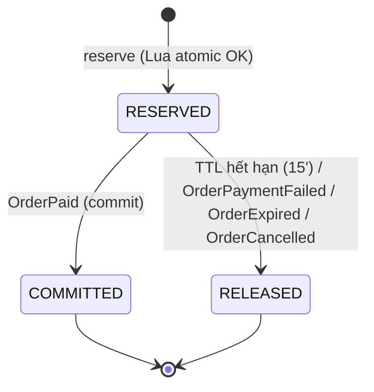

# Service Specification — `inventory-service`

> Nhãn: ✅ khớp implement (session) · 🔭 PLANNED/Pass 2 (chưa code, cố ý) · ⚠️ VERIFY (tái dựng — Claude Code đối chiếu repo).
> ✅ Trạng thái build (Pass 2 wired + verified compose dev, branch `feature/pass2-async`): **LIVE (P1)** = ticket-type CRUD + availability + **reserve** (Lua atomic). **✅ Pass 2 wired+verified** = consume `order.paid` (commit) / `order.payment.failed` + `order.expired` (release) + DLQ + idempotent status-guard. **🔭 còn:** `order.cancelled` (cancel endpoint chưa có) + consume Concert* (chờ Event) + TTL release worker nội bộ (release hiện qua event order.*, KHÔNG sweeper).

## 1. Identity
| Item | Value |
|---|---|
| Service name | inventory-service |
| Owner | Hiệp |
| Repository | tickefy-backend → `services/inventory-service` ✅ |
| Internal port | 8088 (host) → 8080 (container) |
| Public base path | `/api/inventory` |
| Health check | `/actuator/health` ✅ + `/health` |
| Swagger/OpenAPI | springdoc `/swagger-ui.html` ✅ (dep trong pom) |
| Database name / schema | DB `tickefy_inventory` · schema `inventory_service` (`${DB_SCHEMA}`) ✅ |

## 2. Responsibilities
### Chịu trách nhiệm
- Quản lý ticket type (giá, total, sale window, per-user limit). **Per-user limit thuộc Inventory** (quyết định đã khoá — KHÔNG phải Order).
- Theo dõi available / reserved / sold.
- **Reserve** vé atomic (Redis+Lua: check stock + check per-user limit + trừ cả hai trong 1 thao tác) — chống over-sell + lách limit dưới tải cao.
- **Commit** (thanh toán xong) / **Release** (timeout/fail) reservation.
- Đọc số vé còn (availability) từ Redis.
- Ngừng bán khẩn cấp khi `ConcertCancelled` (🔭 chờ Event).

### KHÔNG chịu trách nhiệm
- Concert metadata + seat-map (Event/Dương — chỉ tham chiếu `concertId`).
- Payment, order lifecycle.
- **Điều phối refund/hủy order** khi ConcertCancelled — **Order điều phối** (cách B); Inventory chỉ ngừng bán + release theo lệnh Order.
- **Publish event** — Inventory KHÔNG publish (phản hồi HTTP đồng bộ cho Order).

## 3. Data ownership
### Tables owned ✅ (`V2__inventory_schema.sql`)
| Table | Purpose |
|---|---|
| `ticket_types` | name (SVIP/VIP/CAT1/CAT2/GA), price, total_quantity, per_user_limit, sale_start_at, sale_end_at, concert_id |
| `ticket_type_inventory` | available / reserved / sold counts |
| `ticket_reservations` | status (RESERVED/COMMITTED/RELEASED), qty, user_id, expires_at |

### Cross-service references
| Field | Source service | Validation strategy |
|---|---|---|
| `concertId` | `event-service` | UUID v4, validate qua Event API. Ticket type setup allowed while concert is `DRAFT`; reservation allowed only when concert is `PUBLISHED` and not `CANCELLED`. |
| `ticketTypeId` | `inventory-service` | Inventory owns and generates ticket type IDs. Can reference Event `concertId`, but does not reuse `concert_zones.id` as PK. |
| `userId` | auth | Từ JWT claim, không FK |

### Invariants
- Không cross-service FK. `available` không bao giờ < 0 (Lua atomic). Per-user limit không bị vượt dù song song. **RESERVED + COMMITTED đều tính là "đã sở hữu"** cho per-user check.

## 4. Dependencies
### Synchronous dependencies
| Service | Endpoint | Purpose | Timeout | Retry |
|---|---|---|---:|---|
| `event-service` | `GET /internal/concerts/{concertId}` | Validate concert existence, owner and status for ticket type setup/reservation gate | 2s | 🔭 Event chưa build → chưa gọi thật |

### Infrastructure dependencies
| Dependency | Purpose |
|---|---|
| PostgreSQL | **Source of truth** (ticket_types, inventory counts, reservations) |
| Redis | Cổng atomic Lua (stock + per-user quota) + cache availability |
| RabbitMQ | ✅ Consume order.paid/order.payment.failed/order.expired (wired + DLQ, verified). 🔭 order.cancelled + Concert* chờ wire |
| Object Storage | (none) |

## 5. Public APIs
| Method | Path | Role | Description | Contract |
|---|---|---|---|---|
| POST | `/api/inventory/concerts/{concertId}/ticket-types` | ORGANIZER/ADMIN | Tạo ticket type + khởi tạo inventory + seed Redis. Cho phép khi concert `DRAFT` hoặc `PUBLISHED`, không cho `CANCELLED`. | inventory.md target |
| GET | `/api/inventory/concerts/{concertId}/ticket-types` | public/auth | Danh sách ticket type do Inventory sở hữu | target |
| GET | `/api/inventory/concerts/{concertId}/ticket-types/{ticketTypeId}/availability` | public | Số vé còn (đọc Redis) | target |

Backward compatibility note: implementation hiện có thể còn expose `/events/{concertId}/ticket-types/**`; route này là legacy/alias thuộc Inventory, không phải Event-owned contract mới.

## 6. Internal APIs (gọi từ Order, service-to-service Bearer)
| Method | Path | Caller | Description | Contract |
|---|---|---|---|---|
| POST | `/internal/inventory/reservations` | Order | Reserve atomic (Lua) → reservation snapshot including `reservationId`, `expiresAt`, items with `ticketTypeId`, `ticketTypeName`, `quantity`, `unitPrice` | ✅ **LIVE** (saga reserve sync; response should be extended if implementation lacks item snapshot) — ⚠️ impl hiện tại dùng `/inventory/reservations`, cần migrate sang `/internal/` |
| GET | `/internal/inventory/users/{userId}/purchase-limits` | Order/Admin | Quota còn lại | ✅ (`PurchaseLimitController.java:17,26`) — ⚠️ impl hiện tại dùng `/inventory/users/...`, cần migrate |
| GET | `/internal/concerts/{concertId}/ticket-types` | `csv-ingestion-service` | Resolve ticket types for CSV VIP import by concert. Returns id/name/status fields needed for row validation. | 🔭 Planned internal alias over ticket-type catalog |

> **Commit / Release: KHÔNG có HTTP endpoint** (cách B — event-only). Inventory commit (RESERVED→COMMITTED) / release qua **consume event** `OrderPaid`/`OrderPaymentFailed`/`OrderExpired`/`OrderCancelled` (Pass 2, xem §8), KHÔNG expose `/commit`/`/release` HTTP.

## 7. Events published
| Event | Routing key | When | Consumers | Contract |
|---|---|---|---|---|
| (none) | — | — | — | Inventory KHÔNG publish — phản hồi HTTP đồng bộ ✅ |

## 8. Events consumed — ✅ order.* WIRED (Pass 2 verified). Kênh DUY NHẤT để commit/release (KHÔNG HTTP — §6)
| Event | Producer | Queue | Behavior | Idempotency key |
|---|---|---|---|---|
| `OrderPaid` | `order-service` | `inventory.order-paid` | RESERVED→COMMITTED, sold+=qty, reserved-=qty | `messageId`, `reservationId` — ✅ verified (status-guard ×3) |
| `OrderPaymentFailed` | `order-service` | `inventory.order-payment-failed` | Release reservation | `messageId`, `reservationId` — ✅ verified |
| `OrderExpired` | `order-service` | `inventory.order-expired` | Release reservation | `messageId`, `reservationId` — ✅ verified |
| `OrderCancelled` | `order-service` | `inventory.order-cancelled` | Release reservation when order is cancelled before payment point-of-no-return | `messageId`, `reservationId` — 🔭 Pass 2 (cancel endpoint chưa có) |
| `ConcertPublished` | `event-service` | `inventory.concert-published` | Chuẩn bị counter/cache cho concert đã publish; payload chỉ cần `concertId` + timestamps, ticket types vẫn thuộc Inventory | `messageId`, `concertId` — 🔭 chờ Event |
| `ConcertCancelled` | `event-service` | `inventory.concert-cancelled` | **Ngừng bán khẩn cấp** (khóa tạo reservation mới); release đơn cũ do Order điều phối | `messageId`, `concertId` — 🔭 chờ Event |
> ✅ **DLQ + `setDefaultRequeueRejected(false)`** đã thêm cho 3 queue order.* (poison→DLQ verified). order.cancelled/Concert* khi wire nhớ DLQ. Routing key/queue theo api-contracts §5.

## 9. State machines — reservation

| Current | Action/Event | Next | Side effects |
|---|---|---|---|
| (none) | reserve OK | RESERVED | Redis: DECRBY stock, INCRBY user quota; PG: insert reservation, reserved_count+=qty, expires_at=now+15' |
| RESERVED | OrderPaid | COMMITTED | sold_count+=qty, reserved_count-=qty (idempotent nếu đã COMMITTED) — ✅ verified |
| RESERVED | payment-failed / expired (event order.*) | RELEASED | Redis: INCRBY stock, DECRBY quota; PG: reserved_count-=qty — ✅ verified (release qua **event order.***; cancelled 🔭). **TTL worker nội bộ vẫn 🔭** (KHÔNG sweeper) |

## 10. Reliability
### Idempotency
- ✅ Commit idempotent: reservation đã COMMITTED → bỏ qua (không trừ 2 lần). Release idempotent (đã RELEASED → skip; đã COMMITTED → KHÔNG release). Status-guard trong `ReservationLifecycleService` — **verified**. 🔭 hardening: chưa có `processed_messages(messageId)` (xem §17).
### Retry / Timeout / Circuit breaker
- Reserve Lua ~microsecond. Không CB (validate Event 🔭).
### Transaction boundaries
- Reserve: Lua atomic Redis + ghi reservation PG. Commit/Release: PG transaction + cập nhật Redis.
### Reconciliation / Durability
- Redis AOF (mất ≤1s khi crash). 🔭 Reconcile job `available = total - sold - active_reservations` (PG) — **chưa code** (no `@Scheduled`). Hiện chỉ M3 seed-if-missing rebuild stock key từ PG khi key vắng.
- ✅ Redis down → fallback Conditional UPDATE PG (`incrementReservedConditional`: `SET reserved=reserved+qty WHERE sold+reserved+qty<=total`) — `ReservationPersistence.writeReservationFallback` + `TicketTypeInventoryRepository.incrementReservedConditional`.

## 11. Cache (Redis) ✅ (`InventoryRedisService.java:29,32,35`)
| Key pattern | Data | TTL | Invalidation |
|---|---|---:|---|
| `tickefy:inventory:available:{ttId}` | Số vé còn (counter) | none (source counter) | reserve/commit/release cập nhật trực tiếp |
| `tickefy:inventory:meta:{ttId}` | meta (perUserLimit, price, sale window) | none | seed lúc tạo ticket type / M3 rebuild |
| `tickefy:inventory:user-limit:{userId}:{ttId}` | Quota đã sở hữu/user | none | reserve +, release − |
> Availability đọc **THẲNG counter** (`resolveAvailable` → seed-if-missing + GET, fallback PG; `TicketTypeService.java:103-126`) — **KHÔNG có lớp cache TTL riêng, KHÔNG có mutex/stampede lock** (claim cũ bỏ).

## 12. Security
- **Authentication:** JWT verify-only (public key auth). Reservation endpoint = internal, Order gọi kèm `Authorization: Bearer` (service-to-service); commit/release đi qua Order events từ RabbitMQ.
- **Authorization:** tạo ticket type = ORGANIZER/ADMIN (`@PreAuthorize`); availability = public; reservations = internal (Order).
- **Sensitive data:** không có dữ liệu nhạy đặc biệt.
- **Logging mask:** requestId; không secret.

## 13. Environment variables ✅ (theo `application.yml`)
| Variable | Required | Example | Description |
|---|---|---|---|
| `SPRING_PROFILES_ACTIVE` | ✅ | `docker` | Profile |
| `DB_HOST`/`DB_PORT`/`DB_NAME`/`DB_USERNAME`/`DB_PASSWORD` | ✅ | postgres / `tickefy_inventory` | DB inventory (`application.yml:7-9`) |
| `DB_SCHEMA` | ✅ | `inventory_service` | Schema |
| `REDIS_HOST`/`REDIS_PORT` | ✅ | redis / 6379 | Lua counters + availability (`application.yml:28-29`) |
| `VALIDATE_CONCERT` | optional | `false` (default) | Bật validate concertId qua Event (`application.yml:60`) — hiện skip |
| `RABBITMQ_HOST`/`RABBITMQ_PORT`/`RABBITMQ_USERNAME`/`RABBITMQ_PASSWORD` | ✅ | rabbitmq / 5672 | AMQP consume order.* (`application.yml` `spring.rabbitmq.*`) |
| `APP_DEV_SEED_ENABLED` | optional | `true` (chỉ dev) | Bật DevSeedRunner (seed 1 concert + 5 ticket type) |
| reservation TTL config | ⚠️ | `PT15M` | TTL giữ vé |

## 14. Observability
- **Logs:** requestId; reserve result (SUCCESS/SOLD_OUT/LIMIT_EXCEEDED).
- **Metrics:** actuator mặc định ✅; 🔭 custom counter (sold-out / limit-exceeded / reserve) chưa code.
- **Traces:** propagate X-Request-Id.
- **Alerts:** (không formal).

## 15. Failure scenarios
| Scenario | Expected behavior | Error/event |
|---|---|---|
| Hết vé khi reserve | Lua SOLD_OUT → 409 | `TICKET_SOLD_OUT` ✅ |
| Vượt per-user limit | Lua LIMIT_EXCEEDED → 422 (kèm remaining) | `PER_USER_LIMIT_EXCEEDED` ✅ |
| Tạo/sửa ticket type cho concert DRAFT | Cho phép nếu organizer sở hữu concert | ticket type created/updated |
| Reserve cho concert chưa PUBLISHED hoặc đã CANCELLED | 403 | `SALE_WINDOW_CLOSED` hoặc `CONCERT_NOT_AVAILABLE` nếu catalog bổ sung sau |
| Ngoài giờ bán | 403 | `SALE_WINDOW_CLOSED` ✅ |
| Reservation quá 15' chưa thanh toán | Worker release, trả vé + quota | 🔭 `RESERVATION_EXPIRED` (410) — **chưa throw** (TTL worker Pass 2) |
| Payment failed / order expired | Release reservation (consume order.payment.failed / order.expired) | ✅ verified |
| Order cancelled before paid | Release reservation | 🔭 (cancel endpoint chưa có) |
| OrderPaid gửi trùng | Idempotent — đã COMMITTED bỏ qua | ✅ verified (status-guard) |
| Concert không tồn tại khi tạo/sửa ticket type | API error | `CONCERT_NOT_FOUND` |
| Ticket type không tồn tại | API error | `RESOURCE_NOT_FOUND` |
| ConcertCancelled | Ngừng bán khẩn cấp (khóa reservation mới) | 🔭 chờ Event |
| Redis crash | AOF khôi phục; 🔭 reconcile job từ PG chưa code (chỉ M3 seed-if-missing rebuild key) | 🔭 |
| Redis down hoàn toàn | Fallback Conditional UPDATE PG | ✅ (`incrementReservedConditional`) |
| ~~Cache availability stampede~~ | N/A — availability đọc thẳng counter, không cache TTL/mutex | — |

## 16. Integration acceptance criteria
- [ ] Health check pass.
- [x] Swagger available. ✅ (springdoc)
- [ ] API contract tests pass (ticket-type + availability + reserve).
- [x] ✅ Event contract: consume order.paid (commit) / order.payment.failed + order.expired (release) — **verified compose dev**.
- [x] ✅ Idempotent commit (order.paid ×3 → sold +1, status-guard).
- [ ] Over-selling: 10k request / 200 vé → đúng 200, không 201 (AC1 inventory.md).
- [ ] Per-user limit không vượt dù song song (AC2).
- [ ] Docker image builds. · `.env.example` complete.
- [ ] 🔭 Gateway route — gateway chưa build.
- [x] ✅ Queue/binding/**DLQ** configured (3 order.* queue + DLQ, requeue=false, poison→DLQ verified).
- [ ] Integration test Postgres + Redis pass.

## 17. Open questions
- ✅ Redis key (xác nhận): `tickefy:inventory:available:` / `:meta:` / `:user-limit:` (`InventoryRedisService.java:29,32,35`).
- ✅ Commit/release = **event-only** (cách B) — KHÔNG HTTP endpoint (đã chốt: §6/§8).
- ✅ Validate concertId qua Event: **skip** mặc định (`VALIDATE_CONCERT=false`); bật khi Event build.
- ✅ PG fallback đã code; 🔭 reconciliation job chưa code.
- ✅ INV-005 = `RESOURCE_NOT_FOUND` cho ticket type; INV-006 = `CONCERT_NOT_FOUND` cho concert.
- ✅ Pass 2 consume DONE + verified (order.paid commit / order.payment.failed + order.expired release + DLQ + idempotent). 🔭 còn: order.cancelled + Concert* + TTL worker nội bộ.
- ⚠️ **qty>1 undercount (chờ chốt Hòa + Dương):** e-ticket issue **1 vé/item, KHÔNG đọc `quantity`** → order item qty>1 chỉ sinh 1 vé. Hướng (a) **per-seat** (Order publish N item, mỗi vé 1 orderItemId) vs (b) **quantity** (e-ticket loop theo quantity). `zoneId`/`ticketTypeName` nguồn Event (Dương). Hiện verified ở **qty=1**.
- Lock strategy: Redis+Lua (Hiệp) vs Pessimistic Lock (Hòa) — team chốt 1 cơ chế (không để 2 cùng chạy).
- Legacy path `/events/{concertId}/ticket-types/**` cần migrate client sang `/api/inventory/concerts/{concertId}/ticket-types/**`; contract mới không coi endpoint cũ là Event-owned.
