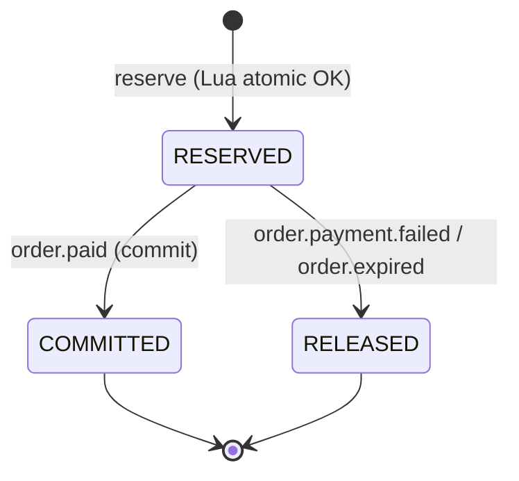

# Service Specification — `inventory-service`

> Nhãn: ✅ khớp implement (session) · 🔭 PLANNED/Pass 2 (chưa code, cố ý) · ⚠️ VERIFY (tái dựng — Claude Code đối chiếu repo).
> ✅ Trạng thái build (Pass 2 wired + verified compose dev, branch `feature/pass2-async`):
> - **LIVE (P1)** = ticket-type CRUD + availability + reserve (Lua atomic).
> - **✅ Pass 2 DONE (verified):** consume `order.paid` → **commit** (RESERVED→COMMITTED, sold+=qty); consume `order.payment.failed`/`order.expired` → **release** (RESERVED→RELEASED, trả stock+quota). DLQ + requeue=false + idempotent status-guard.
> - **🔭 CÒN LẠI:** consume `ConcertPublished`/`ConcertCancelled` (chờ Event/Dương); reconciliation job. *(KHÔNG có TTL worker nội bộ — release do **event `order.expired` từ Order** điều phối, xem §9.)*

## 1. Identity
| Item | Value |
|---|---|
| Service name | inventory-service |
| Owner | Hiệp |
| Repository | tickefy-backend → `services/inventory-service` ✅ |
| Internal port | 8083 (host) → 8080 (container) |
| Public base path | `/api/inventory/**` · ⚠️ ticket-type ở `/events/{concertId}/ticket-types/**` (caveat: nằm dưới `/events/` — trùng namespace Event; đã biết) |
| Health check | `/actuator/health` ✅ + `/health` |
| Swagger/OpenAPI | springdoc `/swagger-ui.html` ✅ (dep trong pom) |
| Database name / schema | DB `tickefy_inventory` · schema `inventory_service` (`${DB_SCHEMA}`) ✅ |

## 2. Responsibilities
### Chịu trách nhiệm
- Quản lý ticket type (giá, total, sale window, per-user limit). **Per-user limit thuộc Inventory** (quyết định đã khoá — KHÔNG phải Order).
- Theo dõi available / reserved / sold.
- **Reserve** vé atomic (Redis+Lua: check stock + check per-user limit + trừ cả hai trong 1 thao tác) — chống over-sell + lách limit dưới tải cao.
- **Commit** (thanh toán xong) / **Release** (timeout/fail) reservation.
- Đọc số vé còn (availability) từ Redis.
- Ngừng bán khẩn cấp khi `ConcertCancelled` (🔭 chờ Event).

### KHÔNG chịu trách nhiệm
- Concert metadata + seat-map (Event/Dương — chỉ tham chiếu `concertId`).
- Payment, order lifecycle.
- **Điều phối refund/hủy order** khi ConcertCancelled — **Order điều phối** (cách B); Inventory chỉ ngừng bán + release theo lệnh Order.
- **Publish event** — Inventory KHÔNG publish (phản hồi HTTP đồng bộ cho Order).

## 3. Data ownership
### Tables owned ✅ (`V2__inventory_schema.sql`)
| Table | Purpose |
|---|---|
| `ticket_types` | name (SVIP/VIP/CAT1/CAT2/GA), price, total_quantity, per_user_limit, sale_start_at, sale_end_at, concert_id |
| `ticket_type_inventory` | available / reserved / sold counts |
| `ticket_reservations` | status (RESERVED/COMMITTED/RELEASED), qty, user_id, expires_at |

### Cross-service references
| Field | Source service | Validation strategy |
|---|---|---|
| `concertId` | Event (Dương) | UUID v4, validate qua Event API (concert tồn tại + PUBLISHED) — ⚠️ Event CHƯA build → hiện validation skip/bỏ qua (🔭 bật khi Event có) |
| `ticketTypeId` | Event (= `concert_zones.id`) | UUID v4 từ Event; Inventory lấy làm PK, KHÔNG tự sinh (chốt với Dương). Dev seed tự đặt id cố định khi chưa có Event |
| `userId` | auth | Từ JWT claim, không FK |

### Invariants
- Không cross-service FK. `available` không bao giờ < 0 (Lua atomic). Per-user limit không bị vượt dù song song. **RESERVED + COMMITTED đều tính là "đã sở hữu"** cho per-user check.

## 4. Dependencies
### Synchronous dependencies
| Service | Endpoint | Purpose | Timeout | Retry |
|---|---|---|---:|---|
| Event (Dương) | GET concert | Validate concertId PUBLISHED khi tạo ticket type | ⚠️ | 🔭 Event chưa build → chưa gọi thật |

### Infrastructure dependencies
| Dependency | Purpose |
|---|---|
| PostgreSQL | **Source of truth** (ticket_types, inventory counts, reservations) |
| Redis | Cổng atomic Lua (stock + per-user quota) + cache availability |
| RabbitMQ | ✅ Consume order.paid/order.payment.failed/order.expired (amqp wired, DLQ, verified). 🔭 Concert* chờ Event |
| Object Storage | (none) |

## 5. Public APIs
| Method | Path | Role | Description | Contract |
|---|---|---|---|---|
| POST | `/events/{concertId}/ticket-types` | ORGANIZER/ADMIN | Tạo ticket type + khởi tạo inventory + seed Redis | inventory.md ✅ |
| GET | `/events/{concertId}/ticket-types` | public/auth | Danh sách ticket type | ✅ (FE 2.19 dùng) |
| GET | `/events/{concertId}/ticket-types/{ttId}/availability` | public | Số vé còn (đọc Redis) | ✅ |

## 6. Internal APIs (gọi từ Order, service-to-service Bearer)
| Method | Path | Caller | Description | Contract |
|---|---|---|---|---|
| POST | `/inventory/reservations` | Order | Reserve atomic (Lua) → `{reservationId,qty,expiresAt}` | ✅ **LIVE** (saga reserve sync) |
| GET | `/inventory/users/{userId}/purchase-limits` | Order/Admin | Quota còn lại | ✅ (`PurchaseLimitController.java:17,26`) |

> **Commit / Release: KHÔNG có HTTP endpoint** (cách B — event-only). Inventory commit (RESERVED→COMMITTED) / release qua **consume event** `OrderPaid`/`OrderPaymentFailed`/`OrderExpired` (Pass 2, xem §8), KHÔNG expose `/commit`/`/release` HTTP.

## 7. Events published
| Event | Routing key | When | Consumers | Contract |
|---|---|---|---|---|
| (none) | — | — | — | Inventory KHÔNG publish — phản hồi HTTP đồng bộ ✅ |

## 8. Events consumed — ✅ order.* WIRED (Pass 2 verified). Kênh DUY NHẤT để commit/release (KHÔNG HTTP — §6)
| Event | Producer | Queue | Behavior | Idempotency key |
|---|---|---|---|---|
| `OrderPaid` (RK `order.paid`) | order | `inventory-service.order-paid.queue` | RESERVED→COMMITTED, sold+=qty, reserved-=qty | ✅ status-guard (đã COMMITTED → skip), verified |
| `OrderPaymentFailed` (RK `order.payment.failed`) | order | `inventory-service.order-payment-failed.queue` | Release: RESERVED→RELEASED, reserved-=qty + Redis stock+quota trả lại | ✅ status-guard, verified |
| `OrderExpired` (RK `order.expired`) | order | `inventory-service.order-expired.queue` | Release (như trên) | ✅ status-guard, verified |
| `ConcertPublished` | event (Dương) | `inventory-service.concert-published.queue` | Chuẩn bị counter | 🔭 chờ Event |
| `ConcertCancelled` | event (Dương) | `inventory-service.concert-cancelled.queue` | **Ngừng bán khẩn cấp** (khóa tạo reservation mới); release đơn cũ do Order điều phối | idempotent theo concertId — 🔭 chờ Event |
> ✅ **DLQ + `setDefaultRequeueRejected(false)`** đã configure cho cả 3 order.* queue (verified: poison→DLQ, không requeue loop). Consume body **FLAT** (khớp order.paid publish — xem §17). order.* deserialize `{messageId,orderId,items[{ticketTypeId,quantity}]}` (bỏ qua field thừa zoneId/ticketTypeName).

## 9. State machines — reservation

| Current | Action/Event | Next | Side effects |
|---|---|---|---|
| (none) | reserve OK | RESERVED | Redis: DECRBY stock, INCRBY user quota; PG: insert reservation, reserved_qty+=qty, expires_at=now+TTL |
| RESERVED | `order.paid` (commit) | COMMITTED | ✅ sold_qty+=qty, reserved_qty-=qty (idempotent đã COMMITTED → skip) — **verified** |
| RESERVED | `order.payment.failed` / `order.expired` (release) | RELEASED | ✅ PG reserved_qty-=qty; Redis stock+=qty, user-quota-=qty (idempotent đã RELEASED → skip) — **verified** |
> ⚠️ **KHÔNG có TTL sweeper nội bộ inventory.** Release vé hết hạn do **Order điều phối**: Order expire worker → publish `order.expired` → inventory consume → release. (Order là chủ vòng đời order; inventory chỉ phản ứng theo event.)

## 10. Reliability
### Idempotency
- ✅ Commit idempotent: reservation đã COMMITTED → bỏ qua (không trừ 2 lần). Release idempotent (đã RELEASED → skip; đã COMMITTED → KHÔNG release). Status-guard trong `ReservationLifecycleService` — **verified**. 🔭 hardening: chưa có `processed_messages(messageId)` (xem §17).
### Retry / Timeout / Circuit breaker
- Reserve Lua ~microsecond. Không CB (validate Event 🔭).
### Transaction boundaries
- Reserve: Lua atomic Redis + ghi reservation PG. Commit/Release: PG transaction + cập nhật Redis.
### Reconciliation / Durability
- Redis AOF (mất ≤1s khi crash). 🔭 Reconcile job `available = total - sold - active_reservations` (PG) — **chưa code** (no `@Scheduled`). Hiện chỉ M3 seed-if-missing rebuild stock key từ PG khi key vắng.
- ✅ Redis down → fallback Conditional UPDATE PG (`incrementReservedConditional`: `SET reserved=reserved+qty WHERE sold+reserved+qty<=total`) — `ReservationPersistence.writeReservationFallback` + `TicketTypeInventoryRepository.incrementReservedConditional`.

## 11. Cache (Redis) ✅ (`InventoryRedisService.java:29,32,35`)
| Key pattern | Data | TTL | Invalidation |
|---|---|---:|---|
| `tickefy:inventory:available:{ttId}` | Số vé còn (counter) | none (source counter) | reserve/commit/release cập nhật trực tiếp |
| `tickefy:inventory:meta:{ttId}` | meta (perUserLimit, price, sale window) | none | seed lúc tạo ticket type / M3 rebuild |
| `tickefy:inventory:user-limit:{userId}:{ttId}` | Quota đã sở hữu/user | none | reserve +, release − |
> Availability đọc **THẲNG counter** (`resolveAvailable` → seed-if-missing + GET, fallback PG; `TicketTypeService.java:103-126`) — **KHÔNG có lớp cache TTL riêng, KHÔNG có mutex/stampede lock** (claim cũ bỏ).

## 12. Security
- **Authentication:** JWT verify-only (public key auth). Reserve/commit/release = internal, Order gọi kèm `Authorization: Bearer` (service-to-service).
- **Authorization:** tạo ticket type = ORGANIZER/ADMIN (`@PreAuthorize`); availability = public; reservations = internal (Order).
- **Sensitive data:** không có dữ liệu nhạy đặc biệt.
- **Logging mask:** requestId; không secret.

## 13. Environment variables ✅ (theo `application.yml`)
| Variable | Required | Example | Description |
|---|---|---|---|
| `SPRING_PROFILES_ACTIVE` | ✅ | `docker` | Profile |
| `DB_HOST`/`DB_PORT`/`DB_NAME`/`DB_USERNAME`/`DB_PASSWORD` | ✅ | postgres / `tickefy_inventory` | DB inventory (`application.yml:7-9`) |
| `DB_SCHEMA` | ✅ | `inventory_service` | Schema |
| `REDIS_HOST`/`REDIS_PORT` | ✅ | redis / 6379 | Lua counters + availability (`application.yml:28-29`) |
| `VALIDATE_CONCERT` | optional | `false` (default) | Bật validate concertId qua Event (`application.yml:60`) — hiện skip |
| `RABBITMQ_HOST`/`RABBITMQ_PORT`/`RABBITMQ_USERNAME`/`RABBITMQ_PASSWORD` | ✅ | rabbitmq / 5672 | AMQP consume order.* (`application.yml` `spring.rabbitmq.*`) |
| `APP_DEV_SEED_ENABLED` | optional | `true` (chỉ dev) | Bật DevSeedRunner (seed 1 concert + 5 ticket type) |
| reservation TTL config | ⚠️ | `PT15M` | TTL giữ vé |

## 14. Observability
- **Logs:** requestId; reserve result (SUCCESS/SOLD_OUT/LIMIT_EXCEEDED).
- **Metrics:** actuator mặc định ✅; 🔭 custom counter (sold-out / limit-exceeded / reserve) chưa code.
- **Traces:** propagate X-Request-Id.
- **Alerts:** (không formal).

## 15. Failure scenarios
| Scenario | Expected behavior | Error/event |
|---|---|---|
| Hết vé khi reserve | Lua SOLD_OUT → 409 | `TICKET_SOLD_OUT` ✅ |
| Vượt per-user limit | Lua LIMIT_EXCEEDED → 422 (kèm remaining) | `PER_USER_LIMIT_EXCEEDED` ✅ |
| Ngoài giờ bán | 403 | `SALE_WINDOW_CLOSED` ✅ |
| Reservation quá hạn chưa thanh toán | Order publish `order.expired` → inventory release, trả vé + quota | ✅ verified (release qua event, KHÔNG TTL worker nội bộ) |
| Payment failed / order expired | Release reservation | ✅ verified (consume order.payment.failed / order.expired) |
| OrderPaid gửi trùng | Idempotent — đã COMMITTED bỏ qua | ✅ verified (status-guard) |
| Concert không tồn tại khi tạo ticket type | code throw `RESOURCE_NOT_FOUND` (404) | `RESOURCE_NOT_FOUND` ✅ (đã chốt) |
| ConcertCancelled | Ngừng bán khẩn cấp (khóa reservation mới) | 🔭 chờ Event |
| Redis crash | AOF khôi phục; 🔭 reconcile job từ PG chưa code (chỉ M3 seed-if-missing rebuild key) | 🔭 |
| Redis down hoàn toàn | Fallback Conditional UPDATE PG | ✅ (`incrementReservedConditional`) |
| ~~Cache availability stampede~~ | N/A — availability đọc thẳng counter, không cache TTL/mutex | — |

## 16. Integration acceptance criteria
- [ ] Health check pass.
- [x] Swagger available. ✅ (springdoc)
- [ ] API contract tests pass (ticket-type + availability + reserve).
- [x] ✅ Event contract: consume order.paid (commit) / order.payment.failed + order.expired (release) — **verified compose dev**.
- [x] ✅ Idempotent commit (order.paid ×3 → sold +1, status-guard).
- [ ] Over-selling: 10k request / 200 vé → đúng 200, không 201 (AC1 inventory.md).
- [ ] Per-user limit không vượt dù song song (AC2).
- [ ] Docker image builds. · `.env.example` complete.
- [ ] 🔭 Gateway route — gateway chưa build.
- [x] ✅ Queue/binding/**DLQ** configured (3 order.* queue + DLQ, requeue=false, poison→DLQ verified).
- [ ] Integration test Postgres + Redis pass.

## 17. Open questions
- ✅ Redis key (xác nhận): `tickefy:inventory:available:` / `:meta:` / `:user-limit:` (`InventoryRedisService.java:29,32,35`).
- ✅ Commit/release = **event-only** (cách B) — KHÔNG HTTP endpoint (đã chốt: §6/§8).
- ✅ Validate concertId qua Event: **skip** mặc định (`VALIDATE_CONCERT=false`); bật khi Event build.
- ✅ PG fallback đã code; 🔭 reconciliation job chưa code.
- ✅ INV-005 = `RESOURCE_NOT_FOUND` (đã chốt error-catalog).
- ✅ **Pass 2 consume DONE + verified** (branch `feature/pass2-async`): order.paid (commit) / order.payment.failed + order.expired (release) + DLQ + idempotent status-guard. Release qua event Order, KHÔNG TTL worker nội bộ.
- ⚠️ **Event shape SPLIT (cần nhóm chốt):** order.* consume **FLAT** (khớp order.paid publish của Order — đồng bộ với consumer e-ticket Hòa). payment.* (phía Order) = ENVELOPE. Inconsistency toàn hệ → **flag Hòa/Dương: chốt envelope-vs-flat chung**.
- ⚠️ **OrderPaid item shape (Hòa chốt):** hiện superset `{orderItemId,ticketTypeId,quantity,zoneId:null,ticketTypeName:null}`, test qty=1. Inventory chỉ dùng `ticketTypeId`+`quantity` (OK); e-ticket cần per-seat — chốt chung.
- 🔭 **Hardening idempotency:** chưa có `processed_messages(messageId)`; status-guard đủ happy-path; race 2 messageId đồng thời chưa cover.
- 🔭 Concert* consume (ConcertPublished/ConcertCancelled) + reconciliation job — chờ Event/sau.
- Lock strategy: Redis+Lua (Hiệp) vs Pessimistic Lock (Hòa) — team chốt 1 cơ chế (không để 2 cùng chạy).
- Path ticket-type dưới `/events/` (trùng namespace Event) — giữ hay đổi?
