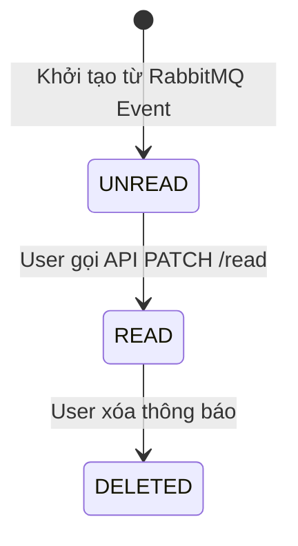

# Service Specification — `notification-service`

## 1. Identity

| Item | Value |
|---|---|
| Service name | notification-service |
| Owner | Dương |
| Repository | tickefy-backend/services/notification-service |
| Internal port | 8086 (host) → 8080 (container) |
| Public base path | `/api/notifications` |
| Health check | `/actuator/health` |
| Swagger/OpenAPI | `/swagger-ui.html` |
| Database schema | `notification_service` |

## 2. Responsibilities

### Service chịu trách nhiệm

- Thuần tuý đóng vai trò là **Consumer**. Lắng nghe sự kiện (Events) từ các Service khác (Order, Ticket, Event) thông qua RabbitMQ.
- Phân phối thông báo đa kênh đến người dùng cuối, bao gồm:
  1. **Realtime In-app:** Bắn thông báo trực tiếp xuống UI qua công nghệ Server-Sent Events (SSE).
  2. **Email:** Render template và gửi Email xác nhận (Dùng Mailpit ở Dev, SMTP/SendGrid ở Prod).
  3. **Push Notification (FCM):** Gửi thông báo đẩy xuống thiết bị di động / Web browser thông qua Firebase Cloud Messaging.
- Lưu trữ lịch sử thông báo In-app vào cơ sở dữ liệu để User xem lại.

### Service không chịu trách nhiệm

- Tuyệt đối không query cơ sở dữ liệu của các service khác (Không vi phạm kiến trúc Database-per-service).
- Tuyệt đối không tự xử lý business logic về vé (ví dụ: quét DB để nhắc nhở 24h). Logic nhắc nhở phải do Ticket Service chủ động chạy Cronjob và bắn event `TicketReminder` sang.
- Chưa hỗ trợ luồng gửi SMS hay Zalo OA (Out-of-scope trong Phase 1).

## 3. Data ownership

### Tables owned

| Table | Purpose |
|---|---|
| `notifications` | Lưu lịch sử các thông báo trong ứng dụng (In-app). Chứa cờ `is_read` để đánh dấu đã đọc. |
| `device_tokens` | Lưu mã Device Token của thiết bị (FCM Token) do FE gửi lên, dùng để gửi Push Notification. |

### Cross-service references

| Field | Source service | Validation strategy |
|---|---|---|
| `user_id` | `auth-service` | Định danh người dùng nhận thông báo. Được lấy từ payload của RabbitMQ event hoặc từ JWT Token của SSE Connection. |

### Invariants

- Bảng `device_tokens` có ràng buộc UNIQUE trên cặp `(user_id, token)`.
- Không có bất kỳ Foreign Key nào trỏ sang schema của các service khác.

## 4. Dependencies

### Synchronous dependencies

| Service | Endpoint | Purpose | Timeout | Retry |
|---|---|---|---:|---|
| Firebase (FCM) | `POST /fcm/send` (SDK) | Gửi Push Notification tới thiết bị người dùng. | 5s | 3 |
| SMTP Server | (Giao thức SMTP) | Gửi thư điện tử (Sử dụng Mailpit trên môi trường Dev). | 5s | 3 |

### Infrastructure dependencies

| Dependency | Purpose |
|---|---|
| PostgreSQL | Lưu trữ In-app notifications và Device Tokens. |
| RabbitMQ | Trái tim của hệ thống phân phối. Notification Service tiêu thụ message từ các hàng đợi (Queues) tại đây. |
| Redis | (Tùy chọn) Lưu Pub/Sub để broadcast thông điệp SSE giữa các bản sao chạy song song (nếu scale > 1 instance Notification Service). |

## 5. Public APIs

| Method | Path | Role | Description | Contract |
|---|---|---|---|---|
| GET | `/api/notifications/stream`| USER | Mở luồng kết nối Server-Sent Events (SSE) để nhận thông báo In-app theo thời gian thực. *Gateway sẽ forward luồng dài này.* | Payload dạng SSE text stream |
| GET | `/api/notifications` | USER | Lấy danh sách lịch sử thông báo (Có phân trang, trả về từ DB). | |
| PATCH | `/api/notifications/{notificationId}/read`| USER | Đánh dấu một thông báo là đã đọc (`is_read` = true). | |
| POST | `/api/notifications/devices` | USER | Lưu FCM Device Token từ Mobile/Web vào hệ thống để bắt đầu nhận Push Notification. | `{ "token": "fcm_token_xyz" }` |

## 6. Internal APIs

*Service này chủ yếu hoạt động theo mô hình Event-driven, không cung cấp API đồng bộ (Synchronous) cho các Backend Service khác gọi.*

| Method | Path | Caller | Description | Contract |
|---|---|---|---|---|
| None | | | | |

## 7. Events published

| Event | Routing key | When | Consumers | Contract |
|---|---|---|---|---|
| None | | | Notification Service là nút chặn cuối (Sink), không có nhu cầu publish đi đâu nữa. | |

## 8. Events consumed

| Event | Producer | Queue | Hành động (Behavior) | Kênh Gửi (Channel) |
|---|---|---|---|---|
| `OrderPaid` | `order-service` | `notification.order-paid` | Gửi thư hóa đơn điện tử / Thông báo thanh toán thành công. Payload theo `event-envelope.md` §14.2. | Email, SSE, Push |
| `OrderPaymentFailed` | `order-service` | `notification.order-payment-failed` | Cảnh báo thanh toán thất bại, yêu cầu thử lại trước khi hết hạn. Payload theo `event-envelope.md` §14.2.1. | Email, SSE, Push |
| `OrderExpired` | `order-service` | `notification.order-expired` | Thông báo đơn hàng đã hết hạn thanh toán, vé đã được trả lại. Payload theo `event-envelope.md` §14.2.2. | SSE, Push |
| `OrderCancelled` | `order-service` | `notification.order-cancelled` | Thông báo đơn hàng đã bị hủy. Payload theo `event-envelope.md` §14.2.3. | SSE, Push |
| `OrderRefunded` | `order-service` | `notification.order-refunded` | Thông báo đơn hàng đã được hoàn tiền (Concert bị hủy). Payload theo `event-envelope.md` §14.2.4. | Email, SSE, Push |
| `TicketsIssued` | `ticket-service` | `notification.tickets-issued` | Gửi thư kèm mã QR vé và thông báo trên App. Payload theo `event-envelope.md` §14.3. | Email, SSE, Push |
| `ConcertCancelled` | `event-service` | `notification.concert-cancelled` | Thông báo sự kiện đã bị hủy cho tất cả khán giả có vé. Payload theo `event-envelope.md` §14.5. | Email, SSE, Push |
| `TicketReminder` | `ticket-service` | `notification.ticket-reminder` | 🔭 **PLANNED** — Lời nhắc: "Còn 24h nữa là sự kiện X sẽ diễn ra". Event chưa được định nghĩa trong `event-envelope.md`, cần bổ sung khi ticket-service implement cronjob. | Email, Push |

> ⚠️ **Thay đổi kiến trúc so với bản gốc:** Bản gốc consume `PaymentSucceeded`/`PaymentFailed` trực tiếp từ `payment-service`. Theo kiến trúc saga đã chốt (`order-service` là orchestrator), notification-service nên nghe **Order events** (`OrderPaid`, `OrderPaymentFailed`) thay vì Payment events — đảm bảo notification chỉ gửi SAU KHI order state đã cập nhật. Xem `payment-service.md` §7 ghi chú tương ứng.

## 9. State machines

*Mô hình vòng đời của 1 In-app Notification.*

## 10. Reliability

### Cấu hình Dead Letter Queue (DLQ)
- Mọi RabbitMQ Listener trong service đều cấu hình Retry (Exponential Backoff: `1s`, `3s`, `10s`).
- Nếu Database lỗi hoặc Mail server ngắt đột ngột quá số lần Retry, Message sẽ được đẩy thẳng vào một Dead Letter Queue (`notification.dlx`).
- Đảm bảo Zero Message Loss. Admin có thể requeue lại các thư lỗi sau khi fix xong hạ tầng.

### SSE Heartbeat (Ping/Pong)
- Web connection cho tính năng Realtime rất dễ bị Gateway Timeout (hoặc trình duyệt ngắt).
- Notification Service bắt buộc bắn ra event dạng `Ping` xuống client mỗi `30 giây` để duy trì kết nối mạng lâu dài.

## 11. Cache

- Không áp dụng Caching cho Notifications vì dữ liệu cá nhân hóa cao và thay đổi liên tục.
- Lệnh query `GET /notifications` đi thẳng vào PostgreSQL (đã đánh Index cột `user_id` và `created_at`).

## 12. Security

- Authentication: Mọi Endpoint Public (`/stream`, `/notifications`) đều yêu cầu Bearer JWT Token xác thực từ Gateway.
- Privacy: Các kênh gửi ra bên ngoài (FCM, Email) không được chứa thông tin quá nhạy cảm (như Full Card Number hay Token Auth).
- Firebase SDK Security: Chìa khóa Service Account JSON phải nạp qua Environment Variable, tuyệt đối không hardcode trong Source code.

## 13. Environment variables

| Variable | Required | Example | Description |
|---|---|---|---|
| `POSTGRES_URL` | Yes | `jdbc:postgresql://db:5432/noti` | Cấu hình Database |
| `SPRING_RABBITMQ_HOST`| Yes | `rabbitmq` | Kết nối Message Broker |
| `SPRING_MAIL_HOST` | Yes | `mailpit` | Mail Server. Prod dùng `smtp.sendgrid.net` |
| `FCM_SERVICE_ACCOUNT` | Yes | `{"type": "service_account"...}`| Chuỗi JSON chứa khóa Firebase để bắn Push |

## 14. Observability

- Logs: Khi gửi 1 kênh thất bại (VD: Push lỗi), KHÔNG Throw Exception làm chết cả luồng (khiến In-app và Email cũng bị rollback). Chỉ ghi Log Error (`"FCM Send failed for User ID..."`) và đánh dấu kênh đó Fail.
- Metrics: Đếm số lượng đang duy trì kết nối SSE (`concurrent_sse_connections`).

## 15. Failure scenarios

| Scenario | Expected behavior | Error/event |
|---|---|---|
| Third-party Mail down | Gửi mail lỗi. | Hệ thống tiến hành gửi In-app và Push bình thường. Push/Email fail sẽ log lại, RabbitMQ retry cục bộ. |
| DB bị Down tạm thời | Không lưu được In-app Notification. | RabbitMQ đẩy Message xuống DLQ, bảo toàn dữ liệu. |
| Client ngắt mạng | SSE Connection Broken | Server phát hiện IOException, xóa session của User đó khỏi bộ nhớ RAM để tránh rò rỉ (Memory Leak). |

## 16. Integration acceptance criteria
- [ ] Mở Postman, cắm vào luồng `/stream` và Publish event `OrderPaid` lên RabbitMQ → Thấy Postman in ra JSON tức thì.
- [ ] Vào trang UI của Mailpit (`http://localhost:8025`) thấy thư gửi đến đẹp mắt, hiển thị chuẩn HTML và đổ đúng tên User, giá tiền.
- [ ] Post một `device_token` rác lên API. Chạy thử FCM Send bị lỗi → Có in log Error nhưng Notification Service không chết.
- [ ] Publish `ConcertCancelled` → Nhận thông báo hủy sự kiện qua SSE/Email/Push.
- [ ] Publish `TicketsIssued` → Nhận email kèm thông tin vé.
- [ ] Queue names khớp convention `notification.{event-name}` theo `event-envelope.md` §6.3.
- [ ] DLQ configured cho tất cả consumer queues.

## 17. Open questions
- Frontend Web (Hiệp) đã tích hợp thư viện Firebase SDK để hứng Web Push Notification chưa?
