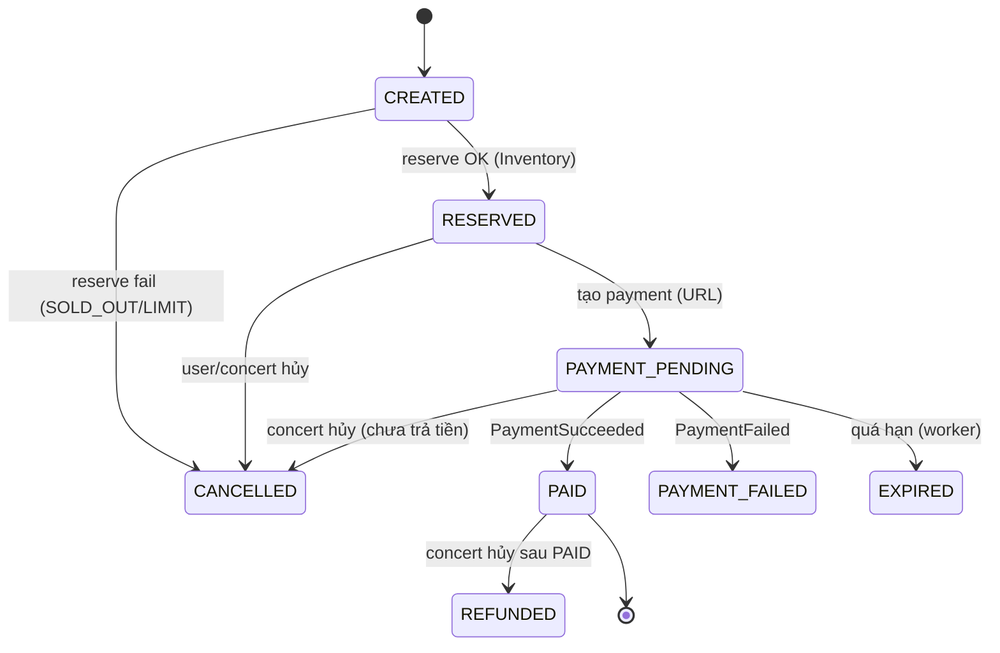

# Service Specification — `order-service`

> Nhãn: ✅ khớp implement · 🔭 PLANNED/Pass 2 (chưa code, cố ý) · 🟡 STUB (giả lập) · ⚠️ VERIFY (tái dựng — Claude Code đối chiếu repo).
> ⚠️ Trạng thái build (integration report v2): **LIVE (P1)** = tạo order + idempotency + **reserve qua Inventory (HTTP+Bearer)** → tới `PAYMENT_PENDING`. **🟡 STUB** = Order→Payment (StubPaymentClient, random UUID — KHÔNG payment thật). **🔭 CHƯA code (Pass 2)** = consume `PaymentSucceeded`/`PaymentFailed`, **outbox writer+drainer → publish OrderPaid** (bảng outbox CÓ nhưng chết: 0 writer/0 drainer), expire worker, ConcertCancelled refund. → Order **chưa bao giờ tới PAID** trong trạng thái hiện tại.

## 1. Identity
| Item | Value |
|---|---|
| Service name | order-service |
| Owner | Hiệp |
| Repository | tickefy-backend → `services/order-service` ✅ |
| Internal port | 8084 (host) → 8080 (container) |
| Public base path | `/api/orders/**` |
| Health check | `/actuator/health` ✅ + `/health` |
| Swagger/OpenAPI | springdoc `/swagger-ui.html` ✅ (dep trong pom) |
| Database name / schema | DB `tickefy_order` · schema `order_service` (`${DB_SCHEMA}`) ✅ |

## 2. Responsibilities
### Chịu trách nhiệm
- Tạo order + order item; idempotency (chống double-submit).
- **Saga Orchestrator (cách B):** điều phối reserve → payment → issue. Inventory consume `OrderPaid` (KHÔNG nghe `PaymentSucceeded` trực tiếp).
- Gọi Inventory reserve (SYNC HTTP), Payment tạo transaction (SYNC HTTP).
- Quản lý **state machine** order; nhận kết quả thanh toán (async event).
- Publish `OrderPaid`/`OrderPaymentFailed`/`OrderExpired`/`OrderCancelled`/`OrderRefunded`.
- Timeout (expire worker), hủy, compensation (release vé khi fail trước point-of-no-return).
- **Điều phối refund** khi `ConcertCancelled` (cách B): duyệt order của concert, release/refund/revoke theo trạng thái.

### KHÔNG chịu trách nhiệm
- Trừ/giữ vé thực (Inventory). Thanh toán thực (Payment). Sinh/revoke vé (E-Ticket). Concert metadata (Event).
- Ngừng-bán-khẩn-cấp khi ConcertCancelled (Inventory tự nghe — độc lập).

## 3. Data ownership
### Tables owned ✅ (`V2__order_schema.sql`)
| Table | Purpose |
|---|---|
| `orders` | status (state machine), userId, concertId, idempotency_key (UNIQUE), expires_at, payment ref, total |
| `order_items` | ticketTypeId, quantity, price |
| `outbox` | event chờ publish (ghi cùng transaction order) — ⚠️ bảng CÓ nhưng **drainer chưa chạy** (🔭 Pass 2) |

### Cross-service references
| Field | Source service | Validation strategy |
|---|---|---|
| `userId` | auth | JWT claim, không FK |
| `concertId` | Event (Dương) | UUID v4, không FK (event-contract) |
| `ticketTypeId` | Event/Inventory | UUID v4, reserve qua Inventory |
| `reservationId` | Inventory | Trả về từ reserve, lưu để commit/release |
| `paymentTransactionId` | Payment | 🟡 hiện stub trả random |

### Invariants
- Không cross-service FK. Idempotency_key UNIQUE. **State machine một chiều** — không lùi từ PAID. Consume event idempotent (event trùng không xử lý 2 lần).

## 4. Dependencies
### Synchronous dependencies
| Service | Endpoint | Purpose | Timeout | Retry |
|---|---|---|---:|---|
| Inventory | `POST /inventory/reservations` (+commit/release) | Reserve/commit/release vé (Bearer) | ⚠️ | ✅ **LIVE** reserve |
| Payment | tạo transaction | Lấy payment URL | ⚠️ | 🟡 **STUB** (StubPaymentClient) |
| Payment | refund (SYNC) | Refund khi concert hủy | ⚠️ | 🔭 Pass 2 (ConcertCancelled) |
| E-Ticket | revoke vé | Revoke khi concert hủy | ⚠️ | 🔭 Pass 2 |

### Infrastructure dependencies
| Dependency | Purpose |
|---|---|
| PostgreSQL | orders / order_items / outbox |
| Redis | ✅ KHÔNG dùng (order yml/pom không có Redis — không lock/cache) |
| RabbitMQ | 🔭 publish (outbox drainer) + consume Payment*/Concert* — **chưa wire (Pass 2)**, no amqp dep |
| Object Storage | (none) |

## 5. Public APIs
| Method | Path | Role | Description | Contract |
|---|---|---|---|---|
| POST | `/orders` | AUDIENCE/ADMIN | Tạo order + reserve → `{orderId, paymentUrl, expiresAt}`. Body có `idempotencyKey` | ✅ tới PAYMENT_PENDING (payment stub) (`OrderController.java:36`) |
| GET | `/orders/{orderId}` | owner/ADMIN | Chi tiết order | ✅ (`OrderController.java:54`) |
| GET | `/users/me/orders` | AUDIENCE | Order của user (paginated) | ✅ path `/users/me/orders` xác nhận (`OrderController.java:70`) |
| POST | `/orders/{orderId}/cancel` | owner | Hủy (chỉ khi chưa PAID) → publish OrderCancelled | 🔭 PLANNED — **chưa có endpoint** |
| POST | `/orders/{orderId}/expire` | internal/worker | Expire order | 🔭 PLANNED — chưa có endpoint + worker chưa code |

> ⚠️ **Idempotency-Key đọc trong BODY** (`CreateOrderRequest.idempotencyKey`), KHÔNG phải HTTP header (DRIFT đã chốt: doc theo code = body; 🔭 header = target khi refactor).

## 6. Internal APIs
| Method | Path | Caller | Description | Contract |
|---|---|---|---|---|
| (none inbound) | — | — | Order là caller (gọi Inventory/Payment), không expose internal API cho service khác gọi vào (ngoài event) | — |

## 7. Events published — 🔭 OUTBOX CHẾT, chưa publish thật
| Event | Routing key | When | Consumers (queue) | Trạng thái |
|---|---|---|---|---|
| `OrderPaid` | `order.paid` | → PAID | e-ticket / notification / inventory `.order-paid.queue` | 🔭 **Pass 2** (outbox 0 writer/0 drainer; e-ticket consumer đã LIVE chờ) |
| `OrderPaymentFailed` | `order.payment.failed` | → PAYMENT_FAILED | inventory / notification | 🔭 Pass 2 |
| `OrderExpired` | `order.expired` | worker expire | inventory / notification | 🔭 Pass 2 |
| `OrderCancelled` | `order.cancelled` | user/concert hủy chưa trả tiền | inventory / notification | 🔭 Pass 2 |
| `OrderRefunded` | `order.refunded` | refund xong (concert hủy) | notification | 🔭 Pass 2 |
> Routing key/queue theo api-contracts §5 (đã verify). `OrderPaid` envelope có `messageId` (dedup) + concertId UUID v4 + items + paidAt (ISO UTC). order.md còn liệt `OrderCreated/OrderReserved/OrderPaymentRequested` — ⚠️ không có trong api-contracts §5; coi là 🔭/optional, đừng publish nếu không có consumer.

## 8. Events consumed — 🔭 CHƯA WIRE (Pass 2)
| Event | Producer | Queue | Behavior | Idempotency key |
|---|---|---|---|---|
| `PaymentSucceeded` | payment | `order-service.payment-succeeded.queue` | → PAID, ghi outbox OrderPaid | orderId/paymentTx — 🔭 (Payment chưa publish; cần **stub payment.succeeded** để test) |
| `PaymentFailed` | payment | `order-service.payment-failed.queue` | → PAYMENT_FAILED, ghi outbox | 🔭 |
| `ConcertCancelled` | event (Dương) | `order-service.concert-cancelled.queue` | Điều phối refund (Luồng 6): chưa trả tiền→CANCELLED+release; PAID→Payment refund + E-Ticket revoke→REFUNDED. Idempotent (đã REFUNDED/CANCELLED bỏ qua) | concertId + orderId — 🔭 chờ Event/Payment |
> ⚠️ Khi wire: thêm **DLQ + setDefaultRequeueRejected(false)**. Payment state khớp = `SUCCESS` (KHÔNG `SUCCEEDED`).

## 9. State machine

| Current | Action/Event | Next | Side effects |
|---|---|---|---|
| CREATED | reserve OK | RESERVED | lưu reservationId |
| CREATED | reserve fail | CANCELLED | trả lỗi user |
| RESERVED | tạo payment | PAYMENT_PENDING | 🟡 stub trả paymentUrl; set expires_at |
| PAYMENT_PENDING | PaymentSucceeded | **PAID** (point-of-no-return) | ghi outbox OrderPaid → publish — 🔭 |
| PAYMENT_PENDING | PaymentFailed | PAYMENT_FAILED | outbox OrderPaymentFailed (Inventory release) — 🔭 |
| PAYMENT_PENDING | quá hạn | EXPIRED | worker; outbox OrderExpired — 🔭 |
| RESERVED/PENDING | cancel/concert hủy (chưa trả) | CANCELLED | release vé |
| PAID | ConcertCancelled | REFUNDED | Payment refund + E-Ticket revoke — 🔭 |
> Sau **PAID = point of no return**: chỉ tiến (retry sinh vé), không release. State machine một chiều — chặn transition bất hợp lệ (vd PAID→EXPIRED) bằng `CONFLICT`.

## 10. Reliability
### Idempotency
- `orders.idempotency_key` UNIQUE; submit trùng key → trả order cũ (resume). ✅ (response `replayDetected`/200 chuẩn → 🔭 chưa có).
- Consume event idempotent (PaymentSucceeded ×N → PAID 1 lần) — 🔭 Pass 2.
### Retry / Timeout / Circuit breaker
- Payment refund retry (concert hủy) → fail → đánh dấu thủ công + alert admin (🔭).
- 🔭 **Circuit breaker** Payment (OPEN → fail-fast "cổng thanh toán bảo trì", `PAYMENT_GATEWAY_UNAVAILABLE`) — **chưa code** (grep resilience4j/CircuitBreaker = NONE; Payment đang stub).
### Transaction boundaries
- **Outbox pattern:** ghi event vào `outbox` **cùng transaction** cập nhật order; drainer publish sau (🔭 drainer chưa chạy).
### Edge case
- Order EXPIRED rồi Payment báo SUCCESS muộn (reconcile đến sau expire) → đề xuất: refund + báo user (vé có thể đã bán người khác). 🔭 cần xử lý khi có Payment/reconcile.

## 11. Cache
| Key pattern | Data | TTL | Invalidation |
|---|---|---:|---|
| (none) | ✅ Order **KHÔNG dùng Redis** (no Redis trong yml/pom) — không lock/cache | — | — |

## 12. Security
- **Authentication:** JWT verify-only (public key). Gọi Inventory/Payment kèm `Authorization: Bearer` (service-to-service).
- **Authorization:** tạo/xem order = AUDIENCE (của mình); xem mọi order = ADMIN; expire = internal/worker.
- **Sensitive data:** không lưu thông tin thẻ (Payment lo). 
- **Logging mask:** requestId; không secret/payment signature.

## 13. Environment variables ✅ (theo `application.yml`)
| Variable | Required | Example | Description |
|---|---|---|---|
| `SPRING_PROFILES_ACTIVE` | ✅ | `docker` | Profile |
| `DB_HOST`/`DB_PORT`/`DB_NAME`/`DB_USERNAME`/`DB_PASSWORD` | ✅ | postgres / `tickefy_order` | DB order (`application.yml:7-9`) |
| `DB_SCHEMA` | ✅ | `order_service` | Schema |
| `INVENTORY_SERVICE_URL` | ✅ | `http://inventory:8080` | Reserve (sync HTTP) — `app.inventory.base-url` |
| `PAYMENT_SERVICE_URL` | 🟡 | — | Khai báo nhưng **unused** (Payment đang stub) |
| `PAYMENT_STUB` | 🟡 | `true` (default) | `app.payment.stub` — bật StubPaymentClient |
| `SPRING_RABBITMQ_*` | 🔭 | rabbitmq | Khi wire publish/consume Pass 2 |
| order expire / reservation TTL | ⚠️ | `PT15M` | Đồng bộ với reservation TTL Inventory |

## 14. Observability
- **Logs:** requestId; order state transition.
- **Metrics:** actuator mặc định ✅; 🔭 custom counter (order created/paid/failed/expired) chưa code.
- **Traces:** propagate X-Request-Id (+ messageId trên event).
- **Alerts:** refund-fail → alert admin (🔭).

## 15. Failure scenarios
| Scenario | Expected behavior | Error/event |
|---|---|---|
| Double-submit | Idempotency key → 1 order | resume order cũ |
| Hết vé khi reserve | Inventory SOLD_OUT → order CANCELLED | `TICKET_SOLD_OUT` (từ Inventory) |
| Vượt per-user limit | Inventory 422 → CANCELLED (kèm remaining) | `PER_USER_LIMIT_EXCEEDED` |
| Payment tạo tx lỗi | Release reservation → CANCELLED | 🟡 stub hiện không fail |
| Payment down (CB OPEN) | Fail-fast graceful | 🔭 `PAYMENT_GATEWAY_UNAVAILABLE` (503) — CB chưa code |
| PaymentSucceeded trùng | Idempotent — đã PAID bỏ qua | 🔭 Pass 2 |
| Order kẹt PAYMENT_PENDING quá hạn | Worker expire → release | 🔭 worker chưa code |
| E-Ticket sinh vé lỗi sau PAID | Retry (point of no return, không hủy) | 🔭 |
| User hủy order đã PAID | Từ chối (cần luồng refund riêng) | `CONFLICT` |
| Transition bất hợp lệ (PAID→EXPIRED) | Chặn | `CONFLICT` (state guard) |
| ConcertCancelled | Điều phối: chưa trả→CANCELLED+release; PAID→refund+revoke→REFUNDED | 🔭 Pass 2 |
| Refund lỗi khi concert hủy | Retry; vẫn lỗi → đánh dấu thủ công + alert admin | 🔭 |

## 16. Integration acceptance criteria
- [ ] Health check pass. · [x] Swagger ✅ (springdoc).
- [ ] API contract tests (POST /orders → RESERVED → PAYMENT_PENDING). (**49 `@Test`** trong repo.)
- [ ] Idempotency: 2 submit cùng key → 1 order (AC2). ✅
- [ ] 🔭 Event contract: publish OrderPaid + consume Payment* — **Pass 2** (cần stub payment.succeeded để test chuỗi: PAID → outbox → publish → e-ticket+inventory consume).
- [ ] 🔭 Idempotent event (PaymentSucceeded ×3 → PAID 1 lần).
- [ ] 🔭 Timeout worker → EXPIRED → release.
- [ ] Docker builds. · `.env.example` complete.
- [ ] 🔭 Gateway route — chưa build.
- [ ] 🔭 Queue/binding/**DLQ** — Pass 2.
- [ ] Integration test với Inventory (reserve) pass; với Payment thật 🔭 (chờ Dương).

## 17. Open questions
- ✅ Path = `/users/me/orders` (xác nhận); `/orders/{id}/expire` & `/cancel` chưa có endpoint (🔭).
- ✅ Order **KHÔNG dùng Redis**.
- ✅ Circuit breaker Payment **chưa code** (🔭; Payment stub).
- 🔭 **Pass 2 (việc Hiệp tự chủ — làm NGAY được):** thêm amqp + consume `payment.succeeded`/`failed` + **outbox writer (PAID→write) + drainer → publish `order.paid`** + expire worker + **DLQ**. Cần **stub phát `payment.succeeded`** để test chuỗi end-to-end (e-ticket consumer đã LIVE).
- 🔭 ConcertCancelled refund (Luồng 6): cần Payment refund API + E-Ticket revoke + Event publish — chờ Dương.
- order/ErrorCode có `CONCERT_NOT_FOUND`, `RESERVATION_EXPIRED` **defined-but-unused** (0 throw) — giữ 🔭 (Pass 2) hay bỏ?
- `OrderCreated/OrderReserved/OrderPaymentRequested` (order.md) không có trong api-contracts §5 — publish không, hay bỏ?
- Edge case EXPIRED-rồi-Payment-SUCCESS-muộn: chốt policy refund.
