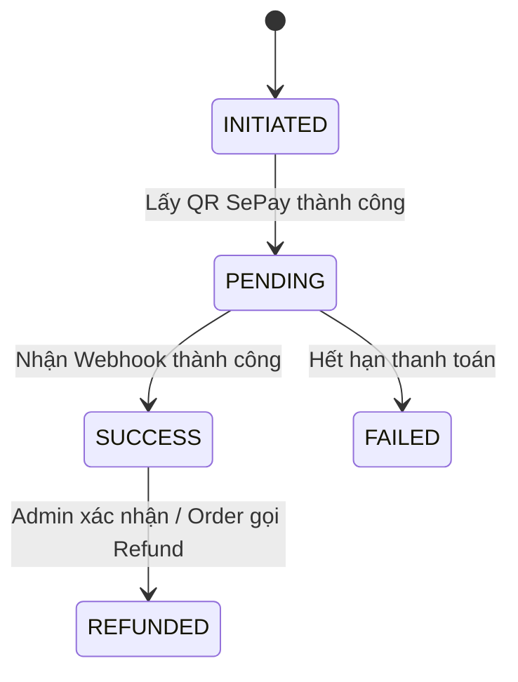

# Service Specification — `payment-service`

## 1. Identity

| Item | Value |
|---|---|
| Service name | payment-service |
| Owner | Dương |
| Repository | tickefy-backend/services/payment-service |
| Internal port | 8085 (host) → 8080 (container) |
| Public base path | `/api/payments` |
| Health check | `/actuator/health` |
| Swagger/OpenAPI | `/swagger-ui.html` |
| Database schema | `payment_service` |

## 2. Responsibilities

### Service chịu trách nhiệm

- Tạo giao dịch thanh toán và sinh mã VietQR (thông qua tích hợp SePay).
- Xử lý Webhook (Callback) từ SePay khi khách hàng quét mã chuyển khoản thành công.
- Cung cấp API nội bộ cho Order Service yêu cầu Refund, và API cho Admin xác nhận hoàn tiền thủ công.
- Đảm bảo tính toàn vẹn tài chính: Chống thanh toán trùng lặp (Idempotency 2 lớp), Circuit Breaker khi gọi cổng ngoài, và Reconciliation Job rà soát giao dịch treo.

### Service không chịu trách nhiệm

- Không quản lý logic nghiệp vụ của Đơn hàng (Thuộc về `order-service`).
- Không điều phối quá trình hoàn tiền tự động (Saga Orchestrator nằm ở `order-service`).
- Không chịu trách nhiệm giao vé (Thuộc về `ticket-service`).

## 3. Data ownership

### Tables owned

| Table | Purpose |
|---|---|
| `payment_transactions` | Lưu trữ giao dịch thanh toán, thông tin số tiền, và trạng thái giao dịch (INITIATED, PENDING, SUCCESS, FAILED, REFUNDED). |
| `outbox_events` | Phục vụ Transactional Outbox Pattern để publish sự kiện `PaymentSucceeded`/`PaymentFailed`. |

### Cross-service references

| Field | Source service | Validation strategy |
|---|---|---|
| `order_id` | `order-service` | Định danh Đơn hàng gốc. Được Order truyền sang. Không dùng FK. |
| `user_id` | `auth-service` | Định danh khách hàng. Với internal payment creation, lấy từ payload tin cậy do `order-service` truyền sau khi Order đã xác thực JWT; không tin userId client tự gửi trực tiếp. |

### Invariants

- Bảng `payment_transactions` bắt buộc có `UNIQUE` constraints trên `idempotency_key` (chống tạo nhiều lần) và `gateway_transaction_id` (chống callback nhiều lần).

## 4. Dependencies

### Synchronous dependencies

| Service | Endpoint | Purpose | Timeout | Retry |
|---|---|---|---:|---|
| SePay (External)| `POST /sepay/create` (Ví dụ)| Tạo mã VietQR | 5s | 2 |
| SePay (External)| `GET /sepay/status` (Ví dụ)| Reconciliation (kiểm tra trạng thái) | 5s | 3 |

### Infrastructure dependencies

| Dependency | Purpose |
|---|---|
| PostgreSQL | Nguồn sự thật (Source of Truth) cho trạng thái thanh toán và Idempotency. |
| Redis | Lớp đệm tra cứu nhanh Idempotency (TTL 24 giờ). |
| RabbitMQ | Đẩy event thông báo trạng thái thanh toán ra ngoài thông qua Outbox. |

## 5. Public APIs

| Method | Path | Role | Description | Contract |
|---|---|---|---|---|
| POST | `/api/payments/callback`| PUBLIC (Webhook) | Endpoint nhận webhook từ SePay. Yêu cầu verify chữ ký số (Signature). | |
| POST | `/api/admin/payments/{txId}/refund`| Admin | Đánh dấu thủ công giao dịch đã được Refund (Admin tự chuyển khoản trả khách). | Yêu cầu JWT role `ADMIN` |

## 6. Internal APIs

| Method | Path | Caller | Description | Contract |
|---|---|---|---|---|
| POST | `/internal/payments` | `order-service` | Khởi tạo giao dịch. Payload: `{orderId, userId, amount, currency, idempotencyKey}`. Response tối thiểu `{paymentId, paymentUrl, qrCodePayload, expiresAt}` để Order trả `paymentUrl`. | |
| POST | `/internal/payments/refund` | `order-service` | Refund khi Concert bị hủy sau PAID. Payload: `{orderId, paymentId, amount, currency, reason, idempotencyKey}`. Response tối thiểu `{refundId, paymentId, status, refundedAt}`. | |

## 7. Events published

*Lưu ý: Publish thông qua Outbox Pattern.*

| Event | Routing key | When | Consumers | Contract |
|---|---|---|---|---|
| `PaymentSucceeded`| `payment.succeeded` | Nhận Webhook báo thành công từ SePay. | `order-service` (`order.payment-succeeded`) | Chứa `paymentId`, `orderId`, `amount`, `paidAt` |
| `PaymentFailed` | `payment.failed` | Hết hạn thanh toán hoặc Webhook báo lỗi. | `order-service` (`order.payment-failed`) | Chứa `paymentId`, `orderId`, `failedAt`, `reason` |

## 8. Events consumed

| Event | Producer | Queue | Behavior | Idempotency key |
|---|---|---|---|---|
| None | | | Service không chủ động bắt event. Mọi lệnh do Order gọi qua REST API. | |

## 9. State machines

### Transition table

| Current | Action/Event | Next | Side effects |
|---|---|---|---|
| PENDING | Webhook Success | SUCCESS | Publish `PaymentSucceeded` qua Outbox. |
| PENDING | Hết hạn / Timeout | FAILED | Publish `PaymentFailed` qua Outbox. |
| SUCCESS | Call API Refund | REFUNDED | Cập nhật DB. |

## 10. Reliability

### Idempotency
- **Tầng 1 (Tạo Transaction):** Lưu `idempotencyKey` do Order gửi vào Cột UNIQUE trong DB + Cache ở Redis (TTL 24h). Request thứ 2 gửi trùng sẽ trả ngay kết quả cũ (hoặc lỗi).
- **Tầng 2 (Webhook):** Dùng `gateway_transaction_id` từ SePay làm cột UNIQUE. SePay bắn webhook trùng 2 lần, DB bắn lỗi Conflict -> Trả 200 cho SePay và bỏ qua.

### Circuit breaker
- Resilience4j bọc các cuộc gọi API sang SePay. Nếu SePay chết (Fail rate > 50%), ngắt mạch (Open) để tránh nghẽn luồng tạo đơn. Trả HTTP 503 Service Unavailable ngay lập tức.

### Transaction boundaries
- Khi nhận Webhook thành công/thất bại: cập nhật status bảng `payment_transactions` và ghi `PaymentSucceeded`/`PaymentFailed` vào `outbox_events` trong cùng 1 transaction DB.

## 11. Cache

| Key pattern | Data | TTL | Invalidation |
|---|---|---:|---|
| `payment:idempotency:{idempotencyKey}` | Dữ liệu chặn spam | 24h | Tự động hết hạn. |

## 12. Security

- Authentication: Endpoint protected dùng `Authorization: Bearer <access-token>` theo Auth Contract; `payment-service` verify RS256 bằng public key. Internal calls từ `order-service` forward access token của request gốc; MVP chưa định nghĩa service-token/client-credentials riêng.
- Authorization: Admin refund yêu cầu role `ADMIN`; internal payment/refund endpoints chỉ chấp nhận caller backend được route nội bộ và bearer token hợp lệ.
- Webhook Signature: Mọi payload gửi từ SePay vào `/api/payments/callback` phải được kiểm tra bằng HMAC-SHA256 (tùy chuẩn SePay) trước khi xử lý.

## 13. Environment variables

| Variable | Required | Example | Description |
|---|---|---|---|
| `SEPAY_API_KEY` | Yes | `...` | Gọi API của SePay |
| `SEPAY_WEBHOOK_SECRET`| Yes | `...` | Mã bí mật check chữ ký |

## 14. Observability

- Logs: Phải ghi nhận mọi Webhook payload đến từ SePay.
- Metrics: Đếm số lượng giao dịch PENDING treo quá 10 phút. Đếm số Webhook bị từ chối do sai Signature.

## 15. Failure scenarios

| Scenario | Expected behavior | Error/event |
|---|---|---|
| SePay Callback bị mất (Mất mạng) | Khách hàng chuyển tiền thành công nhưng hệ thống không có Webhook. | Background Job **Reconciliation** chạy 5 phút/lần quét các đơn PENDING, chủ động gọi API SePay kiểm tra. Nếu thành công -> Tự đẩy sang SUCCESS. |
| RabbitMQ Down | Thanh toán thành công, lưu DB, nhưng Event kẹt ở bảng Outbox. | Không rớt. Drainer sẽ gửi bù khi MQ phục hồi (Eventual Consistency). |

## 16. Integration acceptance criteria
- [ ] Gửi request tạo thanh toán trùng `idempotencyKey` trả về cùng 1 kết quả.
- [ ] Bắn webhook từ SePay (Giả lập) 2 lần liên tục chỉ ghi nhận 1 lần.
- [ ] Bắn webhook sai chữ ký bị reject HTTP 400.
- [ ] Job Reconciliation chạy và vớt được đơn bị treo.
- [ ] API Admin Refund thủ công đánh dấu REFUNDED thành công.

## 17. Open questions
- None
