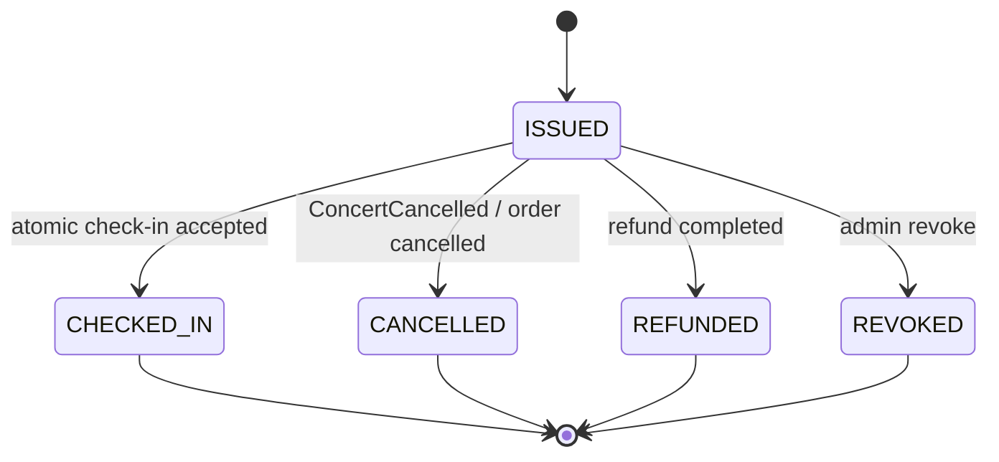

# Service Specification — `ticket-service`

> `ticket-service` là tên canonical trong contract. Implementation folder hiện tại trong backend là `services/e-ticket-service`. File này ưu tiên design đã chốt trong common contracts, không mô tả drift cũ là contract mới.

## 1. Identity

| Item | Value |
|---|---|
| Service name | `ticket-service` |
| Current implementation folder | `services/e-ticket-service` |
| Owner | Hòa |
| Repository | `tickefy-backend` |
| Internal port | TBD from service config |
| Public base path | `/api/tickets` |
| Internal base path | `/internal/tickets` |
| Health check | `/actuator/health` |
| Swagger/OpenAPI | `/swagger-ui/index.html` when enabled |
| Database schema | `ticket_schema` target; verify implementation schema before freeze |

## 2. Responsibilities

### Service chịu trách nhiệm

- Là Source of Truth cho ticket record và ticket status.
- Issue ticket sau khi consume `OrderPaid`.
- Sinh và quản lý QR verification data cho ticket.
- Trả ticket display data cho audience.
- Verify ticket và thực hiện atomic check-in cho `checkin-service`.
- Cancel/refund/revoke ticket khi nhận event nghiệp vụ tương ứng.
- Publish `TicketsIssued` sau khi issue ticket thành công.
- Không expose raw `qrToken` qua public API/event/log.

### Service không chịu trách nhiệm

- Không reserve inventory.
- Không xử lý payment callback.
- Không sở hữu order state.
- Không gửi email/push trực tiếp nếu đã có `notification-service`.
- Không quyết định staff có được phân công gate/concert hay không nếu rule đó thuộc `checkin-service`.
- Không ghi check-in audit log chính; audit thuộc `checkin-service`.

## 3. Data ownership

### Tables owned

| Table | Purpose |
|---|---|
| `tickets` | Ticket issued cho từng order item / user / concert |
| `ticket_qr_tokens` hoặc fields tương đương | QR token/hash/metadata phục vụ verify |
| `processed_messages` | Dedup RabbitMQ messages by `messageId` |
| `ticket_status_history` | Optional audit trạng thái ticket |

### Cross-service references

| Field | Source service | Validation strategy |
|---|---|---|
| `userId` | `auth-service` | Trust from `OrderPaid` payload after producer validation |
| `concertId` | `event-service` | Trust from `OrderPaid`; optional internal lookup for snapshot enrichment |
| `orderId` | `order-service` | Trust from `OrderPaid`; unique issue correlation |
| `orderItemId` | `order-service` | Unique idempotency key for ticket issue |
| `ticketTypeId` | `inventory-service` / `event-service` | Trust from `OrderPaid`; no cross-schema FK |

### Invariants

- Không có cross-service foreign key.
- Service khác không query trực tiếp schema này.
- `orderItemId` hoặc `(orderId, orderItemId, sequence)` phải chống issue ticket duplicate.
- Một ticket chỉ có một terminal state tại một thời điểm.
- Public response/event không chứa raw `qrToken`.

## 4. Dependencies

### Synchronous dependencies

| Service | Endpoint | Purpose | Timeout | Retry |
|---|---|---|---:|---|
| `event-service` | TBD internal concert lookup | Optional enrich snapshot/concert validation | 2s | No retry in request path |
| `auth-service` | none in request path | JWT verified locally via public key | N/A | N/A |

### Infrastructure dependencies

| Dependency | Purpose |
|---|---|
| PostgreSQL | Store tickets, QR metadata, processed messages |
| Redis | Optional cache/idempotency accelerator; DB remains source of truth |
| RabbitMQ | Consume `OrderPaid`, `ConcertCancelled`; publish `TicketsIssued` |
| Object Storage | Optional QR/PDF assets if ticket PDF generation is owned here |

## 5. Public APIs

| Method | Path | Role | Description | Contract |
|---|---|---|---|---|
| GET | `/api/tickets` | `AUDIENCE` | List tickets of authenticated user | `ApiResponse<PagedResponse<TicketSummary>>` |
| GET | `/api/tickets/{ticketId}` | `AUDIENCE` | Get ticket detail if owned by authenticated user | `ApiResponse<TicketDetail>` |

### Public DTO notes

`TicketDetail` should include:

| Field | Required | Notes |
|---|---:|---|
| `ticketId` | Yes | UUID string |
| `orderId` | Yes | Cross-service reference |
| `concertId` | Yes | Must not be `eventId` |
| `ticketTypeId` | Yes | UUID string |
| `ticketTypeName` | Yes | Display name, not `ticketName` |
| `status` | Yes | `ISSUED`, `CHECKED_IN`, `CANCELLED`, `REFUNDED`, `REVOKED` |
| `issuedAt` | Yes | ISO-8601 UTC |
| `checkedInAt` | No | Null until checked in |
| `qrTokenMasked` | Conditional | Safe display/scan token representation; never raw token in logs |

## 6. Internal APIs

| Method | Path | Caller | Description | Contract |
|---|---|---|---|---|
| POST | `/internal/tickets/checkin` | `checkin-service` | Verify and atomically mark ticket checked-in | `ApiResponse<CheckinDecision>` |
| GET | `/internal/tickets/snapshot?concertId={concertId}` | `checkin-service` | Return valid tickets for offline snapshot | `ApiResponse<TicketSnapshotData>` |
| GET | `/internal/tickets/{ticketId}/status` | `checkin-service` optional | Read current ticket state | `ApiResponse<TicketStatusView>` |

### `POST /internal/tickets/checkin`

Request:

```json
{
  "concertId": "concert-uuid",
  "qrTokenMasked": "masked-or-derived-token",
  "staffId": "staff-uuid",
  "gate": "GATE_A",
  "scannedAt": "2026-06-16T10:00:00Z",
  "source": "ONLINE"
}
```

Response uses check-in result semantics from `../common/checkin-result-catalog.md`.

## 7. Events published

| Event | Routing key | When | Consumers | Contract |
|---|---|---|---|---|
| `TicketsIssued` | `tickets.issued` | Tickets created after `OrderPaid` | `notification-service` | `../common/event-envelope.md` §14.3 |
| `TicketCheckedIn` | `ticket.checked-in` | Optional after successful check-in | analytics/optional | `../common/event-envelope.md` §14.5 |

## 8. Events consumed

| Event | Producer | Queue | Behavior | Idempotency key |
|---|---|---|---|---|
| `OrderPaid` | `order-service` | `ticket.order-paid` | Issue tickets for order items | `messageId`, `orderItemId` |
| `ConcertCancelled` | `event-service` | `ticket.concert-cancelled` | Mark issued tickets for concert as `CANCELLED` | `messageId`, `concertId` |
| Refund event TBD | `payment-service` / `order-service` | TBD | Mark tickets as `REFUNDED` | `messageId`, `ticketId`/`orderItemId` |

## 9. State machines



### Transition table

| Current | Action/Event | Next | Side effects |
|---|---|---|---|
| none | `OrderPaid` consumed | `ISSUED` | Create ticket, publish `TicketsIssued` |
| `ISSUED` | Internal check-in accepted | `CHECKED_IN` | Return `ACCEPTED`, optional publish `TicketCheckedIn` |
| `CHECKED_IN` | Check-in replay/duplicate | `CHECKED_IN` | Return `DUPLICATE_REJECTED`, no state change |
| `ISSUED` | `ConcertCancelled` | `CANCELLED` | Ticket no longer valid |
| `ISSUED` | Refund completed | `REFUNDED` | Ticket no longer valid |
| `ISSUED` | Admin revoke | `REVOKED` | Ticket no longer valid |

## 10. Reliability

### Idempotency

- Consume `OrderPaid` idempotent by `messageId` and `orderItemId`.
- Duplicate `OrderPaid` must not create duplicate tickets.
- Internal check-in is atomic; concurrent scans of the same ticket produce exactly one `ACCEPTED`.
- Duplicate scan returns result code, not API error, if request is otherwise valid.

### Retry

- RabbitMQ consumers retry only transient failures.
- Duplicate messages are ACKed after idempotency check.
- Non-retryable contract errors go to DLQ with `messageId`, `eventType`, `correlationId`.

### Timeout

- Internal check-in transaction target timeout: ≤ 2s.
- Snapshot endpoint target timeout: ≤ 5s for typical concert size; large concerts should page/stream or precompute.

### Circuit breaker

- Not required for inbound event consumer.
- If ticket-service calls other services for enrichment, use short timeout and degrade without blocking check-in.

### Transaction boundaries

- Ticket issue and processed message insert should be in one DB transaction.
- Atomic check-in must update ticket status using a guarded update, e.g. only from `ISSUED`.
- No JVM-local lock such as `String.intern()` as production idempotency mechanism.

## 11. Cache

| Key pattern | Data | TTL | Invalidation |
|---|---|---:|---|
| `ticket:snapshot:{concertId}` | Optional precomputed snapshot | Short, e.g. 1-5 min | Ticket issued/cancelled/refunded/check-in |
| `ticket:status:{ticketId}` | Optional status cache | Short | Any ticket transition |

Cache is optional; PostgreSQL remains source of truth.

## 12. Security

- Authentication: public endpoints require JWT; internal endpoints require service-to-service bearer context.
- Authorization: audience can only access own tickets; `checkin-service` calls internal endpoints for staff operations.
- Sensitive data: raw `qrToken` must not leave trusted boundary unless explicitly required by implementation.
- Logging mask: log `qrTokenMasked`/prefix only; never log JWT, raw QR, secrets.

## 13. Environment variables

| Variable | Required | Example | Description |
|---|---|---|---|
| `SERVER_PORT` | Yes | `8087` | Service port |
| `DB_URL` / `DB_HOST` | Yes | `jdbc:postgresql://localhost:5432/tickefy` | PostgreSQL connection |
| `DB_SCHEMA` | Yes | `ticket_schema` | Owned schema |
| `JWT_PUBLIC_KEY_PATH` | Yes in prod | `/run/secrets/jwt-public.pem` | Verify bearer token |
| `RABBITMQ_HOST` | Yes | `localhost` | RabbitMQ host |
| `RABBITMQ_USERNAME` | Yes | `tickefy` | RabbitMQ user |
| `RABBITMQ_PASSWORD` | Yes | `change-me` | RabbitMQ password |

## 14. Observability

- Logs: `requestId`, `correlationId`, `messageId`, `eventType`, `ticketId`, `orderId`, `concertId`, `result`, `durationMs`.
- Metrics: tickets issued total, check-in decisions total by result, duplicate event total, DLQ total.
- Traces: propagate `correlationId` from events and HTTP request.
- Alerts: consumer DLQ > 0, ticket issue failure, check-in error rate, DB lock timeout.

## 15. Failure scenarios

| Scenario | Expected behavior | Error/event |
|---|---|---|
| Duplicate `OrderPaid` | ACK without duplicate tickets | metric `events_duplicate_total` |
| Ticket already checked in | Return business result | `DUPLICATE_REJECTED` |
| Ticket belongs to another concert | Return business result | `WRONG_EVENT` |
| Ticket cancelled/refunded | Return business result | `CANCELLED_REJECTED` / `REFUNDED_REJECTED` |
| QR malformed | API error | `INVALID_QR_TOKEN` |
| DB unavailable during event consume | Retry then DLQ | `SERVICE_UNAVAILABLE` internal/log |
| Unsupported event version | DLQ, alert owner | contract error log |

## 16. Integration acceptance criteria

- [ ] Health check pass.
- [ ] Swagger/OpenAPI available.
- [ ] API contract tests pass.
- [ ] Event contract tests pass for `OrderPaid`, `TicketsIssued`, `ConcertCancelled`.
- [ ] Duplicate `OrderPaid` does not duplicate tickets.
- [ ] Concurrent check-in accepts exactly one request.
- [ ] Public ticket response does not expose raw `qrToken`.
- [ ] Docker image builds.
- [ ] `.env.example` complete.
- [ ] Gateway route configured.
- [ ] Queue/binding/DLQ configured.
- [ ] Integration test with dependencies passes.

## 17. Open questions

- [ ] Confirm final database schema name: `ticket_schema` vs existing implementation schema.
- [ ] Confirm whether `TicketCheckedIn` event is needed in MVP.
- [ ] Confirm whether ticket PDF/QR image generation belongs here or notification-service.
- [ ] Confirm raw QR token storage strategy: raw encrypted vs hash-only.
