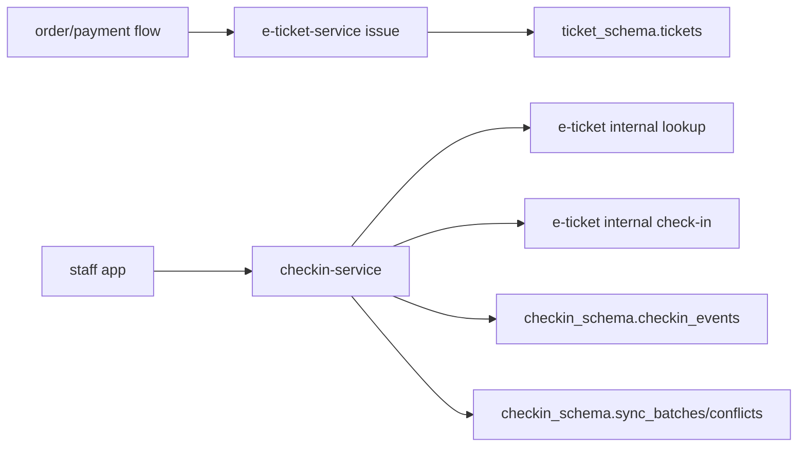

# Luồng xử lý (Service flows)

Status: ACTIVE
Last updated: 2026-06-13

Phạm vi: `e-ticket-service` và `checkin-service`.

## Tổng quan (Big picture)

`e-ticket-service` quản lý trạng thái vé. `checkin-service` quản lý quá trình scan và lịch sử audit. `checkin-service` gọi các internal endpoint được bảo vệ của e-ticket khi cần tra cứu mã QR, check-in vé, hoặc tải snapshot.

## Luồng cấp vé (Ticket issue flow)

1. Caller có role `ADMIN` hoặc `ORGANIZER` gọi `POST /internal/tickets/issue`.
2. Service kiểm tra xem `orderItemId` đã có vé chưa.
3. Nếu có, trả về vé hiện tại (idempotent).
4. Nếu chưa, tạo vé mới với status `ISSUED` và một mã QR token (opaque).
5. Nếu có request khác insert trước, unique constraint ở DB sẽ chặn lại; service catch lỗi và reload vé đã tồn tại.

## Luồng khách hàng xem vé (Customer ticket flow)

1. Khách hàng gửi JWT đến `/api/tickets`.
2. Service đọc `sub` (user id) từ `SecurityContext`.
3. Bỏ qua mọi header `X-User-Id` (chống spoofing).
4. Query DB chỉ trả về các vé thuộc sở hữu của user đó.

## Luồng check-in online (Online check-in flow)

1. Staff app gọi `POST /api/checkin/scan` kèm QR token, concert id, device id, và gate.
2. `checkin-service` đọc staff id từ JWT subject.
3. Gọi internal lookup của `e-ticket-service` bằng QR token.
4. Nếu QR không tồn tại -> `INVALID_QR_TOKEN`.
5. Nếu e-ticket lỗi/timeout -> `ETICKET_SERVICE_UNAVAILABLE`.
6. Nếu vé thuộc concert khác -> `WRONG_EVENT`.
7. Nếu vé đã bị hủy/refund/check-in -> trả về mã lỗi tương ứng.
8. Nếu hợp lệ, `checkin-service` gọi atomic check-in của e-ticket.
9. `checkin-service` ghi nhận 1 dòng audit (accepted hoặc rejected).

## Luồng tải snapshot (Snapshot flow)

1. Staff app gọi `GET /api/checkin/snapshot/{concertId}`.
2. `checkin-service` forward JWT sang e-ticket.
3. `e-ticket-service` trả về danh sách vé đã cấp (`ISSUED`) cho concert đó.
4. `checkin-service` trả về payload chứa mảng `tickets`.

## Luồng đồng bộ offline (Offline sync flow)

1. Mobile app scan offline và lưu local.
2. Khi có mạng, gửi 1 batch với `syncBatchId`, `deviceId`, `concertId`, `gate`, và mảng `items`.
3. `checkin-service` đảm bảo tính lũy đẳng (idempotency) dựa trên `syncBatchId`.
4. Lần scan hợp lệ đầu tiên trên server sẽ thắng.
5. Nếu gửi lại cùng `syncBatchId`, trả về kết quả đã cache.
6. Các scan bị conflict (ví dụ: offline báo accepted nhưng server thấy vé đã check-in) sẽ được ghi vào bảng `conflicts`.